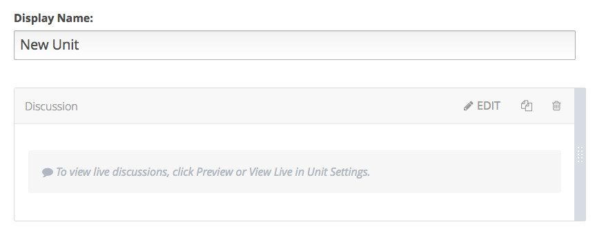
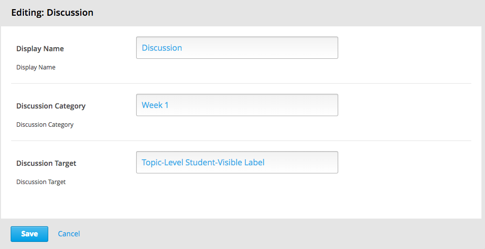
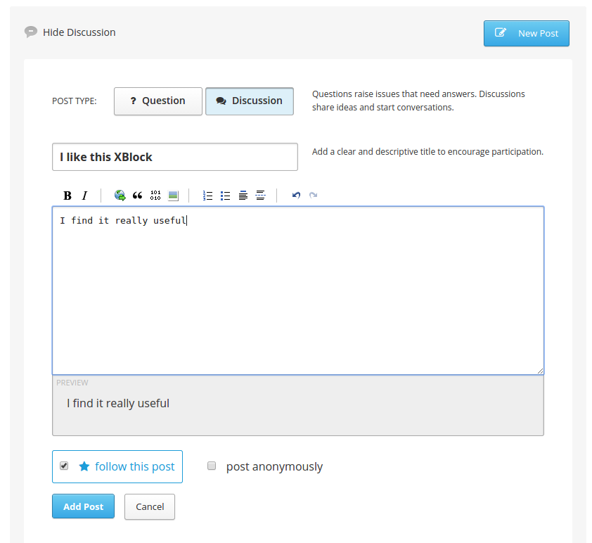
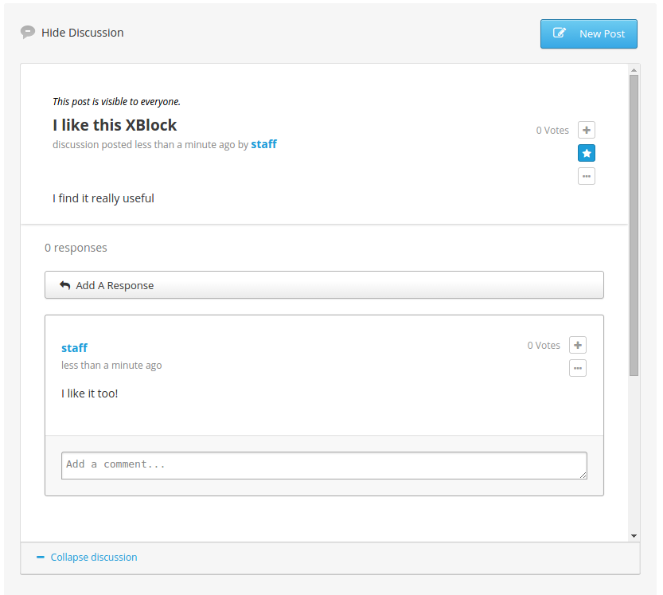

Discussion XBlock
=================

This is an experimental implementation of Discussion as an XBlock.

Installation
------------

Installs automatically along with platform. See `requirements/edx/local.txt`

Enabling in Studio
------------------

You can enable the discussion xblock in studio through the advanced
settings:

1. From the main page of a specific course, click on *Settings*,
   *Advanced Settings* in the top menu.
2. Check for the *advanced_modules* policy key, and add
   `"discussion-forum"` in the policy value list. Note that the use of
   `discussion-forum` instead of `discussion` is currently a limitation
   because `discussion` is reserved to the xmodule, which is still
   supported.

3. Click on the *Save changes* button.

Usage
-----

To add the discussion block to a unit, choose *Discussion* from the
*Advanced Components* list in the studio.

Clicking the *Edit* button opens up a form that will let you change some
basic settings:

The students will be able to post comments on the unit:

Reporting Security Issues
-------------------------

Please do not report security issues in public. Please email
security@edx.org.

Mailing List and IRC Channel
----------------------------

You can discuss this code on the
[edx-code Google Group](https://groups.google.com/forum/#!forum/edx-code)
or in the `#edx-code` IRC channel on Freenode.
