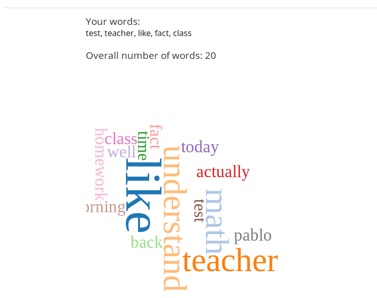

**********************************************
Xml format of "Word Cloud" module [xmodule]
**********************************************

.. module:: word_cloud

Format description
==================

The main tag of Word Cloud module input is:

.. code-block:: xml

    <word_cloud />

The following attributes can be specified for this tag::

    [display_name| AUTOGENERATE] – Display name of xmodule. When this attribute is not defined - display name autogenerate with some hash.
    [num_inputs| 5] – Number of inputs.
    [num_top_words| 250] – Number of max words, which will be displayed.
    [display_student_percents| True] – Display usage percents for each word on the same line together with words.

.. note::

   Percent is shown always when mouse over the word in cloud.

.. note::

   Possible answer for boolean type attributes:
   True – "True", "true", "T", "t", "1"
   False – "False", "false", "F", "f", "0"

.. note::

   If you want to use the same word cloud (the same storage of words), you must use the same display_name value.

Code Example
============

Examples of word_cloud without all attributes (all attributes get by default)
-----------------------------------------------------------------------------

.. code-block:: xml

    <word_cloud />

Examples of poll with all attributes
------------------------------------

.. code-block:: xml

    <word_cloud display_name="cloud" num_inputs="10" num_top_words="100" />

Screenshots
===========

