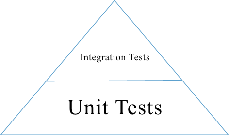

Testing
#######

.. contents::
   :local:
   :depth: 3

Overview
********

We maintain two kinds of tests: unit tests and integration tests.

Overall, you want to write the tests that **maximize coverage** while
**minimizing maintenance**. In practice, this usually means investing
heavily in unit tests, which tend to be the most robust to changes in
the code base.

   Test Pyramid

The pyramid above shows the relative number of unit tests and integration
tests. Most of our tests are unit tests or
integration tests.

Test Types
==========

Unit Tests
----------

-  Each test case should be concise: setup, execute, check, and
   teardown. If you find yourself writing tests with many steps,
   consider refactoring the unit under tests into smaller units, and
   then testing those individually.

-  As a rule of thumb, your unit tests should cover every code branch.

-  Mock or patch external dependencies using `unittest.mock`_ functions.

-  We unit test Python code (using `unittest`_) and Javascript (using
   `Jasmine`_)

.. _unittest.mock: https://docs.python.org/3/library/unittest.mock.html
.. _unittest: http://docs.python.org/2/library/unittest.html
.. _Jasmine: http://jasmine.github.io/

Integration Tests
-----------------

-  Test several units at the same time. Note that you can still mock or patch
   dependencies that are not under test! For example, you might test that
   ``LoncapaProblem``, ``NumericalResponse``, and ``CorrectMap`` in the ``capa``
   package work together, while still mocking out template rendering.

-  Use integration tests to ensure that units are hooked up correctly.  You do
   not need to test every possible input--that's what unit tests are for.
   Instead, focus on testing the "happy path" to verify that the components work
   together correctly.

-  Many of our tests use the `Django test client`_ to simulate HTTP requests to
   the server.

.. _Django test client: https://docs.djangoproject.com/en/dev/topics/testing/overview/

Test Locations
==============

-  Python unit and integration tests: Located in subpackages called
   ``tests``. For example, the tests for the ``capa`` package are
   located in ``xmodule/capa/tests``.

-  Javascript unit tests: Located in ``spec`` folders. For example,
   ``xmodule/js/spec`` and
   ``{cms,lms}/static/js/spec`` For consistency, you should use the
   same directory structure for implementation and test. For example,
   the test for ``src/views/module.js`` should be written in
   ``spec/views/module_spec.js``.

Factories
=========

Many tests delegate set-up to a "factory" class. For example, there are
factories for creating courses, problems, and users. This encapsulates
set-up logic from tests.

Factories are often implemented using `FactoryBoy`_.

In general, factories should be located close to the code they use. For
example, the factory for creating problem XML definitions is located in
``xmodule/capa/tests/response_xml_factory.py`` because the
``capa`` package handles problem XML.

.. _FactoryBoy: https://readthedocs.org/projects/factoryboy/

Running Python Unit tests
*************************

The following commands need to be run within a Python environment in
which requirements/edx/testing.txt has been installed. If you are using a
Docker-based Open edX distribution, then you probably will want to run these
commands within the LMS and/or CMS Docker containers.

We use `pytest`_ to run Python tests. Pytest is a testing framework for python and should be your goto for local Python unit testing.

Pytest (and all of the plugins we use with it) has a lot of options. Use `pytest --help` to see all your option and pytest has good docs around testing.

.. _pytest: https://pytest.org/

Running Python Test Subsets
===========================

When developing tests, it is often helpful to be able to really just run one single test without the overhead of PIP installs, UX builds, etc.

Various ways to run tests using pytest::

    pytest path/test_module.py                          # Run all tests in a module.
    pytest path/test_module.py::test_func               # Run a specific test within a module.
    pytest path/test_module.py::TestClass               # Run all tests in a class
    pytest path/test_module.py::TestClass::test_method  # Run a specific method of a class.
    pytest path/testing/                                # Run all tests in a directory.

For example, this command runs a single python unit test file::

    pytest xmodule/tests/test_stringify.py

Note -
edx-platorm has multiple services (lms, cms) in it. The environment for each service is different enough that we run some tests in both environments in Github Actions.
To test in each of these environments (especially for tests in "common" and "xmodule" directories), you will need to test in each seperately.
To specify that the tests are run with the relevant service as root, Add --rootdir flag at end of your pytest call and specify the env to test in::

    pytest test --rootdir <lms or cms>

Or, if you need django settings from a particular enviroment, add --ds flag to the end of your pytest call and specify the django settings object::

    pytest test --ds=<lms.envs.test or cms.envs.test>

Various tools like ddt create tests with very complex names, rather than figuring out the name yourself, you can:

1. Select tests to run based on their name, provide an expression to the `pytest -k option`_ which performs a substring match on test names::

    pytest xmodule/tests/test_stringify.py -k test_stringify

.. _pytest -k option: https://docs.pytest.org/en/latest/example/markers.html#using-k-expr-to-select-tests-based-on-their-name
.. _node ID: https://docs.pytest.org/en/latest/example/markers.html#node-id

2. Alternatively, you can the get the name of all test methods in a class, file, or project, including all ddt.data variations, by running pytest with `--collectonly`::

    pytest xmodule/tests/test_stringify.py --collectonly

Testing with migrations
=======================

For the sake of speed, by default the python unit test database tables
are created directly from apps' models. If you want to run the tests
against a database created by applying the migrations instead, use the
``--create-db --migrations`` option::

    pytest test --create-db --migrations

Debugging a test
================

There are various ways to debug tests in Python and more specifically with pytest:

- using the verbose -v or really verbose -vv flags can be helpful for displaying diffs on assertion failures

- if you want to focus on one test failure at a time, the ``--exitfirst``or ``-x`` flags to have pytest stop after the first failure

- by default, the plugin pytest-randomly will randomize test case sequence. This is to help reveal bugs in your test setup and teardown. If you do not want this randomness, use the --randomly-dont-reorganize flag

- if you pass the ``--pdb`` flag to a pytest call, the test runner will drop you into pdb on error. This lets you go up and down the stack and see what the values of the variables are. Check out `the pdb documentation`_.  Note that this only works if you aren't collecting coverage statistics (pdb and coverage.py use the same mechanism to trace code execution).

- If there is a specific point in code you would like to debug, you can add the build-in "breakpoint()" function there and it will automatically drop you at the point next time the code runs. If you check this in, your tests will hang on jenkins. Example of use::

    if True:
      # you will be dropped here in the pdb shell when running test or code
      breakpoint()
      a=2
      random_variable = False

.. _the pdb documentation: http://docs.python.org/library/pdb.html

How to output coverage locally
==============================

These are examples of how to run a single test and get coverage::

    pytest cms/djangoapps/contentstore/tests/test_import.py --cov --cov-config=.coveragerc-local # cms example
    pytest lms/djangoapps/courseware/tests/test_block_render.py --cov --cov-config=.coveragerc-local # lms example

That ``--cov-conifg=.coveragerc-local`` option is important - without it, the coverage
tool will look for paths that exist on our jenkins test servers, but not on your local devstack.

How to spit out coverage for a single file with a list of each line that is missing coverage::

   pytest lms/djangoapps/grades/tests/test_subsection_grade.py \
       --cov=lms.djangoapps.grades.subsection_grade \
       --cov-config=.coveragerc-local \
       --cov-report=term-missing
   ---------- coverage: platform linux2, python 2.7.12-final-0 ----------

   Name                                        Stmts   Miss  Cover   Missing
   -------------------------------------------------------------------------
   lms/djangoapps/grades/subsection_grade.py     125     38    70%   47-51, 57, 80-81, 85, 89, 99, 109, 113, [...]

Use this command to generate a coverage report (after previously running ``pytest``)::

    coverage report

The above command looks for a test coverage data file in ``reports/.coverage`` - this file will
contain coverage data from your last run of ``pytest``.  Coverage data is recorded for whichever
paths you specified in your ``--cov`` option, e.g.::

    --cov=.  # will track coverage for the entire project
    --cov=path.to.your.module  # will track coverage only for "module"

Use this command to generate an HTML report::

    coverage html

The report is then saved in reports/xmodule/cover/index.html

Handling flaky unit tests
=========================

See this `confluence document <https://openedx.atlassian.net/wiki/spaces/AC/pages/4306337795/Flaky+Test+Process>`_.

Running JavaScript Unit Tests
*****************************

Before running Javascript unit tests, you will need to be running Firefox or Chrome in a place visible to edx-platform.
If you are using Tutor Dev to run edx-platform, then you can do so by installing and enabling the
``test-legacy-js`` plugin from `openedx-tutor-plugins`_, and then rebuilding
the ``openedx-dev`` image::

    tutor plugins install https://github.com/openedx/openedx-tutor-plugins/tree/main/plugins/tutor-contrib-test-legacy-js
    tutor plugins enable test-legacy-js
    tutor images build openedx-dev

.. _openedx-tutor-plugins: https://github.com/openedx/openedx-tutor-plugins/

We use Jasmine (via Karma) to run most JavaScript unit tests. We use Jest to
run a small handful of additional JS unit tests. You can use the ``npm run
test*`` commands to run them::

    npm run test-karma  # Run all Jasmine+Karma tests.
    npm run test-jest   # Run all Jest tests.
    npm run test        # Run both of the above.

The Karma tests are further broken down into three types depending on how the
JavaScript it is testing is built::

    npm run test-karma-vanilla  # Our very oldest JS, which doesn't even use RequireJS
    npm run test-karma-require  # Old JS that uses RequireJS
    npm run test-karma-webpack  # Slightly "newer" JS which is built with Webpack

Unfortunately, at the time of writing, the build for the ``test-karma-webpack``
tests is broken. The tests are excluded from ``npm run test-karma`` as to not
fail CI. We `may fix this one day`_.

.. _may fix this one day: https://github.com/openedx/edx-platform/issues/35956

To run all Karma+Jasmine tests for a particular top-level edx-platform folder,
you can run::

    npm run test-cms
    npm run test-lms
    npm run test-xmodule
    npm run test-common

Finally, if you want to pass any options to the underlying ``node`` invocation
for Karma+Jasmine tests, you can run one of these specific commands, and put
your arguments after the ``--`` separator::

    npm run test-cms-vanilla -- --your --args --here
    npm run test-cms-require -- --your --args --here
    npm run test-cms-webpack -- --your --args --here
    npm run test-lms-webpack -- --your --args --here
    npm run test-xmodule-vanilla -- --your --args --here
    npm run test-xmodule-webpack -- --your --args --here
    npm run test-common-vanilla -- --your --args --here
    npm run test-common-require -- --your --args --here

Code Quality
************

We use several tools to analyze code quality. The full set of them is::

    mypy $PATHS...
    pycodestyle $PATHS...
    pylint $PATHS...
    lint-imports
    scripts/verify-dunder-init.sh
    make xsslint
    make pii_check
    make check_keywords

Where ``$PATHS...`` is a list of folders and files to analyze, or nothing if
you would like to analyze the entire codebase (which can take a while).
