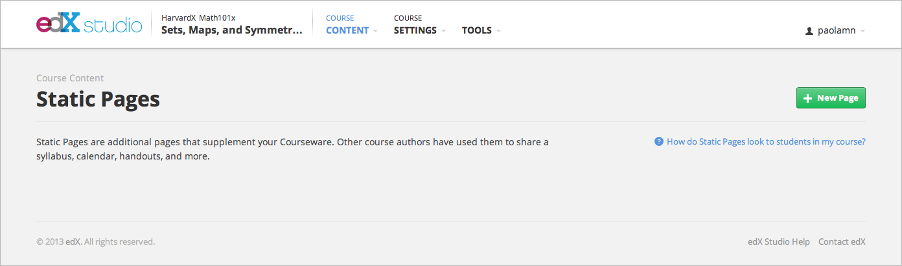
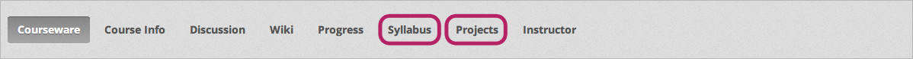
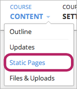
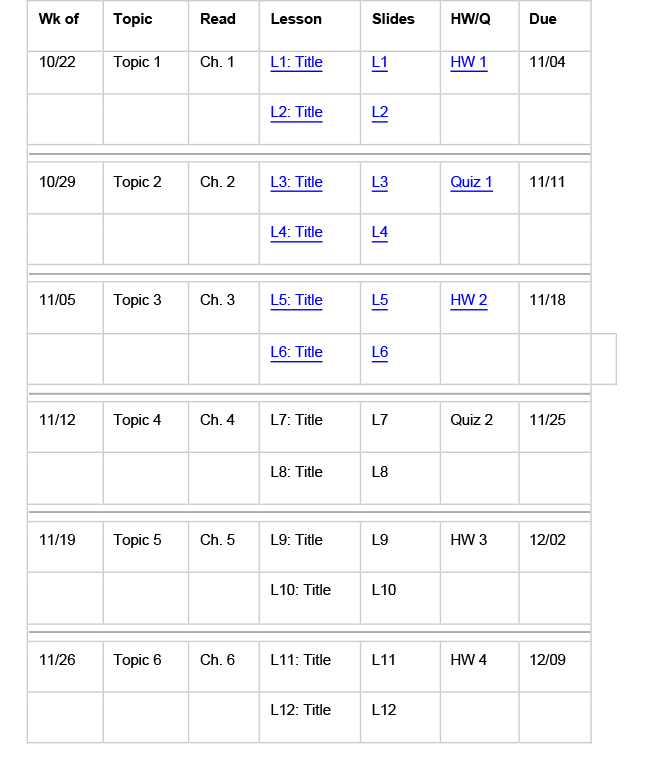
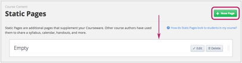
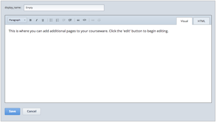
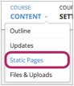

*******************************************************
Add a Syllabus, StaticPage, Update, or Course Handouts
*******************************************************

Add a Static Page 
*****************

**Static Pages** takes you to a list of the important pages for your course that
you want students to be able to access easily. Static pages usually apply to the
whole course rather than a particular sequence. For example, your static pages
might include your syllabus or information about your grading policy.

When you create a static page, the name of that page appears in your course's
navigation bar at the top of the page, along with **Courseware**, **Course
Info**, and other tabs. For example, the following navigation bar includes a
**Syllabus** static page and a  **Projects** static page.

    

To add a static page:

1. On the navigation bar, click **Course Content**, and then click **Static
Pages**.

2. In the top right corner, click **New Page**. The following entry appears.

.. image:: Images/image161.png

3. On the right side of the box, click **Edit**. The following dialog box opens.

.. image:: Images/image163.png

4. In the **display_name** box, type the name that you want to appear in the
navigation bar for your course.

5. Replace the placeholder text with your content.

6. Click **Save**.

Add a Schedule 
**************

To create a schedule for your course, you can create a Google calendar that
students can incorporate into their personal Google calendars, or you can use
HTML to create a dynamic schedule with links that students can click. You can
also include both types of calendar in your course.

Google Calendar 
===============

Your Google calendar should include all release dates and due dates. You can
link to it in your course. Your calendar may look like the following calendar
for BerkeleyX's CS 169.2x course. To see this calendar live, 
click 
https://www.google.com/calendar/embed?src=edx.org_mcjhp2tv3ul2etfpb43hd388p4@group.calendar.g
oogle.com&amp;ctz=America/New_York_

.. image:: Images/image165.png

To create a Google calendar, access your Google account, and then click
**Calendar** at the top of the page. You can then enter your schedule
information. You can also create a link to this calendar anywhere in your
course.

Dynamic HTML Schedule 
=====================

You can create a dynamic HTML schedule page that you update manually as the
course progresses. The template below was adapted from a version created by
Professors Dan Klein and Pieter Abbeel.

Below is a sample course schedule that shows the way the schedule would look
during week 3 of the course. As you can see, there are no links for material
after week 3, since that information has not yet been released.

This course uses the following release schedule:

1. All lessons are released on Mondays. 2. All homework assignments are released
on Wednesdays, and are due on Sunday of the following week. 3. All quizzes are
released on Fridays and due on Sunday of the following week (9 days later).

To create a dynamic HTML schedule:

1. On the navigation bar, click **Course Content**, and then click **Static
Pages**.

2. In the top right corner, click **New Page**. The following entry appears.

.. image:: Images/image161.png

3. On the right side of the box, click **Edit**. The following dialog box opens.

4. In the editor that opens, type **Schedule **in the **display_name** box.

5. Click the **HTML** tab.
  
 
.. image:: Images/image163.png
  
 
6. Go to `Appendix B <appendices/b.html>` and copy the code for the dynamic
schedule template.
  
 
7. In the editor in Studio, replace the placeholder code on the HTML tab with
the code for the dynamic schedule template.
  
  
Course Handouts  
***************
  
 
Your course handouts are available on Edge from the **Course Handouts** sidebar
on the **Course Info** page. To add these items, you must create a file and
upload the file to the **>Files & Uploads** page. When you do this, a URL is
created for that file. You then use this URL to create a link to the file on the
**Handouts** sidebar. You create this link on the **Course Updates** page.
  
.. note::

    You cannot upload videos to the Files & Uploads page.

Upload a File to the Files & Uploads page
=========================================
  
 
The **Files & Uploads** page lists handouts, images, and other content that you
want to integrate into your course.

  
.. image:: Images/image160.png
  
 
For example, if you want to include a cartoon in one of your weekly updates, you
upload the image to **Files & Uploads**. When you do this, the file receives its
own URL, and you then use that URL to create a link to the image in the body of
the course. Likewise, if you want to include a handout in the **Course
Handouts** section of the **Course Info** page or in a lesson, you upload the
handout here, and then create a link to the handout under **Course Handouts** or
in the lesson.
  
 
You can also use the **Files & Uploads** page to keep all of the content for
your course in one place. Content is only visible to students if you create a
link to it. You can thus keep older versions of your content.
  
 
For example, if you create a Word file to use in your class, and you then create
a PDF copy of that Word file, you can link to the PDF file but keep the Word
file on the **Files Uploads** page. If you later delete the file from your
personal computer, or if a colleague asks you if they can run a version of your
course but change the dates in your handout, you can easily find the Word file
on the **Files Uploads** page.
  
 
Note that you should be careful when you name files that you add to the **Files
& Uploads** page. Because the file name becomes part of the URL, students can
see the name of the file when they open it. Avoid using file names such as
"AnswerKey.pdf."
  
 
.. warning::

    Uploading a file with the same name as a file that is already 
    uploaded will cause the original file to be overwritten. There is not currently 
    a warning when you try to upload a file that has the same name.
        
 
To upload a file to the **Files & Uploads** page:
  
 
1. On the navigation bar, click **Course Content**, and then click **Files &
Uploads**.
  
 
2. On the **>Files & Uploads** page, click **Upload New File**.
  
 

  
 
3. In the **Upload New File** dialog box, click **Choose File**.
  
 
4. In the **Open** dialog box, locate the file that you want, and then click
**Open**.
   
To add another file, click **Load Another File**. To close the dialog box, click
the **x** in the top right corner. When you close the dialog box, the file
appears on the **Files & Uploads** page.
  
 
5. Determine the URL of your newly uploaded file. To do this, on the **Files &
Uploads** page, locate the file in the list. In the **URL** column on the right,
you can see the URL you will need to use to display an image or create a
hyperlink.
  
 

  
 
.. note::

    Currently, you cannot delete a file after you upload it to the **Files &
    Uploads** page. You can replace a file by uploading another file with the same
    name, but you cannot delete the file.
      
  
  
Add Items to the Handouts Sidebar 
=================================
  
 
1. On the navigation bar, click **Course Content**, and then click **Updates**.
  
 
image:: Images/image166.png
  
 
2. Locate the **Course Handouts** sidebar on the right, and then click **Edit**.
  
 

  
 
3. In the XML box that appears, create links to your files.
  
 
* To create a link to a document, enter the following syntax, where URL OF FILE
is the URL that you noted in step 5 of **Upload a File** on the **Files &
Uploads Page** and LINK TEXT is the text that you want to appear in the
**Handouts** sidebar.

.. code-block:: html

    
<a href="[URL OF FILE]">[LINK TEXT]</a>

* To create a link to an image that you've uploaded, enter the following syntax,
where URL OF FILE is the URL that you noted in step 5 of **Upload a File to
Your Assets Tab**.

.. code-block:: html

    

 
  
 
4. Click **Save**. Your files appear under **Course Handouts**.
  
 
Add an Announcement or Update  
*****************************
  
 
    You can add announcements or updates to welcome students to the class,
    remind students of exams, notify students of changes in the course schedule,
    and call out important steps students need to keep in mind. These updates
    appear on the **Course Info** tab on edX or Edge. Because your course
    automatically opens to the **Course Info** page, students will see the
    update as soon as they sign in.
  
 
    1. On the **Course Content** menu, click **Updates**. The **Course Updates**
    page opens.
  
 
    .. image:: Images/image185.png

  
 
    2. Click **New Update**. The following dialog box opens.
  
 
    .. image:: Images/image187.png
  
 
    The content for this box must be formatted in HTML. For a template that you
    can use that includes placeholders, see `Appendix A <appendices/a.html>`.
  
 
    3. Enter your update formatted as HTML, and then click **Save**.
