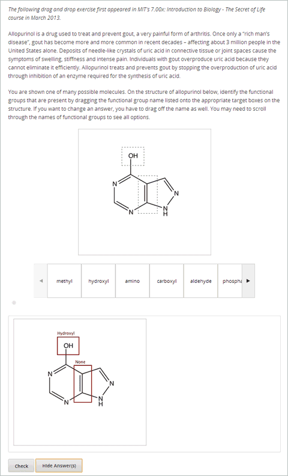
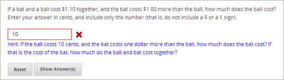

.. _Advanced Problems:

Advanced Problems
=================

Advanced problems are problems such as drag and drop, circuit schematic
builder, and math expression problems. These problems appear on the
Advanced tab when you create a new Problem component. Studio provides
templates for these problems, but the problems open directly in the
**Advanced Editor** and have to be created in XML.

-  :ref:`Circuit Schematic Builder` In circuit schematic problems, students
   create and modify circuits on an interactive grid and submit
   computer-generated analyses of the circuits for grading.
-  :ref:`Write-Your-Own-Grader` Write-your-own-grader problems
   evaluate students' responses using an embedded Python script that you
   create. These problems can be any type.
-  :ref:`Drag and Drop` Drag and drop problems require students to drag text
   or objects to a specific location on an image.
-  :ref:`JavaScript Input` JavaScript input problems allow you to incorporate
   problem types that you've created in HTML into Studio via an IFrame.
-  :ref:`Image Mapped Input` Image mapped input problems require students to
   click a specific location on an image.
-  :ref:`Math Expression Input` Math expression input problems require
   students to enter a mathematical expression as text, such as
   e=m\*c^2.
-  :ref:`Problem Written in LaTeX` This problem type allows you to convert
   problems that you've already written in LaTeX into the edX format.
   Note that this problem type is still a prototype, however, and may
   not be supported in the future.
-  :ref:`Problem with Adaptive Hint` These problems can give students
   feedback or hints based on their responses. Problems with adaptive
   hints can be text input or multiple choice problems.

These problems are easy to access in Studio. To create them, click
**Problem** under **Add New Component**, click the **Advanced** tab, and
then click the name of the problem that you want to create.

.. _Circuit Schematic Builder:

Circuit Schematic Builder
-------------------------

In circuit schematic builder problems, students can arrange circuit
elements such as voltage sources, capacitors, resistors, and MOSFETs on
an interactive grid. They then submit a DC, AC, or transient analysis of
their circuit to the system for grading.

.. image:: /Images/CircuitSchematicExample.gif

Create a Circuit Schematic Builder Problem
~~~~~~~~~~~~~~~~~~~~~~~~~~~~~~~~~~~~~~~~~~

#. In the unit where you want to create the problem, click **Problem**
   under **Add New Component**, and then click the **Advanced** tab.
#. Click **Circuit Schematic Builder**.
#. In the component that appears, click **Edit**.
#. In the component editor, replace the example code with your own code.
#. Click **Save**.

.. _Write-Your-Own-Grader:

Write-Your-Own-Grader ("Custom Python-Evaluated Input")
-------------------------------------------------------

In write-your-own-grader problems (also called "custom Python-evaluated
input" problems), the grader evaluates a student's response using a
Python script that you create and embed in the problem. These problems
can be any type. Numerical input and text input problems are the most
popular write-your-own-grader.

.. image:: Images/WriteYourOwnGraderExample.gif

Create a Write-Your-Own-Grader Problem
~~~~~~~~~~~~~~~~~~~~~~~~~~~~~~~~~~~~~~

To create a write-your-own-grader problem:

#. In the unit where you want to create the problem, click **Problem**
   under **Add New Component**, and then click the **Advanced** tab.
#. Click **Custom Python-Evaluated Input**.
#. In the component that appears, click **Edit**.
#. In the component editor, replace the example code with your own code.
#. Click **Save**.

For more information about write-your-own-grader problems, see `CustomResponse XML and Python
Script <https://edx.readthedocs.org/en/latest/course_data_formats/custom_response.html>`_. 

.. _Drag and Drop:

Drag and Drop
-------------

In drag and drop problems, students respond to a question by dragging
text or objects to a specific location on an image.

Create a Drag and Drop Problem
~~~~~~~~~~~~~~~~~~~~~~~~~~~~~~

To create a drag and drop problem:

#. In the unit where you want to create the problem, click **Problem**
   under **Add New Component**, and then click the **Advanced** tab.
#. Click **Drag and Drop**.
#. In the component that appears, click **Edit**.
#. In the component editor, replace the example code with your own code.
#. Click **Save**.

For more information about drag and drop problems, see `XML Format of Drag and Drop Input
<http://data.edx.org/en/latest/course_data_formats/drag_and_drop/drag_and_drop_input.html>`_.

.. _Image Mapped Input:

Image Mapped Input
------------------

In an image mapped input problem, students click inside a defined area
in an image. You define this area by including coordinates in the body
of the problem.

.. image:: Images/ImageMappedInputExample.gif

Create an Image Mapped Input Problem
~~~~~~~~~~~~~~~~~~~~~~~~~~~~~~~~~~~~

To create a image mapped input problem:

#. In the unit where you want to create the problem, click **Problem**
   under **Add New Component**, and then click the **Advanced** tab.
#. Click **Image Mapped Input**.
#. In the component that appears, click **Edit**.
#. In the component editor, replace the example code with your own code.
#. Click **Save**.

.. _Math Expression Input:

Math Expression Input
---------------------

In math expression input problems, students enter text that represents
a mathematical expression, and Studio changes that text to a symbolic
expression that appears below the field where the student is typing.
Unlike numerical input problems, which only allow integers and a few
select constants, math expression problems can include more complicated
symbolic expressions.

When you create a math expression input problem for your students in
Studio, you'll use `MathJax <http://www.mathjax.org>`_ to change your
plain text into "beautiful math." For more information about how to use
MathJax in Studio, see *A Brief Introduction to MathJax in
Studio*.

.. image:: Images/MathExpressionInputExample.gif

Create a Math Expression Input Problem
~~~~~~~~~~~~~~~~~~~~~~~~~~~~~~~~~~~~~~

To create a math expression input problem:

#. In the unit where you want to create the problem, click **Problem**
   under **Add New Component**, and then click the **Advanced** tab.
#. Click **Math Expression Input**.
#. In the component that appears, click **Edit**.
#. In the component editor, replace the example code with your own code.
#. Click **Save**.

For more information, see `Symbolic Response
<https://edx.readthedocs.org/en/latest/course_data_formats/symbolic_response.html>`_.

.. _Problem Written in LaTeX:

Problem Written in LaTeX
------------------------

If you have an problem that is already written in LaTeX, you can use
this problem type to easily convert your code into XML. After you paste
your code into the LaTeX editor, you'll only need to make a few minor
adjustments. Note that **this problem type is still a prototype and may
not be supported in the future**, so you should use it with caution.

.. note:: If you want to use LaTeX to typeset mathematical expressions
          in problems that you haven't yet written, use any of the other problem
          templates together with `MathJax <http://www.mathjax.org>`_. For more
          information about how to create mathematical expressions in Studio using
          MathJax, see *A Brief Introduction to MathJax in Studio*.

.. image:: Images/ProblemWrittenInLaTeX.gif

Create a Problem Written in LaTeX
~~~~~~~~~~~~~~~~~~~~~~~~~~~~~~~~~

To create a problem written in LaTeX:

#. In the unit where you want to create the problem, click **Problem**
   under **Add New Component**, and then click the **Advanced** tab.
#. Click **Problem Written in LaTeX**.
#. In the component editor that appears, click **Edit**.
#. In the lower left corner of the component editor, click **Launch
   LaTeX Source Compiler**.
#. Replace the example code with your own code.
#. In the lower left corner of the LaTeX source compiler, click **Save &
   Compile to edX XML**.

.. _Problem with Adaptive Hint:

Problem with Adaptive Hint
--------------------------

A problem with an adaptive hint evaluates a student's response, then
gives the student feedback or a hint based on that response so that the
student is more likely to answer correctly on the next attempt. These
problems can be text input or multiple choice problems.

Create a Problem with an Adaptive Hint
~~~~~~~~~~~~~~~~~~~~~~~~~~~~~~~~~~~~~~

To create a problem with an adaptive hint:

#. In the unit where you want to create the problem, click **Problem**
   under **Add New Component**, and then click the **Advanced** tab.
#. Click **Problem with Adaptive Hint**.
#. In the component that appears, click **Edit**.
#. In the component editor, replace the example code with your own code.
#. Click **Save**.

