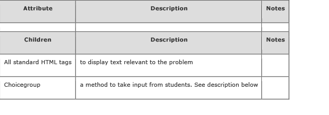
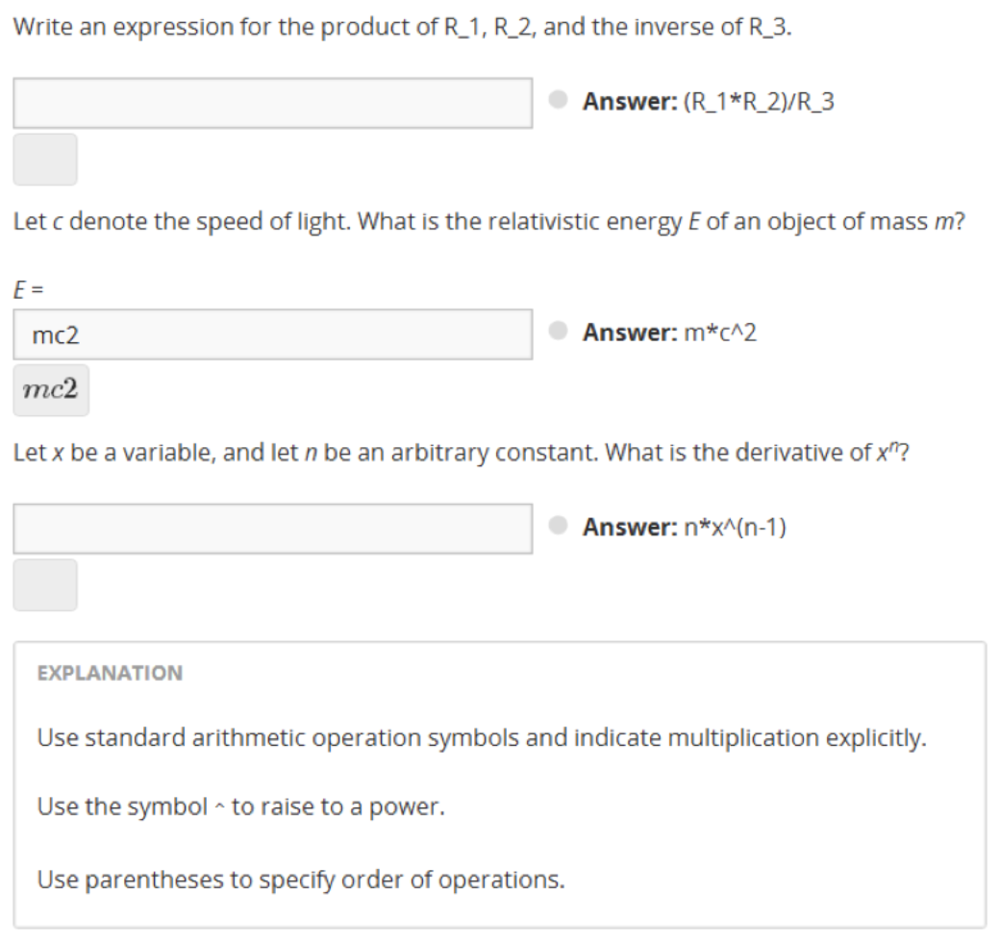
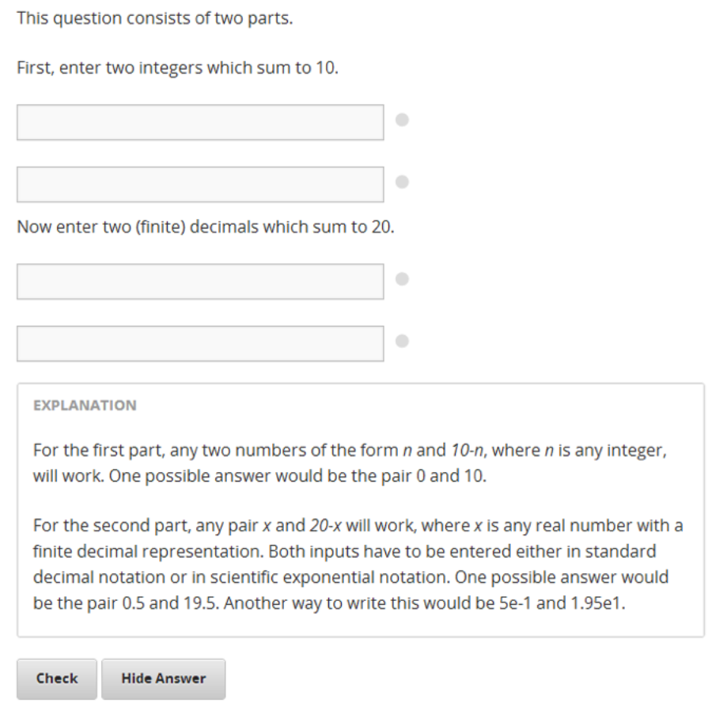
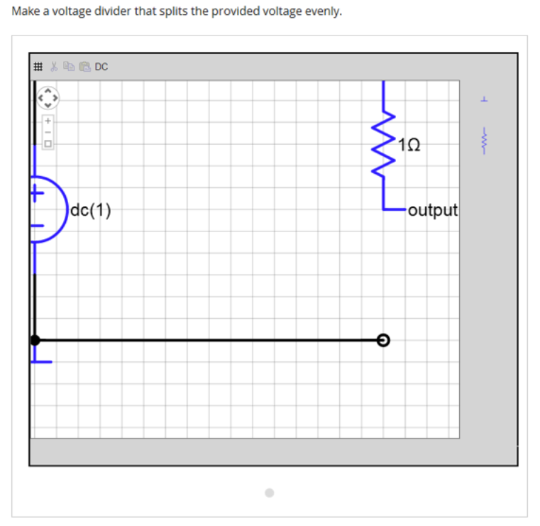
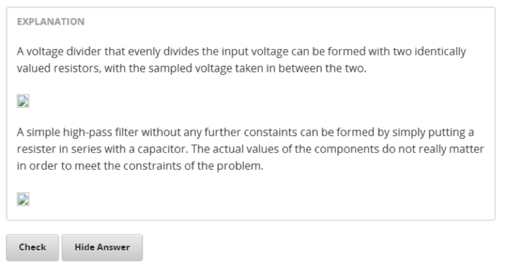

.. raw:: latex

      \newpage %

.. _Appendix E:

==========================
APPENDIX E: Problem Types
==========================

Option Response
===============

The Option Response input type allows the student to choose from a collection of
answer options, presented as a drop-down list.

Option Response is structurally similar to Multiple Choice. Some conceptual
differences between the two include the following.

* The Multiple Choice radio button format makes it easier for students to read very long response options.

* The Option Response drop-down input format makes it more likely for students to think of an answer and then search for it, rather than relying purely on recognition to answer the question. The Multiple Choice format is more explicit and visual. This makes it a more appropriate choice for presenting tricky or complicated answer options which are intended to get the student to pause and think.

Sample Problem:

.. image:: ../Images/image287.png
    :width: 600
    :alt: Image of an option response problem

**Problem Code:**

.. code-block:: xml

  <problem>

   
Option Response is most similar to __________.

    <optionresponse>
     <optioninput
       options="('Multiple Choice','String Response',
                'Numerical Response','External Response',
                'Image Response')"
      correct="Multiple Choice"/>1
    </optionresponse>

   <solution>
     

       
Explanation

        
Like Option Response, Multiple Choice also allows students to select
       from a variety of pre-written responses.

     

    </solution>
  </problem>

**Template**

.. code-block:: xml

  <problem>

    <optionresponse>
     options="('A','B')"
      correct="A"/>
    </optionresponse>

    <solution>
      

      

    </solution>
  </problem>

**XML Attribute Information**

<optionresponse>

  .. image:: ../Images/option_response1.png

<optioninput>

  .. image:: ../Images/optionresponse2.png

.. raw:: latex

      \newpage %

Multiple Choice
===============

The Multiple Choice input type allows the student to select at most one choice
from a collection of answer choices, presented as a list of radio buttons.

A Multiple Choice problem can have more than one correct answer, depending on
how many choices are marked as correct in the underlying XML. If all choices are
marked as incorrect, there is no correct response.

Multiple Choice is structurally similar to Option Response. Some conceptual
differences between the two include the following.

• The Multiple Choice radio button format makes it easier for students to read very long response options.

• The Option Response drop-down input format makes it more likely for students to think of an answer and then search for it, rather than relying purely on recognition to answer the question.

• The Multiple Choice format is more explicit and visual. This makes it a more appropriate choice for presenting tricky or complicated answer options which are intended to get the student to pause and think.

Sample Problem:

.. image:: ../Images/image289.png
 :width: 600:
 :alt: Image of a multiple choice problem

**Problem Code:**

.. code-block:: xml

  <problem>
  
<b>Example Problem</b>

  
How many correct responses can a Multiple Choice question have?

      <multiplechoiceresponse>
     <choicegroup type="MultipleChoice">
        <choice correct="false" name="one">Only one</choice>
        <choice correct="false" name="zeroone">Only zero or one</choice>
        <choice correct="true" name="zeromore">Zero or more</choice>
        <choice correct="false" name="onemore">Only one or more</choice>
        <choice correct="false" name="noone">Nobody knows</choice>
        <choice correct="true" name="someone">Somebody might know :)</choice>
    </choicegroup>
    </multiplechoiceresponse>
  <solution>
        

          
Explanation

            
It depends on how many choices are marked as correct in the underlying XML.

  
Note that if all choices are marked as incorrect, there is no
          correct response.

        

    </solution>
  </problem>

**Template**

.. code-block:: xml

  <problem>

  <multiplechoiceresponse>
    <choicegroup type="MultipleChoice">
      <choice correct="false" name="a">A</choice>
      <choice correct="true" name="b">B</choice>
    </choicegroup>
  </multiplechoiceresponse>

  <solution>
    

    

  </solution>
  </problem>

**XML Attribute Information**

<multiplechoiceresponse>

<choicegroup>

  .. image:: ../Images/multipleresponse2.png

<choice>

  .. image:: ../Images/multipleresponse3.png

.. raw:: latex

      \newpage %

Checkbox
========

The Checkbox input type allows the student to select zero or more choices from a
collection of answer choices, presented as a list of checkboxes.

Remark: Questions with one Checkbox input type have exactly one correct
response. All the choices marked as correct="true" have to be selected for the
submitted answer (i.e. the response) to be considered correct.

In particular, the response of no boxes checked off could be the single correct
response, and a Checkbox question, unlike a Multiple Choice question, cannot
have zero correct responses.

Sample Problem:

.. image:: ../Images/image290.png
 :width: 600
  :alt: Image of a checkbox problem

**Problem Code:**

.. code-block:: xml

  <problem>
  <startouttext/>
    
How many correct responses can a Checkbox question have?

  <choiceresponse>
  <checkboxgroup>
  <choice correct="false"><text>Zero</text></choice>
  <choice correct="true"><text>One</text></choice>
  <choice correct="false"><text>Two or more</text></choice>
  <choice correct="false"><text>Nobody knows</text></choice>
  <choice correct="true"><text>Somebody might know :)</text></choice>
  </checkboxgroup>
  </choiceresponse>
  </problem>

**Template**

.. code-block:: xml

  <problem>

  <choiceresponse>
  <checkboxgroup>
  <choice correct="false"><text>Zero</text></choice>
  <choice correct="true"><text>One</text></choice>
  </checkboxgroup>
  </choiceresponse>
  </problem>

.. raw:: latex

     \newpage %

String Response
===============

The String Response input type provides an input box in which the student can
enter a line of text, which is then checked against a specified expected answer.

A String Response input does not provide any answer suggestions, so it can be a
good way to get the students to engage with the material more deeply in a
sequence and look up, figure out, or remember the correct answer themselves.

Note that a student's answer in a String Response is marked as correct if it
matches every character of the expected answer. This can be a problem with
international spelling, dates, or anything where the format of the answer is not
clear.

Sample Problem:

.. image:: ../Images/image291.png
 :width: 600
 :alt: Image of a string response problem

**Problem Code:**

.. code-block:: xml

  <problem>
    
<b>Example Problem</b>

    
What is the name of this unit? (What response type is this?)

    <stringresponse answer="String Response" type="ci">
      <textline size="20"/>
    </stringresponse>
    <solution>
      

        
Explanation

        
The name of this unit is "String Response," written without the punctuation.

        
Arbitrary capitalization is accepted.

      

    </solution>
  </problem>

**Template**

.. code-block:: xml

  <problem>
    <stringresponse answer="REPLACE_THIS" type="ci">
      <textline size="20"/>
    </stringresponse>
    <solution>
      

      

    </solution>
  </problem>

This response type allows to add more than one answer. Use `additional_answer`  tag to add more answers.

You can add `regexp` to value of `type` attribute, for example: `type="ci regexp"` or `type="regexp"` or `type="regexp cs"`.
In this case, any answer and hint will be treated as regular expressions.
Regular expression has to match whole answer, for answer to be correct.
Student answers "foobar", "o foo" or " ==foo==", will be correct if teacher has set answer=".*foo.*" with type="regexp".

**Template**

.. code-block:: xml

    <problem>
        <stringresponse answer="a1" type="ci regexp">
            <additional_answer>\d5</additional_answer>
            <additional_answer>a3</additional_answer>
            <textline size="20"/>
            <hintgroup>
                <stringhint answer="a0" type="ci" name="ha0" />
                <stringhint answer="a4" type="ci" name="ha4" />
                <stringhint answer="^\d" type="ci" name="re1" />
                <hintpart on="ha0">
                    <startouttext />+1<endouttext />
                </hintpart >
                <hintpart on="ha4">
                    <startouttext />-1<endouttext />
                </hintpart >
                <hintpart on="re1">
                    <startouttext />Any number+5<endouttext />
                </hintpart >
            </hintgroup>
        </stringresponse>
    </problem>

**XML Attribute Information**

<stringresponse>

 .. raw:: html

      <table border="1" class="docutils" width="60%">
        <colgroup>
        <col width="15%">
        <col width="75%">
        <col width="10%">
        </colgroup>
        <thead valign="bottom">
        <tr class="row-odd"><th class="head">Attribute</th>
        <th class="head">Description</th>
        <th class="head">Notes</th>
        </tr>
        </thead>
        <tbody valign="top">
        <tr class="row-even"><td>type</td>
        <td>(optional) “[ci] [regex]”. Add “ci” if the student response should be graded case-insensitively. The default is to take case into consideration when grading. Add “regexp” for correct answer to be treated as regular expression.</td>
        <td>&nbsp;</td>
        </tr>
        <tr class="row-odd"><td>answer</td>
        <td>The string that is used to compare with student answer. If "regexp" is not presented in value of <em>type</em> attribute, student should enter value equal to exact value of this attribute in order to get credit. If  "regexp" is presented in value of <em>type</em> attribute, value of <em>answer</em> is treated as regular expression and exact match of this expression and student answer will be done. If search is successful, student will get credit.</td>
        <td>&nbsp;</td>
        </tr>
        </tbody>
      </table>

      <table border="1" class="docutils" width="60%">
        <colgroup>
        <col width="15%">
        <col width="75%">
        <col width="10%">
        </colgroup>
        <thead valign="bottom">
        <tr class="row-odd"><th class="head">Children</th>
        <th class="head">Description</th>
        <th class="head">Notes</th>
        </tr>
        </thead>
        <tbody valign="top">
        <tr class="row-even"><td>textline</td>
        <td>used to accept student input. See description below.</td>
        <td>&nbsp;</td>
        </tr>
        <tr class="row-odd"><td>additional_answer</td>
        <td>todo</td>
        <td>&nbsp;</td>
        </tr>
        </tbody>
      </table>

<textline>

  .. image:: ../Images/stringresponse2.png

<additional_answer> - Can be unlimited number of this tags. Any tag adds one more additional answer for matching.

.. raw:: latex

      \newpage %

Numerical Response
==================

The Numerical Response input type accepts a line of text input from the student
and evaluates the input for correctness based on its numerical value. The input
is allowed to be a number or a mathematical expression in a fixed syntax.

The answer is correct if it is within a specified numerical tolerance of the
expected answer.

The expected answer can be specified explicitly or precomputed by a Python
script.

Accepted input types include ``<formulaequationinput />`` and ``<textline />``.
However, the math display on ``<textline math="1" />`` uses a different parser
and has different capabilities than the response type--this may lead to student
confusion. For this reason, we strongly urge using ``<formulaequationinput />``
only, and the examples below show its use.

Sample Problem:

.. image:: ../Images/image292.png
 :width: 600
 :alt: Image of a numerical response problem

**Problem Code**:

.. code-block:: xml

  <problem>
    
<b>Example Problem</b>

  
What base is the decimal numeral system in?
      <numericalresponse answer="10">
          <formulaequationinput />
      </numericalresponse>
  

    
What is the value of the standard gravity constant <i>g</i>, measured in m/s2? Give your answer to at least two decimal places.
    <numericalresponse answer="9.80665">
      <responseparam type="tolerance" default="0.01" />
      <formulaequationinput />
    </numericalresponse>
  

  <!-- Use python script spacing. The following should not be indented! -->
  

  
What is the distance in the plane between the points (pi, 0) and (0, e)? You can type math.
      <numericalresponse answer="$computed_response">
          <responseparam type="tolerance" default="0.0001" />
          <formulaequationinput />
      </numericalresponse>
  

  <solution>
    

      
Explanation

      
The decimal numerical system is base ten.

      
The standard gravity constant is defined to be precisely 9.80665 m/s2.
      This is 9.80 to two decimal places. Entering 9.8 also works.

      
By the distance formula, the distance between two points in the plane is
         the square root of the sum of the squares of the differences of each coordinate.
        Even though an exact numerical value is checked in this case, the
        easiest way to enter this answer is to type
        <code>sqrt(pi^2+e^2)</code> into the editor.
        Other answers like <code>sqrt((pi-0)^2+(0-e)^2)</code> also work.
      

    

  </solution>
  </problem>

**Templates**

Exact values

.. code-block:: xml

  <problem>

    <numericalresponse answer="10">
      <formulaequationinput />
    </numericalresponse>

    <solution>
    

    

  </solution>
  </problem>

Answers with decimal precision

.. code-block:: xml

  <problem>

    <numericalresponse answer="9.80665">
      <responseparam type="tolerance" default="0.01" />
      <formulaequationinput />
    </numericalresponse>

    <solution>
    

    

  </solution>
  </problem>

Answers with percentage precision

.. code-block:: xml

  <problem>

    <numericalresponse answer="100">
      <responseparam type="tolerance" default="10%" />
      <formulaequationinput />
    </numericalresponse>

    <solution>
    

    

  </solution>
  </problem>

Answers with scripts

.. code-block:: xml

  <problem>

  <!-- Use python script spacing. The following should not be indented! -->
  

    <numericalresponse answer="$computed_response">
      <responseparam type="tolerance" default="0.0001" />
      <formulaequationinput />
    </numericalresponse>

    <solution>
    

    

  </solution>
  </problem>

**XML Attribute Information**

    <formularesponse type="cs" samples="m,c@1,2:3,4#10" answer="m*c^2">
      <responseparam type="tolerance" default="0.00001"/>
      <text><i>E</i> =</text> <formulaequationinput size="40"/>
    </formularesponse>

    
Let <i>x</i> be a variable, and let <i>n</i> be an arbitrary constant. What is the derivative of <i>xn</i>?

  
    <formularesponse type="ci" samples="x,n@1,2:3,4#10" answer="$derivative">
      <responseparam type="tolerance" default="0.00001"/>
      <formulaequationinput size="40" />
    </formularesponse>

    <!-- Example problem specifying only one variable -->
    <formularesponse type="ci" samples="x@1,9#10" answer="x**2 - x + 4">
      <responseparam type="tolerance" default="0.00001"/>
      <formulaequationinput size="40" />
    </formularesponse>

    <solution>
      

        
Explanation

        
Use standard arithmetic operation symbols and indicate multiplication explicitly.

        
Use the symbol <tt>^</tt> to raise to a power.

        
Use parentheses to specify order of operations.

      

    </solution>
  </problem>

XML Attribute Information

    
This question consists of two parts. 

  
First, enter two integers which sum to 10. 

  <customresponse cfn="test_add_to_ten">
          <textline size="40" /> 
          <textline size="40" />
  </customresponse>

    
Now enter two (finite) decimals which sum to 20.

  <customresponse cfn="test_add" expect="20">
          <textline size="40" /> 
          <textline size="40" />
  </customresponse>

      <solution>
          

              
Explanation

            
For the first part, any two numbers of the form <i>n</i>
              and <i>10-n</i>, where <i>n</i> is any integer, will work.
              One possible answer would be the pair 0 and 10.
            

            
For the second part, any pair <i>x</i> and <i>20-x</i> will work, where <i>x</i> is any real number with a finite decimal representation. Both inputs have to be entered either in standard decimal notation or in scientific exponential notation. One possible answer would be the pair 0.5 and 19.5. Another way to write this would be 5e-1 and 1.95e1.
            

          

      </solution>
  </problem>

**Templates**

*With displayed suggested correct answers*

.. code-block:: xml

  <problem>

  

  
Enter two real numbers which sum to 20: 

  <customresponse cfn="test_add" expect="20">
          <textline size="40" correct_answer="11"/> 
          <textline size="40" correct_answer="9"/>
  </customresponse>

      <solution>
          

          

      </solution>
  </problem>

**Templates**

*With NO suggested correct answers*

.. code-block:: xml

  <problem>

  

  
Enter two real numbers which sum to 20: 

  <customresponse cfn="test_add" expect="20">
          <textline size="40" /> 
          <textline size="40" />
  </customresponse>

      <solution>
          

          

      </solution>
  </problem>

.. raw:: latex

      \newpage %

.. _Chemical Equation Response:

Chemical Equation Response
==========================

The Chemical Equation Response input type is a special type of Custom Response
that allows the student to enter chemical equations as answers.

Sample Problem:

.. image:: ../Images/image296.png
 :width: 600
 :alt: Image of a chemical equation response problem

**Problem Code**:

.. code-block:: xml

  <problem>
    
<b>Example Problem</b>

    <startouttext/>
    
Some problems may ask for a particular chemical equation. Practice by writing out the following reaction in the box below.

    
\( \text{H}_2\text{SO}_4 \longrightarrow \text{ H}^+ + \text{ HSO}_4^-\)

     
    <customresponse>
      <chemicalequationinput size="50"/>
      <answer type="loncapa/python">

  if chemcalc.chemical_equations_equal(submission[0], 'H2SO4 -> H^+ + HSO4^-'):
      correct = ['correct']
  else:
      correct = ['incorrect']

  </answer>
    </customresponse>
    
 Some tips:<ul><li>Only real element symbols are permitted.</li><li>Subscripts are entered with plain text.</li><li>Superscripts are indicated with a caret (^).</li><li>The reaction arrow (\(\longrightarrow\)) is indicated with "->".</li></ul>
     So, you can enter "H2SO4 -> H^+ + HSO4^-".

    <endouttext/>
  </problem>

.. raw:: latex

      \newpage %

Schematic Response
==================

The Schematic Response input type provides an interactive grid on which the
student can construct a schematic answer, such as a circuit.

Sample Problem:

.. image:: ../Images/image298.png
 :width: 600
 :alt: Image of a schematic response problem

**Problem Code**:

.. code-block:: xml

    <problem>
      Make a voltage divider that splits the provided voltage evenly.

    <schematicresponse>
    

    <schematic height="500" width="600" parts="g,r" analyses="dc"
    initial_value="[["v",[168,144,0],{"value":"dc(1)","_json_":0},["1","0"]],["r",[296,120,0],{"r":"1","_json_":1},["1","output"]],["L",[296,168,3],{"label":"output","_json_":2},["output"]],["w",[296,216,168,216]],["w",[168,216,168,192]],["w",[168,144,168,120]],["w",[168,120,296,120]],["g",[168,216,0],{"_json_":7},["0"]],["view",-67.49999999999994,-78.49999999999994,1.6000000000000003,"50","10","1G",null,"100","1","1000"]]"
    />
    

    <answer type="loncapa/python">
    dc_value = "dc analysis not found"
    for response in submission[0]:
      if response[0] == 'dc':
          for node in response[1:]:
              dc_value = node['output']

    if dc_value == .5:
      correct = ['correct']
    else:
      correct = ['incorrect']

    </answer>
    </schematicresponse>
    <schematicresponse>
    
Make a high pass filter.

    

    <schematic height="500" width="600" parts="g,r,s,c" analyses="ac"
    submit_analyses="{"ac":[["NodeA",1,9]]}"
    initial_value="[["v",[160,152,0],{"name":"v1","value":"sin(0,1,1,0,0)","_json_":0},["1","0"]],["w",[160,200,240,200]],["g",[160,200,0],{"_json_":2},["0"]],["L",[240,152,3],{"label":"NodeA","_json_":3},["NodeA"]],["s",[240,152,0],{"color":"cyan","offset":"0","_json_":4},["NodeA"]],["view",64.55878906250004,54.114697265625054,2.5000000000000004,"50","10","1G",null,"100","1","1000"]]"/>
    

    <answer type="loncapa/python">
    ac_values = None
    for response in submission[0]:
      if response[0] == 'ac':
          for node in response[1:]:
              ac_values = node['NodeA']
    print "the ac analysis value:", ac_values
    if ac_values == None:
      correct = ['incorrect']
    elif ac_values[0][1] < ac_values[1][1]:
      correct = ['correct']
    else:
      correct = ['incorrect']
    </answer>
    </schematicresponse>

        <solution>
            

                
Explanation

                
A voltage divider that evenly divides the input voltage can be formed with two identically valued resistors, with the sampled voltage taken in between the two.

                

                
A simple high-pass filter without any further constaints can be formed by simply putting a resister in series with a capacitor. The actual values of the components do not really matter in order to meet the constraints of the problem.

                

            

        </solution>
    </problem>
