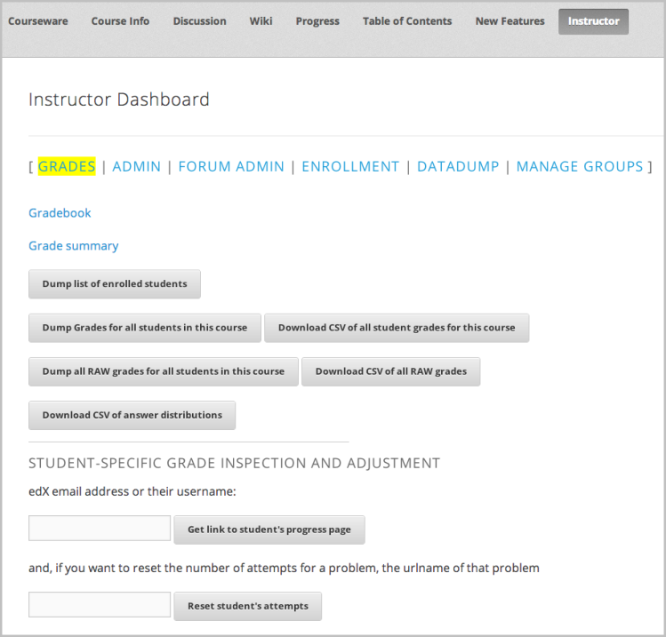

**************************************************
Checking Student Progress and Issuing Certificates
**************************************************

 
As will be discussed more in later sections, the grading policy and stored
problem scores are used to record progress through the course, determine
final grades, and issue certificates at the end. This unit will give you
some advance information about how the grading policy will be visible to the
students during the run of the course and what you will need to do at the
end of the course to give out grades.
 
 
Checking Progress as a Student
******************************
 
 
During the run of a course, students can check their progress by clicking on
the Progress tab of the course on Edge. (This is the same page they would go
to to view subsection problem scores, as described in Viewing Scores.) The
student's progress through the graded part of the course is displayed at the
top of this page, above the subsection scores, as a chart with entries for
all the assignments, total percentage earned in the course so far and
percent needed for each grade cutoff. Here is an example of a student's
progress through edX101.
 
 
.. image:: Images/image245.png

 
 
The student will be able to see from this page that, at the time this
screenshot was taken, edX101 was graded as a Pass/Fail course with a cutoff
of 34% and that the grading rubric contained one assignment type, called
Learning Sequence, consisting of 11 assignments total. Furthermore, this
picture says that this particular student has only submitted correct
responses to two assignments, and that their current total percent grade in
the course is 6%. By hovering over each progress bar, the student would be
able to get further statistics of how much each assignment was counted as.
 
 
As was mentioned in the unit on Viewing Scores, further down on the Progress
page is a list of all the subsections in the course, with the scores
recorded for the student for all problems in the course. Here is a scrolled
down view of the example Progress page for the student in the example above:
 
 
.. image:: Images/image247.png
 
 
Again, note that point scores from graded sections are called "Problem
Scores", while point scores from ungraded sections are called "Practice
Scores".

.. raw:: latex
  
      \newpage %
 
Checking Progress of Students as an Instructor
**********************************************
 
 
To check the progress of the student through the course, visit the
Instructor dashboard of your course in instructor view on Edge and click on
the Grades page. The Instructor dashboard for courses sometimes changes as
more course-specific tools get added. Here is the current view of the top of
the Grades page of the Instructor dashboard for edX101:
 
 

 
Here you see several options for viewing or downloading student grades,
viewing individual progress through a course or resetting problem attempts.

.. note::

	Only the top part of the Grades page is shown. The page continues
	with some more information about course statistics. The link to the
	student's progress page should give you a view of exactly what the student
	would see, including scores for graded and ungraded assignments.
 
 
.. note::

	The stored scores visible to you on the Instructor tab and to
	the students from the Progress tab in the course on Edge are a snapshot of the
	current state of the problem score database. They may be slightly out of
	sync with actual problem scores. (Asynchronicities may happen if, for example,
	the weight of a live problem was changed during an assignment, and not
	everyone has yet resubmitted their answers for that problem.) Scores and grades
	are usually recomputed at the end of the semester before determining final
	grades and issuing Certificates.

.. raw:: latex
  
      \newpage %
 
 
Assigning Final Grades and Issuing Certificates
***********************************************

The final grades of a student in the course and the grading
rubric you have set are used to determine whether the student has earned a
Certificate of Mastery for the course. The process for issuing Certificates
has to be started manually by you or by the edX support team at the end of the
course run. For more information about issuing Certificates, see TBD.
 
