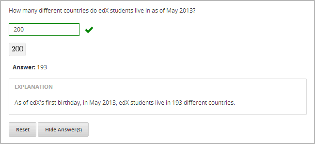
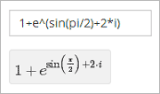
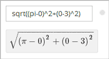

.. _Common Problems:

############################
Common Problems
############################

*Common problems* are typical problems such as multiple choice problems
and other problems whose answers are simple for students to select or
enter. You can create all of these problems using the Simple Editor in
Studio. You don't have to use XML or switch to the Advanced Editor.

The following are the common problem types in Studio:

-  :ref:`Checkbox` In checkbox problems, students select one or more options
   from a list of possible answers.
-  :ref:`Dropdown` In dropdown problems, students select one answer from a
   dropdown list.
-  :ref:`Multiple Choice` Multiple choice problems require students to
   select one answer from a list of choices that appear directly below
   the question.
-  :ref:`Numerical Input` Numerical input problems require answers that
   include only integers, fractions, and a few common constants and
   operators.
-  :ref:`Text Input` In text input problems, students enter a short text
   answer to a question.

These problems are easy to access in Studio. To create them, click
**Problem** under **Add New Component**, click the **Common Problem
Types** tab, and then click the name of the problem. (Note that
**Checkbox** doesn't appear in the list of common problem types. To
create a checkbox problem, you'll click **Blank Common Problem**.)

.. _Checkbox:

*******************
Checkbox
*******************

In checkbox problems, the student selects one or more options from a
list of possible answers. The student must select all the options that
apply to answer the problem correctly. Each checkbox problem must have
at least one correct answer.

.. image:: Images/CheckboxExample.gif

==========================
Create a Checkbox Problem
==========================

#. Under **Add New Component**, click **Problem**.
#. In the **Select Problem Component Type** screen, click **Blank Common
   Problem** on the **Common Problem Types** tab.
#. In the Problem component that appears, click **Edit**.
#. In the component editor, replace the default text with the text of your 
   problem. Enter each answer option on its own line.
#. Select all the answer options, and then click the checkbox button. 
           
   When you do this, brackets appear next to each answer choice.

#. Add an **x** between the brackets for the correct answer or answers.
#. In the component editor, select the text of the explanation, and then click the 
   explanation button to add explanation tags around the text.

   .. image:: Images/ProbCompButton_Explanation.gif

#. On the **Settings** tab, specify the settings that you want. 
#. Click **Save**.

For the example problem above, the text in the Problem component is the
following.

::

    Learning about the benefits of preventative healthcare can be particularly 
    difficult. Check all of the reasons below why this may be the case.

    [x] A large amount of time passes between undertaking a preventative measure 
    and seeing the result. 
    [ ] Non-immunized people will always fall sick. 
    [x] If others are immunized, fewer people will fall sick regardless of a 
    particular individual's choice to get immunized or not. 
    [x] Trust in healthcare professionals and government officials is fragile. 

    [explanation]
    People who are not immunized against a disease may still not fall sick from 
    the disease. If someone is trying to learn whether or not preventative measures 
    against the disease have any impact, he or she may see these people and conclude, 
    since they have remained healthy despite not being immunized, that immunizations 
    have no effect. Consequently, he or she would tend to believe that immunization 
    (or other preventative measures) have fewer benefits than they actually do.
    [explanation]

.. _Dropdown:

*******************
Dropdown
*******************

Dropdown problems allow the student to choose from a collection of
answer options, presented as a dropdown list. Unlike multiple choice
problems, whose answers are always visible directly below the question,
dropdown problems don't show answer choices until the student clicks
the dropdown arrow.

.. image:: Images/DropdownExample.gif

==========================
Create a Dropdown Problem
==========================

To create a dropdown problem, follow these steps.

#. Under **Add New Component**, click **Problem**.
#. In the **Select Problem Component Type** screen, click
   **Dropdown** on the **Common Problem Types** tab.
#. In the new Problem component that appears, click **Edit**.
#. Replace the default text with the text for your problem. Enter each of the possible 
   answers on the same line, separated by commas.
#. Select all the answer options, and then click the dropdown button. 
      
   .. image:: Images/ProbCompButton_Dropdown.gif
      
   When you do this, a double set of brackets ([[ ]]) appears and surrounds the 
   answer options.
      
#. Inside the brackets, surround the correct answer with parentheses.
#. In the component editor, select the text of the explanation, and then click the 
   explanation button to add explanation tags around the text.

   .. image:: Images/ProbCompButton_Explanation.gif

#. On the **Settings** tab, specify the settings that you want. 
#. Click **Save**.

For the example problem above, the text in the Problem component is the
following.

::

    What type of data are the following?

    Age:
    [[Nominal, Discrete, (Continuous)]]
    Age, rounded to the nearest year:
    [[Nominal, (Discrete), Continuous]]
    Life stage - infant, child, and adult:
    [[(Nominal), Discrete, Continuous]]

.. _Multiple Choice:

*******************
Multiple Choice
*******************

In multiple choice problems, students select one option from a list of
answer options. Unlike with dropdown problems, whose answer choices
don't appear until the student clicks the drop-down arrow, answer
choices for multiple choice problems are always visible directly below
the question.

.. image:: Images/MultipleChoiceExample.gif

==================================
Create a Multiple Choice Problem
==================================

#. Under **Add New Component**, click **Problem**.
#. In the **Select Problem Component Type** screen, click **Multiple
   Choice** on the **Common Problem Types** tab.
#. When the new Problem component appears, click **Edit**.
#. In the component editor, replace the sample problem text with the text of your 
   problem. Enter each answer option on its own line.
#. Select all the answer options, and then click the multiple choice button. 
   
   .. image:: Images/ProbCompButton_MultChoice.gif
   
   When you do this, the component editor adds a pair of parentheses next to each 
   possible answer.
   
#. Add an "x" between the parentheses next to the correct answer.
   
#. In the component editor, select the text of the explanation, and then click the 
   explanation button to add explanation tags around the text.

   .. image:: Images/ProbCompButton_Explanation.gif

#. On the **Settings** tab, specify the settings that you want. 
#. Click **Save**.

For the example problem above, the text in the Problem component is the
following.

::

    Lateral inhibition, as was first discovered in the horsehoe crab:

    ( ) is a property of touch sensation, referring to the ability of crabs to 
    detect nearby predators.
    ( ) is a property of hearing, referring to the ability of crabs to detect 
    low frequency noises.
    (x) is a property of vision, referring to the ability of crabs eyes to 
    enhance contrasts.
    ( ) has to do with the ability of crabs to use sonar to detect fellow horseshoe 
    crabs nearby.
    ( ) has to do with a weighting system in the crabs skeleton that allows it to 
    balance in turbulent water.

    [Explanation]
    Horseshoe crabs were essential to the discovery of lateral inhibition, a property of 
    vision present in horseshoe crabs as well as humans, that enables enhancement of 
    contrast at edges of objects as was demonstrated in class. In 1967, Haldan Hartline 
    received the Nobel prize for his research on vision and in particular his research 
    investigating lateral inhibition using horseshoe crabs.
    [Explanation]

.. _Numerical Input:

*******************
Numerical Input
*******************

In numerical input problems, students enter numbers or specific and
relatively simple mathematical expressions to answer a question. 

Note that students' responses don't have to be exact for these problems. You can 
specify a margin of error. For more information, see the instructions below.

Responses for numerical input problems can include integers, fractions,
and constants such as *pi* and *g*. Responses can also include text
representing common functions, such as square root (sqrt) and log base 2
(log2), as well as trigonometric functions and their inverses, such as
sine (sin) and arcsine (arcsin). For these functions, Studio changes the
text that the student enters into mathematical symbols. The following
example shows the way Studio renders students' text responses in
numerical input problems. To see more examples, scroll down to **Examples**.

.. image:: Images/Math5.gif

==================================
Create a Numerical Input Problem
==================================

#. Under **Add New Component**, click **Problem**.
#. In the **Select Problem Component Type** screen, click **Numerical
   Input** on the **Common Problem Types** tab.
#. When the new Problem component appears, click **Edit**.
#. In the component editor, replace the sample problem text with your own text.

#. Select the text of the answer, and then click the numerical input button. 

   .. image:: Images/ProbCompButton_NumInput.gif
   
   When you do this, an equal sign appears next to the answer.
        
#. (Optional) If you want to include a margin of error, add **+-NUMBER** after the answer. For
   example, if you want to include a 2% margin of error, add **+-2%**.

#. In the component editor, select the text of the explanation, and then click the 
   explanation button to add explanation tags around the text.

   .. image:: Images/ProbCompButton_Explanation.gif

#. On the **Settings** tab, specify the settings that you want. 
#. Click **Save**.

For the example problem above, the text in the Problem component is the
following.

::

   How many different countries do edX students live in as of May 2013?

   = 193 +- 5%
    
   [explanation]
   As of edX's first birthday, in May 2013, edX students live in 193 different countries.
   [explanation]

**Examples**

The following are a few more examples of the way that Studio renders numerical input
text that students enter.

.. image:: Images/Math3.gif
.. image:: Images/Math4.gif

For more information, see `Formula Equation Input 
<https://edx.readthedocs.org/en/latest/course_data_formats/formula_equation_input.html>`_.

.. _Text input:

*******************
Text Input
*******************

In text input problems, students enter text into a response field. The
response can include numbers, letters, and special characters such as
punctuation marks. Because the text that the student enters must match
the instructor's specified answer exactly, including spelling and
punctuation, we recommend that you specify more than one attempt for
text input problems to allow for typographical errors.

.. image:: Images/TextInputExample.gif

==================================
Create a Text Input Problem
==================================

To create a text input problem, follow these steps.

#. Under **Add New Component**, click **Problem**.
#. In the **Select Problem Component Type** screen, click **Text Input**
   on the **Common Problem Types** tab.
#. In the new Problem component that appears, click **Edit**.
#. Replace the default text with the text for your problem.
#. Select the text of the answer, and then click the text input button. 
   
   .. image:: Images/ProbCompButton_TextInput.gif
   
   When you do this, an equal sign appears next to the answer.
  
   
#. In the component editor, select the text of the explanation, and then click the 
   explanation button to add explanation tags around the text.

   .. image:: Images/ProbCompButton_Explanation.gif

#. On the **Settings** tab, specify the settings that you want. 
#. Click **Save**.

For the example problem above, the text in the Problem component is the
following.

::

    What is the technical term that refers to the fact that, when enough people 
    sleep under a bednet, the disease may altogether disappear?
    = herd immunity

    [explanation]
    The correct answer is herd immunity. As more and more people use bednets, 
    the risk of malaria begins to fall for everyone – users and non-users alike. 
    This can fall to such a low probability that malaria is effectively eradicated 
    from the group (even when the group does not have 100% bednet coverage).
    [explanation]
    
=========================================
Case Sensitivity and Text Input Problems
=========================================

By default, text input problems do not require a case sensitive response. You can change this
and require a case sensitive answer.

To make a text input response case sensitive, you must use the :ref:`Advanced Editor`.

In the advanced editor, you see that the **type** attribute of the **stringresponse** 
element equals **ci**, for *case insensitive*. For example:

::

    <stringresponse answer="Michigan" type="ci">
      <textline size="20"/>
    </stringresponse>

To make the response case sensitive, change the value of the **type** attribute to **cs**.

::

    <stringresponse answer="Michigan" type="cs">
      <textline size="20"/>
    </stringresponse>
    
============================================
Response Field Length of Text Input Problems
============================================

By default, the response field for text input problems is 20 characters long. 

You should preview the unit to ensure that the length of the response input field
accommodates the correct answer, and provides extra space for possible incorrect answers.

If the default response field length is not sufficient, you can change it using the :ref:`Advanced Editor`.

In the advanced editor, in the XML block for the answer, you see that the **size** attribute of the **textline** 
element equals **20**:

::

    <stringresponse answer="Democratic Republic of the Congo" type="ci">
      <textline size="20"/>
    </stringresponse>

To change the response field length, change the value of the **size** attribute:

::

    <stringresponse answer="Democratic Republic of the Congo" type="ci">
      <textline size="40"/>
    </stringresponse>
