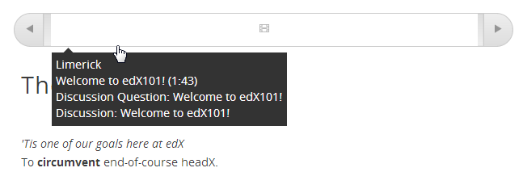

.. _Working with Discussion Components:

###################################
Working with Discussion Components
###################################

*******************
Overview
*******************

You can add a Discussion component to a Unit, to pose a question related to the Unit and give students a chance to respond and interact.

* :ref:`Create a Discussion Component`
* :ref:`A Student's View of the Discussion`
* :ref:`Seed a Discussion Space in Your Course`

Before you add a Discussion component, it is generally a good idea to add an HTML component that 
introduces the topic to be discussed. The Discussion component itself does not contain any text and may be easy for students to overlook. 

.. _Create a Discussion Component:

*****************************
Create a Discussion Component 
*****************************

.. note:: Before you create a Discussion component, consider that Discussion categories are immediately visible in your forum (on the Discussion tab for your course) when you create them, even though the unit that contains the Discussion component is set to Private.

To create a new HTML component in an existing Unit, ensure the Unit is Private.  
For more information on Public and Private Units, see LINK.

#. Under **Add New Component**, click the **discussion** icon.

   .. image:: Images/NewComponent_Discussion.png
  
   The Discussion component is added:
  
   .. image:: Images/EditDiscussionComponent.png

#. In the Discussion component, click **Edit**.

   The Discussion component editor opens.
   
   .. image:: Images/DiscussionComponentEditor.png

#. Follow the guidelines in the editor to fill in the **Discussion Category**, **Display Name**, and **Subcategory**. 
  
#. Click **Save**.

.. _A Student's View of the Discussion:

**********************************
A Student's View of the Discussion 
**********************************

For students, Discussion component names appear in the course ribbon at the top of the page:

The Discussion space appears under other components in the unit. 
It doesn't have a label in the body of the unit. 
Instead, students see "Show discussion" or "Hide discussion" on the left, 
and a blue **New Post** button on the right.

In the following example, the Discussion component follows Video and HTML components:

.. image:: Images/DiscussionComponent_LMS.png

In the **Discussion** tab at the top of the page, 
students can find the category and subcategory of the discussion in the left pane.

.. image:: Images/DiscussionComponent_Forum.png

.. _Seed a Discussion Space in Your Course:

**************************************
Seed a Discussion Space in Your Course 
**************************************

Many students may feel hesitant to be the first to
post an answer to your question. You can get the discussion started by posting
your own answer—preferably anonymously or as a student, so that students will be
more comfortable replying if they disagree with your post.

To post as a student, follow the steps below. If you later want to reply as
yourself, log back into your usual account and omit steps 1 and 2.

#. Set up a test account on with an e-mail address that is not associated with your Course Team.

#. Go to your course URL and register for your course.

  a. Locate the Unit that contains the Discussion component.

  b. In the Unit, locate the discussion space.

  c. Click **New post.**

3. Type a title for your post in the Title field, and then enter text for your post.

#. If you want to, select the **post anonymously** check box or the **follow this post** check box.

#. When you are satisfied with your post, click **Add Post.**

Your new post appears at the top of list in the unit. Posts are listed in
reverse chronological order.

