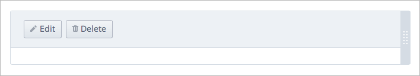
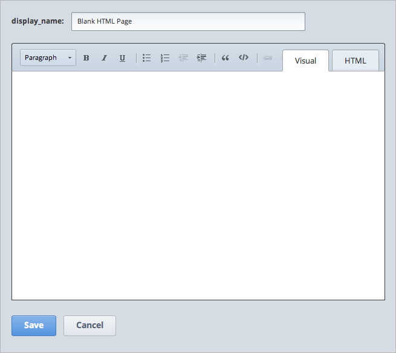
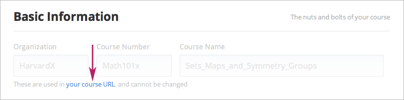
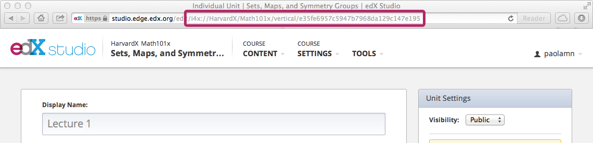
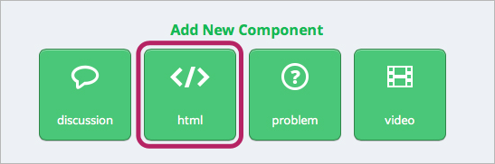
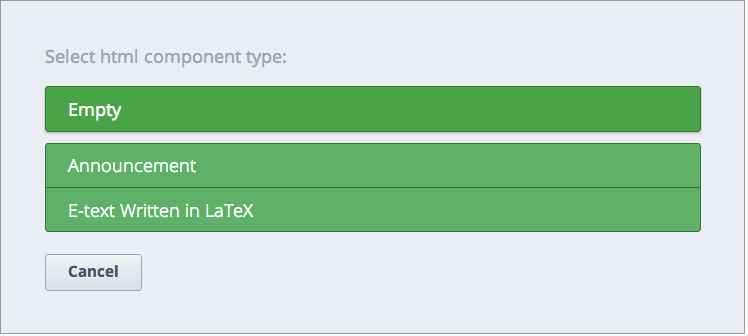
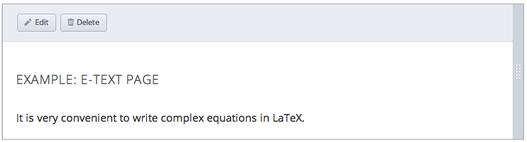

************************
Create an HTML Component
************************

    .. image:: Images/image067.png

The HTML component is the most basic component type. These components are the
building blocks of text-based courses. They are used to add information such as
text, lists, links, and images to units. For example, you can use these
components between Problem components to add explanatory text. You can also use
HTML components to import LaTeX code into your course.

The HTML component editor has two views: **Visual view** and **HTML view.**
Visual view offers you a “what you see is what you get” (WYSIWYG) editor for
editing a pre-formatted version of the text. HTML view gives you a text editor
in which you can edit HTML code directly.

.. note::

  Studio processes the HTML code entered when saving it and before rendering
  it. Make sure that the component you created looks the way you expect live if
  you go back and forth between Visual and HTML view.

.. raw:: latex
  
      \newpage %

Create a Basic HTML Component
*****************************

**To create a basic, blank HTML component:**

1. Under Add New Component, click **html**, and then click **Empty.** The
following blank component appears.

2. In the blank component, click **Edit.** The HTML editor opens.

.. image:: Images/image071.png

3. Enter the information that you want, and then click **Save.**

.. note::

  If you want to enter links to other pages or to images or to edit the
  HTML  directly, switch to the HTML tab.

.. raw:: latex
  
      \newpage %

**To create a basic HTML component that includes a template you can use:**

1. Under **Add New Component,** click **html** and then click **Announcement.** 
The following screen opens.

.. image:: Images/image073.png

2. Click **Edit.**

  The text editor opens in Visual view. Replace the template text with your
  announcement text.

.. note::

  If you want to enter links to other pages or to images or to edit the
  HTML directly, switch to the HTML tab.

3. Click **Save.**

.. raw:: latex
  
    \newpage %

Create Links
************

Link to a Handout or Image
==========================

To link to a document, image, or other file that you uploaded to the Files &
Uploads page:

1. Create a blank HTML component, and switch to HTML view.

2. In the HTML box, create links to your files.

To create a link to a document, enter the following syntax, where URL OF FILE is
the URL that you noted in step 5 of Upload a File to the Files & Uploads Page
and LINK TEXT is the text that the user will click. ::

	
<a href="[URL OF FILE]">[LINK TEXT]</a>

For example, to create a link to the HTML template for the “About” page document
whose URL is /c4x/edX/edX101/asset/AboutPage_Template.txt, use the following
code. ::

  
<a href="/c4x/edX/edX101/asset/AboutPage_Template.txt">HTML Template for
  <the "About" page</a>

To create a link to an image that you’ve uploaded, enter the following syntax,
where URL OF FILE is the URL that you noted in step 5 of Upload a File to the
Files & Uploads Page. ::

  

For example, to create a link to the CourseImage.jpg file whose URL is
/c4x/edX/edX101/asset/CourseImage.jpg, use the following code. ::

	

When you use this code, the following image appears.

.. image:: Images/image078.png
  :width: 800

3. Click **Save.** Your files or images appear in the component.

.. raw:: latex
  
  \newpage %
  

Link to Course Units
====================

To direct the student to a specific place in your own course, you must add an
HTML link to that unit. To do this:

1. Determine the relative directory of your course.

a. On the Course Settings tab, click the blue your course URL link under Basic
  Information.

The registration page for your course opens.

b. In the address bar at the top of the page, locate the URL.

c. Copy the part of the URL after “.org” and before “about”, including the 
forward slashes. The syntax is the following. ::

	/courses/[organization]/[course_number]/[course_name]/

For example, for edX101: How to Create an edX Course from edX, the complete URL
is the following. ::

	https://edge.edx.org/courses/edX/edX101/How_to_create_an_edX_course/about

The relative directory is the following. ::

	/courses/edX/edX101/How_to_create_an_edX_course/

2. Determine the location ID of the target unit. Studio generates the location
ID for each unit when you create the unit. The location ID uses the following
syntax. ::

	 i4x://<organization>/<course_number>/vertical/<url_name_of_unit>

.. note::

  To find the location ID, open the page of the unit you are trying to link
  to in Studio and look at the URL in the browser’s address bar. The location ID
  is the text in the URL after edit, as in the following example.

3. Open the unit that you want to link from.

4. Under Add New Component, click html, and then click Empty. A  new, blank
component appears.

.. image:: Images/image083.png
  :width: 800

5. Click **edit**.

6. In the HTML editor that opens, click the HTML tab.

7. Next to the number 1, type the following. Replace relative course directory,
location id of unit, and link text with your information. ::

  <a href = "[[relative course directory]]/jump_to/[[location id of
  <unit]]">[link text]</a>

For example, a link to the “Creating an HTML Component” unit in edx101
resembles the following ::

  <a href = "courses/edX/edX101/How_to_Create_an_edX_Course/jump_to/i4x://edX/ed
  <X101/vertical/8713e94afd074e40991dcb675d1030b5">Creating an HTML
  <Component</a>
 

.. raw:: latex
  
  \newpage %

Import from LaTeX
*****************

You can create an HTML component from imported LaTeX code.

.. note::

  This feature is currently under development.

1. Under **Add New Component**, click **html**, and then click **E-text Written
in LaTeX.**

2. In the component that appears, click Edit.

.. image:: Images/image083.png
  :width: 800

3. The component editor opens. In the top left corner of the editor, click the
yellow **Edit High Level Source** text.

4. In the **High Level Source Editing** screen that opens, replace the sample
code with your LaTeX code.

5. Click **Save and compile to edX XML** to convert the LaTeX code into edX XML
code.

.. note::

  Studio uses a third-party LaTeX processor to convert LaTeX code to XML.
  The LaTeX processor must be up and running.

6. Click **Save**. Verify that your newly created component looks the way you
want it to.

