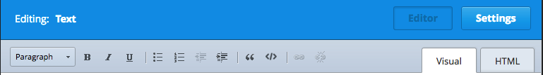
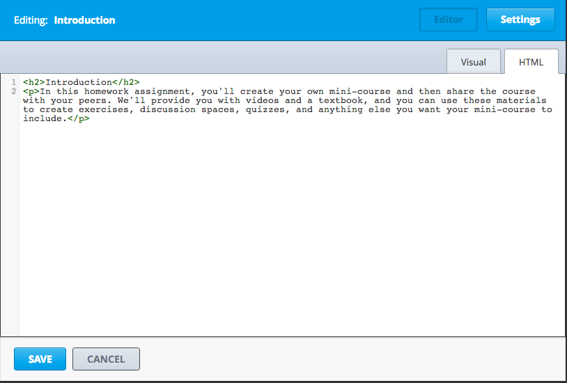
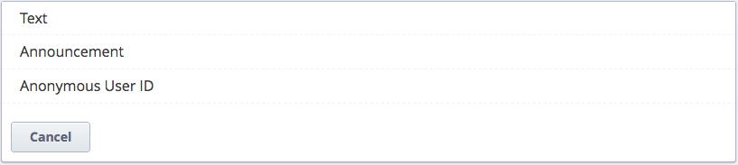
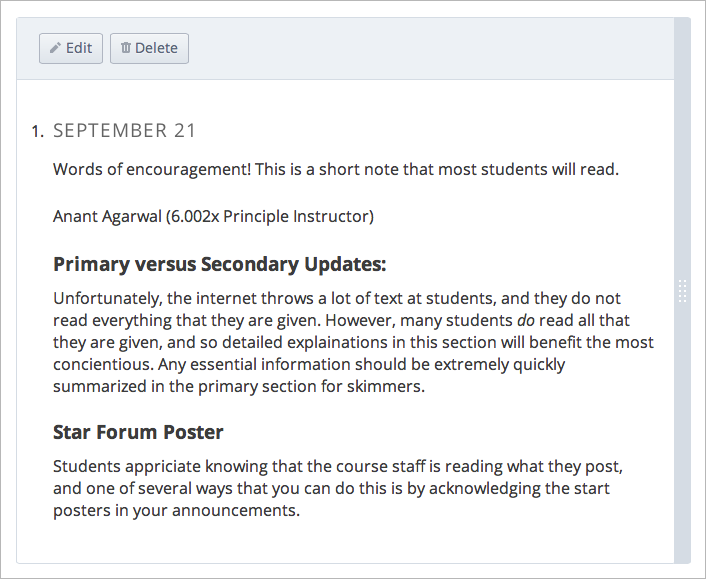

.. _Working with HTML Components:

#############################
Working with HTML Components
#############################

*******************
Overview
*******************

You use an HTML component to add and format text for your course. 
You can add text, lists, links and images in an HTML component. 

See the following topics:

* :ref:`Create an HTML Component`
* :ref:`Work with the Visual and HTML Editors`
* :ref:`Use the Announcement Template`
* :ref:`Import Content from LaTex`
* :ref:`Add a Link in an HTML Component`
* :ref:`Add an Image to an HTML Component`

.. note:: Ensure you understand the chapter :ref:`Organizing Your Course Content` before working with HTML components.

.. _Create an HTML Component:

*****************************
Create an HTML Component
*****************************

To create a new HTML component in an existing Unit, ensure the Unit is Private.  
For more information on Public and Private Units, see :ref:`Public and Private Units`.

#. Under **Add New Component**, click the **html** icon.

  .. image:: Images/NewComponent_HTML.png

2. In the list that appears, click **Text**.

   An empty component appears at the bottom of the Unit.
   
  .. image:: Images/HTMLComponent_Edit.png
   
3. In the empty component, click **Edit**.
   
   The HTML Component Editor opens. 
  
  .. image:: Images/HTMLEditor.png

4. Click **Settings** to enter the **Display Name** for the HTML component. 

   A student sees the Display when hovering your mouse over the icon for the Unit in the Subsection accordian. 

   Click **Save** to return to the Component Editor. 

5. Enter text as needed. 

6. Click **Save** to save the HTML component.

For more information, see:

* :ref:`Work with the Visual and HTML Editors`
* :ref:`Use the Announcement Template`
* :ref:`Import Content from LaTex`
* :ref:`Add a Link in an HTML Component`
* :ref:`Add an Image to an HTML Component`

.. _Work with the Visual and HTML Editors:

*****************************************
Work with the Visual and HTML Editors
*****************************************

The HTML Component editor has two views: the **Visual view** and the **HTML view.**

You select the view by clicking the tab in the upper-right of the component Editor.

==============
Visual Editor
==============

The Visual view provides a “what you see is what you get” (WYSIWYG) editor for
editing a pre-formatted version of the text. 

.. image:: Images/HTMLEditor_Visual.png

Use the buttons at the top of the Visual editor to change the formatting as needed. 
For example, you can enclose the title in heading tags, create bulleted or numbered lists, 
or apply bold, italic, or underline formatting. 

==============
HTML Editor
==============
The HTML allows you to edit HTML code directly.

.. note:: Studio processes the HTML code entered when saving it and before rendering
  it. Make sure that the text you create looks the way you expect if
  you go back and forth between the Visual and HTML views.

.. _Use the Announcement Template:

************************************
Use the Announcement Template
************************************

When you create a new HTML component, you can select to use a built-in Announcement template.

When creating the new HTML component, select **Announcement**.

 
The following screen opens.

Edit the content of the announcement just as you would any HTML component.

.. _Import Content from LaTeX:

*************************
Import Content from LaTeX
*************************

If LaTeX is enabled for your course, you can create an HTML component from imported LaTeX code.

Studio uses a third-party LaTeX processor to convert LaTeX code to XML. The LaTeX processor must be up and running.

1. When creating the new HTML component, select **E-text Written in LaTeX**.

   The new HTML component opens, with an **upload** link:
   
   .. image:: Images/latex_upload.png
     :width: 800   

2. To upload a LaTeX file from your computer, click **upload**.

   You are prompted to select a file.  The file loads in the LaTeX editor.
   
3. In the LaTeX editor, click **Save & Compile to edX XML**.   

   The LaTeX content is added to the HTML component. For example:
   
   .. image:: Images/Latex_component.png
     :width: 800

4. Verify that your newly created component looks the way you want it to. 

You can edit the HTML component with LaTeX as you can any other component. 
In the editor, you can launch the LaTeX source compiler.

.. _Add a Link in an HTML Component:

***********************************
Add a Link in an HTML Component
***********************************

You can add a link in an HTML component to any file you uploaded for the course. 

Find any copy the URL of the file in the Files & Uploads page.

See :ref:`Add Files to a Course` for more information.

While editing the HTML component:

#. Switch to the HTML view.

#. To create a link to a document, enter the following syntax, where URL OF FILE is the URL that you copied from the Files & Uploads Page and LINK TEXT is the text that the user will click. 
   
   ``
<a href="[URL OF FILE]">[LINK TEXT]</a>
``

.. _Add a Link to a Course Unit:

============================
Add a Link to a Course Unit
============================

You can add a link to a course unit in an HTML component.

#. Determine the unit identifier of the unit you're linking to. To do this, open the
   unit page in Studio, and locate the **Unit Identifier** field under **Unit Location** in the right pane.

#. Copy the unit identifier.

#. Open the HTML component where you want to add the link.

#. Select the text that you want to make into the link.

#. Click the link icon in the toolbar.

#. In the Insert/Edit Link dialog box, enter the following in the Link URL field.
   
   Make sure to replace <unit identifier>(including the brackets) with the unit
   identifier that you copied in step 2, and make sure to include both forward slashes (/).
   
   ``/jump_to_id/<unit identifier>``

#. If you want the link to open in a new window, click the drop-down arrow next to
   the Target field, and then select Open Link in a New Window. If not, you can leave the default value.
   
#. Click **Insert**.

#. Save the HTML component and test the link.

.. _Add an Image to an HTML Component:

***********************************
Add an Image to an HTML Component
***********************************

You can add an any image that you have uploaded for the course to an HTML component. 

Find any copy the URL of the image in the Files & Uploads page.

See :ref:`Add Files to a Course` for more information.

While editing the HTML component:

#. Switch to the HTML view.

#. To add the image to a document, enter the following syntax, where URL OF FILE is the URL that you copied from the Files & Uploads Page. 
   
   ``

``

