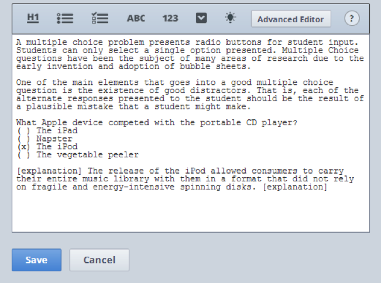
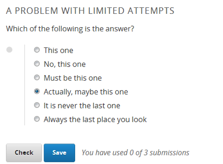
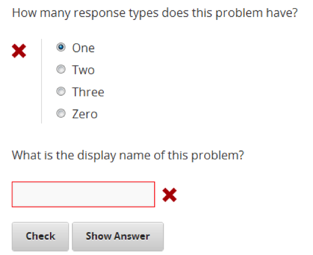
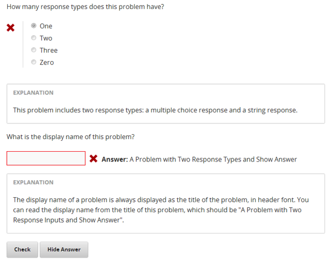
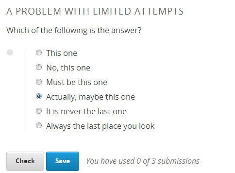
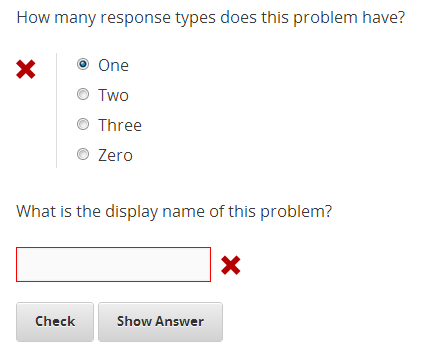
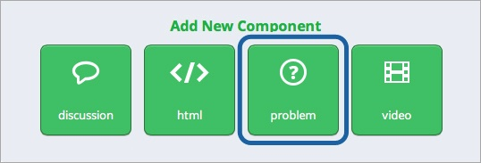

****************
Create a Problem 
****************

Overview
********

The problem component allows you to add interactive, automatically graded exercises to your course content. You can create many different types of problems
in Studio.

By default, all problems are ungraded practice problems. To change the problems to graded problems, change the assignment type of the subsection. 

To create a problem, determine:

• The type of problem that you want.

• The weight to assign to the problem.

• Whether you want to randomize the problem. 

• How to close the problem-that is, how to set the number of attempts a student has, [as well as set the due date].

• How you want to provide feedback to students; show answer on/off.

This course contains several places with more information about creating exercises and integrating them into your 	course.

• `Writing Exercises <https://edge.edx.org/courses/edX/edX101/How_to_Create_an_edX_Course/courseware/a45de3baa8a9468cbfb1a301fdcd7e86/d15cfeaff0af4dd7be4765cd0988d172/1>`_ has more in-depth discussion about problem types, and some general pedagogical considerations for adapting to the online format and a `Gallery of Response Types <https://edge.edx.org/accounts/login?next=/courses/edX/edX101/How_to_Create_an_edX_Course/courseware/a45de3baa8a9468cbfb1a301fdcd7e86/3ba055e760d04f389150a75edfecb844/1>`_

•  `Appendix E <appendices/e.html>`  contains XML documentaion for the different problem response types.

•  The `Discussion Forum <https://edge.edx.org/courses/edX/edX101/How_to_Create_an_edX_Course/discussion/forum">`_  for this class is a good place to ask questions about exercise types, report any errors or oddities that you may encounter, and get technical support.
   
•  Creating problems for the online format opens a new playing field in the educational process. A big part of the community aspect of edX is to initiate and grow a `Creative Problems <https://edge.edx.org/courses/edX/edX101/How_to_Create_an_edX_Course/wiki/edx101/creative-problems/>`_ . Please look here to be inspired by new approaches when first making your class. Please also come back to post interesting approaches that you came up with while running your class, and to share with the community what worked well and what did not.

**Simple Editor and Advanced Editor**

Studio offers two interfaces for editing problem components.

• The **Simple Editor** allows you to edit problems visually, without having to work with XML.

• The **Advanced Editor** converts the problem to edX's XML standard and allows you to edit that XML directly. For more information about the XML for different problem types, see `Appendix E <appendices/e.html>` .

 
Some of the simpler problem templates, including multiple choice, open in the Simple Editor and allow you to switch to the Advanced Editor. The more complicated problem types, such as Circuit Response, open in the Advanced Editor.

.. note::

    You can switch at any time from the Simple Editor to the Advanced Editor by clicking "Advanced Editor" in the Simple Editor interface. However, there is no way to go back from the Advanced Editor to the Simple Editor without making a new component.
   
To open the Advanced Editor, click **Advanced Editor** in the top right corner of the Simple Editor.

   

The following is a multiple choice problem in the Advanced Editor.

.. image:: Images/image276.png
    :width: 600px

.. raw:: latex
  
  \newpage %

Problem Type
************

Links to description of all the different problem types-brief. Then include links to all the XML, etc.

You may want to create a problem that has more than one response type. For example, you may want to create a multiple choice question, and then ask the
student to explain his or her response. You may also want a student to be able to check the answers to many problems at one time. To accomplish these
tasks, you can include multiple problems inside a single Problem component. (LINK)

.. raw:: latex
  
  \newpage %

Randomizing
***********

The **rerandomize** setting determines whether any random variable inputs for a problem are randomized each time a student loads the problem.
(This is only applicable to problems with randomly generated numeric variables.)

.. raw:: latex
  
  \newpage %

Scoring and Weight
******************

Problems store a **point score** for submitted responses. The score that a student earns is the number of correct responses the student
submits divided by the maximum score for the problem. The default maximum score, or weight, is the integer number of response type inputs the problem has.
Thus, the weight attribute for a problem with one response type input is set to 1 (one point). You can change the maximum score for an individual problem
by manually changing the problem **weight** attribute to another number. When you do this, the number of points that you specify appears next
to the problem title ( to one decimal precision).

**WEIGHT: 0 POINTS**

Scores are stored for all problems, but they only contribute to a student's grade in the course if they are part of a subsection marked as graded. For more
information, see the material on attempts and closing problems in 7B: Feedback and Grading.

.. raw:: latex
  
  \newpage %

**Computing Point Scores**

The point score of a response for a problem reflects the correctness of the response and is recorded as the number of points earned out of the maximum
possible score for the problem (also known as the problem weight). The formula used for computing the recorded point score is the following:

•  **point score of response = problem weight * (# inputs correct / # total inputs)**

•  **point score of response** is the point score "earned" by this response for the problem.
   
•  **problem weight** is the maximum possible point score that can be earned for the problem. By default, this is the integer number of response types in that problem. This can be changed to another value by setting the weight attribute of the problem, as described in Setting Problem Attributes.
  
• ** # inputs correct** is the number of values for this response that were evaluated as correct by the response type fields.
   
• **# total inputs** is the total number of response type fields in the problem.

.. raw:: latex
  
  \newpage %
   
**Examples**

The following are some examples of setting problem weight and computing problem scores.

**Example 1**

A problem with two response type inputs and a blank weight attribute has a maximum score of 2.0 points.

A student response to this problem that consists of one correct input value and one incorrect input value would be marked as having a score of 1.0 points
out of 2.0 points possible.

**Example 2**

A problem with three response type inputs and a weight attribute of 12 has a maximum score of 12.0 points.

A student response to this problem that consists of one correct input value and two incorrect input values would be marked as having a score of 4.0 points out of 12.0 points possible.

**Example 3**

A problem with four response type inputs and a weight attribute of 2 has a maximum score of 2.0 points.

A student response to this problem that consists of two correct input values and two incorrect input values would be marked as having a score of 0.5 of a point out of 2.0 points total.

**PROBLEM: 20.0 POINTS**

• The weight attribute for this problem has been changed from the default.

• How many points is the entire problem worth?

• What number is the weight attribute of this problem set to?

• How many response inputs does this problem have?

• What is the default maximum score for this problem?

• If a response to this problem got one value right and the rest wrong, what score would it be assigned?

.. raw:: latex
  
  \newpage %

Close
*****

To stop accepting responses and recording points, problems can be **closed.** Closed problems do not display a **Check** button. Students
can still see questions, solutions, and revealed explanations in a closed problem, but they can no longer check their work, submit responses, or change their stored score.

There are several ways that you can close problems:

• Set a due date for the problems in a subsection. Note that you cannot set due dates for individual problems -- only for containing subsections (assignments). By default, due dates are not set. To set a due date, see LINK.

• Specify a grace period for your course. Note that the grace period applies to the entire course. To set a grace period, see LINK.

• Set the number of attempts for the individual problem component. The attempts setting determines the number of times a student is allowed to check their answer by clicking Check before the problem closes. If this field is left blank, a student has unlimited attempts. If you specify a number for the attempts setting, the number of total allowed and remaining attempts appears next to the Check button for the problem. Problems with a limited number of attempts also always display a Save button that allows response values to be saved without being submitted. When there is only one submission left, the student will receive a warning, and the Check button will be replaced with a Final Check button. When no attempts are left, both the Save and Check button will disappear.For more information, see Problem Attributes.

• Manually increase the number of attempts left for a given problem for a particular student from the Instructor tab in the live view of your course, when accessed in the Instructor view on Edge. This is recommended only for unusual situations, such as if you have to fix live problems during an exam.

.. raw:: latex
  
  \newpage %

Feedback
********

Studio includes several tools to provide feedback to students: the **Check** button, the **Show Answer** button, and the**Attempts** setting. When you use the **Show Answer** button, you can also provide a detailed explanation of the answer.

TBD-SCREENSHOT OF PROBLEM WITH THESE ELEMENTS CIRCLED

**Check Button**

The student clicks the **Check** button to submit a response. The problem module then performs the following steps.

• Accepts and stores the responses entered into each input.

• Checks the response values against the correct answers or solutions using an automatic grader.

• Visually marks the correct responses with a green check mark and the incorrect responses with a red x.

• Stores the point score earned by this response for this problem for this student.

If a student wants to save but not submit a response, the student can click **Save**.

In the following problem, enter a response, and then click **Check**. The problem tells you if your response is correct or incorrect.
Additionally, although you don't see it, a point score is also automatically stored for the response you submit.

**Show Answer button**

When a student clicks **Show Answer**, the problem shows the correct answers next to the corresponding response inputs and reveals any
additional explanations that you have provided. **Show Answer** is controlled by the **showanswer** attribute in the problem
editor. It can be set to be never visible, always visible, or visible only when the problem has closed. [Reference: Setting Problem Attributes.]

In the following problem, the **Show Answer ** button appears after the student has made at least one attempt to answer. Enter a response that you know is wrong, and then click **Check**.

Now, click **Show Answer** to view the correct answer and its explanation.

.. raw:: latex
  
  \newpage %

Create a Problem
****************

.. note::
    
    You can also include non-graded exercises throughout your course.

To add interactive, automatically graded exercises to your course content, use the Problem component. This component allows you to include an explanation
that the student can see when the student clicks **Show Answer**.

 Studio offers several templates that you can use. Alternatively, you can create your own problem type in XML.
 For detailed information about different problem types, see `Appendix E <appendices/e.html>`.  
   

1. Under **Add New Component**, click **Problem**.

.. image:: Images/image096.png
    :width: 600px

The **Select Problem Component Type** screen appears. By default, the **Common Problem Types** tab is selected.

To see a list of more complex problem types, click the **Advanced** tab.

2. Click the problem type that you want.

.. note::
    
    To create your own problem in XML, click "Empty" to open a blank XML editor.

A new problem component with sample template text appears.

For example, if you click **Multiple Choice**, the following problem component appears.

.. image:: Images/image101.png
    :width: 600px

3. Click **Edit**. This opens the Simple Editor for the problem component. The following example shows this view for a multiple choice
problem.

4. Set the problem attributes.

In the **display_name** box, type the text that you want the student to see when the student hovers over the icon in the bar at the top of the page. This text also appears as a header for the problem.
   
a. In the **weight** box, set a weight for the problem. If you want the problem to be a practice problem, set this to zero (0).

b. In the **rerandomize** box,

c.  In the **attempts** box, specify the number of attempts that you want to allow the student.
  
d.  In the **showanswer** box, enter one of the following settings.

.. raw:: latex
  
  \newpage %

**Reference**

• **never** = The Show Answer button is never visible.

• **closed** = The Show Answer button is not visible if either the due date has passed, or the student has no attempts left.

• **attempted** = The Show Answer button appears after the student has checked an answer once, regardless of correctness.

• **always** = The Show Answer button always appears.

5. Modify the problem text, and then click **Save** to save and check your work. Make sure to publish the draft you are working on to view the problem live.

.. raw:: latex
  
  \newpage %

Modify a Released Problem
*************************

   **WARNING: Be careful when you modify problems after they have been released!**

Currently, problems cache the following information per student:

• The student's last **submitted** response. 

• The score the student earned for that last response.

• The maximum point score for that problem.

This information is updated when a student submits a response to a problem. If the student refreshes the **Progress** page, solutions are not re-checked. If a student refreshes the page of a problem, the latest version of the problem statement is loaded, but their previous response is NOT reevaluated. Rather, the previous response is loaded on top of the current problem statement. That is **existing** student responses for a problem are not reevaluated if the problem statement or attributes are changed, until a student goes back and resubmits the problem. Furthermore, as of the time of writing, if the problem weight attribute is changed, stored scores are re-weighted (without rechecking the response) when the student reloads the **Progress** page.

For example, you may release a problem that has two inputs. After some students have submitted answers, if you change the solution to one of the inputs, the existing student scores are not updated.

Example: If you change the number of inputs to three, students who submitted answers before the change will have a score of 0, 1, or 2 out of 2.0. Students who submitted answers after the change will have scores of 0, 1, 2, or 3 out of 3.0 for the same problem.

However, if you go in and change the weight of the problem, the existing scores update when you refresh the **Progress** page.

Note that the behavior of re-grading in case of error is an edX Edge case. It is dependent on the implementation of grading, and may change. The goal in the future is to include re-grading that will allow some basic updates to live problems, whether or not students have submitted a response.

.. raw:: latex
  
  \newpage %

Workarounds
===========

If you have to modify a released problem in a way that affects grading, you have two options. Note that both options require you to ask your students to go back and resubmit a problem.

1.  Increase the number of attempts on the problem in the same Problem component. Then ask all the students in your class to redo the problem.
   
2.  Delete the entire Problem component in Studio and create a new Problem component with the content and settings that you want. Then ask all the students in your course to go back to this assignment and complete problem.

Check your **Progress** view or the **Instructor** tab on Edge as described in the Viewing Scores unit to see if point scores are being stored as you expect. If there are issues with stored scores that you do not understand or cannot fix, contact support on the Studio help page.

For a discussion of some trade-offs and some suggestions for cleaner solutions in the future, see the following `discussion thread <http://help.edge.edx.org/discussions/questions/73-what-if-you-discover-that-a-live-problem-is-wrong">`_ on the Studio help desk.

You can include multiple problems of different types inside a single Problem component, even if you select a particular template when you create a problem. A template is simply an XML editor with template text already filled in. You can add to or replace the template text.
