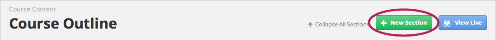
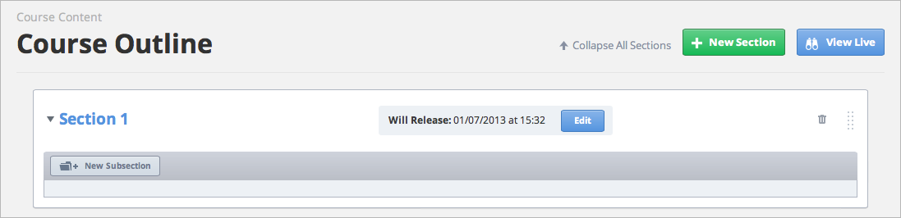
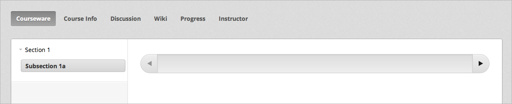
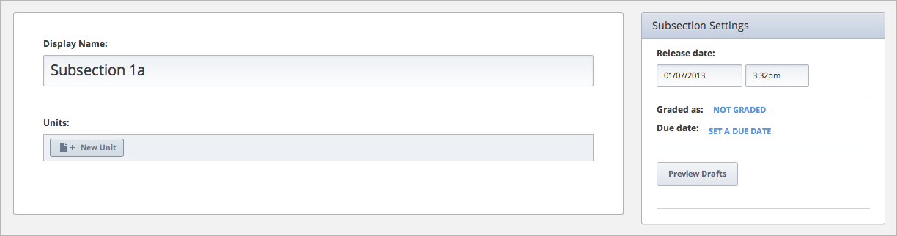

*******************************
Create a Section and Subsection
*******************************

1. Sign in to Studio, and then click the course that you want.

2. On the **Course Outline** page, click **New Section.** 

3. In the **New Section** Name box, type a section name, and then click
**Save**. 

.. note::

	In most courses, the name of the first section is Week 1. 
	The section that you have created appears on the **Course Outline** page.

The name you enter also appears in the navigation ribbon, as follows.

.. image:: Images/image043.png  
 :width: 800

4. To create a new lesson or assessment in your section, click **New
Subsection.** 

5. In the **New Subsection** box, enter the name for this subsection, and then
click **Save.** 

For example, if you enter **Week 1** as the section title and **Subsection 1**
as the subsection title, you see the following.

.. image:: Images/image045.png  
 :width: 800

If you view your course as a student would see it, you see the following.

6. Click the new subsection that you just created. In this example, you would
click **Subsection 1.** You see the following screen. 

