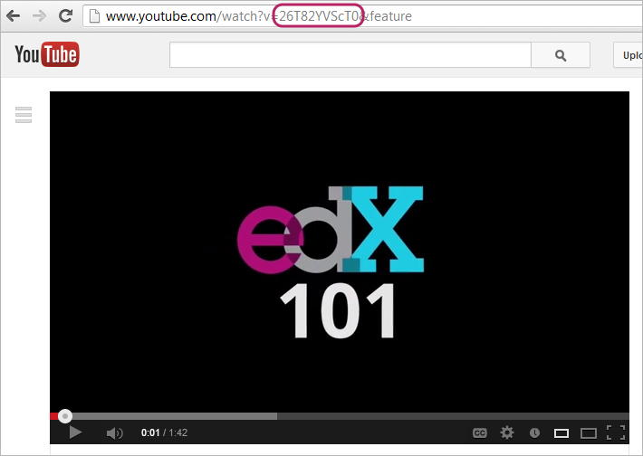

.. _Working with Video Components:

#############################
Working with Video Components
#############################

*******************
Overview
*******************
You can create a video of your lecture, and add it to your course with other components—such as discussions and problems—to promote active learning.

You can also associate a timed transcript with your video, which students can read and download.

When you add a video to your course, you first post the video online, and then create a link to that video in the body of your course. 

* :ref:`Video Formats`
* :ref:`Video Hosting`
* :ref:`Create a Video Component`

.. _Video Formats:

*******************
Video Formats
*******************

The edX video player supports videos in .mp4, .ogg, and .mpeg format.

.. _Video Hosting:

*******************
Video Hosting
*******************

All course videos should be posted to YouTube. 
By default, the edX video player accesses your YouTube videos. 
However, because YouTube is not available in all locations, we recommend that you also post copies of your videos on a third-party site such as Amazon S3. 
When a student views a video in your course, if YouTube is not available in that student's location or if the YouTube video doesn't play, the video on the backup site starts playing automatically. 
The student can also click a link to download the video from the backup site.

You can use any video backup site that you want. Keep in mind, however, that the site where you post the videos may have to handle a lot of traffic.

.. _Create a Video Component:

*************************
Create a Video Component
*************************

To add a video to the unit, you must obtain the YouTube ID for the video, obtain the URL for the backup video, and then create a video component.

To determine the YouTube ID for a video, locate the video on YouTube and make a note of the code that appears between **watch?v =** and **&feature** in the URL. 
This code appears circled below.

.. note:: If **&feature** does not appear in the URL, just use the code that follows **watch?v=** in the URL.

You can include videos that run at 0.75 speed, 1.25 speed, and 1.50 speed as well as at normal speed. To do this, you must upload each of these videos to YouTube separately.

.. note:: YouTube only hosts videos of up to 15 minutes. If you encode a 0.75 speed option, you must make
  sure that source video segments are only 11.25 minutes long so that YouTube can host all speeds.
  YouTube offers paid accounts that relax this restriction.

After you have uploaded the video to YouTube:

#. Under **Add New Component**, click the **video** icon.

   .. image:: Images/NewComponent_Discussion.png
  
   The Video component is added:

   .. image:: Images/VideoComponent_Default.png

2. When the new video component appears, click **edit**.** The video editor opens and displays the Basic settings.

   .. image:: Images/video-edit.png
   
3. In the **Display Name** field, enter the name you want students to see when they hover the mouse over the icon unit icon in the course accordian. This text also appears as a header for the video.

#. Enter the URL of the YouTube video. 	

   When you enter a video URL, Studio checks to see if a timed transcript for that video exists on edX. 
   If the transcript exists, Studio automatically associates the transcript with the video.  

   If your video is on YouTube, you can import a timed transcript from YouTube. This YouTube transcript overwrites the edX version of the transcript.
   
#. If no transcript exists, click **Upload New Timed Transcript** to upload a transcript file from your computer.

#. If you want to modify the transcript, click **Download to Edit**. You can then make your changes and upload the new file.

#. To specify additional sources for the video, click **Add more video sources**, and enter the URL and file type for the video.

#. Optionally, click **Advanced** to set the following for the video:

   * **Download Transcript**: the external URL for non-YouTube video transcripts.
   * **Download Video**:  the external URL to download the video.
   * **Start Time** and **End Time** for the video
   * **Video Sources**:  URLs and filenames for other sources of the video.
   * **Youtube ID**:  IDs for different speed videos on YouTube.

#. Click **Save.**
  

