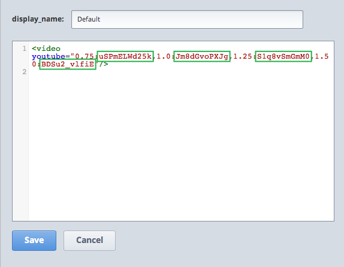

**************
Create a Video
**************

Many instructors use videos to take the place of in-class lectures. You can create a video of your lecture, and interweave other components—such as discussions and problems—to promote active learning.

To add a video to the unit, you must upload your video to YouTube, and then create a video component. You can also add a transcript to your video.

You can include videos that run at 0.75 speed, 1.25 speed, and 1.50 speed as well as at normal speed. To do this, you must upload each of these videos to YouTube separately.

.. note::

  YouTube only hosts videos of up to 15 minutes. If you encode a 0.75 speed option, you must make
  sure that source video segments are only 11.25 minutes long so that YouTube can host all speeds.
  YouTube offers paid accounts that relax this restriction.

1. Upload the video that you want to YouTube. Make note of the code that appears between **watch?v**
= and **&feature** in the URL. This code appears in the green box below.

.. image:: Images/image053.png
  :width: 800 px

2. In Studio, go to the unit that you want.

3. Under **Add New Component,** click **Video.**

4. In the screen that appears, click **default.**

5. When the new video component appears, click **edit**.** A video component opens, and a sample video
begins playing automatically.

6. In the **display_name** box, type the text that you want the student to see when the student hovers
the mouse over the icon in the bar at the top of the page. This text also appears as a headerfor the video.

7. Change the codes in the green boxes to the YouTube codes that you noted in step 1. The first
code (immediately to the right of "0.75:") corresponds to the video at 0.75 speed, the next
corresponds to 1.0 speed, etc.

8. Click **Save.**

.. note::

  All videos embedded using the edX player begin playing automatically. 
  There is currently no way to turn off the autoplay feature.
  

**To add a transcript for your video:**

1. Save your srt.sjson file as **subs_YOUTUBEID.srt.sjson,** where **YOUTUBEID** is the YouTube ID of your video.

2. Upload the **subs_YOUTUBEID.srt.sjson** file to the **Files & Uploads** page.

3. Create a link to this file by following the steps in the Add Items to the Handouts Sidebar
section.

