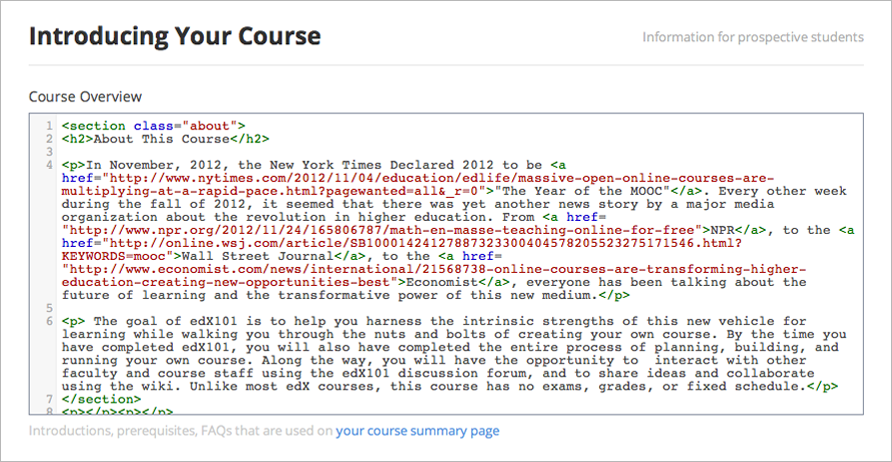
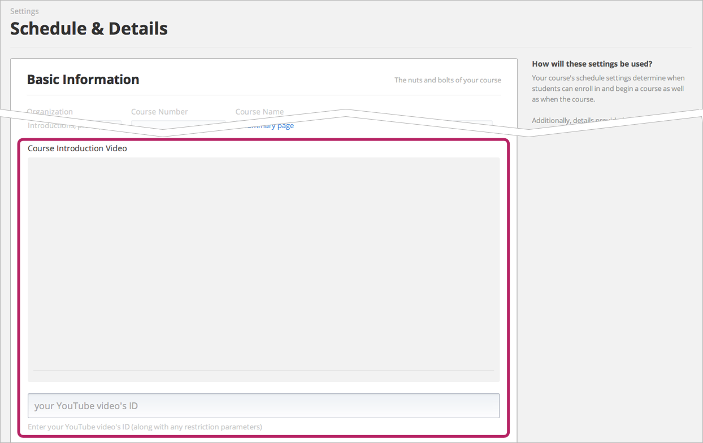

*************************
Establish Course Settings
*************************

Add Collaborators
*****************

    Studio has support for rudimentary collaborative editing of a course. Users must have registered at studio.edge.edx.org, and must have activated their account via the mail link. If a user is not found, you will be notified.

    Before you add a new user, consider the following.

    · Invited users have full permissions to edit your course, including deleting content created by anyone else.

    · Invited users cannot currently grant new permissions on the course.

    · Editing conflicts are currently not managed. Thus, the state of the course might change between refreshes of the page.

    To give another user permission to edit your course:

    1. On the navigation bar, click **Course Settings**, and then click **Course Team**.

    .. image:: Images/image115.png

    2. Click **New User**.

    .. image:: Images/image117.png

    3. In the **email** box, type the  mail address of the user, and then click **Add User**.

.. raw:: latex

      \newpage %

Add Manual Policy Data
**********************

    You can add manual policy data on the **Advanced Settings** page. These advanced configuration options are specified using JSON key and value
    pairs.

    You should only add manual policy data if you are very familiar with valid configuration key value pairs and the ways these pairs will affect your course.
    Errors on this page can cause significant problems with your course.

    The edX program managers can help you learn about how to apply these settings.

    1. On the navigation bar, click **Course Settings**, and then click **Advanced Settings**.

    2. Click **New Manual Policy** .

      .. image:: Images/image119.png

    3. In the **Policy Key** box, enter the policy key.

    4. In the **Policy Value** box, enter the value of the policy.

.. raw:: latex

      \newpage %

Add About Page Information
***************************

    To add scheduling information, a description, and other information for your course, use the **Course Settings** menu.

     .. image:: Images/image121.png

    This takes you to the

Schedule and Details Page
=========================

1. At the top of this page, you will find a section with the **Basic Information** for your course. It is here that you can locate the title of your course and find the URL for your course, which you can  mail to students to invite students to enroll in your course.

 .. image:: Images/image281.png

2. In the **Course Schedule** section, enter the date you want your course to start in the **Course Start Date** box, and then enter the time you want your course to start in the **Course** **Start Time** box.

.. note::

    The Course Start Time on this screen will reflect the current time zone in your browser, depending on your geography. Course start times for students will show as UTC on Edge.

3. In the **Course Schedule** section, enter the date you want your course to end in the **Course** **End Date**
    box, and then enter the time you want your course to end in the **Course** **End Time** box.

Add Enrollment Information
==========================

1. On the navigation bar, click **Course **Settings, and then click **Schedule & Details** .

2. In the **Course Schedule** section, enter the date you want enrollment for your course to start in the **Enrollment Start Date** box, and then enter the time you want enrollment for your course to start in the **Enrollment Start Time** box.

3. In the **Course Schedule** section, enter the date you want enrollment for your course to end in the **Enrollment End Date**
box, and then enter the time you want enrollment for your course to end in the **Enrollment End Time** box.

.. note::

    The Enrollment dates on this screen will reflect the current time zone in your browser, depending on your geography. Enrollment times for students will show as UTC on Edge.

Add a Course Overview
=====================

1. On the navigation bar, click **Course Settings**, and then click   **Schedule & Details** .

2. Scroll down to the **Introducing Your Course** section, and then locate the **Course Overview** box.

.. image:: Images/image123.png

3. In the **Course Overview** box, enter a description of your course.

The content for this box must be formated in HTML. For a template that you
can use that includes placeholders, see :doc:`appendices/a`.

If your course has prerequisites, you can include that information in the course overview.

.. note::

    There is no save button. Studio automatically saves your changes.

The following is example content for the **Course Overview** box:

Add a Descriptive Picture
=========================

1.  Select a high-resolution image that is a minimum of 660 pixels in width by 240 pixels in height.

2.  Change the file name of the picture that you want to use to **images_course_image.jpg**.

3.  Upload the file to the **Files & Uploads** page.

The picture that is named **images_course_image.jpg** automatically appears on the course About page.

Add an About Video
==================

You can create an About video that will appear on the **About** page for your course.

1. Upload the video that you want to YouTube. Make note of the code that appears between   ** watch?v =**  and   ** &feature**  in the URL. This code appears in the green box below.

.. image:: Images/image127.png

2. On the navigation bar, click **Course Settings**, and then click **Schedule & Details** .

3. Scroll down to the **Introducing Your Course** section, and then locate the **Course** **Introduction Video**
    field. If you have not already added a video, you see a blank field above an **id** box.

4. In the **your YouTube video's ID**  box, enter your video code. When you add the code, the video automatically appears in the field above the   **your YouTube video's ID**  box.

.. note::

    There is no save button. Studio automatically saves your changes.

For example, your course introduction video appears as follows.

.. image:: Images/image131.png

Add Weekly Time Requirements Information
========================================

1. On the navigation bar, click **Course Settings**, and then click **Schedule & Details** .

2. Scroll down to the **Requirments** section.

3. In the **Hours of Effort per Week** box, enter the number of hours you expect students to work on this course each week.
