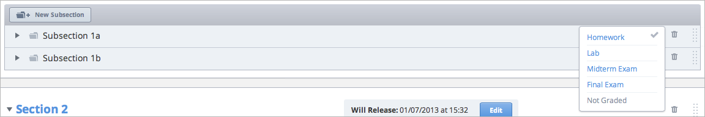
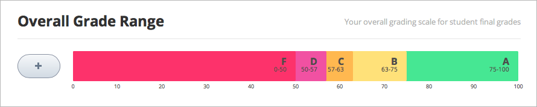
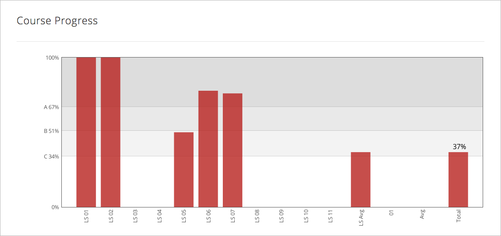
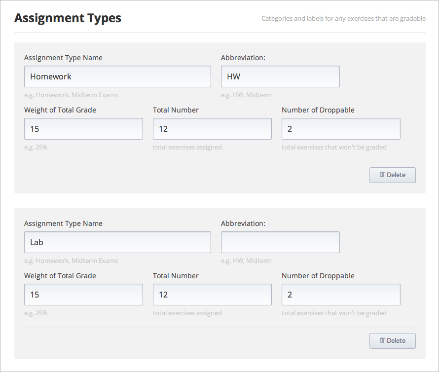
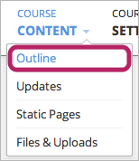
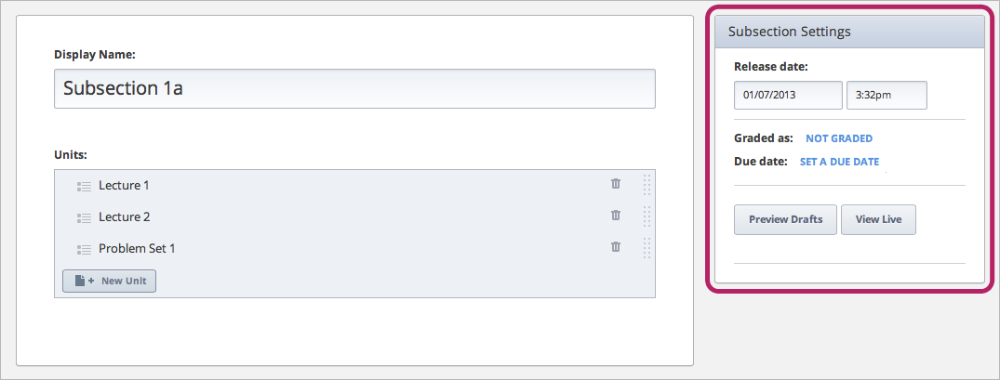

***************************
Establish a Grading Policy  
***************************
  

Overview 
********
  
  
Grades in edX courses are based on homework assignments and exams.
  
  
Setting up grading in edX Studio has several steps. These steps will be explained in more detail later in the course. To skip to the detailed information, click the links below.
  

1. Establish an overall grading policy, also see :ref:`Set Grade Brackets<Set-Grade-Brackets>`.
          
.. image:: Images/image139.png
  
This is done at the course level in the **Course Settings** menu.
  
          
Establish whether your course is pass-fail or graded by letter, and what the thresholds are for each grade.
     
          
Create assignment types for the course and determine the weight of the student's total grade for each assignment type. For example, you may have 10 homework assignments, worth a total of 50% of the grade; three exams, worth a total of 10% of the grade; and one final exam, worth 20% of the grade. By default, Studio includes four assignment types when you create the course: homework, lab, midterm exam, and final exam. You can also create additional assignment types, such as quizzes.
    
            
2. Create subsections that contain graded assignments in the body of the course, see :ref:`Create Subsections that Contain Graded Assignments<Create-Graded-Subsections>`.
              

  
Each subsection in your course can be designated as one of the assignment types that you have specified in the grading policy. You can also specify a release date and a due date.
  
  
.. note::
	
		You can create problems in Studio without specifying that the subsection is an assignment type. However, problems do not count toward a student's grade unless you set the subsection as a graded assignment type.

For more information on creating problems, see `Create a Problem <Create_Problem.html>`_ . 
 
3. In the assignment subsections, create individual problems 

.. image:: Images/image137.png
  
  
You can then establish the settings for these problems (including the number of attempts a student has and the problem's point value, or weight).  

Once a grading policy is in place, students can view both their problem scores and the percent completed and current grade at the top of their  **Progress** tab for the course.
  
Additionally, as an instructor, you can access your students' scores on graded content. On the live published page of your course on Edge (not from the Preview page in Studio), click the **Instructor** tab. Many options appear for viewing or downloading a snapshot of the currently stored student grades. On the **Instructor** tab you can also request a link to a view of the student's individual progress page, including both graded and not graded scores. For more information, see Progress and Certificates.

  
.. _Set-Grade-Brackets:

Set Grade Brackets 
++++++++++++++++++ 
  
To set the thresholds for course grades:
    
1. On the navigation bar, click **Course Settings**, and then click **Grading**.
  
2. Under **Overall Grade Range**, click and drag the dividing line between grade divisions to move each threshold up or down.
  
.. note::

	The default grade divisions are Pass and Fail. To add more grade divisions (such as A, B, C, or D), click the plus sign (+).
    
  

To remove a grade division, hover the mouse over the grade division (shown above) and then click the **Remove** link that appears above the grade division.

.. _Set-Grace-Period:

Set a Grace Period 
++++++++++++++++++
    
You can set a grace period that extends homework due dates for your students. Note that this setting applies to the whole course; you cannot set a grace period for individual assignments.
  
  
1. On the navigation bar, click **Course Settings**, and then click **Grading**.
  
  
2. Under **Grading Rules & Policies** enter a value in the **Grace Period on Deadline** box.
  
  
Create Assignment Types
+++++++++++++++++++++++  
  
  
By default, Studio includes four assignment types for your course when you create the course: homework, lab, midterm exam, and final exam. You decide the weight of the student's total grade for each assignment type.
  
  
To set an assignment type:
  
  
1. On the navigation bar, click **Course Settings**, and then click **Grading**.
  
  
2. Under **Assignment Types**, locate the settings for the assignment type that you want.
  
  
If you want to create a new assignment type, scroll to the bottom of the page, and then click **New Assignment Type**.
  
  
3. Enter values in each of the following boxes.
  
  
**Assignment Type Name:** 
This is a general category of assessment (homework, exam, exercise). All assignments within an assignment type are given equal weight. This name will be visible to students.
  
  
**Abbreviation:** 
This is the short name that will appear next to an assignment on every student's **Progress** tab (see below).
  

      
  
**Weight of Total Grade:** 
The assignments of a particular type together account for the percent value set in **Weight of Total Grade**.
  
  
**Total Number:** 
The number of assignments of that type that you plan to present in your course.
  
  
**Number of Droppable**
(optional): Specify the number of assignments that the grader will drop. The grader will omit the lowest-scored assignments first.
  
  
For example, the following course has two types of assignments. The overall course grade is broken down as 40% Homework and 60% Final Exam. There are eight Homework assignments, and the grader will omit the lowest-scored assignment from the final grade. Thus, the seven remaining Homework assignments are each worth 40 7 = 5.8% of the final grade.
  

          
Troubleshooting
+++++++++++++++
   
If you have problems creating assignment types, try the following.
        
In the **Weight of Total Grade** field, omit the % sign. Be sure that your **Weight of Total Grade** fields add up to 100.
    
.. _Create-Graded-Subsections:  

.. raw:: latex
  
      \newpage %

Create Subsections Containing Graded Assignments
**************************************************
   
After you establish your grading rubric, you can create a graded assignment or a test for your students. To do this, you must first create a subsections and then set up grading for the subsection. This includes setting the assignment type, the assignment release date, and the due date.
  

.. note::

	When you set a due date, keep in mind that students will be in different time zones across the world. By default, the time zone appears as UTC-not the student's local time. If you tell your students an assignment is due at 5:00 PM, make sure to specify that the time is 5:00 PM UTC and point them to a time converter.
      
  
Alternatively, you can :ref:`set a grace period<Set-Grace-Period>` for your assignments to cover any misunderstandings about time. For example, some classes have set a grace period of 1 day, 6 hours, and 1 minute. This grace period applies to the entire course. 
      
Keep in mind that a subsection can only have one assignment type. If you want to create a homework assignment and a lab for a specific topic, you would create two subsections for that topic. You would set one subsection as the Homework assignment type and the other as the Lab assignment type. Both subsections can contain other content as well as the actual homework or lab problems.
  
  
All assignments of a particular type are automatically worth the same amount. Thus, a homework assignment that contains 10 problems is worth the same percentage of a student's grade as a homework assignment that contains 20 problems. If you want the assignment with 20 problems to be worth twice as much as the assignment with 10 problems, you can create two assignments.
  
  
1. On the navigation bar, click **Course Content**, and then click **Outline**.
  
  

      
2. Under **Course Outline**, locate the section where you want to add an assignment.
  
3. Under the name of the section, click **New Subsection**.
       
4. In the text box, replace **New Subsection** with the name of your subsection, and then click **Save**.
      
Click the subsection you want. The edit page for the subsection opens. In the top right corner of the page, locate the **Subsection Settings** box.

      
Set the assignment type. To do this, locate the blue link next to **Graded as**. Because all subsections are set to  **Not Graded** by default, the text for this link is **NOT GRADED**.

.. image:: Images/image149.png  
    
Click this link to open a list of the assignment types that you specified in your grading rubric, and then click the assignment type that you want.
  
  
.. image:: Images/image151.png   

Set the assignment's release date and time. To set the date, click inside the **Release date** field, and then select the date that you want in the calendar that appears. To set the release time, click inside the time input field, and then specify the time you want.
       
Set a due date for the assignment. To do this, click the blue **SET A DUE DATE** link, and click inside the **Due date** box, and then select the date you want in the calendar that appears. To set the time, click inside the time input field, and then specify the time you want.

Change a Subsection's Assignment Type
+++++++++++++++++++++++++++++++++++++    
  
To set the assignment type for a subsection:
  
1. On the navigation bar, click **Course Content**, and then click **Course Outline**.

2. Under **Course Outline**, locate the subsection that you want.
  
3. On the right side of the screen, click the blue check mark for the subsection, and then select the assignment type.
  
.. image:: Images/image153.png   

.. note::

	If you change an assignment type name in the Grading page, make sure the assignment type names on the Course Outline still match.
