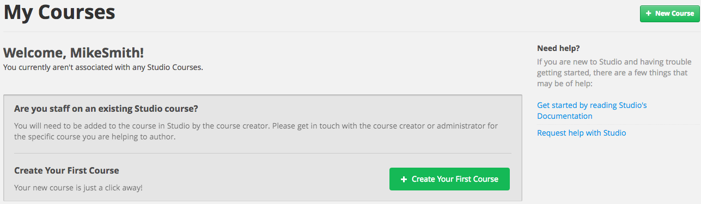

.. image:: Images/image001.png
 :width: 800  

.. _Getting Started with Studio:

###########################
Getting Started with Studio
###########################

***************
Overview
***************

This chapter describes the tools you use to build an edX course, and how to create your first course:

* :ref:`What is Studio?`
* :ref:`What is Edge?`
* :ref:`Get Started on Edge`
* :ref:`Use Studio on Edge`
* :ref:`Create Your First Course`
* :ref:`View Your Course on Edge`
* :ref:`Register Your Course on edX.org`

If you are using an instance of Open edX, some specifics in this chapter may not apply.

.. _What is Studio?:        
            
***************
What is Studio?
***************

Studio is the edX tool you use to build your courses. 

You use Studio to create course content, problems, videos, and other resoruces for students.

With Studio, you can also manage your schedule and course team, set grading policies, publish your course, and more.

You use Studio directly through your browser. You do not need any additional software.

.. _What is Edge?: 

******************
What is Edge?
******************

EdX Edge_ is the site where you can create courses with Studio, then run courses through the edX Learning Management System.

Visually and functionally, edX Edge is the same as edX.org_. 
However, on Edge you can freely publish courses.  
There is no course catalog on Edge and other users will not find your course. You must explicitly invite students to participate in your course.

Courses on Edge are not published on edX.org. All course data and accounts on Edge and edX.org are separate.

To publish courses on edX.org, you must have an agreement with edX and specific approval from your university.

.. _Edge: http://edge.edx.org
.. _edX.org: http://edx.org

   
.. _Get Started on Edge:
         
*******************
Get Started on Edge
*******************

Go to https://edge.edx.org, click **Register**, and fill out required information to create your account.

.. note::  Students will see your **Public Username**, not your **Full Name**.

.. note::  If you are at an edX consortium university, you should use your institutional e-mail
   address.

After you click \ **Create My Account**, you will receive an activation
e-mail message. To finish creating your account, click the link in the e-mail.

When you log in to Edge, you can view edX101_.	

edX101 is both an example of a course you can build with Studio, 
and a self-paced walk through of planning, building, and running your own online course.	

.. _edX101: https://edge.edx.org/courses/edX/edX101/How_to_Create_an_edX_Course/about

.. _Use Studio on Edge:

******************
Use Studio on Edge
******************

You can use Studio_ on Edge to build your own courses.

Go to: https://studio.edge.edx.org. Sign in with the account you created on Edge.

You must then request access to create courses:  

#. Click the **+** sign to expland the field labeled **Becoming a Course Creator in Studio**.

#. Click **Request the Ability to Create Courses**.

EdX then evaluates your request. When course creation permissions are granted, you receive an email message.

.. _Studio: https://studio.edge.edx.org
  
.. _Create Your First Course:  
  
***************************
Create Your First Course
***************************

When you receive notice that you can create courses, log into Studio_.

You see the following page:

#. Click **Create Your First Course**.
#. Enter course information as needed and click **Create**.

  .. image:: Images/new_course_info.png
     :width: 800

  .. note::  Enter new course information carefully. This information becomes part of the URL for your course. To change the URL after the course is created, you must contact edX through the Help site (http://help.edge.edx.org). Additionally, because this information becomes part of your course URL, the total number of characters in the following three fields must be 65 or fewer.

  * For **Course Name**, enter the title of your course. For example, the name may be “Sets, Maps and Symmetry Groups". Use title capitalization for the course title.

  * For **Organization**, enter the name of your university. Do not include whitespace or special characters.

  * For **Course Number**, enter both a subject abbreviation and a number. For example, for public health course number 207, enter **PH207**. For math course 101x, enter **Math101x**. Do not include whitespace or special characters in the course number.

    *Note: If your course will be open to the world, be sure to include the "x". If it is exclusively an on-campus offering, do not include the "x".* 

3. Click **Save.**

You then see the empty Course Outline.

In your browser’s address bar, notice that the URL of your course includes the course organization, number, and course run.

The rest of this documentation describes how you now build and run your course. But first, lets view your empty course on Edge.
  
.. _View Your Course on Edge:
    
************************
View Your Course on Edge
************************
You can now view the course you just created, even though it doesn't have any content.

In the Course Outline in Studio, click **View Live**. The course opens on Edge.

You can also go directly to Edge_. Log in if prompted. You see the course you just created listed:

.. image:: Images/new_course.png
 :width: 800

You can view the course and see that there is no content yet.

To build your course, keep reading this document.

.. _Register Your Course on edx.org:

************************************
Register Your Course on edX.org
************************************

If you're creating your course on **edX**, you must register
for your course.

#. On the **Course Outline** page, click the blue **View
   Live** button in the upper-right corner of your screen.

   Your course registration page opens in a new tab on the LMS.

#. Click the blue **Register** button to register for your course.
#. In your browser, switch back to the tab that shows Studio. You will
   still be on the **Course Outline** page.
