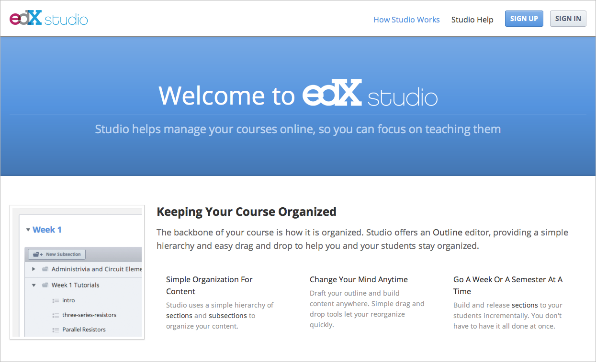
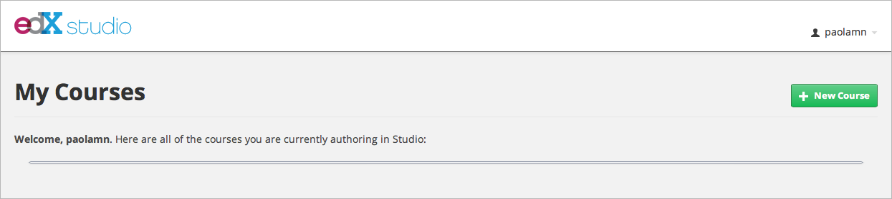
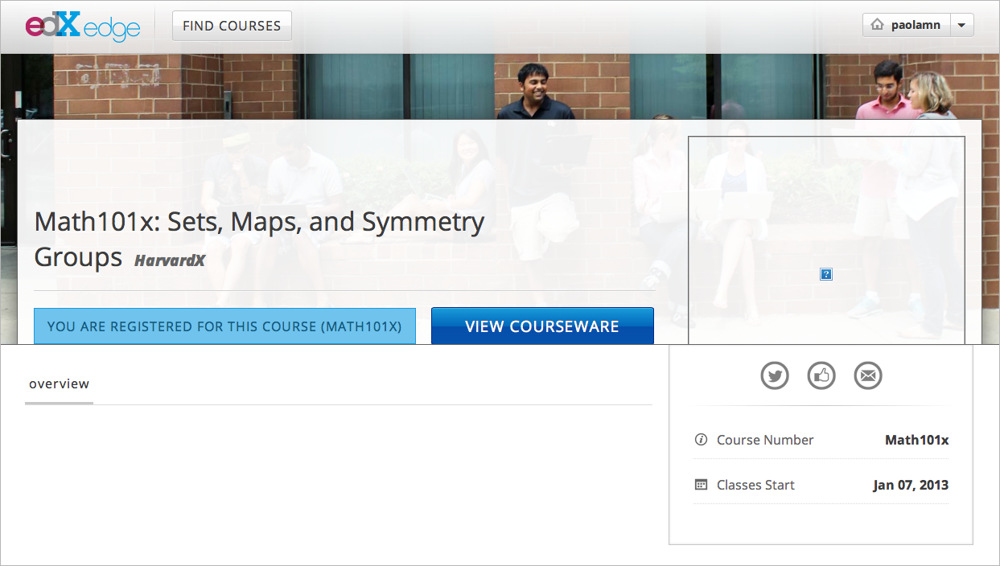
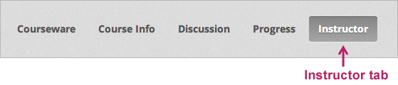
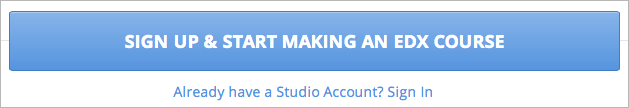
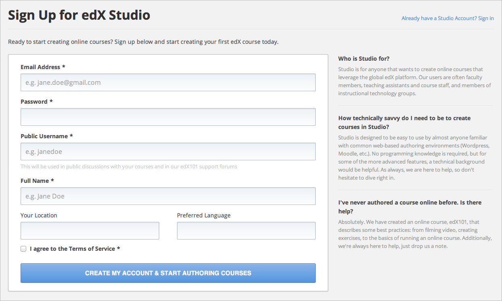
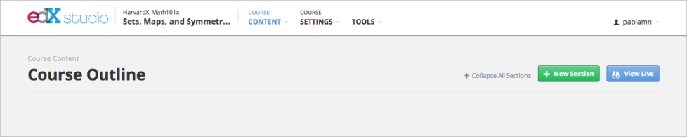

###########################
Getting Started with Studio
###########################

  
************
Introduction
************

Since the launch of edX to our original partners, we have been working to provide opportunities for additional educators to create courses on our platform. The fruits of our efforts are Edge and Studio. These tools are available not only to our edX partners, but to all faculty at consortium universities.

EdX (http://edx.org) is our original, premiere learning portal. Publication to
edX is available on a limited basis, depending on your university’s agreement
with edX. You need specific approval from your university to release your
course on the edX portal. Once a course is released on the edX portal, it
becomes a publicly available massively open online course (MOOC).

Edge (http://edge.edx.org) is our newest online learning portal. It is almost identical to edX.org both visibly and functionally. 

Edge is where you view the content you create with Studio, our course authoring
tool. Courses on Edge cannot be seen publicly; rather, only you, your
colleagues, and the students with whom you explicitly share a course link can
see your course. Instructors are encouraged to use Edge to experiment with
creating courses. You do not need approval to release a course on Edge--you can
create a course and release it immediately.

Studio (http://studio.edge.edx.org) is our web-based course authoring tool. It is the easiest way for educators to develop courses for the edX platform. You can create courses in Studio and view and enroll in them instantly on Edge—even before you have finished creating the course.

**There is a workflow to getting started.** Here is a quick summary:

1. First, go to: https://studio.edge.edx.org. Sign up and create an account.

**then**

2. Create a course in Studio.

**then**

3. View your course on Edge.

.. raw:: latex
  
	\newpage %

*****************
Create an Account
*****************

To begin using Studio, create an account with a unique user ID and password. A Studio account isn't the same as an edX account. Even if you already have an edX account, you still need to create a separate Studio account. You can use the same e-mail address for both accounts.

When you create your account on Studio, an account on Edge is automatically created using the same user name and password. You don't have to create separate accounts on Studio and Edge. 

Edge has two views - an Instructor view and a Student view. When you view your course on Edge, you view your course as an instructor, and you see the **Instructor** tab at the top of the page.

    

Your students will view your courses in Student view, which is similar to Instructor view, but does not include the Instructor tab or release dates. 

To create an account:

1. Go to http://studio.edge.edX.org. The Welcome to edX Studio page opens.

   
2. Scroll to the bottom of the page and click **Sign Up & Start Making an edX Course.**

 
3.  In the page that opens, fill in the fields. Required fields are marked with an asterisk (*).

 
a. In the **Email Address** box, type your e-mail address.
b. In the **Password** box, type a unique password. 
c. In the **Public Username** field, type the name you want students to see when you post on the user forum. Most websites call this the "user name". 
d. In the **Full Name** box, type your full name. This name only appears in Studio. 
   Your students will not see this name.
e.  Click to select I agree to the Terms of Service.

.. image:: Images/image017.png
 :width: 800

4. Click **Create My Account & Start Authoring Courses,** After you click this button, the following page opens. 

.. image:: Images/image015.png
 :width: 800

5. To finish creating your account, click the link that you receive in the activation e-mail. When you click this link, the following page opens.

.. image:: Images/image017.png
 :width: 800

.. raw:: latex
  
	\newpage %

*******************
Create a New Course
*******************

The first time that you log in to Studio, the following page opens.

.. image:: Images/image017.png
 :width: 800
 
Click the **dashboard** link, and the **My Courses** page opens. 

Once you have created a course in Studio, it will be listed on this page. From here, you can start creating courses immediately by clicking the **New Course** button.

To create a new course:

1. Click **New Course.** A screen opens.

.. note::

	Enter your new course information carefully. This information becomes part of the URL for your course. To change the URL after the course is created, you must contact edX through the Help site (http://help.edge.edx.org).Additionally, because this information becomes part of your course URL, the total number of characters in the following three fields must be 65 or fewer.

2. For **Course Name**, enter the title of your course. For example, the name may be “Sets, Maps and Symmetry Groups". Use title capitalization for the course title.

3. For **Organization**, enter the name of your university. Do not include whitespace or special characters.

4. For **Course Number**, enter both a subject abbreviation and a number. For example, for public health course number 207, enter "PH207". For math course 101x, enter “Math101x”. Do not include whitespace or special characters in the course number.

   *Note: If your course will be open to the world, be sure to include the "x". If it is exclusively anon-campus offering, do not include the "x".* 

5. Click **Save.**

    
If you click **View Live** your course appears as follows on Edge.

*Note: Although the start date is set to the current date by default, your course will not be advertised, so it will not be visible to the general public. You can change the start date of your course in Studio.*
