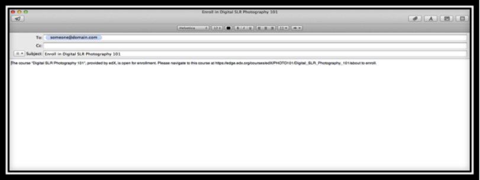

 
***************************
Invite Students to Register
***************************
 
To invite students to register for your course on Edge through the course
registration page, direct students to the registration page, and provide
instructions for completing the registration process.
 
 
1. Determine the link to your class registration page on Edge. To do this:
 
 
a. Click the **Settings **tab of your course in Studio, and then locate the
**Course Details** section.
 
 
b. Under **Basic Information**, you will see a link to email and invite
students to enroll in your course.
 
 
c. Click "**Invite Your Students**" link. Clicking the link creates an email
template.
 
 

 
 
d. Email this to your chosen mail list.