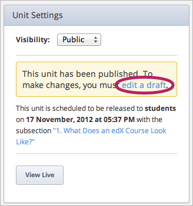
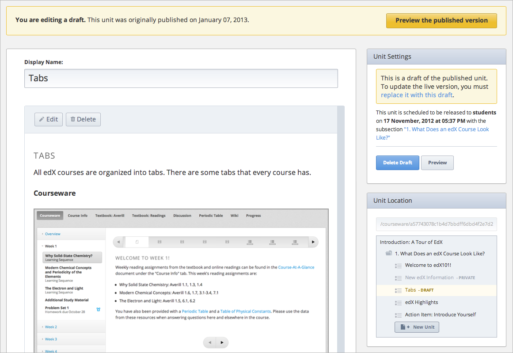
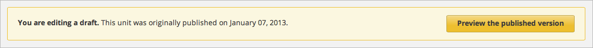
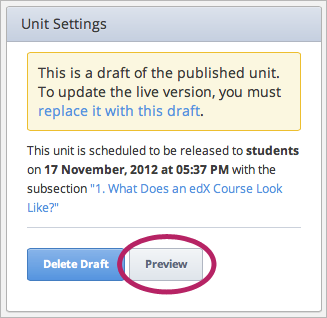
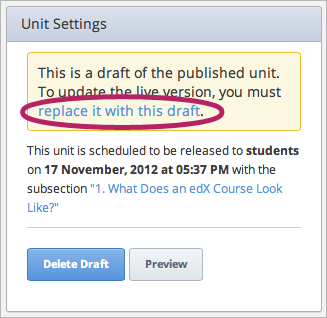

***************************
Modifying Published Content
***************************
 
When you set a Unit to Public, that content appears on edX or Edge when you
view the content as an instructor. If the release date has passed, the
content is also visible to students.
 
 
If you want to modify content after it has been set to Public, you must
create a draft. The draft does not appear on edX or Edge. However, the draft
does appear when you view your content in Preview mode.
 
 
To create a draft, open the Unit that you want. Note that no **Edit** button
appears on the page for that Unit, and you cannot make changes to the Unit.
 
 
.. image:: Images/image231.png
  :width: 600 
 
 
In the right pane, click the blue **edit a draft** link in the **Unit
Settings** box.
 
 

 
 
After you click **edit a draft**, you can make changes to the Unit. You can
edit existing content or add new content.
 
 

 
 
If you want to view the version of your content that is currently live,
click **Preview the published version **in the yellow banner at the top of
the page.
 
 

 
 
If you want to view the draft version that you are working on, click
**Preview** under **Unit Settings**. This opens your course in Preview
mode.****
 
 

 
 
When you are done making changes to the Unit, click the blue **replace it
with this draft** link under **Unit Settings**.
 
 

