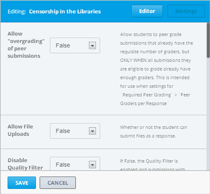
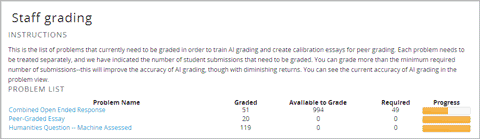
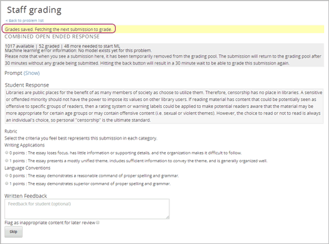

.. _Open Response Assessment Problems:

Open Response Assessments
---------------------------------

Introduction to Open Response Assessments
~~~~~~~~~~~~~~~~~~~~~~~~~~~~~~~~~~~~~~~~~

.. note:: 

   Open response assessments are still in beta. We recommend that
   you test them thoroughly in a practice course and only add them to
   courses that are **not** already running. Contact your edX Program Manager for more information.

Open response assessments allow instructors to assess student learning
through questions that may not have definite answers. Tens of thousands
of students can receive feedback on written responses of varying lengths
as well as files, such as computer code or images, that the students
upload. Open response assessment technologies include self assessment,
peer assessment, and artificial intelligence (AI) assessment (sometimes
called "machine assessment" or "machine grading"). With self
assessments, students learn by comparing their answers to a rubric that
you create. With peer assessments, students compare their peers' answers
to the rubric.

A Few Notes about Open Response Assessments
~~~~~~~~~~~~~~~~~~~~~~~~~~~~~~~~~~~~~~~~~~~

**Open response assessment technology is still in beta.** For a good
experience with open response assessments, you'll need to follow a few
guidelines.

-  Do not create a new open response assessment in a running course.
   Only create open response assessments in a test course.
-  If your course will include open response assessments, add and
   thoroughly test all the open response assessments *before* the course
   is live.
-  Set open response assessments to be optional, ungraded, or droppable
   exercises until you've used the technology a few times and have
   become familiar with it.
-  Use open response assessments sparingly at first. Only include a few
   in your course, and make sure that you have contingency plans in case
   you run into problems.

Finally, if you're at an edX consortium university and you plan to
include open response assessments in a MOOC, make sure to notify your
edX project manager (PM).

Components of an Open Response Assessment
~~~~~~~~~~~~~~~~~~~~~~~~~~~~~~~~~~~~~~~~~

An open response assessment has three elements:

-  The assessment type or types--self, peer, or artificial intelligence
   (AI). The type of assessment and the order in which the assessments
   run appears in the upper right corner of the ORA problem. In the
   following example, the student performs a self assessment, then peers
   perform peer assessments, and then an AI assessment runs.

   .. image:: Images/CITL_AssmtTypes.gif

-  The question that you want your students to answer. This appears near
   the top of the component, followed by a field where the student
   enters a response.

   .. image:: Images/CITLsample.gif

-  A rubric that you design. After the student enters a response and
   clicks **Submit**, if the assessment is a self assessment, the
   student sees the rubric below his answer and compares his answer to
   the rubric. (If the assessment is an AI or peer assessment, the
   student sees a "Your response has been submitted" message but doesn't
   see the rubric.)

   .. image:: Images/CITL_SA_Rubric.gif

Open Response Assessment Types
~~~~~~~~~~~~~~~~~~~~~~~~~~~~~~

There are three types of assessments for ORAs: self assessment, AI
assessment, and peer assessment.

-  Self assessment allows students to answer a question, and then assess
   their response according to the rubric you created for the question.
-  In AI assessment, a computer algorithm learns how to grade according
   to the rubric from 100 or more instructor-graded responses, and
   attempts to grade the rest of the student responses in the same way.
-  Peer assessment allows students to score each other and provide
   feedback, again using the same rubric.

You can use one or more of these assessments in any problem. You can
also set thresholds within the problem for each assessment, so that a
response with a low score in one assessment does not move on to the next
assessment.

Effective Questions
~~~~~~~~~~~~~~~~~~~

When you write your question, we recommend that you specify an
approximate number of words or sentences that a student's response has
to have in the body of your question. You may also want to provide
information about how to use the LMS. If you require students to upload
a file as a response, you can provide specific instructions about how to
upload and submit their files. You can let students know what to expect
after they submit responses. You can also mention the number of times
that a student will be able to submit a response for the problem.

Rubrics
~~~~~~~

The same rubric is used for all three ORA types, and it can include
anything that you want it to include.

In Studio, rubrics are arranged by *categories*. Each category has two
or more *options*, and each option has a point value.

Options must be listed in ascending order starting at 0 points. For
example, in a category with three options, the first option is worth 0
points, the second is worth 1 point, and the third is worth 2 points.
The person or algorithm that grades the problem selects one value for
each category.

Different categories in the same problem can have different numbers of
options.

Create an Open Response Assessment Problem
~~~~~~~~~~~~~~~~~~~~~~~~~~~~~~~~~~~~~~~~~~

Creating an open response assessment is a multi-step process.

#. Create the component for the open response assessment.
#. Add the question.
#. Add the rubric.
#. Set the assessment type and scoring.
#. Set the problem name.
#. Set other options.
#. Save the problem.
#. Add the peer grading interface (for peer assessments only).
#. Test the problem.

Each of these steps is described in detail below.

1. Create the Component
~~~~~~~~~~~~~~~~~~~~~~~

#. Add the advanced component for open response assessments. To do this,
   add the "peergrading","combinedopenended" key value to the **Advanced
   Settings** page. (For more information, see the instructions in
   Specialized Problems.)
#. In Studio, open the unit where you want to create the ORA.
#. Under **Add New Component**, click **Advanced**, and then click
   **Open Response Assessment**.
#. In the problem component that appears, click **Edit**, and then click
   **OK** in the dialog box that appears.
#. The component editor opens. The component editor contains a sample
   question ("prompt"), rubric, assessment type specification, and
   scoring. You'll replace this sample content with the content for your
   problem. 
 
2. Add the Question
~~~~~~~~~~~~~~~~~~~

-  In the component editor, locate the [prompt] tags.

   .. image:: Images/ORA_Prompt.gif

Replace the sample text between the **[prompt]** tags with the text of
your question. When you replace the sample text, make sure you follow
these guidelines to avoid common formatting mistakes.

-  Leave the **[prompt]** tags in place.
-  Enclose all text in HTML tags.

3. Add the Rubric
~~~~~~~~~~~~~~~~~

#. In the component editor, locate the [rubric] tags. (The sample rubric
   is long, so you'll have to scroll down to locate the second tag.)

   .. image:: Images/ORA_Rubric.gif

#. Replace the sample rubric with the text of your rubric. Make sure to
   do the following.

-  Include the beginning and ending [rubric] tags.
-  Precede the categories with a plus (+) sign.
-  Precede the options with a minus (-) sign.

- List the option that scores zero points first, followed by the option
    that scores one point, and so on.

    For example, your rubric might resemble the following rubric.

::

    [rubric]

    + Writing Applications
    - The essay loses focus, has little information or supporting details, and the organization makes it difficult to follow.
    - The essay presents a mostly unified theme, includes sufficient information to convey the theme, and is generally organized well.

    + Language Conventions 
    - The essay demonstrates a reasonable command of proper spelling and grammar. 
    - The essay demonstrates superior command of proper spelling and grammar.

    [rubric]

4. Set the Assessment Type and Scoring
~~~~~~~~~~~~~~~~~~~~~~~~~~~~~~~~~~~~~~

To set the assessment type and scoring for your open response
assessment, you'll enter code that specifies the type and order of
assessments to use along with the scoring thresholds for each
assessment. The code uses the following format.

::

    [tasks]
    (Type 1), ({min-max}Type 2), ({min-max}Type 3)
    [tasks] 

-  The **[tasks]** tags surround the code.
-  **Type 1**, **Type 2**, and **Type 3** are the names of the types of
   assessments. Assessments run in the order in which they're listed.
-  **min** is the point value the response must receive in the previous
   assessment to move to this assessment. Note that you do not define a
   scoring threshold for the first assessment, because there is no
   required previous assessment.
-  **max** is the maximum point value for the assessment. The maximum
   score is the second number in the pair of numbers for each assessment
   after the first assessment.

For example, a problem might contain the following code.

::

    [tasks]
    (Self), ({5-7}Peer), ({4-7}AI)
    [tasks]

The problem that includes this code has the following characteristics.

-  The problem has a self assessment, a peer assessment, and then an AI
   assessment.
-  The maximum score for the problem is 7.
-  To advance to the peer assessment, the response must have a self
   assessment score of 5 or greater.
-  To advance to the AI assessment, the response must have a peer
   assessment score of 4 or greater.

Set the Type and Scoring
^^^^^^^^^^^^^^^^^^^^^^^^

#. In the component editor, locate the [tasks] tags.

   .. image:: Images/ORA_Tasks.gif

#. Replace the sample code with the code for your problem.

5. Set the Problem Name
~~~~~~~~~~~~~~~~~~~~~~~

The name of the problem appears as a heading above the problem in the
courseware. It also appears in the list of problems on the **Staff
Grading** page.

.. image:: Images/ORA_ProblemName1.gif

To change the name:

#. In the upper-right corner of the component editor, click
   **Settings**.
#. In the **Display Name** field, replace **Open Response Assessment**
   with the name of your problem.

6. Set Other Options
~~~~~~~~~~~~~~~~~~~~

If you want to change the problem settings, which include the number of
responses a student has to peer grade and whether students can upload
files as part of their response, click the **Settings** tab, and then
specify the options that you want.

Open response assessments include the following settings.

+---------------------------------------------+--------------------------------------------------------------------+
| **Allow "overgrading" of peer submissions** | This setting applies only to peer grading. If all of the responses |
|                                             | for a question have been graded, the instructor can allow          |
|                                             | additional students to grade responses that were previously        |
|                                             | graded. This can be helpful if an instructor feels that peer       |
|                                             | grading has helped students learn, or if some students haven't     |
|                                             | graded the required number of responses yet, but all available     |
|                                             | responses have been graded.                                        |
+---------------------------------------------+--------------------------------------------------------------------+
| **Allow File Uploads**                      | This setting specifies whether a student can upload a file, such   |
|                                             | as an image file or a code file, as a response. Files can be of    |
|                                             | any type.                                                          |
+---------------------------------------------+--------------------------------------------------------------------+
| **Disable Quality Filter**                  | This setting applies to peer grading and AI grading. When the      |
|                                             | quality filter is disabled (when this value is set to True),       |
|                                             | Studio allows submissions that are of "poor quality" (such as      |
|                                             | responses that are very short or that have many spelling or        |
|                                             | grammatical errors) to be peer graded. For example, you may        |
|                                             | disable the quality filter if you want students to include URLs to |
|                                             | external content—otherwise Studio sees a URL, which may contain a  |
|                                             | long string of seemingly random characters, as a misspelled word.  |
|                                             | When the quality filter is enabled (when this value is set to      |
|                                             | False), Studio does not allow poor-quality submissions to be peer  |
|                                             | graded.                                                            |
+---------------------------------------------+--------------------------------------------------------------------+
| **Display Name**                            | This name appears in two places in the LMS: in the course ribbon   |
|                                             | at the top of the page and above the exercise.                     |
+---------------------------------------------+--------------------------------------------------------------------+
| **Graded**                                  | This setting specifies whether the problem counts toward a         |
|                                             | student's grade. By default, if a subsection is set as a graded    |
|                                             | assignment, each problem in that subsection is graded. However, if |
|                                             | a subsection is set as a graded assignment, and you want this      |
|                                             | problem to be a "test" problem that doesn't count toward a         |
|                                             | student's grade, you can change this setting to **False**.         |
+---------------------------------------------+--------------------------------------------------------------------+
| **Maximum Attempts**                        | This setting specifies the number of times the student can try to  |
|                                             | answer the problem. Note that each time a student answers a        |
|                                             | problem, the student's response is graded separately. If a student |
|                                             | submits two responses to a peer-assessed problem (for example, by  |
|                                             | using the **New Submission** button after her first response       |
|                                             | receives a bad grade or because she wants to change her original   |
|                                             | response), and the problem requires three peer graders, three      |
|                                             | separate peer graders will have to grade each of the student's two |
|                                             | responses. We thus recommend keeping the maximum number of         |
|                                             | attempts for each question low.                                    |
+---------------------------------------------+--------------------------------------------------------------------+
| **Maximum Peer Grading Calibrations**       | This setting applies only to peer grading. You can set the maximum |
|                                             | number of responses a student has to "practice grade" before the   |
|                                             | student can start grading other students' responses. The default   |
|                                             | value is 6, but you can set this value to any number from 1 to 20. |
|                                             | This value must be greater than or equal to the value set for      |
|                                             | **Minimum Peer Grading Calibrations**.                             |
+---------------------------------------------+--------------------------------------------------------------------+
| **Minimum Peer Grading Calibrations**       | This setting applies only to peer grading. You can set the minimum |
|                                             | number of responses a student has to "practice grade" before the   |
|                                             | student can start grading other students' responses. The default   |
|                                             | value is 3, but you can set this value to any number from 1 to 20. |
|                                             | This value must be less than or equal to the value set for         |
|                                             | **Maximum Peer Grading Calibrations**.                             |
+---------------------------------------------+--------------------------------------------------------------------+
| **Peer Graders per Response**               | This setting applies only to peer grading. This setting specifies  |
|                                             | the number of times a response must be graded before the score and |
|                                             | feedback are available to the student who submitted the response.  |
+---------------------------------------------+--------------------------------------------------------------------+
| **Peer Track Changes**                      | This setting is new and still under development. This setting      |
|                                             | applies only to peer grading. When this setting is enabled (set to |
|                                             | **True**), peer graders can make inline changes to the responses   |
|                                             | they're grading. These changes are visible to the student who      |
|                                             | submitted the response, along with the rubric and comments for the |
|                                             | problem.                                                           |
+---------------------------------------------+--------------------------------------------------------------------+
| **Problem Weight**                          | This setting specifies the number of points the problem is worth.  |
|                                             | By default, each problem is worth one point.                       |
+---------------------------------------------+--------------------------------------------------------------------+
| **Required Peer Grading**                   | This setting specifies the number of responses that each student   |
|                                             | who submits a response has to grade before the student receives a  |
|                                             | grade for her response. This value can be the same as the value    |
|                                             | for the **Peer Graders per Response** setting, but we recommend    |
|                                             | that you set this value higher than the **Peer Graders per         |
|                                             | Response** setting to make sure that every student's work is       |
|                                             | graded. (If no responses remain to be graded, but a student still  |
|                                             | needs to grade responses, you can set the **Allow "overgrading" of |
|                                             | peer submissions** setting to allow more students to grade         |
|                                             | previously graded responses.)                                      |
+---------------------------------------------+--------------------------------------------------------------------+

7. Save the Problem
~~~~~~~~~~~~~~~~~~~

-  After you have created the prompt and the rubric, set the assessment
   type and scoring, changed the name of the problem, and specified any
   additional settings, click **Save**.

   The component appears in Studio. In the upper right corner, you can
   see the type of assessments that you have set for this problem.

.. image:: Images/ORA_Component.gif

8. Add the Peer Grading Interface (for peer assessments only)
~~~~~~~~~~~~~~~~~~~~~~~~~~~~~~~~~~~~~~~~~~~~~~~~~~~~~~~~~~~~~

You can add just one peer grading interface for the whole course, or you
can add a separate peer grading interface for each individual problem.

Add a Single Peer Grading Interface for the Course
^^^^^^^^^^^^^^^^^^^^^^^^^^^^^^^^^^^^^^^^^^^^^^^^^^^

When you add just one peer grading interface for the entire course, we
recommend that you create that peer grading interface in its own section
so that students can find it easily. Students will be able to access all
the ORA problems for the course through this peer grading interface.

#. Create a new section, subsection, and unit. You can use any names
   that you want. One course used "Peer Grading Interface" for all
   three.
#. Under **Add New Component** in the new unit, click **Advanced**, and
   then click **Peer Grading Interface**.

   A new Peer Grading Interface component appears.

#. To see the peer grading interface in the course, set the visibility
   of the unit to **Public**, and then click **View Live**.

   The following page opens.

   .. image:: Images/PGI_Single.gif

   When students submit responses for peer assessments in your course,
   the names of the problems appear in this interface.

Add the Peer Grading Interface to an Individual Problem
^^^^^^^^^^^^^^^^^^^^^^^^^^^^^^^^^^^^^^^^^^^^^^^^^^^^^^^

When you add a peer grading interface for an individual problem, you
must add the identifier for the problem to that peer grading interface.
If you don't add the identifier, the interface will show all of the peer
assessments in the course.

Note that the peer grading interface doesn't have to appear under the
problem you want it to be associated with. As long as you've added the
identifier of the problem, the peer grading interface will be associated
with the problem, even if you include the peer grading interface in a
later unit (for example, if you want the problem to be due after a
week).

#. Open the unit that contains the ORA.
#. If the visibility of the unit is set to Public, click **View Live**.
   If the visibility is set to Private, click **Preview**. The unit
   opens in the LMS in a new tab. Make sure you're in Staff view rather
   than Student view.
#. Scroll down to the bottom of the ORA, and then click **Staff Debug
   Info**.
#. In the image that opens, locate the string of alphanumeric characters
   to the right of the word **location**. Press CTRL+C to copy this
   string, starting with **i4x**.

   .. image:: Images/PA_StaffDebug_Location.gif

#. Switch back to the unit in Studio. If the visibility of the unit is
   set to **Public**, change the visibility to **Private**.
#. Scroll to the bottom of the unit, click **Advanced** under **Add New
   Component**, and then click **Peer Grading Interface**.
#. On the Peer Grading Interface component that opens, click **Edit**.
#. In the Peer Grading Interface component editor, click **Settings**.
#. In the **Link to Problem Location** field, paste the string of
   alphanumeric characters that you copied in step 4. Then, change the
   **Show Single Problem** setting to **True**.

   .. image:: Images/PGI_CompEditor_Settings.gif

#. Click **Save** to close the component editor.

9. Test the Problem
~~~~~~~~~~~~~~~~~~~

Test your problem by adding and grading a response.

#. In Studio, open the unit that contains your ORA problem.
#. Under **Unit Settings**, change the **Visibility** setting to
   **Public**, and then click **View Live**.

   When you click **View Live**, the unit opens in the LMS in a new tab.

#. In the LMS, locate your ORA question, and then type your response in
   the Response field under the question.

   .. image:: Images/ThreeAssmts_NoResponse.gif

   Note that when you view your ORA problem in the LMS as an instructor,
   you see the following message below the problem. This message never
   appears to students.

   .. image:: Images/ORA_DuplicateWarning.gif

#. Test the problem to make sure that it works as expected.

To test your open response assessment, you may want to sign into your
course as a student, using an account that's different from the account
that you use as an instructor.

-  If you want to keep your course open as an instructor when you sign
   in as a student, either open a window in Incognito Mode in Firefox or
   Chrome or use a different browser to access your course. For example,
   if you used Firefox to create the course, use Chrome when you sign in
   as a student.
-  If you don't need to keep your course open, sign out of your course,
   and then sign back in using a different account. Note that if you do
   this, you can't make changes to your course without signing out and
   signing back in as an instructor.

Grade an Open Response Assessment Problem
~~~~~~~~~~~~~~~~~~~~~~~~~~~~~~~~~~~~~~~~~

You'll grade student responses to both AI assessments and peer
assessments from the **Staff Grading** page in the LMS. Take a moment to
familiarize yourself with the features of this page.

The Staff Grading Page
^^^^^^^^^^^^^^^^^^^^^^^

When a response is available for you to grade, a yellow exclamation mark
appears next to **Open Ended Panel** at the top of the screen.

To access the **Staff Grading** page, click **Open Ended Panel**.

When the **Open Ended Console** page opens, click **Staff Grading**.
Notice the **New submissions to grade** notification.

.. image:: Images/OpenEndedConsole_NewSubmissions.gif

When the **Staff Grading** page opens, information about your open
response assessment appears in several columns.

+----------------------------------------------------+--------------------------------------------------------------------+
| **Problem Name**                                   | The name of the problem. Click the name of the problem to open it. |
|                                                    | Problems in your course do not appear under **Problem Name** on    |
|                                                    | the **Staff Grading** page until at least one response to the      |
|                                                    | problem has been submitted and is available to grade.              |
+----------------------------------------------------+--------------------------------------------------------------------+
| **Graded**                                         | The number of responses for that problem that you have already     |
|                                                    | graded. Even if the AI algorithm has graded all available          |
|                                                    | responses, you can still grade the responses that the algorithm    |
|                                                    | designates as low-confidence responses by clicking the problem     |
|                                                    | name in the list.                                                  |
+----------------------------------------------------+--------------------------------------------------------------------+
| **Available to grade**                             | The total number of ungraded student submissions.                  |
+----------------------------------------------------+--------------------------------------------------------------------+
| **Required**                                       | The number of responses remaining to be graded to train the        |
|                                                    | algorithm for AI or to calibrate the responses for peer grading.   |
|                                                    | If your open response assessment calls for both AI and peer        |
|                                                    | assessment, the 20 responses that you grade for the peer           |
|                                                    | assessment count toward the 100 responses for the AI assessment.   |
+----------------------------------------------------+--------------------------------------------------------------------+
| **Progress**                                       | A visual indication of your progress through the grading process.  |
+----------------------------------------------------+--------------------------------------------------------------------+

Grade Responses
^^^^^^^^^^^^^^^

#. Go to the **Staff Grading** page.
#. Under **Problem Name**, click the name of the problem that you want.

   When the problem opens, the information about the number of responses
   that are still available to grade, that have been graded, and that an
   instructor is required to grade appears under the problem name. You
   can also find out about the AI algorithm's error rate. The error rate
   is a calculation of the difference between the scores that AI
   algorithm provides and the scores that the instructor provides.

   .. image:: Images/ResponseToGrade.gif

#. In the rubric below the response, select the option that best
   describes the response.
#. If applicable, add additional feedback.

   -  You can provide comments for the student in the **Written
      Feedback** field.
   -  If you do not feel that you can grade the response (for example,
      if you're a member of course staff but you would rather have the
      instructor grade the response), you can click **Skip** to skip it.
   -  If the response contains inappropriate content, you can select the
      **Flag as inappropriate content for later review** check box.
      Flagged content is accessed on the **Staff Grading** page. If
      necessary, course staff can ban a student from peer grading.

   .. image:: Images/AdditionalFeedback.gif

#. When you are done grading the response, click **Submit**.

When your course is running, another response opens automatically after
you grade the first response, and a message appears at the top of the
page.

After you've graded all responses for this problem, **No more
submissions to grade** appears on the page.

.. image:: Images/NoMoreSubmissions.gif

Click **Back to problem list** to return to the list of problems. You
can also wait for a few minutes and click **Re-check for submissions**
to see if any other students have submitted responses.

Access Scores and Feedback
~~~~~~~~~~~~~~~~~~~~~~~~~~

You access your scores for your responses to AI and peer assessment
problems through the **Open Ended Console** page.

#. From any page in the LMS, click the **Open Ended Panel** tab at the
   top of the page.

   .. image:: Images/OpenEndedPanel.gif

#. On the **Open Ended Console** page, click **Problems You Have
   Submitted**.

   .. image:: Images/ProblemsYouHaveSubmitted.gif

#. On the **Open Ended Problems** page, check the **Status** column to
   see whether your responses have been graded.
#. When grading for a problem has been finished, click the name of a
   problem in the list to see your score for that problem. When you
   click the name of the problem, the problem opens in the courseware.

For both AI and peer assessments, the score appears below your response
in an abbreviated version of the rubric. For peer assessments, you can
also see the written feedback that your response received from different
graders.

**Graded AI Assessment**

.. image:: Images/AI_ScoredResponse.gif

**Graded Peer Assessment**

.. image:: Images/Peer_ScoredResponse.gif

If you want to see the full rubric for either an AI or peer assessment,
click **Toggle Full Rubric**.

.. note:: For a peer assessment, if you haven't yet graded enough
          problems to see your score, you receive a message that lets you know how
          many problems you still need to grade.

.. image:: Images/FeedbackNotAvailable.gif
