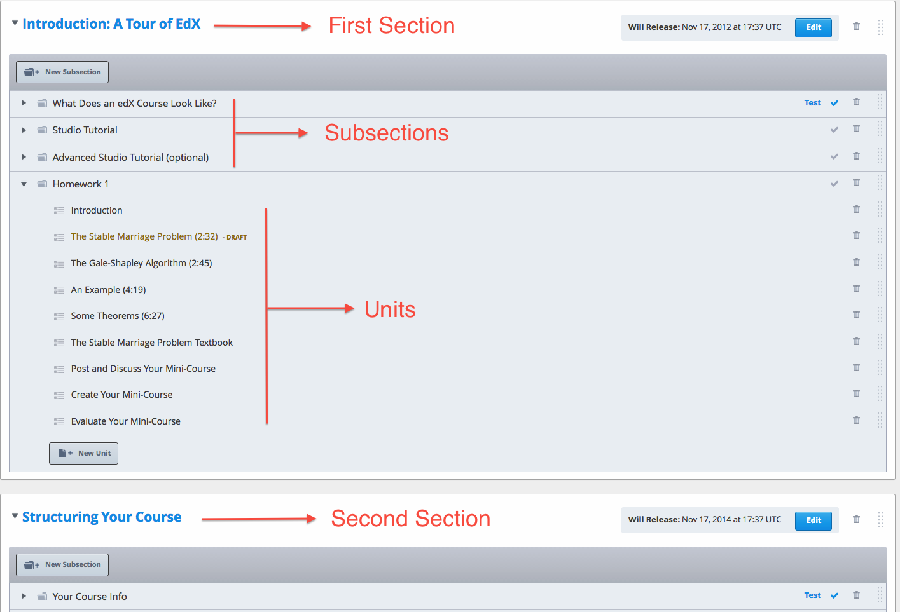
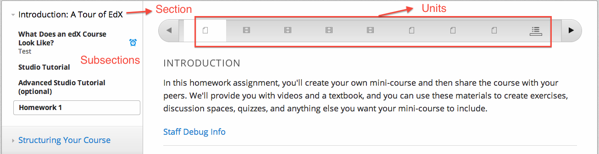
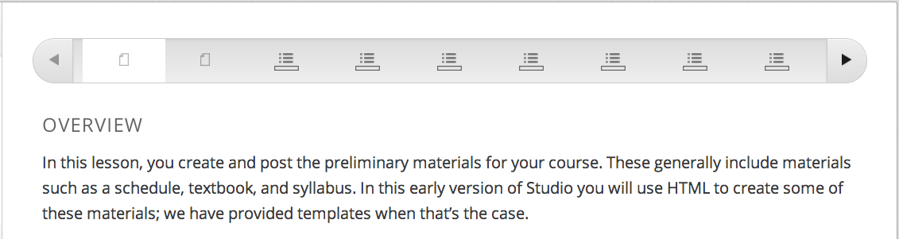

.. _Organizing Your Course Content:

###############################
Organizing Your Course Content
###############################

.. _How a Course is Organized:

*************************
How a Course is Organized
*************************

You organize your course in the following hierarchy:

- :ref:`Sections`, which contain
    - :ref:`Subsections`, which contain
        - :ref:`Units`, which contain
            - :ref:`Components`, which contain your actual course content.

Studio provides you with flexibility when organizing your course.  
A common course model is for Sections to correspond to weeks, and for Subsections to correspond to lessons.

==================
The Course Outline
==================

In Studio, you view your course organization through the Course Outline.

To open the Course Outline, from the **Content** menu, select **Outline**.

The following example shows a course outline with callouts to identify the different course elements:

The following example shows how a student would view this course content:

.. _Sections:

********
Sections
********

A Section is the topmost category in your course. A Section can represent a time-period in your course, or another organizing principle.

To create a Section:

#. In the Course Outline, click **New Section**.  
#. In the field that opens at the top of the outline, enter the new Section name.
#. Click **Save**.

The new, empty Section is placed at the bottom of the course outline.
You must now add Subsections to the Section.

Whether or not students see the new Section depends on the release date. 
See :ref:`Publishing Your Course` for more information.

.. _Subsections:

****************
Subsections
****************

Sections are divided into Subsections. A Subsection may represent a topic in your course, or another organizing principle.

You can set a Subsection to an assignment type that you created when
you set up grading. You can then include assignments in the body of that
Subsection. For more information on grading, see LINK.

To create a Subsection:

#. Within the Section, click **New Subsection**.  
#. In the field that opens at the bottom of the section, enter the new Subsection name.
#. Click **Save**.

The new, empty Subsection is placed at the bottom of the Section.
You must now add Units to the Subsection.

Whether or not students see the new Subsection depends on its release date. 
See LINK for more information on releasing your course.

==================
Edit a Subsection
==================

You can add and delete Subsections, and select the grading policy, directly from the Course Outline.

You can also open the Subsection in its own page, to perform those tasks as well as to 
set the Subsection release date, set a due date, preview a draft of the Subsection, or view the live course.

Click on the Subsection title. The Subsection opens in its own page:

    .. image:: Images/subsection.png
       :width: 800

=======================
Set the Grading Policy
=======================

You can designate a Subsection as one of the assignment types that you specified in the grading policy.

You set the grading policy for the Subsection from the Course Outline or from the Subsection page.

From the Course Outline, click the checkmark next to the Subsection.  Then select a grading policy from the popup menu:

    .. image:: Images/course_outline_set_grade.png
       :width: 800

From the Subsection page, click the text next to the **Graded as** label, then select a grading policy from the popup menu:

    .. image:: Images/subsection_set_grade.png
       :width: 800

See :ref:`Establish a Grading Policy` for more information.

==================
Set the Due Date
==================

For Subsections that contain graded problems, you can set a due date. Students must complete the problems in the Subsection before the due date to get credit.
  
#. From the Subsection page, click **SET A DUE DATE**. The Due Day and Due Time fields appear.
#. Place the cursor in the Due Date field, and pick a day from the popup calendar.
#. Place the cursor in the Due Time field and pick a time.

.. note:: When you set a due date, keep in mind that students will be in different time zones. By default, the time zone appears as UTC, not the student's local time. If you tell your students an assignment is due at 5:00 PM, make sure to specify that the time is 5:00 PM UTC and point them to a time converter.
 
Alternatively, you can :ref:`Set the Grace Period` for your assignments to cover any misunderstandings about time. For example, some classes have set a grace period of 1 day, 6 hours, and 1 minute. The grace period applies to all assignments. 

For more information, see :ref:`Establish a Grading Policy`.

.. _Units:

******
Units
******

Subsections are divided into Units. A Unit contains one or more Components.

For students, each Unit in the Subsection is represented as a link on the accordian at the top of the page.
The following page shows a Subsection that has nine Units:

.. warning::

	Studio does not have versioning or automatic
	updating of your browser between refreshes. Versioning is planned for future
	releases, but, in the meantime, only one author should edit a unit, in one
	browser, on only one tab.  If a unit is open for editing in multiple browser
	sessions, the session that saves last will overwrite any previously saved
	content without displaying a warning. Also, older browser sessions can overwrite
	more recent content, so refresh your browser before you start working every time
	you work with a private unit or edit a draft of a public unit.

To create a Unit from the Course Outline or the Subsection page:

#. Within the Subsection, click **New Unit**.  
#. Enter the Display Name that students will see.
#. Click a Component type to add a the first Component in the Unit.

   .. image:: Images/Unit_DisplayName_Studio.png

#. Follow the instructions for the type of Component, listed below.
#. By default, the Unit visibility is **Private**, meaning students will not be able to see the Unit. Unless you want to publish the Unit to students immediately, leave this setting. See LINK for more information on releasing your course.

The Unit with the single Component is placed at the bottom of the Subsection. 

.. _Components:

**********
Components
**********

A component is the part of a unit that contains your actual course content. A unit can can contain one or more components

A student can view the name of all components in a unit by hovering over the unit icon in the accordian at the top of the page.

You add the first component when creating the unit. 

To add another component to the unit:

#. If the Unit is Public, change the **Visibility** setting to **Private**. You cannot modify a Public Unit.
#. In the **Add New Component** panel at the bottom of the Unit, click the type of Component to add.
    .. image:: Images/Unit_DisplayName_Studio.png
#. Follow the instructions for the type of Component:

  * :ref:`Working with HTML Components` 
  * :ref:`Working with Video Components`
  * :ref:`Working with Discussion Components`
  * :ref:`Working with Problem Components`

.. _Reorganize Your Course:

**********************
Reorganize Your Course
**********************

You can reorganize your course by dragging and dropping elements in the Course Outline.

To move a Section, Subsection, or Unit, click the mouse on the element's handle on the right side of the outline, then move the element to the new location. 
Element handles are highlighed in the following image: 

    .. image:: Images/drag_drop.png
       :width: 800

When you move a course element, a blue line indicates the new position. You can move a Subsection to a new Section, and a Unit to a new Subsection.

You can reorganize Components within a Unit in the same way.