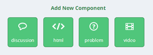
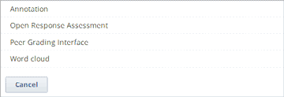

.. _Specialized Problems:

Specialized Problems
====================

Specialized problems are advanced problems such as annotations, open
response assessments, and word clouds. These problems are available
through the Advanced component in Studio. To add the Advanced component
to your course, you'll modify your course's advanced settings. The
Advanced component then appears under **Add New Component** in each
unit.

-  :ref:`Annotation` Annotation problems ask students to respond to
   questions about a specific block of text. The question appears above
   the text when the student hovers the mouse over the highlighted text
   so that students can think about the question as they read.
-  :ref:`Open Response Assessment` Open response assessment problems allow students
   to enter short answer or essay responses that students or a computer
   algorithm can then grade.
-  :ref:`Word Cloud` Word cloud problems show a colorful graphic of the
   words that students enter as responses to a prompt.

.. _ Add Advanced Component:

**Add the Advanced Component to Your Course**

By default, when you create a new component in Studio, you see the
following options.

To create a specialized problem, you must first add the Advanced
component to your course. To do this, follow these steps.

#. On the **Settings** menu, click **Advanced Settings**.

#. On the **Advanced Settings** page, locate the **Manual Policy
   Definition** section, and then locate the **advanced_modules**
   policy key (this key is at the top of the list).

   .. image:: Images/AdvancedModulesEmpty.gif

#. Under **Policy Value**, place your cursor between the brackets, and
   then enter the value for the type of problem that you want to create.
   Make sure to include the quotation marks, but not the period.

   -  For annotations, enter **"annotatable"**.

   -  For open response assessments, enter
      **"combinedopenended","peergrading"**. (Include the comma but no
      spaces between the words.)

   -  For word clouds, enter **"word_cloud"**.

   You can enter more than one problem type at a time. When you do,
   make sure to surround each problem type with quotation marks and
   separate each problem type with a comma, but do not include any
   spaces.
   
   For example, if you wanted to add annotations, open response
   assessments, and word cloud problems in your course, you would enter
   the following between the brackets.

   ::

       "annotatable","combinedopenended","peergrading","word_cloud"

   .. image:: Images/AdvSettings_Before.gif

#. At the bottom of the page, click **Save Changes**.

   The page refreshes automatically. At the top of the page, you see a
   notification that your changes have been saved.

   The text in the **Policy Value** field now appears as follows.

   .. image:: Images/AdvSettings_After.gif

#. Return to the unit where you want to add the specialized problem. The
   list of possible components now contains an Advanced component.

   .. image:: Images/AdvancedComponent.gif

When you click the Advanced component, you see the following list.

You can now create annotations, open response assessments, and word
clouds in your course. More information about how to create each problem
is provided in the page for that problem type.

.. _Annotation:

Annotation
----------

In an annotation problem, the instructor highlights specific text
inside a larger text block and then asks questions about that text. The
questions appear when students hover the mouse over the highlighted
text. The questions also appear in a section below the text block, along
with space for students' responses.

.. image:: Images/AnnotationExample.gif

Create an Annotation Problem
~~~~~~~~~~~~~~~~~~~~~~~~~~~~

To create an annotation problem:

Add the Annotation advanced component. To do this, add the "annotatable"
key value to the **Advanced Settings** page. (For more information, see
the instructions in :ref:`Specialized Problems`.)

Add the **Instructions** and **Guided Discussion** segments of the
problem.

#. In the unit where you want to create the problem, click **Advanced**
   under **Add New Component**.
#. In the list of problem types, click **Annotation**.
#. In the component that appears, click **Edit**.
#. In the component editor, replace the example code with your own code.
#. Click **Save**.

Add the **Annotation problem** segment of the problem.

#. Under the Annotation component, create a new blank Advanced Problem
   component.
#. Paste the following code in the Advanced Problem component, replacing
   placeholders with your own information.

       ::

           <problem>
            <annotationresponse>
            <annotationinput>
            <text>PLACEHOLDER: Text of annotation</text>
            <comment>PLACEHOLDER: Text of question</comment>
            <comment_prompt>PLACEHOLDER: Type your response below:</comment_prompt>
            <tag_prompt>PLACEHOLDER: In your response to this question, which tag below 
            do you choose?</tag_prompt>
            <options>
            <option choice="incorrect">PLACEHOLDER: Incorrect answer (to make this 
            option a correct or partially correct answer, change choice="incorrect" 
            to choice="correct" or choice="partially-correct")</option>
            <option choice="correct">PLACEHOLDER: Correct answer (to make this option 
            an incorrect or partially correct answer, change choice="correct" to 
            choice="incorrect" or choice="partially-correct")</option>
            <option choice="partially-correct">PLACEHOLDER: Partially correct answer 
            (to make this option a correct or partially correct answer, 
            change choice="partially-correct" to choice="correct" or choice="incorrect")
            </option>
            </options>
            </annotationinput>
            </annotationresponse>
            <solution>
            
PLACEHOLDER: Detailed explanation of solution

            </solution>
           </problem>

#. Click **Save**.

.. _Open Response Assessment:

Open Response Assessment
------------------------

In open response assessments, tens of thousands of students can receive feedback 
on written responses of varying lengths as well as files, such as computer code or 
images, that the students upload. 

Because open response assessments are more complex than most other problem types,
they have a separate section. For more information about these problems, see 
:ref:`Open Response Assessment Problems`.

.. _Word Cloud:

Word Cloud
----------

In a word cloud problem, students enter words into a field in response
to a question or prompt. The words all the students have entered then
appear instantly as a colorful graphic, with the most popular responses
appearing largest. The graphic becomes larger as more students answer.
Students can both see the way their peers have answered and contribute
their thoughts to the group.

For example, the following word cloud was created from students'
responses to a question in a HarvardX course.

.. image:: Images/WordCloudExample.gif

Create a Word Cloud Problem
~~~~~~~~~~~~~~~~~~~~~~~~~~~~

To create a word cloud problem:

#. Add the Word Cloud advanced component. To do this, add the
   "word_cloud" key value to the **Advanced Settings** page. (For more
   information, see the instructions in :ref:`Specialized Problems`.)
#. In the unit where you want to create the problem, click **Advanced**
   under **Add New Component**.
#. In the list of problem types, click **Word Cloud**.
#. In the component that appears, click **Edit**.
#. In the component editor, specify the settings that you want. You can
   leave the default value for everything except **Display Name**.

   -  **Display Name**: The name that appears in the course ribbon and
      as a heading above the problem.
   -  **Inputs**: The number of text boxes into which students can enter
      words, phrases, or sentences.
   -  **Maximum Words**: The maximum number of words that the word cloud
      displays. If students enter 300 different words but the maximum is
      set to 250, only the 250 most commonly entered words appear in the
      word cloud.
   -  **Show Percents**: The number of times that students have entered
      a given word as a percentage of all words entered appears near
      that word.

#. Click **Save**.

For more information, see `Xml Format of "Word Cloud" Module 
<https://edx.readthedocs.org/en/latest/course_data_formats/word_cloud/word_cloud.html#>`_.