*******************
View Course Content
*******************

When you create a course on Studio, you can control when students can see
the content of your course. This means that you can continue building a
course, but students won't be able to see the changes you make until you
make those changes available. You can set release dates that control when
content is released to the internet. You can also set the visibility of
specific Units (a subdivision that helps you organize your course content)
to Public or Private. By default, all content is set to Private.
 
 
Your content is not visible to students on edX or Edge until three
conditions are met: 

1. The course start date has passed.

2. The release dates for the Section and Subsection that contain the
   content have passed.
 
 
* Sections and Subsections are categories that you use to organize your
course. For example, Sections may correspond to weeks in your course, while
Subsections may correspond to the topics in your course.
 
 
* Neither a Section nor its contents are visible until the release date
passes. If the release date for the Section has passed, but the release date
for the Subsection has not passed, the student can see the Section heading
in the left pane. However, the student cannot see the Subsection heading or
any of the Subsection's content.
 
 
* Subsections inherit the release date of the Section they are in, but you
can change this date so that individual Subsections are released at different
times after the Section has been released.
 
 
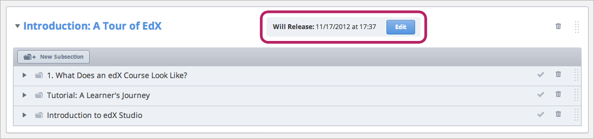
 
 
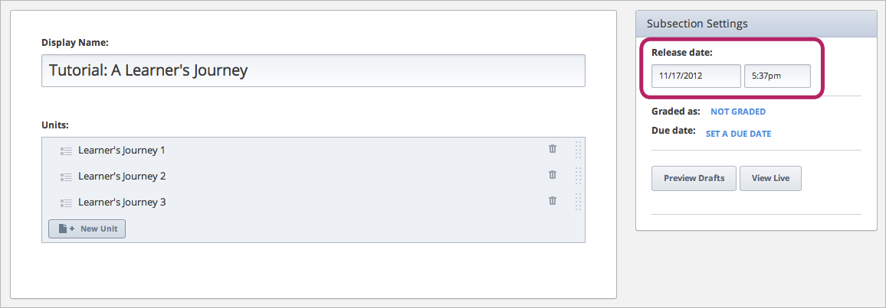

 
3. You set the Unit that contains the content to Public.** By default, all
Units are set to Private.
 
 
There are four ways of viewing your course on edX or Edge while you are
still creating it:
 
 
* In Studio

.. note::

	The way your course looks in Studio is not the way it looks to students on
	edX or Edge.
 
 
* On edX or Edge in Preview mode

	Any content that is set to Private is only visible in Preview mode.
 
 
* On edX or Edge as an Instructor

	When you view content as an instructor, you see the **Instructor** tab at the
	the top of the screen.
 
 
* On edX or Edge as a Student

.. raw:: latex
  
      \newpage %
 

Outline View
============

 
When you want to see the overall organization of your course in Studio, you can
go to the **Course Outline **page. On the**Course Outline **page, you can
see the "macro" outline of your course, down to individual Units.
 
 
.. image:: Images/image193.png

.. raw:: latex
  
      \newpage %
 
Subsection View
===============
 
You can also view content by Subsection. In this view, you can see the name
of the Subsection and the Units that the Subsection contains. You can see if
the Section is graded or not graded; if it is graded, you can see the
assignment type of the Subsection. You can also see if the individual Units
are set to Public or Private. Private Units appear in light gray text with
"PRIVATE" next to the Unit name. All other Units are Public.
 
 
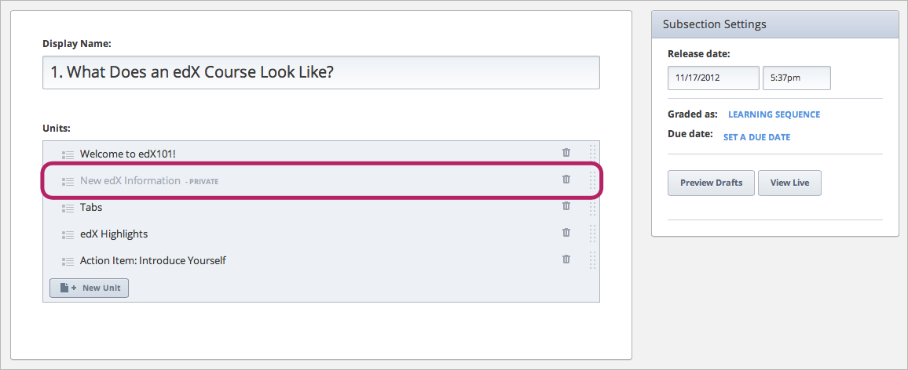

.. raw:: latex
  
      \newpage %
 
Unit View
=========
 
When you want to see the actual text, problems, and other content in your
course, you can open an individual Unit. You then see the Components for
that Unit. You can see this content whether it is set to Public or Private,
and whether or not the release date has passed.
 
 
The following example shows the Studio view of two Units in the "What Does
an edX Course Look Like?" Subsection.
 
 
The following Unit is set to Public. The release date for the Subsection has
passed.
 
 
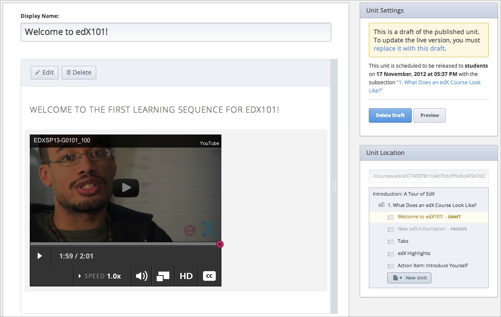
 
 
The following Unit is set to Private. The release date for the Subsection
has passed.
 
 
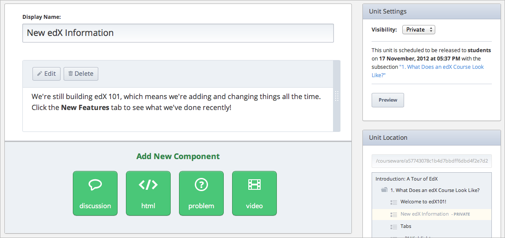
 
 
If you change the release date for the "What Does an edX Course Look Like?"
Subsection to a date in the future (in this example, January 1, 2099), you
still see both Units in Studio.
 
 
Public Unit
^^^^^^^^^^^

 
 
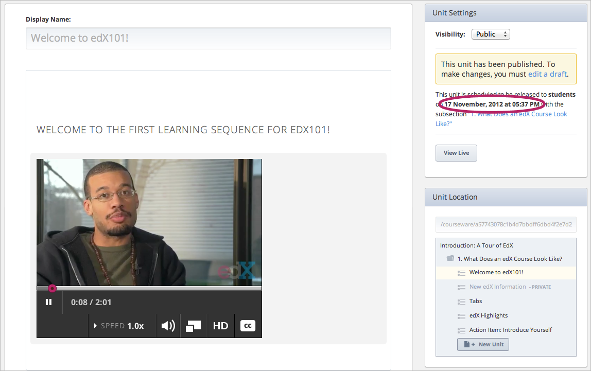
 
 
Private Unit
^^^^^^^^^^^^

 
 
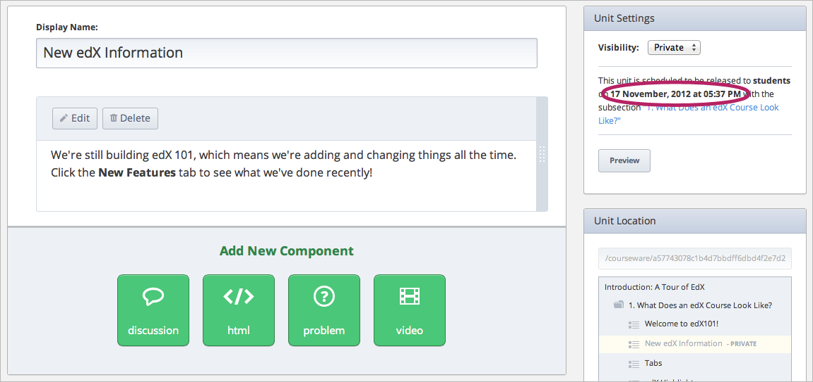

.. raw:: latex
  
      \newpage %

 
Preview Mode
============
 
When you view your course on edX or Edge using Preview mode, you see all the
Units of your course, regardless of whether they are set to Public or
Private and regardless of whether the release dates have passed.
 
 
**Using Preview mode is the only way to see content that is set to Private
**as a student would see it.**
 
 
You can enter Preview mode in two ways.
 
 
1. On any Subsection page, click** Preview Drafts**.
 
 
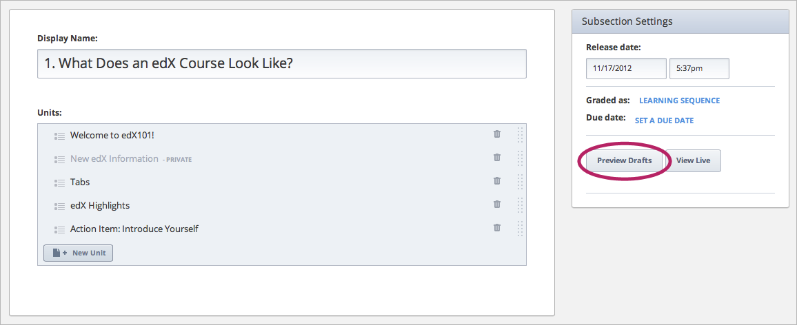
 
 
2. On any Unit page, click **Preview**.
 
 
The following example shows the **Preview** button on a page for a Unit that
is set to Public.
 
 
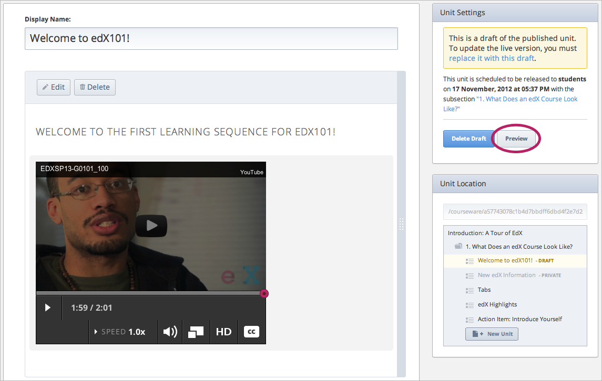
 
 
The following example shows the **Preview** button on a page for a Unit that
is set to Private.
 
 
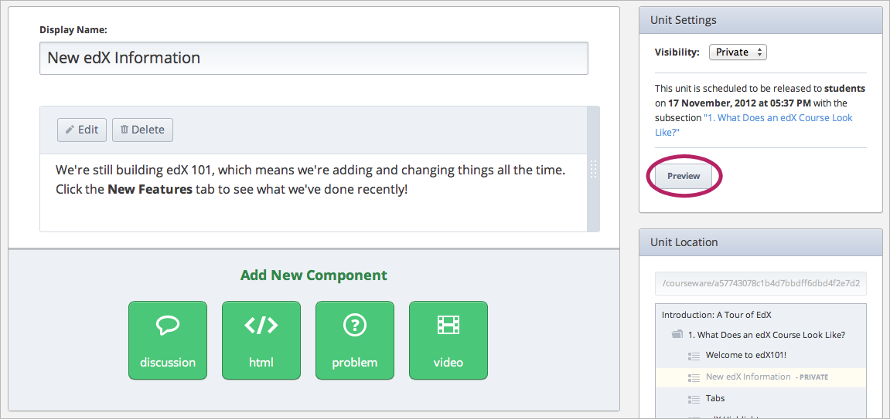
 
Example
=======
 
The following example shows the first Unit of the "What Does an edX Course
Look Like?" Subsection in Preview mode.
 
 
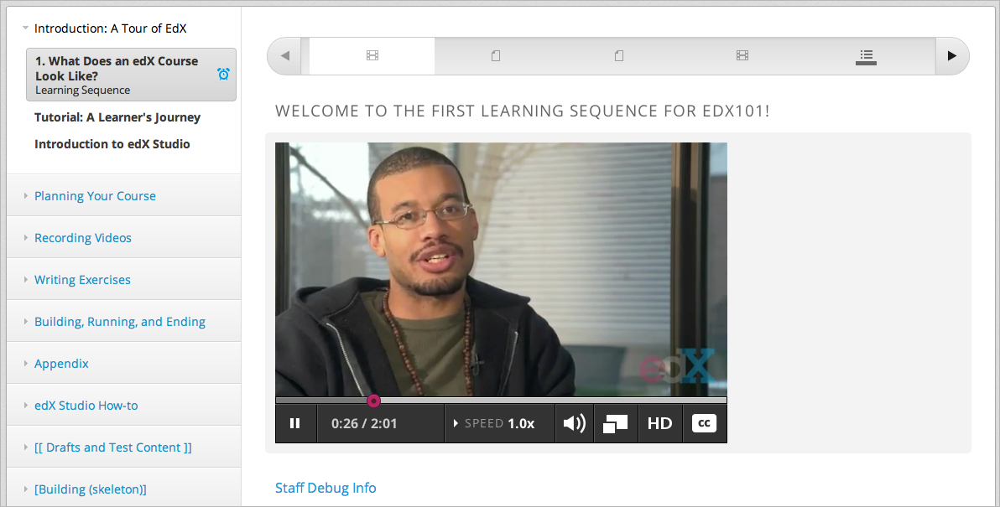
 
 
Remember that the release date for the Subsection is in the past. However,
even if you change the release date for the "What Does an edX Course Look
Like?" Subsection to a date in the future, you still see both Units in
Preview.
 
 
In the "What Does an edX Course Look Like?" Subsection, Unit 1 ("Welcome to
edX 101") is set to Public, and Unit 2 ("New edX Information") is set to
Private. Both Units appear in the course ribbon at the top of the screen.
 
 
.. image:: Images/image213.png

When you click Unit 2 in the course ribbon, you see the content in Unit 2:
 
 
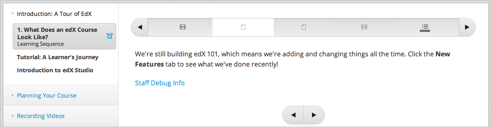
 
**On edX or Edge as an Instructor**
 
When you view your course on edX or Edge as an instructor:
 
 
* You see all the Units of your course that you have set to Public. 
* Release dates do not matter.
 
 
You do not see Units that are set to Private.
 
 
Additionally, at the top of the page on edX or Edge, you can see the
**Instructor** tab.
 
 
To view your course on edX or Edge as an instructor, click **View Live**. The
**View Live **button is available in three places.** **
 
The **Course Outline** page.
 
 
.. image:: Images/image217.png
 
 
Any Subsection page.
 
 
.. image:: Images/image219.png
 
 
 
The Unit page, if the Unit is Public.
 
 
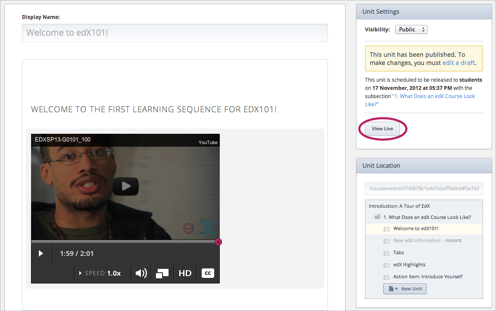
 
Example
=======
 
The following example shows the first Unit of the "What Does an edX Course
Look Like?" Subsection as if you were viewing it on edX or Edge as an
instructor. Notice the **Instructor** tab at the top of the page.
 
 
.. image:: Images/image223.png
 
 
The release date for the "What Does an edX Course Look Like?" Subsection is
set to January 1, 2099. However, you still see this Unit on edX or Edge as
an instructor.
 
 
On the other hand, remember that Unit 1 is set to Public, and Unit 2 is set
to Private. Unit 2 does not appear in the course ribbon at the top of the
screen. Instead, the next public unit, **Tabs**, appears.
 
 
.. image:: Images/image225.png
 
**On edX or Edge as a Current Student**
 
When you view your course as a current student would see it, you can only
see material that meets all three publishing conditions:
 
 
The course start date has passed.
 
 
* The release dates for the Section and Subsection have passed.
 
* The Unit that contains the material is set to Public.
 
 
You can use this view to make sure that material does not appear in your
course prematurely.
 
 
To view your course as a student, set up a test account on edX or Edge with
an e-mail address that is not associated with your Course Team, and then go
to your course URL and register for your course.

Example
=======
 
The following example shows the first Unit of the "What Does an edX Course
Look Like?" Subsection as if you were viewing it on edX or Edge as a
student. Notice that the **Instructor** tab does not appear at the top of
the page.
 
 
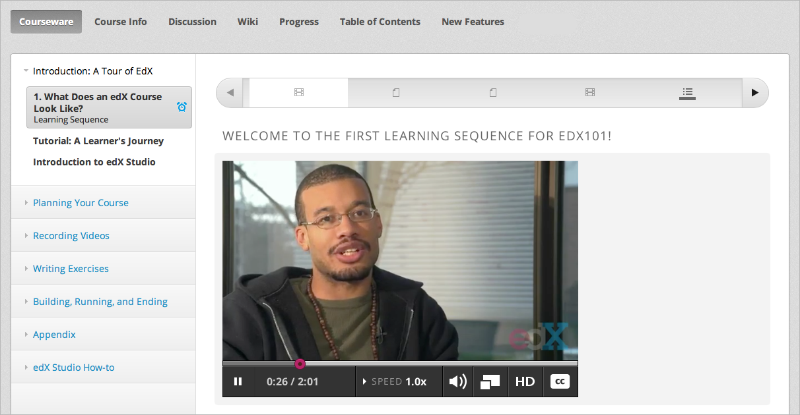
 
 
Remember that Unit 1 is set to Public, and Unit 2 is set to Private. Unit 2
does not appear in the course ribbon at the top of the screen. Instead, the
next public unit, **Tabs**, appears.
 
 
.. image:: Images/image229.png
 
 
If you change the release date of the Subsection to a future date (such as
January 1, 2099), the student cannot see it.
 
 
If you set the Unit to Private, the student cannot see it.
