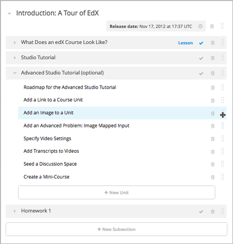
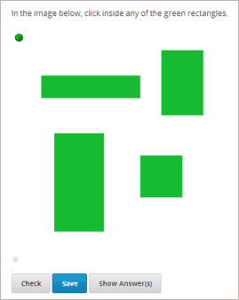
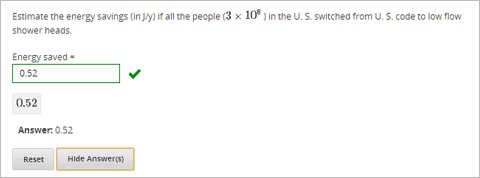

.. _Advanced Problems:

Advanced Problems
=================

Advanced problems are problems such as drag and drop, circuit schematic
builder, and math expression problems. These problems appear on the
Advanced tab when you create a new Problem component. Studio provides
templates for these problems, but the problems open directly in the
**Advanced Editor** and have to be created in XML.

-  :ref:`Circuit Schematic Builder` In circuit schematic problems, students
   create and modify circuits on an interactive grid and submit
   computer-generated analyses of the circuits for grading.
-  :ref:`Custom JavaScript Display and Grading` With custom JavaScript display
   and grading problems, you can incorporate problem types that you've created
   in HTML into Studio via an IFrame.
-  :ref:`Write-Your-Own-Grader` Write-your-own-grader problems
   evaluate students' responses using an embedded Python script that you
   create. These problems can be any type.
-  :ref:`Drag and Drop` Drag and drop problems require students to drag text
   or objects to a specific location on an image.
-  :ref:`Image Mapped Input` Image mapped input problems require students to
   click a specific location on an image.
-  :ref:`Math Expression Input` Math expression input problems require
   students to enter a mathematical expression as text, such as
   e=m\*c^2.
-  :ref:`Problem with Adaptive Hint` These problems can give students
   feedback or hints based on their responses. Problems with adaptive
   hints can be text input or multiple choice problems.
- :ref:`Problem Written in LaTeX` This problem type allows you to convert problems that you’ve already written in LaTeX into the edX format. Note that this problem type is still a prototype, however, and may not be supported in the future.

These problems are easy to access in Studio. To create them, click
**Problem** under **Add New Component**, click the **Advanced** tab, and
then click the name of the problem that you want to create.

To add a label for an advanced problem, you'll add a **label** attribute to one of the XML tags for the problem. For more information, see :ref:`Appendix E`.

.. _Circuit Schematic Builder:

Circuit Schematic Builder
-------------------------

In circuit schematic builder problems, students can arrange circuit
elements such as voltage sources, capacitors, resistors, and MOSFETs on
an interactive grid. They then submit a DC, AC, or transient analysis of
their circuit to the system for grading.

.. image:: /Images/CircuitSchematicExample.gif
 :alt: Image of a circuit schematic builder

Create a Circuit Schematic Builder Problem
~~~~~~~~~~~~~~~~~~~~~~~~~~~~~~~~~~~~~~~~~~

#. In the unit where you want to create the problem, click **Problem**
   under **Add New Component**, and then click the **Advanced** tab.
#. Click **Circuit Schematic Builder**.
#. In the component that appears, click **Edit**.
#. In the component editor, replace the example code with your own code.
#. Click **Save**.

.. _Custom JavaScript Display and Grading:

Custom JavaScript Display and Grading
-------------------------------------

Custom JavaScript display and grading problems (also called custom JavaScript problems
or JS Input problems) allow you to create a custom problem or tool that uses JavaScript
and then add the problem or tool directly into Studio. When you create a JS Input problem,
Studio embeds the problem in an inline frame (IFrame) so that your students can interact with
it in the LMS. You can grade your students’ work using JavaScript and some basic Python, and
the grading is integrated into the edX grading system.

The JS Input problem that you create must use HTML, JavaScript, and cascading style sheets
(CSS). You can use any application creation tool, such as the Google Web Toolkit (GWT), to
create your JS Input problem.

.. image:: /Images/JavaScriptInputExample.gif
 :alt: Image of a JavaScript Input problem

Create a Custom JavaScript Display and Grading Problem
~~~~~~~~~~~~~~~~~~~~~~~~~~~~~~~~~~~~~~~~~~~~~~~~~~~~~~

#. Create your JavaScript application, and then upload all files associated with
   that application to the **Files & Uploads** page.
#. In the unit where you want to create the problem, click **Problem**
   under **Add New Component**, and then click the **Advanced** tab.
#. Click **Custom JavaScript Display and Grading**.
#. In the component that appears, click **Edit**.
#. In the component editor, modify the example code according to your problem.

   - All problems have more than one element. Most problems conform to the same-origin
     policy (SOP), meaning that all elements have the same protocol, host, and port.
     For example, **http**://**store.company.com**:**81**/subdirectory_1/JSInputElement.html and
     **http**://**store.company.com**:**81**/subdirectory_2/JSInputElement.js have the same protocol
     (http), host (store.company.com), and port (81).

     If any elements of your problem use a different protocol, host, or port, you need to
     bypass the SOP. For example, **https**://**info.company.com**/JSInputElement2.html
     uses a different protocol, host, and port. To bypass the SOP, change
     **sop="false"** in line 8 of the example code to **sop="true"**. For more information, see the same-origin policy
     page on the `Mozilla Developer Network <https://developer.mozilla.org/en-US/docs/Web/JavaScript/Same_origin_policy_for_JavaScript>`_
     or on `Wikipedia <http://en.wikipedia.org/wiki/Same_origin_policy>`_.
#. If you want your problem to have a **Save** button, click the **Settings** tab, and then set
   **Maximum Attempts** to a number larger than zero.
#. Click **Save**.

Re-create the Example Problem
^^^^^^^^^^^^^^^^^^^^^^^^^^^^^

To re-create the example problem above, you'll need the following files.

   - webGLDemo.html
   - webGLDemo.js
   - webGLDemo.css
   - three.min.js

You'll create the first three files using the code in :ref:`Appendix F`. The three.min.js file is a library
file that you'll download.

#. Go to :ref:`Appendix F` and use the code samples to create the following files.

   - webGLDemo.html
   - webGLDemo.js
   - webGLDemo.css

#. Download the **three.min.js** file. To do this, go to the `three.js home page <http://threejs.org>`_,
   and then click **Download** in
   the left pane. After the .zip file has finished downloading, open the .zip file, and then
   open the **build** folder to access the three.min.js file.

    **Note** If you need to bypass the SOP, you'll also need the **jschannel.js** file. To do
    this, go to the `jschannel.js <https://github.com/mozilla/jschannel/blob/master/src/jschannel.js>`_
    page, copy the code for the file into a text editor, and then save the file as jschannel.js.

#. On the **Files & Uploads** page, upload all the files you just created or downloaded.
#. Create a new custom JavaScript display and grading problem component.
#. On the **Settings** tab, set **Maximum Attempts** to a number larger than
   zero.
#. In the problem component editor, replace the example code with the code below.
#. Click **Save.**

JavaScript Input Problem Code
#############################

::

    <problem display_name="webGLDemo">
    In the image below, click the cone.

    
    <customresponse cfn="vglcfn">
        <jsinput
            gradefn="WebGLDemo.getGrade"
            get_statefn="WebGLDemo.getState"
            set_statefn="WebGLDemo.setState"
            width="400"
            height="400"
            html_file="/static/webGLDemo.html"
        />
    </customresponse>
    </problem>

.. note::    When you create this problem, keep the following in mind.

             - The webGLDemo.js file defines the three JavaScript functions (**WebGLDemo.getGrade**, **WebGLDemo.getState**, and **WebGLDemo.setState**).

             - The JavaScript input problem code uses **WebGLDemo.getGrade**, **WebGLDemo.getState**, and **WebGLDemo.setState** to grade, save, or restore a problem. These functions must be global in scope.

             - **WebGLDemo.getState** and **WebGLDemo.setState** are optional. You only have to define these functions if you want to conserve the state of the problem.

             - **Width** and **height** represent the dimensions of the IFrame that holds the application.

             - When the problem opens, the cone and the cube are both blue, or "unselected." When you click either shape once, the shape becomes yellow, or "selected." To unselect the shape, click it again. Continue clicking the shape to select and unselect it.

             - The response is graded as correct if the cone is selected (yellow) when the user clicks **Check**.

             - Clicking **Check** or **Save** registers the problem's current state.

.. _Write-Your-Own-Grader:

Write-Your-Own-Grader ("Custom Python-Evaluated Input")
-------------------------------------------------------

In write-your-own-grader problems (also called "custom Python-evaluated
input" problems), the grader evaluates a student's response using a
Python script that you create and embed in the problem. These problems
can be any type. Numerical input and text input problems are the most
popular write-your-own-grader.

.. image:: Images/CustomPythonExample.png
 :alt: Image of a write your own grader problem

Create a Write-Your-Own-Grader Problem
~~~~~~~~~~~~~~~~~~~~~~~~~~~~~~~~~~~~~~

To create a write-your-own-grader problem:

#. In the unit where you want to create the problem, click **Problem**
   under **Add New Component**, and then click the **Advanced** tab.
#. Click **Custom Python-Evaluated Input**.
#. In the component that appears, click **Edit**.
#. In the component editor, replace the example code with your own code.
#. Click **Save**.

For more information about write-your-own-grader problems, see `CustomResponse XML and Python
Script <https://edx.readthedocs.org/en/latest/course_data_formats/custom_response.html>`_.

.. _Drag and Drop:

Drag and Drop
-------------

In drag and drop problems, students respond to a question by dragging
text or objects to a specific location on an image.

Create a Drag and Drop Problem
~~~~~~~~~~~~~~~~~~~~~~~~~~~~~~

To create a drag and drop problem:

#. In the unit where you want to create the problem, click **Problem**
   under **Add New Component**, and then click the **Advanced** tab.
#. Click **Drag and Drop**.
#. In the component that appears, click **Edit**.
#. In the component editor, replace the example code with your own code.
#. Click **Save**.

For more information about drag and drop problems, see `XML Format of Drag and Drop Input
<https://edx.readthedocs.org/en/latest/course_data_formats/drag_and_drop/drag_and_drop_input.html>`_.

.. _Image Mapped Input:

Image Mapped Input
------------------

In an image mapped input problem, students click inside a defined area
in an image. You define this area by including coordinates in the body
of the problem.

Create an Image Mapped Input Problem
~~~~~~~~~~~~~~~~~~~~~~~~~~~~~~~~~~~~

To create a image mapped input problem:

#. In the unit where you want to create the problem, click **Problem**
   under **Add New Component**, and then click the **Advanced** tab.
#. Click **Image Mapped Input**.
#. In the component that appears, click **Edit**.
#. In the component editor, replace the example code with your own code.
#. Click **Save**.

.. _Math Expression Input:

Math Expression Input
---------------------

In math expression input problems, students enter text that represents a mathematical expression into a field, and the LMS changes that text to a symbolic expression that appears below that field. 

.. image:: Images/MathExpressionInputExample.gif
 :alt: Image of math expression input problem

Unlike numerical input problems, which only allow integers and a few select constants, math expression problems can include unknown variables and more complicated symbolic expressions. The grader uses a numerical sampling to determine whether the student's response matches the instructor-provided math expression, to a specified numerical tolerance. The instructor must specify the allowed variables in the expression as well as the range of values for each variable.

.. warning:: Math expression input problems cannot currently include negative numbers raised to fractional powers, such as (-1)^(1/2). Math expression input problems can include complex numbers raised to fractional powers, or positive non-complex numbers raised to fractional powers.

When you create a math expression input problem in Studio, you'll use `MathJax <http://www.mathjax.org>`_ to change your plain text into "beautiful math." For more information about how to use MathJax in Studio, see :ref:`MathJax in Studio`.

The LMS automatically converts the following Greek letter names into the corresponding Greek characters when a student types them in the answer field:

.. list-table::
   :widths: 20 20 20 20
   :header-rows: 0

   * - alpha
     - beta
     - gamma
     - delta
   * - epsilon
     - varepsilon
     - zeta
     - eta
   * - theta
     - vartheta
     - iota
     - kappa
   * - lambda
     - mu
     - nu
     - xi
   * - pi
     - rho
     - sigma
     - tau
   * - upsilon
     - phi
     - varphi
     - chi
   * - psi
     - omega
     - 
     - 

note:: ``epsilon`` is the lunate version, whereas ``varepsilon`` looks like a backward 3.

Create a Math Expression Input Problem
~~~~~~~~~~~~~~~~~~~~~~~~~~~~~~~~~~~~~~

To create a math expression input problem:

#. In the unit where you want to create the problem, click **Problem**
   under **Add New Component**, and then click the **Advanced** tab.
#. Click **Math Expression Input**.
#. In the component that appears, click **Edit**.
#. In the component editor, replace the example code with your own code.
#. Click **Save**.

For more information, see `Symbolic Response
<https://edx.readthedocs.org/en/latest/course_data_formats/symbolic_response.html>`_.

.. _Problem with Adaptive Hint:

Problem with Adaptive Hint
--------------------------

A problem with an adaptive hint evaluates a student's response, then
gives the student feedback or a hint based on that response so that the
student is more likely to answer correctly on the next attempt. These
problems can be text input or multiple choice problems.

.. image:: Images/ProblemWithAdaptiveHintExample.gif
 :alt: Image of a problem with an adaptive hint

Create a Problem with an Adaptive Hint
~~~~~~~~~~~~~~~~~~~~~~~~~~~~~~~~~~~~~~

To create a problem with an adaptive hint:

#. In the unit where you want to create the problem, click **Problem**
   under **Add New Component**, and then click the **Advanced** tab.
#. Click **Problem with Adaptive Hint**.
#. In the component that appears, click **Edit**.
#. In the component editor, replace the example code with your own code.
#. Click **Save**.

.. _Problem Written in LaTeX:

Problem Written in LaTeX
------------------------

.. warning:: This problem type is still a prototype and may not be supported in the future. By default, the ability to create these problems is not enabled in Studio. You must change the advanced settings in your course before you can create problems with LaTeX. Use this problem type with caution.

If you have an problem that is already written in LaTeX, you can use
this problem type to easily convert your code into XML. After you paste
your code into the LaTeX editor, you'll only need to make a few minor
adjustments. 

.. note:: If you want to use LaTeX to typeset mathematical expressions
          in problems that you haven't yet written, use any of the other problem
          templates together with `MathJax <http://www.mathjax.org>`_. For more
          information about how to create mathematical expressions in Studio using
          MathJax, see *A Brief Introduction to MathJax in Studio*.

Create a Problem Written in LaTeX
~~~~~~~~~~~~~~~~~~~~~~~~~~~~~~~~~

To create a problem written in LaTeX:

#. Enable the policy key in your course.

   #. In Studio, click **Settings**, and then click **Advanced Settings**.
   #. On the **Advanced Settings** page, scroll down to the **use_latex_compiler** policy key.
   #. In the **Policy Value** field next to the **use_latex_compiler** policy key, change **false** to **true**.
   #. At the bottom of the page, click **Save Changes**.
   
#. In the unit where you want to create the problem, click **Problem**
   under **Add New Component**, and then click the **Advanced** tab.
#. Click **Problem Written in LaTeX**.
#. In the component editor that appears, click **Edit**.
#. In the lower left corner of the component editor, click **Launch
   LaTeX Source Compiler**.
#. Replace the example code with your own code. You can also upload a Latex file into the editor from your computer by clicking **Upload** in the bottom right corner.
#. In the lower left corner of the LaTeX source compiler, click **Save &
   Compile to edX XML**.