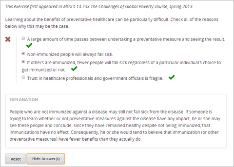
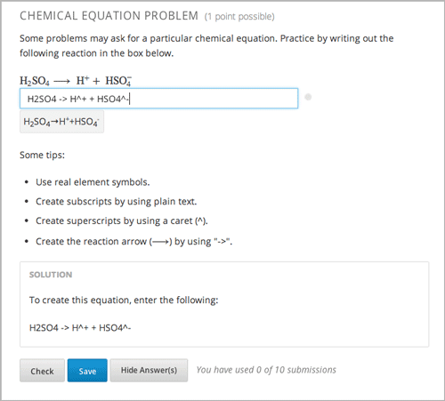
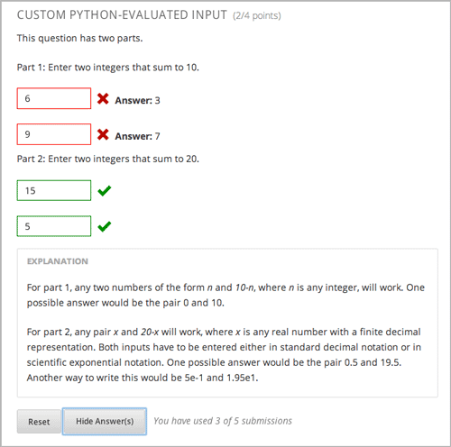
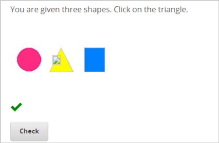
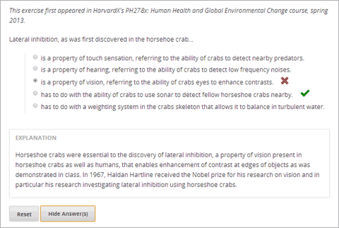
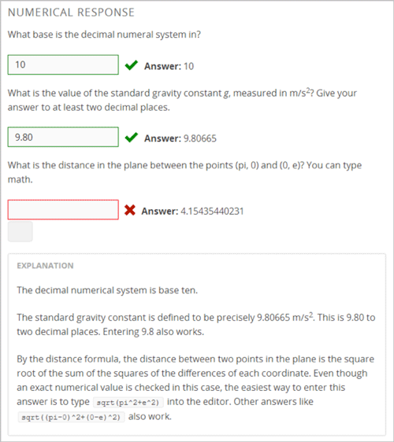
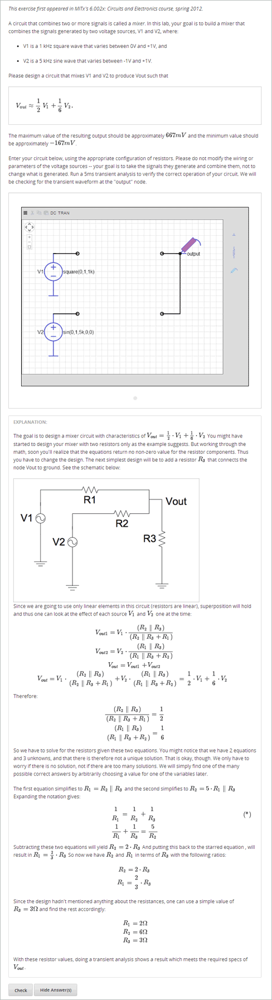

.. _Appendix E:

^^^^^^^^^^^^^^^^^^^^^^^^^^^^^^^^
APPENDIX E: Problem and Tool XML
^^^^^^^^^^^^^^^^^^^^^^^^^^^^^^^^

This appendix provides information about the XML for most problem and tool types in Studio:

* :ref:`General`
* :ref:`Choice Response`
* :ref:`Chemical Equation Input`
* :ref:`Custom Response`
* :ref:`Formula Response`
* :ref:`Image Response`
* :ref:`Multiple Choice Response`
* :ref:`Numerical Response`
* :ref:`Option Response`
* :ref:`Schematic Response`
* :ref:`String Response`

.. _General:

General
-------
 
Most problems have the following tags.

.. list-table::
   :widths: 20 80

   * - ``<problem> </problem>``
     - These must be the first and last tags for any content created in the Advanced
       Editor in a Problem component.
   * - ``<startouttext/>``
     - The ``<startouttext />`` tag indicates the beginning of a line or block of text.
   * - ``<endouttext/>``
     - The ``<endouttext />`` tag indicates the end of a line or block of text.
   * - ``<solution> 
 
 </solution>`` (optional)
     - If you want to include more information in the problem, such as a detailed explanation of the problem's answer, you'll enter the text between the two ``
`` tags, which are inside the ``<solution>`` tags. (These tags do not have to be on the same line.)

.. _Choice Response:

Choice Response (Checkbox Problems)
-----------------------------------

Although you can create checkbox problems by using the Simple Editor in Studio, you may want to see or change the problem's underlying XML.

**Sample Problem**

**Tags**

.. list-table::
   :widths: 20 80

   * - ``<choiceresponse>``
     - Specifies that the problem lists answer options for students to choose from.
   * - ``<checkboxgroup>``
     - A child of ``<choiceresponse>``. Specifies that the problem is a checkbox problem.
   * - ``<choice>``
     - A child of ``<checkboxgroup>``. Designates an answer option. Each choice must include the ``correct`` attribute, set to ``true`` (for a correct answer) or ``false`` (for an incorrect answer). For checkbox problems, more than one option can be a correct answer.

**Sample Problem XML**

.. code-block:: xml

  <problem>
  <startouttext/>
    
Learning about the benefits of preventative healthcare can be particularly
     difficult. Check all of the reasons below why this may be the case.

  <choiceresponse>
    <checkboxgroup>
      <choice correct="true"><text>A large amount of time passes between undertaking
      a preventative measure and seeing the result.</text></choice>
      <choice correct="false"><text>Non-immunized people will always fall sick.</text>
      </choice>
      <choice correct="true"><text>If others are immunized, fewer people will fall 
      sick regardless of a particular individual's choice to get immunized or not.
      </text></choice>
      <choice correct="true"><text>Trust in healthcare professionals and government 
      officials is fragile.</text></choice>
    </checkboxgroup>

   <solution>
   

   
Explanation

   
People who are not immunized against a disease may still not fall sick from the 
   disease. If someone is trying to learn whether or not preventative measures 
   against the disease have any impact, he or she may see these people and conclude, 
   since they have remained healthy despite not being immunized, that immunizations 
   have no effect. Consequently, he or she would tend to believe that immunization 
   (or other preventative measures) have fewer benefits than they actually do.

   

   </solution>
  </choiceresponse>
  </problem>

**Template**

.. code-block:: xml

  <problem>
  <startouttext/>
    
Question text

  <choiceresponse>

  <checkboxgroup>
  <choice correct="false"><text>Answer option 1 (incorrect)</text></choice>
  <choice correct="true"><text>Answer option 2 (correct)</text></choice>
  </checkboxgroup>

   <solution>
   

   
Solution or Explanation Heading

   
Solution or explanation text

   

   </solution>

  </choiceresponse>
  </problem>

.. _Chemical Equation Input:

Chemical Equation Input (Chemical Equation Problems)
----------------------------------------------------

In chemical equation problems, students enter text that represents a chemical equation into a text box. The LMS converts that text into a chemical equation below the text box.

**Sample Problem**

**Required Tags**

.. list-table::
   :widths: 20 80

   * - ``<customresponse>``
     - Indicates that this problem has a custom response. The ``<customresponse>`` tags must surround the ``<chemicalequation>`` tags.
   * - ``<chemicalequationinput>``
     - A child of ``<customresponse>``. Indicates that the answer to this problem is a chemical equation.
   * - ``<answer type=loncapa/python>``
     - A child of ``<chemicalequationinput>``. Contains the Python script that grades the problem.

Chemical equation problems use MathJax to create formulas. For more information about using MathJax in Studio, see :ref:`MathJax in Studio`.

**Sample Problem XML**:

.. code-block:: xml

  <problem>
    <startouttext/>
    
Some problems may ask for a particular chemical equation. Practice by writing out the following reaction in the box below.

    
  \( \text{H}_2\text{SO}_4 \longrightarrow \text { H}^+ + \text{ HSO}_4^-\)

    <customresponse>
      <chemicalequationinput size="50"/>
      <answer type="loncapa/python">

  if chemcalc.chemical_equations_equal(submission[0], 'H2SO4 -> H^+ + HSO4^-'):
      correct = ['correct']
  else:
      correct = ['incorrect']

      </answer>
    </customresponse>
    
Some tips:

    <ul>
    <li>Use real element symbols.</li>
    <li>Create subscripts by using plain text.</li>
    <li>Create superscripts by using a caret (^).</li>
    <li>Create the reaction arrow (\(\longrightarrow\)) by using "->".</li>
    </ul>

    <endouttext/>
  
   <solution>
   

   
Solution

   
To create this equation, enter the following:

     
H2SO4 -> H^+ + HSO4^-

   

   </solution>
  </problem>

**Problem Template**:

.. code-block:: xml

  <problem>
    <startouttext/>
    
Problem text

    <customresponse>
      <chemicalequationinput size="50"/>
      <answer type="loncapa/python">

  if chemcalc.chemical_equations_equal(submission[0], 'TEXT REPRESENTING CHEMICAL EQUATION'):
      correct = ['correct']
  else:
      correct = ['incorrect']

      </answer>
    </customresponse>

    <endouttext/>
  
   <solution>
   

   
Solution or Explanation Header

   
Solution or explanation text

   

   </solution>
  </problem>

.. _Custom Response:

Custom Response ("Custom Python-Evaluated Input") Problems
-----------------------------------------------------------

In custom Python-evaluated input (also called “write-your-own-grader”) problems, the grader evaluates a student’s response using a Python script that you create and embed in the problem. 

**Sample Problem**

.. list-table::
   :widths: 20 80

   * - ``

  
Part 1: Enter two integers that sum to 10. 

  <customresponse cfn="test_add_to_ten">
          <textline size="10" correct_answer="3"/> 
          <textline size="10" correct_answer="7"/>
  </customresponse>

  
Part 2: Enter two integers that sum to 20. 

  <customresponse cfn="test_add" expect="20">
          <textline size="10"/> 
          <textline size="10"/>
  </customresponse>

  <solution>
      

          
Explanation

          
For part 1, any two numbers of the form <i>n</i> and <i>10-n</i>, where <i>n</i> is any integer, will work. One possible answer would be the pair 0 and 10.

          
For part 2, any pair <i>x</i> and <i>20-x</i> will work, where <i>x</i> is any real number with a finite decimal representation. Both inputs have to be entered either in standard decimal notation or in scientific exponential notation. One possible answer would be the pair 0.5 and 19.5. Another way to write this would be 5e-1 and 1.95e1.

      

  </solution>
  </problem>

**Templates**

The following template includes answers that appear when the student clicks **Show Answer**. 

.. code-block:: xml

  <problem>

  

  
Problem text

  <customresponse cfn="test_add" expect="20">
          <textline size="10" correct_answer="11"/> 
          <textline size="10" correct_answer="9"/>
  </customresponse>

      <solution>
          

            
Solution or Explanation Heading

            
Solution or explanation text

          

      </solution>
  </problem>

The following template does not return answers when the student clicks **Show Answer**. If your problem doesn't include answers for the student to see, make sure to set **Show Answer** to **Never** in the problem component.

.. code-block:: xml

  <problem>

  

  
Enter two real numbers that sum to 20: 

  <customresponse cfn="test_add" expect="20">
          <textline size="10" /> 
          <textline size="10" />
  </customresponse>

      <solution>
          

            
Solution or Explanation Heading

            
Solution or explanation text

          

      </solution>
  </problem>

.. _Formula Response:

Formula Response (Math Expression Input Problems)
-------------------------------------------------

**Sample Problem**

.. image:: ../Images/MathExpressionInputExample.gif
 :alt: Image of a math expression input problem

.. list-table::
   :widths: 20 80
   :header-rows: 1

   * - ``<formularesponse>``
     - 
   * - ``<formulaequationinput>``
     - 
   * - ``

    
Let <i>x</i> be a variable, and let <i>n</i> be an arbitrary constant. What is the derivative of <i>xn</i>?

  
    <formularesponse type="ci" samples="x,n@1,2:3,4#10" answer="$derivative">
      <responseparam type="tolerance" default="0.00001"/>
      <formulaequationinput size="20" />
    </formularesponse>

    <solution>
      

        
Explanation or Solution Header

        
Explanation or solution text

      

    </solution>
  </problem>

**Template XML**

.. code-block:: xml

  <problem>
    
Problem text

    <formularesponse type="ci" samples="VARIABLES@LOWER_BOUNDS:UPPER_BOUNDS#NUMBER_OF_SAMPLES" answer="$VoVi">
      <responseparam type="tolerance" default="0.00001"/>
      <formulaequationinput size="20" />
    </formularesponse>

  

    <solution>
      

        
Explanation or Solution Header

        
Explanation or solution text

      

    </solution>
  </problem>

**XML Attribute Information**

  
What is the distance in the plane between the points (pi, 0) and (0, e)? You can type math.
      <numericalresponse answer="$computed_response">
          <responseparam type="tolerance" default="0.0001" />
          <formulaequationinput />
      </numericalresponse>
  

  <solution>
    

      
Explanation

      
The decimal numerical system is base ten.

      
The standard gravity constant is defined to be precisely 9.80665 m/s2.
      This is 9.80 to two decimal places. Entering 9.8 also works.

      
By the distance formula, the distance between two points in the plane is
         the square root of the sum of the squares of the differences of each coordinate.
        Even though an exact numerical value is checked in this case, the
        easiest way to enter this answer is to type
        <code>sqrt(pi^2+e^2)</code> into the editor.
        Other answers like <code>sqrt((pi-0)^2+(0-e)^2)</code> also work.
      

    

  </solution>
  </problem>

**Templates**

Exact values

.. code-block:: xml

  <problem>

    <numericalresponse answer="10">
      <formulaequationinput />
    </numericalresponse>

    <solution>
    

    

  </solution>
  </problem>

Answers with decimal precision

.. code-block:: xml

  <problem>

    <numericalresponse answer="9.80665">
      <responseparam type="tolerance" default="0.01" />
      <formulaequationinput />
    </numericalresponse>

    <solution>
    

    

  </solution>
  </problem>

Answers with percentage precision

.. code-block:: xml

  <problem>

    <numericalresponse answer="100">
      <responseparam type="tolerance" default="10%" />
      <formulaequationinput />
    </numericalresponse>

    <solution>
    

    

  </solution>
  </problem>

Answers with scripts

.. code-block:: xml

  <problem>

  <!-- Use python script spacing. The following should not be indented! -->
  

    <numericalresponse answer="$computed_response">
      <responseparam type="tolerance" default="0.0001" />
      <formulaequationinput />
    </numericalresponse>

    <solution>
    

    

  </solution>
  </problem>

**XML Attribute Information**

<script>

  .. image:: ../Images/numericalresponse.png

``<numericalresponse>``

+------------+----------------------------------------------+-------------------------------+
| Attribute  |                 Description                  |              Notes            |
+============+==============================================+===============================+
| ``answer`` | A value to which student input must be       | Note that any numeric         |
|            | equivalent. Note that this expression can be | expression provided by the    |
|            | expressed in terms of a variable that is     | student will be automatically |
|            | computed in a script provided in the problem | simplified on the grader's    |
|            | by preceding the appropriate variable name   | backend.                      |
|            | with a dollar sign.                          |                               |
|            |                                              |                               |
|            | This answer will be evaluated similar to a   |                               |
|            | student's input. Thus '1/3' and 'sin(pi/5)'  |                               |
|            | are valid, as well as simpler expressions,   |                               |
|            | such as '0.3' and '42'                       |                               |
+------------+----------------------------------------------+-------------------------------+

+------------------------+--------------------------------------------+--------------------------------------+
|       Children         |                 Description                |                 Notes                |
+========================+============================================+======================================+
| ``responseparam``      | used to specify a tolerance on the accepted|                                      |
|                        | values of a number. See description below. |                                      |
+------------------------+--------------------------------------------+--------------------------------------+
|``formulaequationinput``| An input specifically for taking math      |                                      |
|                        | input from students. See below.            |                                      |
+------------------------+--------------------------------------------+--------------------------------------+
| ``textline``           | A format to take input from students, see  | Deprecated for NumericalResponse.    |
|                        | description below.                         | Use ``formulaequationinput`` instead.|
+------------------------+--------------------------------------------+--------------------------------------+

<responseparam>

  .. image:: ../Images/numericalresponse4.png

<formulaequationinput/>

========= ============================================= =====
Attribute                  Description                  Notes
========= ============================================= =====
size      (optional) defines the size (i.e. the width)
          of the input box displayed to students for
          typing their math expression.
========= ============================================= =====

<textline> (While <textline /> is supported, its use is extremely discouraged.
We urge usage of <formulaequationinput />. See the opening paragraphs of the
`Numerical Response`_ section for more information.)

  .. image:: ../Images/numericalresponse5.png

.. _Math Expression Syntax:

Math Expression Syntax
----------------------

In NumericalResponses, the student's input may be more complicated than a
simple number. Expressions like ``sqrt(3)`` and even ``1+e^(sin(pi/2)+2*i)``
are valid, and evaluate to 1.73 and -0.13 + 2.47i, respectively.

A summary of the syntax follows:

Numbers
~~~~~~~

Accepted number types:

- Integers: '2520'
- Normal floats: '3.14'
- With no integer part: '.98'
- Scientific notation: '1.2e-2' (=0.012)
- More s.n.: '-4.4e+5' = '-4.4e5' (=-440,000)
- Appending SI suffixes: '2.25k' (=2,250). The full list:

  ====== ========== ===============
  Suffix Stands for One of these is
  ====== ========== ===============
  %      percent    0.01 = 1e-2
  k      kilo       1000 = 1e3
  M      mega       1e6
  G      giga       1e9
  T      tera       1e12
  c      centi      0.01 = 1e-2
  m      milli      0.001 = 1e-3
  u      micro      1e-6
  n      nano       1e-9
  p      pico       1e-12
  ====== ========== ===============

The largest possible number handled currently is exactly the largest float
possible (in the Python language). This number is 1.7977e+308. Any expression
containing larger values will not evaluate correctly, so it's best to avoid
this situation.

Default Constants
~~~~~~~~~~~~~~~~~

Simple and commonly used mathematical/scientific constants are included by
default. These include:

- ``i`` and ``j`` as ``sqrt(-1)``
- ``e`` as Euler's number (2.718...)
- ``pi``
- ``k``: the Boltzmann constant (~1.38e-23 in Joules/Kelvin)
- ``c``: the speed of light in m/s (2.998e8)
- ``T``: the positive difference between 0K and 0°C (285.15)
- ``q``: the fundamental charge (~1.602e-19 Coloumbs)

Operators and Functions
~~~~~~~~~~~~~~~~~~~~~~~

As expected, the normal operators apply (with normal order of operations):
``+ - * / ^``. Also provided is a special "parallel resistors" operator given
by ``||``. For example, an input of ``1 || 2`` would represent the resistance
of a pair of parallel resistors (of resistance 1 and 2 ohms), evaluating to 2/3
(ohms).

At the time of writing, factorials written in the form '3!' are invalid, but
there is a workaround. Students can specify ``fact(3)`` or ``factorial(3)`` to
access the factorial function.

The default included functions are the following:

- Trig functions: sin, cos, tan, sec, csc, cot
- Their inverses: arcsin, arccos, arctan, arcsec, arccsc, arccot
- Other common functions: sqrt, log10, log2, ln, exp, abs
- Factorial: ``fact(3)`` or ``factorial(3)`` are valid. However, you must take
  care to only input integers. For example, ``fact(1.5)`` would fail.
- Hyperbolic trig functions and their inverses: sinh, cosh, tanh, sech, csch,
  coth, arcsinh, arccosh, arctanh, arcsech, arccsch, arccoth

.. _Option Response:

Option Response (Dropdown Problems)
-----------------------------------

Although you can create dropdown problems by using the Simple Editor in Studio, you may want to see or change the problem's underlying XML.

**Sample Problem**

.. image:: ../Images/DropdownExample.gif
    :alt: Image of an option response problem

**XML Tags**

.. list-table::
   :widths: 20 80

   * - ``<optionresponse>``
     - Indicates that the problem is a dropdown problem.
   * - ``<optioninput>``
     - Lists the answer options. This tag includes the ``options`` and ``correct`` attributes.

**Problem Code:**

.. code-block:: xml

  <problem>
  

    <em>This exercise first appeared in HarvardX's PH207x Health in Numbers: Quantitative Methods in Clinical &amp; Public Health Research course, fall 2012.</em>
  

  
What type of data are the following?

  
Age:

  <optionresponse>
    <optioninput options="('Nominal','Discrete','Continuous')" correct="Continuous"/>
  </optionresponse>
  
Age, rounded to the nearest year:

  <optionresponse>
    <optioninput options="('Nominal','Discrete','Continuous')" correct="Discrete"/>
  </optionresponse>
  
Life stage - infant, child, and adult:

  <optionresponse>
    <optioninput options="('Nominal','Discrete','Continuous')" correct="Nominal"/>
  </optionresponse>
  </problem>

**Template**

.. code-block:: xml

  <problem>
  

    Problem text

  <optionresponse>
    <optioninput options="('Option 1','Option 2','Option 3')" correct="Option 2"/>
  </optionresponse>
    <solution>
      

      
Explanation or Solution Header

      
Explanation or solution text

      

    </solution>
  </problem>

.. code-block:: xml

  <problem>
   
Problem text

    <optionresponse>
     options="('A','B')"
      correct="A"/>
    </optionresponse>
   
    <solution>
      

      
Explanation or Solution Header

      
Explanation or solution text

      

    </solution>
  </problem>

**XML Attribute Information**

<optionresponse>

  .. image:: ../Images/option_response1.png

<optioninput>

  .. image:: ../Images/optionresponse2.png

.. _Schematic Response:

Schematic Response (Circuit Schematic Problems)
-----------------------------------------------

The Schematic Response input type provides an interactive grid on which the
student can construct a schematic answer, such as a circuit.

**Sample Problem**

**Problem Code**:

.. code-block:: xml

    <problem>
      
Make a voltage divider that splits the provided voltage evenly.

    <schematicresponse>
    

    <schematic height="500" width="600" parts="g,r" analyses="dc"
    initial_value="[["v",[168,144,0],{"value":"dc(1)","_json_":0},["1","0"]],["r",[296,120,0],{"r":"1","_json_":1},["1","output"]],["L",[296,168,3],{"label":"output","_json_":2},["output"]],["w",[296,216,168,216]],["w",[168,216,168,192]],["w",[168,144,168,120]],["w",[168,120,296,120]],["g",[168,216,0],{"_json_":7},["0"]],["view",-67.49999999999994,-78.49999999999994,1.6000000000000003,"50","10","1G",null,"100","1","1000"]]"
    />
    

    <answer type="loncapa/python">
    dc_value = "dc analysis not found"
    for response in submission[0]:
      if response[0] == 'dc':
          for node in response[1:]:
              dc_value = node['output']
    if dc_value == .5:
      correct = ['correct']
    else:
      correct = ['incorrect']
    </answer>
    </schematicresponse>
    <schematicresponse>
    
Make a high pass filter.

    

    <schematic height="500" width="600" parts="g,r,s,c" analyses="ac"
    submit_analyses="{"ac":[["NodeA",1,9]]}"
    initial_value="[["v",[160,152,0],{"name":"v1","value":"sin(0,1,1,0,0)","_json_":0},["1","0"]],["w",[160,200,240,200]],["g",[160,200,0],{"_json_":2},["0"]],["L",[240,152,3],{"label":"NodeA","_json_":3},["NodeA"]],["s",[240,152,0],{"color":"cyan","offset":"0","_json_":4},["NodeA"]],["view",64.55878906250004,54.114697265625054,2.5000000000000004,"50","10","1G",null,"100","1","1000"]]"/>
    

    <answer type="loncapa/python">
    ac_values = None
    for response in submission[0]:
      if response[0] == 'ac':
          for node in response[1:]:
              ac_values = node['NodeA']
    print "the ac analysis value:", ac_values
    if ac_values == None:
      correct = ['incorrect']
    elif ac_values[0][1] < ac_values[1][1]:
      correct = ['correct']
    else:
      correct = ['incorrect']
    </answer>
    </schematicresponse>
        <solution>
            

                
Explanation

                
A voltage divider that evenly divides the input voltage can be formed with two identically valued resistors, with the sampled voltage taken in between the two.

                

                
A simple high-pass filter without any further constaints can be formed by simply putting a resister in series with a capacitor. The actual values of the components do not really matter in order to meet the constraints of the problem.

                

            

        </solution>
    </problem>

.. _String Response:

String Response (Text Input Problems)
-------------------------------------

Although you can create text input problems by using the Simple Editor in Studio, you may want to see or change the problem's underlying XML. For example, you can add hints that appear when students enter common incorrect answers, or modify the problem's XML so that students can submit regular expressions as answers. 

The regular expression that the student enters must contain the part of the answer that the instructor specifies. For example, if an instructor has specified  ``<answer=".*example answer.*" type="regexp">``, correct answers include ``example answered``, ``two example answers``, or even ``==example answer==``, but not ``examples`` or ``example anser``.

You can add ``regexp`` to the value of the ``type`` attribute, for example: ``type="ci regexp"`` or ``type="regexp"`` or ``type="regexp cs"``. In this case, any answer or hint will be treated as regular expressions.

**Sample Problem**

.. image:: ../Images/TextInputExample.gif
 :alt: Image of a string response problem

**XML Tags**

.. list-table::
   :widths: 20 80

   * - ``<stringresponse>``
     - Indicates that the problem is a text input problem. 
   * - ``<textline>``
     - Child of ``<stringresponse>``. Lists the answer options.
   * - ``<additional_answer>`` (optional)
     - Specifies an additional correct answer for the problem. A problem can contain an unlimited number of additional answers.
   * - ``<hintgroup>`` (optional)
     - Indicates that the instructor has provided hints for certain common incorrect answers.
   * - ``<stringhint />`` (optional)
     - Child of ``<hintgroup>``. Specifies the text of the incorrect answer to provide the hint for. Contains answer, type, name.
   * - ``<hintpart>``
     - Contains the name from ``<stringhint>``. Associates the incorrect answer with the hint text for that incorrect answer.
   * - ``<startouttext />``
     - Indicates the beginning of the text of the hint.
   * - ``<endouttext />``
     - Indicates the end of the text of the hint.

**Sample Problem Code**

.. code-block:: xml

  <problem>
  

    <em>This problem is adapted from an exercise that first appeared in MITx's 14.73x The Challenges of Global Poverty course, spring 2013.</em>
  

  
What is the technical term that refers to the fact that, when enough people sleep under a bednet, the disease may altogether disappear?

  <stringresponse answer=".*herd immunity.*" type="ci regexp">
         <additional_answer>community immunity</additional_answer>
          <additional_answer>population immunity</additional_answer>
          <textline size="20"/>
          <hintgroup>
              <stringhint answer="contact immunity" type="ci" name="contact_immunity_hint" />
              <hintpart on="contact_immunity_hint">
                  <startouttext />
                  In contact immunity, a vaccinated individual passes along his immunity to another person through contact with feces or bodily fluids. The answer to the question above refers to the form of immunity that occurs when so many members of a population are protected, an infectious disease is unlikely to spread to the unprotected population.
                  <endouttext />
              </hintpart >
              <stringhint answer="firewall immunity" type="ci" name="firewall_immunity_hint" />
              <hintpart on="firewall_immunity_hint">
                  <startouttext />
                  Although a firewall provides protection for a population, the term "firewall" is used more in computing and technology than in epidemiology.
                  <endouttext />
              </hintpart >
          </hintgroup>
  </stringresponse>
  <solution>
    

      
Explanation

      
The correct answer is <b>herd immunity</b>. As more and more people use bednets, the risk of malaria begins to fall for everyone – users and non-users alike. This can fall to such a low probability that malaria is effectively eradicated from the group (even when the group does not have 100% bednet coverage).

    

  </solution>
  </problem>

**Template**

.. code-block:: xml

  <problem>
      
Problem text

      <stringresponse answer="**.Correct answer 1.**" type="ci regexp">
          <additional_answer>Correct answer 2</additional_answer>
          <additional_answer>Correct answer 3</additional_answer>
          <textline size="20"/>
          <hintgroup>
              <stringhint answer="Incorrect answer A" type="ci" name="hintA" />
                <hintpart on="hintA">
                    <startouttext />Text of hint for incorrect answer A<endouttext />
                </hintpart >
              <stringhint answer="Incorrect answer B" type="ci" name="hintB" />
                <hintpart on="hintB">
                    <startouttext />Text of hint for incorrect answer B<endouttext />
                </hintpart >
              <stringhint answer="Incorrect answer C" type="ci" name="hintC" />
                <hintpart on="hintC">
                    <startouttext />Text of hint for incorrect answer C<endouttext />
                </hintpart >
          </hintgroup>
      </stringresponse>
      <solution>
      

      
Explanation or Solution Header

      
Explanation or solution text

      

    </solution>
  </problem>

**XML Attribute Information**

<stringresponse>

 .. raw:: html

      <table border="1" class="docutils" width="60%">
        <colgroup>
        <col width="15%">
        <col width="75%">
        <col width="10%">
        </colgroup>
        <thead valign="bottom">
        <tr class="row-odd"><th class="head">Attribute</th>
        <th class="head">Description</th>
        <th class="head">Notes</th>
        </tr>
        </thead>
        <tbody valign="top">
        <tr class="row-even"><td>type</td>
        <td>(optional) “[ci] [regex]”. Add “ci” if the student response should be graded case-insensitively. The default is to take case into consideration when grading. Add “regexp” for correct answer to be treated as regular expression.</td>
        <td>&nbsp;</td>
        </tr>
        <tr class="row-odd"><td>answer</td>
        <td>The string that is used to compare with student answer. If "regexp" is not presented in value of <em>type</em> attribute, student should enter value equal to exact value of this attribute in order to get credit. If  "regexp" is presented in value of <em>type</em> attribute, value of <em>answer</em> is treated as regular expression and exact match of this expression and student answer will be done. If search is successful, student will get credit.</td>
        <td>&nbsp;</td>
        </tr>
        </tbody>
      </table>

      <table border="1" class="docutils" width="60%">
        <colgroup>
        <col width="15%">
        <col width="75%">
        <col width="10%">
        </colgroup>
        <thead valign="bottom">
        <tr class="row-odd"><th class="head">Children</th>
        <th class="head">Description</th>
        <th class="head">Notes</th>
        </tr>
        </thead>
        <tbody valign="top">
        <tr class="row-even"><td>textline</td>
        <td>used to accept student input. See description below.</td>
        <td>&nbsp;</td>
        </tr>
        <tr class="row-odd"><td>additional_answer</td>
        <td>todo</td>
        <td>&nbsp;</td>
        </tr>
        </tbody>
      </table>

<textline>

  .. image:: ../Images/stringresponse2.png