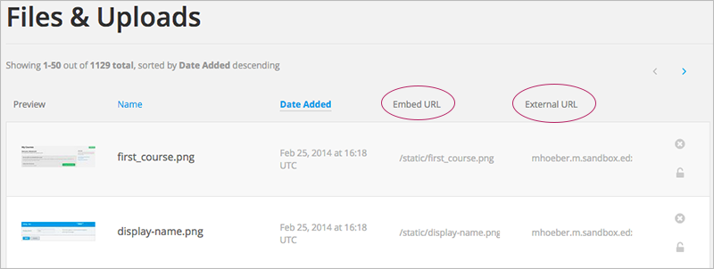
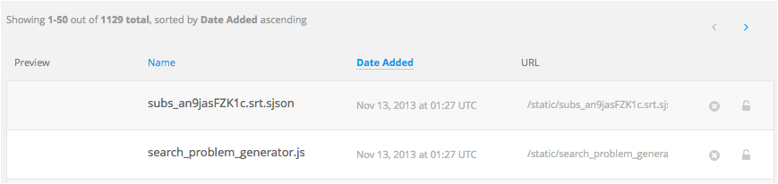

.. _Add Files to a Course:

###########################
Adding Files to a Course
###########################

*******************
Overview
*******************

To use images in your course content, or to use other documents such as a
syllabus, you must add the files to your course.

* :ref:`Add a File`
* :ref:`File URLs`
* :ref:`Sort Files`
* :ref:`Find Files`
* :ref:`Lock a File`
* :ref:`Delete a File`

.. _Add a File:

*******************
Add a File
*******************
 
You can add files that you want students to access in the course. After you add
a file, you must link to it from a component, a course update, or in the course
handouts. A file is only visible to students if you create a link to it.

Because the file name becomes part of the URL, students can see the name of the
file when they open it. Avoid using file names such as AnswerKey.pdf.

.. warning:: 
 For PDF and image files, edX recommends that you use standard compression tools to reduce the file size before adding them to your course.

 If you have files that are larger than 50 MB after compression and need them for your course, contact your edX Program Manager.

 Furthermore, do not add video or audio files, or large data sets that are to be used by students. You should use YouTube or another hosting service to host multimedia files for your course. For storing large data sets for student use, contact your edX Program Manager.
  

To add files:
 
#. From the **Content** menu, select **Files & Uploads**.
#. Click **Upload New File**.
#. In the **Upload New File** dialog box, click **Choose File**.
#. In the **Open** dialog box, select one more files that you want to upload,
   then click **Open**.

   .. note:: 
     If you upload a file with the same name as an existing course file
     the original file is overwritten without warning.

#. To add more file, click **Load Another File** and repeat the previous step.
#. To close the dialog box, click the **x** in the top right corner. 

When you close the dialog box, the new files appear on the **Files & Uploads**
page.

.. _File URLs:

*******************
File URLs
*******************

In the Files & Uploads page, each file has has an **Embed URL** and an
**External URL**:

     columns circled

* You use the **Embed URL** to link to the file or image from a component, a
  course update, or a course handout.

* You use the **External URL** to reference the file or image from outside of
  your course. The external URL does not work if you lock the file unless the
  person accessing the URL is enrolled in the course.

  .. warning:: You cannot use the External URL as the reference to a file or
   image from within your course.

You can double click a value in the **Embed URL** or **External URL** column to select the value, then copy it.

.. _Sort Files:

*******************
Sort Files
*******************

By default, files are sorted by the **Date Added** column, with the most
recently added first.

Alternatively, can also sort the list by the **Name** column by clicking on the
column header.

For either the the **Date Added** or **Name** column, you can switch the sort
order from descending to ascending, and back, by clicking the column header a
second time.

The current sort order is shown at the top of the file list, and the active sort
column header is underlined:

.. _Find Files:

*******************
Find Files
*******************

The **Files & Uploads** page lists up to 50 files.  If your course has more than
50 files, additional files are listed on other pages.

The range of the files listed on the page, and the total number of files, are
shown at the top of the page.

You can navigate through the pages listing files in two ways:

* Use the **<** and **>** buttons at the top and bottom of the list to navigate
  to the previous and next pages.

* At the bottom of the page, enter the page number to skip to, then tab out of
  the field:

  
  .. image:: ../Images/file_pagination.png
    :alt: Pagination in the Files & Uploads page

.. _Lock a File:
 
*******************
Lock a File
*******************

By default, anyone can access a file you upload if they know the URL, even
people not enrolled in your class.

To ensure that those not in your class cannot view the file, click the lock
icon.

.. note:: The external URL does not work if you lock the file.
 
.. _Delete a File:

*******************
Delete a File
*******************

To delete a file, click the **x** icon next to the file.  You are prompted to
confirm the deletion.

.. warning:: If you have links to a file you delete, those links will be broken.
 Ensure you change those links before deleting the file.
 