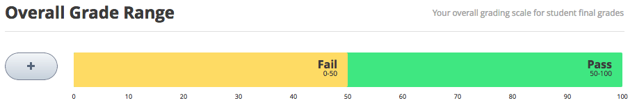

.. _Establish a Grading Policy:

##############################
Establishing a Grading Policy  
##############################

*******************
Overview
*******************

Establishing a grading policy takes several steps. You must:

#. :ref:`Set the Grade Range`
#. :ref:`Set the Grace Period`
#. :ref:`Configure the Assignment Types`
#. :ref:`Graded Subsections`
#. :ref:`The Student View of Grades`

.. _Set the Grade Range:

*******************
Set the Grade Range
*******************

You must set the grade range for the course.  For example, your course can be
pass/fail, or can have letter grades A through F.

To set the grade range, from the **Settings** menu, select **Grading**.

The control for the grade range is at the top of the Grading page.

The above example shows that you have a pass/fail grade range, with a score of
50 as the cutoff. This is the default setting used when you create a course.

You use the grade range control to change these settings:

* To add a grade in the range, click the **+** icon.

  A new grade is added to the range between the existing grades. For example, if
  you add a grade in the default setting, the grade range changes to **F** (0 to
  50), **B** (50 to 75), and **A** (75 to 100):

  .. image:: ../Images/grade_range_b.png
    :alt: Image of an altered Grade Range control

* To change the score range, hover the mouse over the line dividing two grades,
  click and drag the line left or right.

  You can see the range numbers of the two grades adjacent to the line change.
  Release the mouse button when the line is where you want it.
  
* To change the name of the grade, double-click the current name of the grade to
  select it, and then start typing the name of the new grade. For example, if
  the original name of the grade is "Pass", you can double-click "Pass" and then
  type "Excellent" to replace the name.

  You cannot change **F** or **Fail**. 

* To remove a grade, hover the mouse over the grade. 

  A **remove** link appears above the grade. Click the link.
  
  You cannot remove F or A.
  
After you make any changes to the grade range, you must click **Save Changes**
at the bottom of the page.

.. _Grade Ranges and Certificates:

==============================
Grade Ranges and Certificates
==============================

If you plan for your course to offer certificates, note that a student will
qualify for a certificate by earning any grade over the F, or Fail, threshold.
This is true regardless of how many grade levels you add in the grade range.

.. _Set the Grace Period:

*************************
Set the Grace Period 
*************************
    
You can set a grace period that extends homework due dates for your students. 

.. note:: The grace period applies to the whole course; you cannot set a grace
 period for individual assignments.
  
In the Grading page, under **Grading Rules & Policies**, enter a value in the
**Grace Period on Deadline** field. Enter the value in Hours:Minutes format.

.. _Configure the Assignment Types:

******************************
Configure the Assignment Types
******************************

You must create assignment types for your course and determine the weight of the
student's total grade for each assignment type.

For example, you may have:

* 10 homework assignments, worth a total of 50% of the grade; 
* A midterm exam, worth a total of 20% of the grade; 
* A final exam, worth 30% of the grade. 

By default, a new course you create has four assignment types: 

* Homework
* Lab
* Midterm Exam
* Final Exam

You can use these assignment types, modify or remove them, and create new
assignment types.

To create a new assignment type, in the bottom of the Grading page, click **New
Assignment Type**, then configure the fields described below.

==========================
Assignment Type Fields
==========================
You configure the following fields for each assignment type:
    
* **Assignment Type Name:** 
  
  The general category of the assignment. This name will be visible to students.
 
  .. note:: All assignments of a particular type count the same toward the
   weight of that category. As a result, a homework assignment that contains
   10 problems is worth the same percentage of a student's grade as a homework
   assignment that contains 20 problems.
  
  
* **Abbreviation:** 
  
  This is the short name that appears next to an assignment on a student's
  **Progress** tab.
      

* **Weight of Total Grade:** 
  
  The assignments of this type together account for the percent value set in
  **Weight of Total Grade**.
  
  The total weight of all assignment types must equal 100.
  
  .. note:: Do not include the percent sign (%) in this field.
  
  
  
* **Total Number:** 
  
  The number of assignments of this type that you plan to include in your
  course.
  
  
  
* **Number of Droppable**
  
  The number of assignments of this type that the grader will drop. The grader
  will drop the lowest-scored assignments first.

.. _Graded Subsections:

**********************************************
Graded Subsections
**********************************************

After you configure assignment types, as you are organizing your course, you
set the assignment type for subsections that contain problems that are to be
graded.

Each subsection that contains problems to be graded can include only one
assignment type. 

.. note:: 
 You can only set assignment types and due dates at the subsection level. You
 cannot set assignment types or due dates for entire sections or for individual
 units within subsections. Additionally, you can designate a subsection as one,
 and only one, of the assignment types you configured.
  
See :ref:`Developing Course Subsections` for general instructions on
configuring a subsection.

See :ref:`Set the Assignment Type and Due Date for a Subsection` for
instructions on designating a subsection as a graded assignment.

Within a graded subsection, you create problems of the type designated for that
subsection. You cannot not mix problems of different assignment types in the
same subsection.

For example, if you want to create a homework assignment and a lab for a
specific topic, create two subsections. Set one subsection as the Homework
assignment type and the other as the Lab assignment type. Both subsections can
contain other content as well as the actual homework or lab problems.

.. note:: 
 You can create problems in Studio without specifying that the subsection is an
 assignment type. However, such problems do not count toward a student's grade.

See :ref:`Working with Problem Components` for instructions on creating
problems.

.. _The Student View of Grades:

**************************
The Student View of Grades
**************************
Once a grading policy is in place, students can view both their problem scores
and the percent completed and current grade in the **Progress** tab for the
course.
  
  .. image:: ../Images/Progress_tab.png
    :alt: Image of the student Progress tab

Each item in the X axis of the chart is for a graded subsection. Graded problems
in units are not broken out in the chart; the score from each problem in the
subsection is added to that vertical bar.

Graded subsections are grouped in the chart by assignment type rather than
listed in chronological order. For example, all homework exercises are grouped
together, followed by labs, then exams.

.. note:: The **x** for an assignment in the Progress tab indicates that the
 assignment grade is currently dropped. You configure how many assignments are
 dropped when you :ref:`Configure the Assignment Types`.