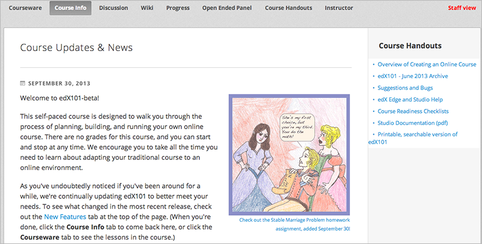

.. _Adding Course Updates and Handouts:

######################################################
Adding Course Updates and Handouts
######################################################

You add course updates and handouts in Studio.

Student's see the course updates and handouts in the **Course Info** tab in your
course:

.. _Add a Course Update:

**********************
Add a Course Update
**********************

You add updates to notify students of exams, changes in the course schedule, or
anything else of a more urgent nature.

To add a course update:

#. From the **Content** menu, select **Updates**. 
#. Click **New Update**.
#. Enter your update in the HTML editor that opens.

  .. note::  You must enter the update in HTML. 

4. Click **Save**.

.. _Add Course Handouts:

**********************
Add Course Handouts
**********************
You can add course handouts that are visible to students on the **Course Info**
page. To add an uploaded file to the course handouts, you will need its URL.

.. note::  You must :ref:`Add Files to a Course` before you can add them as
 course handouts.

#. From the **Content** menu, select **Updates**. 
#. In the **Course Handouts** panel, click **Edit**.
#. Edit the HTML to add links to the files you uploaded. See :ref:`Add a Link in
   an HTML Component` for more information.
#. Click **Save**.

