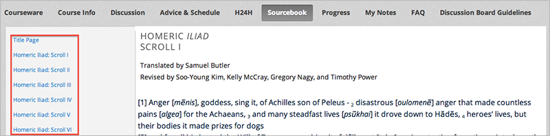

.. _Adding Textbooks:

###########################
Adding Textbooks
###########################

You can add PDF textbooks for your course.  

.. note::  Do not use image files (for example, .PNG files) as textbooks for
 your course, as they are not accessible to screen readers. Review the
 :ref:`Best Practices for Accessible PDFs` for more information.

Each textbook that you add is displayed to students as a tab in the course
navigation bar.

It's recommended that you upload a separate PDF file for each chapter of your
textbook.

When students open the textbook tab in the course, they can navigate the
textbook by chapter:

To add a textbook:

#. From the **Content** menu, select **Textbooks**.
#. Click **New Textbook**. The following screen opens:

  .. image:: ../Images/textbook_new.png
   :alt: Image of the New Textbook page.

3. Enter the **Textbook Name**.
#. Enter the first **Chapter Name**.
#. To upload a PDF file from your computer, click **Upload PDF**.  Follow the
   prompts to upload your file.
#. To add more chapters, click **+Add a Chapter** and repeat steps 3 and 4.
#. Click **Save**.