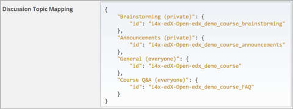

.. _Enabling and Configuring Cohorts:

############################################
Enabling and Configuring the Cohort Feature
############################################

To support discussions that are divided by cohort, you select a strategy
for assigning your students to cohort groups: automated assignment, manual
assignment, or a hybrid approach. See :ref:`Options for Assigning Students to
Cohorts`. You also decide whether to change any of the course-wide discussion
topics so that they are divided by cohort instead of unified for all students. 

After you select a strategy, you complete these configuration steps (as
applicable):

#. :ref:`Enable the cohort feature<Enable Cohorts>`.

#. Based on the strategy you select for assigning students to cohort groups:
   
  * :ref:`Define the auto cohort groups<Define Auto Cohort Groups>`.

  * :ref:`Define the manual cohort groups<Define the Manual Cohort Groups>` and
    then :ref:`assign students<Assign Students to Cohort Groups
    Manually>` to them.

  * Do both. 

3. Identify the :ref:`course-wide discussion topics<Identifying Private
   CourseWide Discussion Topics>` that you want to be divided by cohort. This
   procedure is optional.

You complete these procedures in Studio and on the Instructor Dashboard. For an
optimal student experience, configuration of the cohort feature should be as
complete as possible prior to the start date of your course. 

.. If you need to make changes to the way you have configured the cohort feature while your course is running, please see :ref:`%%`.

.. _Enable Cohorts:

********************************
Enabling the Cohort Feature
********************************

#. Open the course in Studio. 

#. Select **Settings**, then **Advanced Settings**.

#. In the **Cohort Configuration** field, place your cursor between the
   supplied pair of braces.

#. Type ``"cohorted": true``. 

#. Click **Save Changes**. Studio reformats the name:value pair you just
   entered to indent it on a new line.
   
 .. image:: ../Images/Enable_cohorts.png
  :alt: Cohort Configuration dictionary field with the cohorted key defined 
        as true

You can then :ref:`implement the automated assignment strategy<Implementing the
Automated Assignment Strategy>`, :ref:`implement the manual assignment
strategy<Implementing the Manual Assignment Strategy>`, or both.

.. _Implementing the Automated Assignment Strategy:

***************************************************
Implementing the Automated Assignment Strategy
***************************************************

To implement automated assignment of students to cohort groups you define the
auto cohort groups in the **Cohort Configuration** advanced setting field.

You complete this procedure if you are using either the automated or hybrid
assignment strategy for your course. For more information, see :ref:`All
Automated Assignment` or :ref:`Hybrid Assignment`.

.. _Define Auto Cohort Groups:

============================================
Define the Auto Cohort Groups
============================================

.. note:: Students can see the name of the cohort group they are assigned to. 
 The message "This post is visible only to {cohort name}" appears with each
 post in discussion topics that are divided by cohort. See :ref:`Read the
 Cohort Indicator in Posts`.

.. note: You cannot delete cohort groups or change their names. If you need to make changes to the way you have configured the cohort feature while your course is running, please see :ref:`%%`.

#. Open the course in Studio. 

#. Select **Settings**, then **Advanced Settings**.

#. In the **Cohort Configuration** field, place your cursor after the opening
   brace character (``{``) and press Enter.

#. On the new line, you define the ``"auto_cohort_groups":`` policy key,
   followed by one or more cohort group names enclosed by square brackets (``[
   ]``). You can define a set of auto cohort groups or just one.

   To define a set of groups, you type each group name on a new line, enclose
   it within quotation marks (``" "``), and separate the quoted name values
   with commas. For example:
   
 .. code:: 

   "auto_cohort_groups": [
       "Example Group Name A",
       "Example Group Name B",
       "Example Group Name C"
   ]
   
.. comment is here only to allow indented formatting of next line

  You can also define only a single auto cohort group. Type
   ``"auto_cohort_groups": ["Example Group Name"]`` and then press Enter again.

5. Type a comma after the closing square bracket character (``],``). You must
   include a comma to separate each of the policy keys that you define.
   
#. Click **Save Changes**. Studio resequences and reformats your entry. Scroll
   back to the **Cohort Configuration** field to verify that your entry was
   saved as you expect. Entries that do not contain all of the required
   punctuation characters revert to the previous value when you save, and no
   warning is presented.

 .. image:: ../Images/Multiple_auto_cohort_groups.png
  :alt: Cohort Configuration dictionary field with the auto_cohort_groups key 
        with three values

.. spacer line

 .. image:: ../Images/Single_auto_cohort_group.png
  :alt: Cohort Configuration dictionary field with the auto_cohort_groups key 
        with one value

Any student who is not already assigned to a cohort group will be randomly
assigned to one of the auto cohort groups when she visits any of the course
discussion topics.

For a report that includes the cohort group assignment for every enrolled
student, review the student profile information for your course. See
:ref:`View and download student data`.

.. _Implementing the Manual Assignment Strategy:

***************************************************
Implementing the Manual Assignment Strategy
***************************************************

To implement manual assignment of students to cohort groups, you define the
manual cohort groups and then assign students to them. 

You complete these procedures if you are using either the manual or hybrid
assignment strategy for your course. For more information, see :ref:`All Manual
Assignment` or :ref:`Hybrid Assignment`.

You must :ref:`enable the cohort feature<Enable Cohorts>` for your course
before you can complete these procedures.

.. note: You cannot delete cohort groups or change their names. If you need to make changes to the way you have configured the cohort feature while your course is running, please see :ref:`%%`.

.. _Define the Manual Cohort Groups:

==========================================
Define the Manual Cohort Groups
==========================================

.. note:: Students can see the name of the cohort group they are assigned to. 
 The message "This post is visible only to {cohort name}" appears with each
 post in discussion topics that are divided by cohort. See :ref:`Read the
 Cohort Indicator in Posts`.

#. View the live version of your course. For example, in Studio click **View
   Live**.

#. Click **Instructor**, then click **Membership**. 

#. Scroll to the **Cohort Management** section at the bottom.

#. Click **Add Cohort Group**.

#. Supply a name for the group, and then click **Save** below the **New Cohort
   Name** field.

.. _Assign Students to Cohort Groups Manually:

==========================================
Assign Students to Cohort Groups Manually
==========================================

.. note:: Manual assignments should be as complete as possible before your 
 course starts. If student enrollment continues after your course starts, you
 should continue to assign new students to cohort groups. To review the cohort
 group assignments of every enrolled student, generate the student profile
 information report for your course. See :ref:`View and download student data`.

#. View the live version of your course. For example, in Studio click **View
   Live**.

#. Click **Instructor**, then click **Membership**. 

#. Scroll to the **Cohort Management** section at the bottom.

#. Select a cohort group from the drop down list.

#. In the **Add students** field, enter the username or email address of a
   single student, or enter multiple names or addresses separated by commas or
   new lines. You can copy data from a CSV file of email addresses and paste it
   into this field.

#. Click **Add Students**. The students are assigned to the selected manual
   cohort group. A message appears to indicate the number of students who were
   added to the cohort group. Because students can belong to only one cohort
   group, the message also indicates the number of students whose assignment to
   another cohort group was changed by this procedure.

.. _Identifying Private CourseWide Discussion Topics:

*****************************************************************
Configuring Course-Wide Discussion Topics To Be Divided
*****************************************************************

When you enable the cohort feature for a course, all of the course-wide
discussion topics provide unified access to posts for all students. You can
configure one or more of the course-wide topics to be divided by cohort
instead.

.. note:: The content-specific discussion topics in the course, which are 
 added to units as discussion components, are always divided by cohort.

For more information about content-specific and course-wide discussion topics,
see :ref:`Organizing_discussions`.

Before you configure course-wide discussion topics to be divided by cohort, you
add the topics in Studio. See :ref:`Create CourseWide Discussion Topics`. In
the example given for creating course-wide discussion topics, a single topic,
Course Q&A, is added to the system-supplied General topic. The steps in the
following procedure expand on that example: you have now decided to enable the
cohort feature for your course. The posts that you intend to make to the Course
Q&A and General topics, and the subjects you expect students to explore there,
are appropriate for a unified student audience. However, you also want to give
students some course-wide topics that are divided by cohort. You define two
more course-wide discussion topics, Announcements and Brainstorming.

You also decide to apply a naming convention so that students will know 
the audience for their posts before they add them. See :ref:`Apply Naming
Conventions to Discussion Topics`. 

       defined

.. _Configure CourseWide Discussion Topics as Private:

======================================================
Identify Divided Course-Wide Discussion Topics
======================================================

In the steps that follow, you configure two topics so that they are divided
by cohort. On the Studio **Advanced Settings** page, the two topics appear as follows in the **Discussion Topic Mapping** field:

.. code::

      "Brainstorming (private)": {
          "id": "i4x-edX-Open-edx_demo_course_brainstorming"
      },
      "Announcements (private)": {
          "id": "i4x-edX-Open-edx_demo_course_announcements"
      }

#. Open the course in Studio. 

#. Select **Settings**, then **Advanced Settings**.

#. In the **Cohort Configuration** field, place your cursor after the opening
   brace character (``{``) and press Enter.

#. On the new line, you define the ``"cohorted_discussions":`` policy key,
   followed by one or more course-wide discussion topic IDs enclosed by
   square brackets (``[ ]``). You can define a set of discussion topics or just
   one.

   To define a set of topics, you type the value of the "id" for each
   discussion topic on a new line, enclose it within quotation marks (``" "``),
   and separate the quoted "id" values with commas. For example:

 .. code:: 

   "cohorted_discussions": [
       "i4x-edX-Open-edx_demo_course_announcements",
       "i4x-edX-Open-edx_demo_course_brainstorming"
   ]
   
.. this comment is here only to force allow indented formatting of next line

  To specify a single discussion topic, type ``"cohorted_discussions": ["i4x-
  test_doc-SB101-course-2014_Jan_announcements"]`` and then press Enter again.
   
5. Type a comma after the closing square bracket character (``],``). You must
   include a comma to separate each of the policy keys that you define.
   
#. Click **Save Changes**. Studio resequences and reformats your entry. Scroll
   back to the **Cohort Configuration** field to verify that your entry was
   saved as you expect. Entries that do not contain all of the required
   punctuation characters revert to the previous value when you save, and no
   warning is presented.

 .. image:: ../Images/Configure_cohort_topic.png
  :alt: Cohort Configuration dictionary field with the cohorted_discussions key
        defined
