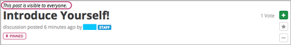
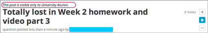
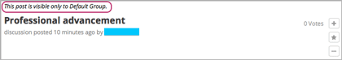
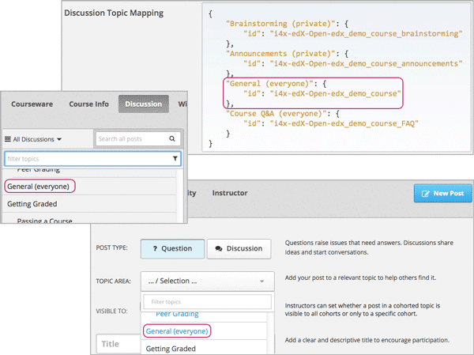
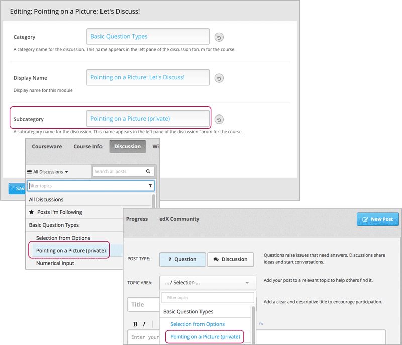

.. _Moderating Discussions for Cohorts:

##########################################################
Managing Discussions in a Course with Student Cohorts
##########################################################

The experience that students have in the course discussions is different in
courses that do, and do not, enable the cohort feature. Additional features are
also available to the staff members and community TAs who moderate the course
discussions. This section describes how students and staff can :ref:`find out
who can read a post<Finding Out Who Can See a Post>`.

.. to come in a separate PR: a better introduction, info on how a moderator can post into one cohort or all cohorts, how students see posts in a course with cohorts, more

.. _Finding Out Who Can See a Post:

********************************
Finding Out Who Can Read a Post
********************************

In a course with the cohort feature enabled, all posts include a cohort
indicator above the title. This indicator appears after a student or staff
member adds each post. Other than choosing the cohort group names carefully
when you add them, no configuration is necessary to include this identifier.
You can share the information in the :ref:`Read the Cohort Indicator in Posts`
section with your students.

For students to see who will be able to read their posts before they add them,
you can name the discussion topics so that they identify who will be able to
see posts. See :ref:`Apply Naming Conventions to Discussion Topics`.

.. _Read the Cohort Indicator in Posts:

==================================
Read the Cohort Indicator in Posts
==================================

Every post includes a sentence that identifies whether everyone can see and
contribute to it, or only the members of a cohort within the course.

       the title

       above the title

       above the title

You see this identifier after you add your post. The responses and comments
that others add to a post are visible to the same group of people as the
post itself.

.. _Apply Naming Conventions to Discussion Topics:

=========================================================
Apply Naming Conventions to Discussion Topics
=========================================================

All of the content-specific discussion topics that you add to units in Studio
are divided by cohort. However, course-wide topics can either be divided by
cohort or remain unified (all students can read and react to all posts).

Optionally, you can use a naming convention for your discussion topics to give
your students the audience context of their posts *before* they add them.
Applying a naming convention can be useful if the students in your cohort
groups are particularly sensitive about the privacy of their conversations.

For example, you can use a naming convention such as "everyone" for unified
course-wide discussion topics to distinguish them from topics that are divided
by cohort. (You may only find it necessary to identify topics that offer a
unified, public audience for all posts in this way. However, in this
illustration, each topic has been given an identifier of either "everyone" or
"private".)

       dropdown list of discussion topics in the live course

When students visit the **Discussion** page and use dropdown lists to select
one of the course-wide topics, the topic names indicate who can see the posts,
responses, and comments.

For more information about adding and configuring course-wide discussion
topics, see :ref:`Organizing_discussions` or :ref:`Identifying Private
CourseWide Discussion Topics`.

If desired, you could also apply a naming convention to the content-specific
discussion topics that you add as Discussion components in Studio. For example,
you could include an identifier like "(private)" or "(small group)" in the
**Subcategory** name of every Discussion component that you add.

       Studio appears on the dropdown lists of discussion topics in the live
       course
