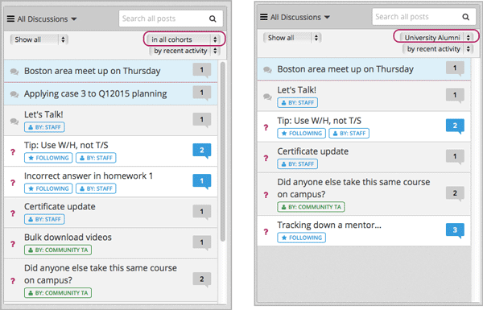

.. _Moderating Discussions for Cohorts:

##########################################################
Managing Discussions in a Course with Student Cohorts
##########################################################

In a course that has the cohort feature enabled, every post has an indicator of
who can read it: either everyone, or only the members of a single cohort group.
For students, this is the only noticeable difference between discussions in
courses that include cohorts when compared to courses that don't. You can share
the examples in the :ref:`Read the Cohort Indicator in Posts` section with your
students, along with the :ref:`Discussions for Students and Staff` section of
this guide.

Staff members who have the discussion admin, discussion moderator, or community
TA role see the same indicator of who can read each post. Unlike the students,
however, the discussion staff members can read and contribute to every post,
regardless of the cohort group assignment of the student who posted it.

.. note:: Students who have the Community TA role can read and 
 contribute to all posts.

In courses that enable the cohort feature, members of the discussion staff can
also:

* Choose who will be able to see the posts that they add to divided topics. See
  :ref:`Choosing the Visibility of a Post`.

* Filter the posts that are listed on the **Discussion** page by cohort group.
  See :ref:`Viewing the Posts of a Cohort Group`.
  
All of the other options and features described in the :ref:`Discussions`
section continue to be available to the discussion staff.

.. _Finding Out Who Can See a Post:

********************************
Identifying Who Can Read a Post
********************************

In a course that includes cohorts, all posts include a cohort indicator above
the title. This indicator appears after any student or staff member adds a
post. Other than naming the cohort groups carefully when you add them, no
configuration is necessary to include this identifier.

Optionally, you can name your discussion topics to show students who will be
able to view their posts. See :ref:`Apply Naming Conventions to Discussion
Topics`.

.. _Read the Cohort Indicator in Posts:

==================================
Read the Cohort Indicator in Posts
==================================

Every post includes a sentence that identifies whether everyone can see and
contribute to it, or only the members of a cohort in the course. Examples
follow.

.. image:: ../Images/post_visible_all.png
 :alt: A discussion topic post with "This post is visible to everyone" above 
       the title

.. image:: ../Images/post_visible_cohort.png
 :alt: A discussion topic post with "This post is visible to" and a cohort name
       above the title

You see this identifier after you add your post. All of the responses and
comments that other contributors add to a post are visible to the same group of
people as the post itself.

.. _Apply Naming Conventions to Discussion Topics:

=========================================================
Apply Naming Conventions to Discussion Topics
=========================================================

Optionally, course team members can give students the audience context of their
posts before they add them. Indicating who will be able to read posts in the
names of the topics themselves can be useful when a cohort is particularly
sensitive about the privacy of their conversations.

For example, you add "(everyone)" to the names of the unified course-wide
discussion topics in your course.

.. image:: ../Images/discussion_category_names.png
 :alt: The names you supply for course-wide topics in Studio appear on the 
       dropdown list of discussion topics in the live course

When students visit the **Discussion** page and use dropdown lists to select a
course-wide topic, the topic names indicate who can see the posts, responses,
and comments.

(In the illustration above, every topic name includes either "(everyone)" or
"(private)". You may only find it necessary to explicitly identify topics that
have a unified audience for all posts.)

For more information about adding and configuring course-wide discussion
topics, see :ref:`Organizing_discussions` or :ref:`Identifying Private
CourseWide Discussion Topics`.

If desired, you could also apply a naming convention to the content-specific
discussion topics that you add as Discussion components in Studio. For example,
you could include an identifier like "(private)" or "(small group)" in the
**Subcategory** name of every Discussion component that you add.

.. image:: ../Images/discussion_topic_names.png
 :alt: The Subcategory name that you supply for a Discussion component in
       Studio appears on the dropdown lists of discussion topics in the live
       course

.. _Choosing the Visibility of a Post:

***************************************
Choosing the Visibility of a Post
***************************************

If you have the discussion admin, discussion moderator, or community TA role,
you can make posts to divided discussion topics visible to everyone who is
enrolled in the course or to the members of a selected cohort group only. When
you :ref:`add a post<Add a Post>`, the **Visible to** dropdown list appears
above the **Title** field.

This example shows a new post being added to a content-specific
discussion topic.

.. image:: ../Images/visible_to_contentspecific.png
 :alt: The fields and controls that appear when a staff member clicks 
       New Post for a content-specific topic

As a discussion staff member, you can choose the visibility of your posts in
topics that are divided by cohort. This means that you can add a single post
with information that you want everyone to see, rather than having to write a
separate post for each cohort group. It also means that it is possible for you
to unintentionally share information with a different audience than you
intended.

.. note:: Students do not choose the visibility of their posts. The 
 visibility of student posts is determined by the configuration of the topic
 they post in. See :ref:`Options for Discussion Topics`.

Posts that discussion staff members add to unified discussion topics are always
visible to all students, regardless of cohort assignment.

.. _Considerations When Editing Posts:

===================================
Considerations When Editing Posts
===================================

It may be helpful to keep these additional considerations in mind when you edit
posts in a course that includes cohorts.

* You cannot change the visibility of a post after it has been added. If you
  notice that a post contains information that is not appropriate for the
  cohort who can read it, edit the content of the post or delete the post.

* If you change the topic that a post appears in, the visibility of the post
  and its responses and comments **does not change**. This ensures that
  students who are following the post, or who have contributed responses or
  comments to it, will still be able to read it.

* All of the responses and comments that are contributed to a post will be
  visible to the same group of people as the post itself. You cannot change the
  visibility of individual responses or comments.

.. _Viewing the Posts of a Cohort Group:

************************************
Viewing the Posts of a Cohort Group
************************************

When a course includes student cohorts, you can view posts and monitor
discussion activity for one cohort group at a time. You can also view all
posts.

Above the list of posts on the **Discussion** page, the **in all cohorts**
filter is selected by default. You see every post when you make this selection,
as shown in the illustration on the left. To limit the list so that you can
view the same set of posts as the members of a cohort group, select the name
of that group as shown on the right.

  showing only posts that members of the Univeristy Alumni cohort group can see

Note that both of these lists include posts that are visible to
everyone. When you filter the list by cohort group, you see the same, complete
set of posts that the members of the cohort see.

For other options that you can use to view posts, see :ref:`Find Posts`.
