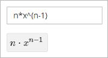
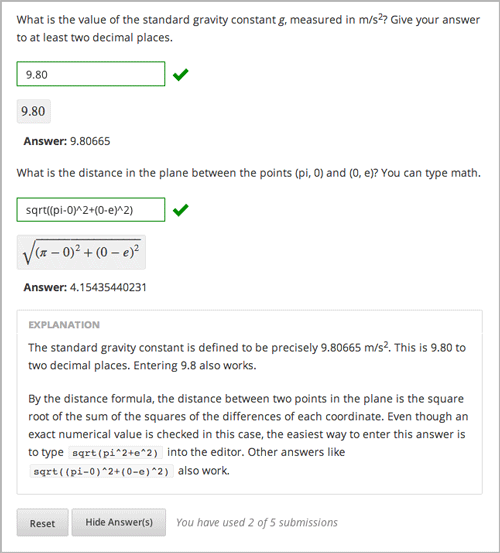
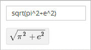
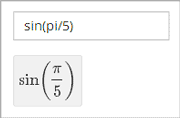
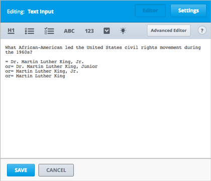

.. _Common Problems:

############################
Common Problems
############################

*Common problems* are typical problems such as multiple choice problems
and other problems whose answers are simple for students to select or
enter. You can create all of these problems using the Simple Editor in
Studio. You don't have to use XML or switch to the Advanced Editor.

The following are the common problem types in Studio:

-  :ref:`Checkbox` In checkbox problems, students select one or more options
   from a list of possible answers.
-  :ref:`Dropdown` In dropdown problems, students select one answer from a
   dropdown list.
-  :ref:`Multiple Choice` Multiple choice problems require students to
   select one answer from a list of choices that appear directly below
   the question.
-  :ref:`Numerical Input` Numerical input problems require answers that
   include only integers, fractions, and a few common constants and
   operators.
-  :ref:`Text Input` In text input problems, students enter a short text
   answer to a question.

These problems are easy to access in Studio. To create them, click
**Problem** under **Add New Component**, click the **Common Problem
Types** tab, and then click the name of the problem. (Note that
**Checkbox** doesn't appear in the list of common problem types. To
create a checkbox problem, you'll click **Blank Common Problem**.)

.. note:: All problems must include labels for accessibility. The label generally includes the text of the main question in your problem. To add a label for a common problem, surround the text of the label with angle brackets pointed toward the text (>>*label text*<<).

.. _Checkbox:

*******************
Checkbox
*******************

In checkbox problems, the student selects one or more options from a
list of possible answers. The student must select all the options that
apply to answer the problem correctly. Each checkbox problem must have
at least one correct answer.

.. image:: Images/CheckboxExample.gif
 :alt: Image of a checkbox problem

==========================
Create a Checkbox Problem
==========================

#. Under **Add New Component**, click **Problem**.
#. In the **Select Problem Component Type** screen, click **Checkboxes** on the **Common Problem Types** tab.
#. In the Problem component that appears, click **Edit**.
#. In the component editor, replace the default text with the text of your 
   problem. Enter each answer option on its own line.
#. Determine the text of the problem to use as a label, and then surround that text with two sets of angle brackets (>><<).
#. Select all the answer options, and then click the checkbox button. 

   .. image:: Images/ProbComponent_CheckboxIcon.gif
    :alt: Image of the checkbox button
   
   When you do this, brackets appear next to each answer choice.

#. Add an **x** between the brackets for the correct answer or answers.
#. In the component editor, select the text of the explanation, and then click the 
   explanation button to add explanation tags around the text.

   .. image:: Images/ProbCompButton_Explanation.gif
    :alt: Image of the explanation button

#. On the **Settings** tab, specify the settings that you want. 
#. Click **Save**.

For the example problem above, the text in the Problem component is the
following.

.. code-block:: xml

    Learning about the benefits of preventative healthcare can be particularly 
    difficult. >>Check all of the reasons below why this may be the case.<<

    [x] A large amount of time passes between undertaking a preventative measure 
    and seeing the result. 
    [ ] Non-immunized people will always fall sick. 
    [x] If others are immunized, fewer people will fall sick regardless of a 
    particular individual's choice to get immunized or not. 
    [x] Trust in healthcare professionals and government officials is fragile. 

    [explanation]
    People who are not immunized against a disease may still not fall sick from 
    the disease. If someone is trying to learn whether or not preventative measures 
    against the disease have any impact, he or she may see these people and conclude, 
    since they have remained healthy despite not being immunized, that immunizations 
    have no effect. Consequently, he or she would tend to believe that immunization 
    (or other preventative measures) have fewer benefits than they actually do.
    [explanation]

==========================
Checkbox Problem XML
==========================

.. code-block:: xml

  <problem>
  <startouttext/>
    
Learning about the benefits of preventative healthcare can be particularly
     difficult. Check all of the reasons below why this may be the case.

  <choiceresponse>
    <checkboxgroup direction="vertical" label="Check all of the reasons below why this may be the case">
      <choice correct="true"><text>A large amount of time passes between undertaking
      a preventative measure and seeing the result.</text></choice>
      <choice correct="false"><text>Non-immunized people will always fall sick.</text>
      </choice>
      <choice correct="true"><text>If others are immunized, fewer people will fall 
      sick regardless of a particular individual's choice to get immunized or not.
      </text></choice>
      <choice correct="true"><text>Trust in healthcare professionals and government 
      officials is fragile.</text></choice>
    </checkboxgroup>

   <solution>
   

   
Explanation

   
People who are not immunized against a disease may still not fall sick from the 
   disease. If someone is trying to learn whether or not preventative measures 
   against the disease have any impact, he or she may see these people and conclude, 
   since they have remained healthy despite not being immunized, that immunizations 
   have no effect. Consequently, he or she would tend to believe that immunization 
   (or other preventative measures) have fewer benefits than they actually do.

   

   </solution>
  </choiceresponse>
  </problem>

=============================
Checkbox Problem XML Template
=============================

.. code-block:: xml

  <problem>
  <startouttext/>
    
Question text

  <choiceresponse>

  <checkboxgroup direction="vertical" label="label text">
  <choice correct="false"><text>Answer option 1 (incorrect)</text></choice>
  <choice correct="true"><text>Answer option 2 (correct)</text></choice>
  </checkboxgroup>

   <solution>
   

   
Solution or Explanation Heading

   
Solution or explanation text

   

   </solution>

  </choiceresponse>
  </problem>

.. _Dropdown:

*******************
Dropdown
*******************

Dropdown problems allow the student to choose from a collection of
answer options, presented as a dropdown list. Unlike multiple choice
problems, whose answers are always visible directly below the question,
dropdown problems don't show answer choices until the student clicks
the dropdown arrow.

.. image:: Images/DropdownExample.gif
 :alt: Image of a dropdown problem

==========================
Create a Dropdown Problem
==========================

To create a dropdown problem, follow these steps.

#. Under **Add New Component**, click **Problem**.
#. In the **Select Problem Component Type** screen, click
   **Dropdown** on the **Common Problem Types** tab.
#. In the new Problem component that appears, click **Edit**.
#. Replace the default text with the text for your problem. Enter each of the possible 
   answers on the same line, separated by commas.
#. Determine the text of the problem to use as a label, and then surround that text with two sets of angle brackets (>><<).
#. Select all the answer options, and then click the dropdown button. 
      
   .. image:: Images/ProbCompButton_Dropdown.gif
    :alt: Image of the dropdown button
      
   When you do this, a double set of brackets ([[ ]]) appears and surrounds the 
   answer options.
      
#. Inside the brackets, surround the correct answer with parentheses.
#. In the component editor, select the text of the explanation, and then click the 
   explanation button to add explanation tags around the text.

   .. image:: Images/ProbCompButton_Explanation.gif
    :alt: Image of the explanation button

#. On the **Settings** tab, specify the settings that you want. 
#. Click **Save**.

For the example problem above, the text in the Problem component is the
following.

::

    >>What type of data are the following?<<

    Age:
    [[Nominal, Discrete, (Continuous)]]
    Age, rounded to the nearest year:
    [[Nominal, (Discrete), Continuous]]
    Life stage - infant, child, and adult:
    [[(Nominal), Discrete, Continuous]]

==========================
Dropdown Problem XML
==========================

**Problem Code:**

.. code-block:: xml

  <problem>
  

    <em>This exercise first appeared in HarvardX's PH207x Health in Numbers: Quantitative Methods in Clinical &amp; Public Health Research course, fall 2012.</em>
  

  
What type of data are the following?

  
Age:

  <optionresponse>
    <optioninput options="('Nominal','Discrete','Continuous')" correct="Continuous" label="Age"/>
  </optionresponse>
  
Age, rounded to the nearest year:

  <optionresponse>
    <optioninput options="('Nominal','Discrete','Continuous')" correct="Discrete" label="Age, rounded to the nearest year"/>
  </optionresponse>
  
Life stage - infant, child, and adult:

  <optionresponse>
    <optioninput options="('Nominal','Discrete','Continuous')" correct="Nominal" label="Life stage"/>
  </optionresponse>
  </problem>

**Template**

.. code-block:: xml

  <problem>
  

    Problem text

  <optionresponse>
    <optioninput options="('Option 1','Option 2','Option 3')" correct="Option 2" label="label text"/>
  </optionresponse>
    <solution>
      

      
Explanation or Solution Header

      
Explanation or solution text

      

    </solution>
  </problem>

.. code-block:: xml

  <problem>
   
Problem text

    <optionresponse>
     options="('A','B')"
      correct="A"/>
      label="label text"
    </optionresponse>
   
    <solution>
      

      
Explanation or Solution Header

      
Explanation or solution text

      

    </solution>
  </problem>

.. _Multiple Choice:

*******************
Multiple Choice
*******************

In multiple choice problems, students select one option from a list of
answer options. Unlike with dropdown problems, whose answer choices
don't appear until the student clicks the drop-down arrow, answer
choices for multiple choice problems are always visible directly below
the question.

.. image:: Images/MultipleChoiceExample.gif
 :alt: Image of a multiple choice problem

==================================
Create a Multiple Choice Problem
==================================

#. Under **Add New Component**, click **Problem**.
#. In the **Select Problem Component Type** screen, click **Multiple
   Choice** on the **Common Problem Types** tab.
#. When the new Problem component appears, click **Edit**.
#. In the component editor, replace the sample problem text with the text of your 
   problem. Enter each answer option on its own line.
#. Determine the text of the problem to use as a label, and then surround that text with two sets of angle brackets (>><<).
#. Select all the answer options, and then click the multiple choice button. 
   
   .. image:: Images/ProbCompButton_MultChoice.gif
    :alt: Image of the multiple choice button
   
   When you do this, the component editor adds a pair of parentheses next to each 
   possible answer.
   
#. Add an "x" between the parentheses next to the correct answer.
   
#. In the component editor, select the text of the explanation, and then click the 
   explanation button to add explanation tags around the text.

   .. image:: Images/ProbCompButton_Explanation.gif
    :alt: Image of the explanation button

#. On the **Settings** tab, specify the settings that you want. 
#. Click **Save**.

For the example problem above, the text in the Problem component is the
following.

::

    >>Lateral inhibition, as was first discovered in the horsehoe crab:<<

    ( ) is a property of touch sensation, referring to the ability of crabs to 
    detect nearby predators.
    ( ) is a property of hearing, referring to the ability of crabs to detect 
    low frequency noises.
    (x) is a property of vision, referring to the ability of crabs eyes to 
    enhance contrasts.
    ( ) has to do with the ability of crabs to use sonar to detect fellow horseshoe 
    crabs nearby.
    ( ) has to do with a weighting system in the crabs skeleton that allows it to 
    balance in turbulent water.

    [Explanation]
    Horseshoe crabs were essential to the discovery of lateral inhibition, a property of 
    vision present in horseshoe crabs as well as humans, that enables enhancement of 
    contrast at edges of objects as was demonstrated in class. In 1967, Haldan Hartline 
    received the Nobel prize for his research on vision and in particular his research 
    investigating lateral inhibition using horseshoe crabs.
    [Explanation]

**Problem Code:**

.. code-block:: xml

  <problem>
  
Lateral inhibition, as was first discovered in the horsehoe crab...

  <multiplechoiceresponse>
    <choicegroup type="MultipleChoice" label="Lateral inhibition, as was first discovered in the horsehoe crab">
      <choice correct="false">is a property of touch sensation, referring to the ability of crabs to detect nearby predators.</choice>
      <choice correct="false">is a property of hearing, referring to the ability of crabs to detect low frequency noises.</choice>
      <choice correct="false">is a property of vision, referring to the ability of crabs eyes to enhance contrasts.</choice>
      <choice correct="true">has to do with the ability of crabs to use sonar to detect fellow horseshoe crabs nearby.</choice>
      <choice correct="false">has to do with a weighting system in the crabs skeleton that allows it to balance in turbulent water.</choice>
    </choicegroup>
  </multiplechoiceresponse>
  <solution>
    

      
Explanation

      
Horseshoe crabs were essential to the discovery of lateral inhibition, a property of vision present in horseshoe crabs as well as humans, that enables enhancement of contrast at edges of objects as was demonstrated in class. In 1967, Haldan Hartline received the Nobel prize for his research on vision and in particular his research investigating lateral inhibition using horseshoe crabs.

    

  </solution>
  </problem>

**Template**

.. code-block:: xml

  <problem>
  
Question text

  <multiplechoiceresponse>
    <choicegroup type="MultipleChoice" label="label text">
      <choice correct="false" name="a">Incorrect choice</choice>
      <choice correct="true" name="b">Correct choice</choice>
    </choicegroup>
  </multiplechoiceresponse>

  <solution>
    

    
Explanation or solution header

    
Explanation or solution text

    

  </solution>
  </problem>

.. _Numerical Input:

*******************
Numerical Input
*******************

In numerical input problems, students enter numbers or specific and
relatively simple mathematical expressions to answer a question. 

.. image:: Images/NumericalInputExample.gif
 :alt: Image of a simple numerical input problem

Note that students' responses don't have to be exact for these problems. You can 
specify a margin of error, or tolerance. For more information, see the instructions below.

Responses for numerical input problems can include integers, fractions,
and constants such as *pi* and *g*. Responses can also include text
representing common functions, such as square root (sqrt) and log base 2
(log2), as well as trigonometric functions and their inverses, such as
sine (sin) and arcsine (arcsin). For these functions, Studio changes the
text that the student enters into mathematical symbols. The following
example shows the way Studio renders students' text responses in
numerical input problems. To see more examples, scroll down to **Examples**.

==================
Student Answers
==================

.. _Math Expression Syntax:

Math Expression Syntax
----------------------

In numerical input problems, the student's input may be more complicated than a
simple number. Expressions like ``sqrt(3)`` and even ``1+e^(sin(pi/2)+2*i)``
are valid, and evaluate to 1.73 and -0.13 + 2.47i, respectively.

A summary of the syntax follows:

Numbers
~~~~~~~

Accepted number types:

- Integers: '2520'
- Normal floats: '3.14'
- With no integer part: '.98'
- Scientific notation: '1.2e-2' (=0.012)
- More s.n.: '-4.4e+5' = '-4.4e5' (=-440,000)
- Appending SI suffixes: '2.25k' (=2,250). The full list:

  ====== ========== ===============
  Suffix Stands for One of these is
  ====== ========== ===============
  %      percent    0.01 = 1e-2
  k      kilo       1000 = 1e3
  M      mega       1e6
  G      giga       1e9
  T      tera       1e12
  c      centi      0.01 = 1e-2
  m      milli      0.001 = 1e-3
  u      micro      1e-6
  n      nano       1e-9
  p      pico       1e-12
  ====== ========== ===============

The largest possible number handled currently is exactly the largest float
possible (in the Python language). This number is 1.7977e+308. Any expression
containing larger values will not evaluate correctly, so it's best to avoid
this situation.

Default Constants
~~~~~~~~~~~~~~~~~

Simple and commonly used mathematical/scientific constants are included by
default. These include:

- ``i`` and ``j`` as ``sqrt(-1)``
- ``e`` as Euler's number (2.718...)
- ``pi``
- ``k``: the Boltzmann constant (~1.38e-23 in Joules/Kelvin)
- ``c``: the speed of light in m/s (2.998e8)
- ``T``: the positive difference between 0K and 0°C (285.15)
- ``q``: the fundamental charge (~1.602e-19 Coloumbs)

Operators and Functions
~~~~~~~~~~~~~~~~~~~~~~~

As expected, the normal operators apply (with normal order of operations):
``+ - * / ^``. Also provided is a special "parallel resistors" operator given
by ``||``. For example, an input of ``1 || 2`` would represent the resistance
of a pair of parallel resistors (of resistance 1 and 2 ohms), evaluating to 2/3
(ohms).

At the time of writing, factorials written in the form '3!' are invalid, but
there is a workaround. Students can specify ``fact(3)`` or ``factorial(3)`` to
access the factorial function.

The default included functions are the following:

- Trig functions: sin, cos, tan, sec, csc, cot
- Their inverses: arcsin, arccos, arctan, arcsec, arccsc, arccot
- Other common functions: sqrt, log10, log2, ln, exp, abs
- Factorial: ``fact(3)`` or ``factorial(3)`` are valid. However, you must take
  care to only input integers. For example, ``fact(1.5)`` would fail.
- Hyperbolic trig functions and their inverses: sinh, cosh, tanh, sech, csch,
  coth, arcsinh, arccosh, arctanh, arcsech, arccsch, arccoth

=================================
Create a Numerical Input Problem 
=================================

You can create numerical problems in the Simple Editor and in the Advanced Editor regardless of the answer to the problem. If the text of your problem doesn't include any italics, bold formatting, or special characters, you can create the problem in the Simple Editor. If the text of your problem contains special formatting or characters, or if your problem contains a Python script, you'll use the Advanced Editor.

For example, the following example problems require the Advanced Editor. 

For more information about including a Python script in your problem, see :ref:`Custom Python Evaluated Input`.

Create a Numerical Input Problem in the Simple Editor
-------------------------------------------------------

#. Under **Add New Component**, click **Problem**.
#. In the **Select Problem Component Type** screen, click **Numerical
   Input** on the **Common Problem Types** tab.
#. When the new Problem component appears, click **Edit**.
#. In the component editor, replace the sample problem text with your own text.
#. Determine the text of the problem to use as a label, and then surround that text with two sets of angle brackets (>><<).
#. Select the text of the answer, and then click the numerical input button. 

   .. image:: Images/ProbCompButton_NumInput.gif
    :alt: Image of the numerical input button
   
   When you do this, an equal sign appears next to the answer.
        
#. (Optional) Specify a margin of error, or tolerance. You can specify a percentage, number, or range.

   * To specify a percentage on either side of the correct answer, add **+-NUMBER%** after the answer. For example, if you want to include a 2% tolerance, add **+-2%**. 

   * To specify a number on either side of the correct answer, add **+-NUMBER** after the answer. For example, if you want to include a tolerance of 5, add **+-5**.

   * To specify a range, use brackets [] or parentheses (). A bracket indicates that range includes the number next to it. A parenthesis indicates that the range does not include the number next to it. For example, if you specify **[5, 8)**, correct answers can be 5, 6, and 7, but not 8. Likewise, if you specify **(5, 8]**, correct answers can be 6, 7, and 8, but not 5.

#. In the component editor, select the text of the explanation, and then click the 
   explanation button to add explanation tags around the text.

   .. image:: Images/ProbCompButton_Explanation.gif
    :alt: Image of athe explanation button

#. On the **Settings** tab, specify the settings that you want. 
#. Click **Save**.

For the first example problem above, the text in the Problem component is the
following.

::

   >>How many different countries do edX students live in as of May 2013?<<

   = 193 +- 5%
    
   [explanation]
   As of edX's first birthday, in May 2013, edX students live in 193 different countries.
   [explanation]

Create a Numerical Input Problem in the Advanced Editor
-------------------------------------------------------

**Examples**

The following are a few more examples of the way that Studio renders numerical input
text that students enter.

.. image:: Images/Math1.gif
 :alt: Image of a numerical input probem rendered by Studio
.. image:: Images/Math2.gif
 :alt: Image of a numerical input probem rendered by Studio

**Problem Code**:

.. code-block:: xml

  <problem>
    
<b>Example Problem</b>

  
What base is the decimal numeral system in?
      <numericalresponse answer="10">
          <formulaequationinput label="What base is the decimal numeral system in?"/>
      </numericalresponse>
  

    
What is the value of the standard gravity constant <i>g</i>, measured in m/s2? Give your answer to at least two decimal places.
    <numericalresponse answer="9.80665">
      <responseparam type="tolerance" default="0.01" />
      <formulaequationinput label="Give your answer to at least two decimal places"/>
    </numericalresponse>
  

  <!-- Use python script spacing. The following should not be indented! -->
  

  
What is the distance in the plane between the points (pi, 0) and (0, e)? You can type math.
      <numericalresponse answer="$computed_response">
          <responseparam type="tolerance" default="0.0001" />
          <formulaequationinput label="What is the distance in the plane between the points (pi, 0) and (0, e)?"/>
      </numericalresponse>
  

  <solution>
    

      
Explanation

      
The decimal numerical system is base ten.

      
The standard gravity constant is defined to be precisely 9.80665 m/s2.
      This is 9.80 to two decimal places. Entering 9.8 also works.

      
By the distance formula, the distance between two points in the plane is
         the square root of the sum of the squares of the differences of each coordinate.
        Even though an exact numerical value is checked in this case, the
        easiest way to enter this answer is to type
        <code>sqrt(pi^2+e^2)</code> into the editor.
        Other answers like <code>sqrt((pi-0)^2+(0-e)^2)</code> also work.
      

    

  </solution>
  </problem>

**Templates**

Exact values

.. code-block:: xml

  <problem>

    <numericalresponse answer="10">
      <formulaequationinput label="label text"/>
    </numericalresponse>

    <solution>
    

    

  </solution>
  </problem>

Answers with decimal precision

.. code-block:: xml

  <problem>

    <numericalresponse answer="9.80665">
      <responseparam type="tolerance" default="0.01" />
      <formulaequationinput label="label text"/>
    </numericalresponse>

    <solution>
    

    

  </solution>
  </problem>

Answers with percentage precision

.. code-block:: xml

  <problem>

    <numericalresponse answer="100">
      <responseparam type="tolerance" default="10%" />
      <formulaequationinput label="label text"/>
    </numericalresponse>

    <solution>
    

    

  </solution>
  </problem>

Answers with scripts

.. code-block:: xml

  <problem>

  <!-- Use python script spacing. The following should not be indented! -->
  

    <numericalresponse answer="$computed_response">
      <responseparam type="tolerance" default="0.0001" />
      <formulaequationinput label="label text"/>
    </numericalresponse>

    <solution>
    

    

  </solution>
  </problem>

.. _Text input:

*******************
Text Input
*******************

In text input problems, students enter text into a response field. The
response can include numbers, letters, and special characters such as
punctuation marks. Because the text that the student enters must match
the instructor's specified answer exactly, including spelling and
punctuation, we recommend that you specify more than one attempt for
text input problems to allow for typographical errors.

.. image:: Images/TextInputExample.gif
 :alt: Image of a text input probem

==================================
Create a Text Input Problem
==================================

To create a text input problem, follow these steps.

#. Under **Add New Component**, click **Problem**.
#. In the **Select Problem Component Type** screen, click **Text Input**
   on the **Common Problem Types** tab.
#. In the new Problem component that appears, click **Edit**.
#. Replace the default text with the text for your problem.
#. Determine the text of the problem to use as a label, and then surround that text with two sets of angle brackets (>><<).
#. Select the text of the answer, and then click the text input button. 
   
   .. image:: Images/ProbCompButton_TextInput.gif
    :alt: Image of the text input button
   
   When you do this, an equal sign appears next to the answer.
  
   
#. In the component editor, select the text of the explanation, and then click the 
   explanation button to add explanation tags around the text.

   .. image:: Images/ProbCompButton_Explanation.gif
    :alt: Image of the explanation button

#. On the **Settings** tab, specify the settings that you want. 
#. Click **Save**.

For the example problem above, the text in the Problem component is the
following.

::

    >>What is the technical term that refers to the fact that, when enough people 
    sleep under a bednet, the disease may altogether disappear?<<
    = herd immunity

    [explanation]
    The correct answer is herd immunity. As more and more people use bednets, 
    the risk of malaria begins to fall for everyone – users and non-users alike. 
    This can fall to such a low probability that malaria is effectively eradicated 
    from the group (even when the group does not have 100% bednet coverage).
    [explanation]
    
=========================================
Multiple Responses in Text Input Problems
=========================================

You can specify more than one correct response for text input problems. 
For example, instead of requiring students to enter exactly "Dr. Martin Luther 
King, Junior," you can allow answers of "Martin Luther King," "Doctor Martin 
Luther King," and other variations.

To do this, include "or=" (without the quotation marks) before each additional
correct response.

=========================================
Case Sensitivity and Text Input Problems
=========================================

By default, text input problems do not require a case sensitive response. You can change this
and require a case sensitive answer.

To make a text input response case sensitive, you must use :ref:`Advanced Editor`.

In the advanced editor, you see that the **type** attribute of the **stringresponse** 
element equals **ci**, for *case insensitive*. For example:

::

    <stringresponse answer="Michigan" type="ci">
      <textline size="20"/>
    </stringresponse>

To make the response case sensitive, change the value of the **type** attribute to **cs**.

::

    <stringresponse answer="Michigan" type="cs">
      <textline size="20"/>
    </stringresponse>
    
=============================================
Response Field Length of Text Input Problems
=============================================

By default, the response field for text input problems is 20 characters long. 

You should preview the unit to ensure that the length of the response input field
accommodates the correct answer, and provides extra space for possible incorrect answers.

If the default response field length is not sufficient, you can change it using :ref:`Advanced Editor`.

In the advanced editor, in the XML block for the answer, you see that the **size** attribute of the **textline** 
element equals **20**:

::

    <stringresponse answer="Democratic Republic of the Congo" type="ci">
      <textline size="20"/>
    </stringresponse>

To change the response field length, change the value of the **size** attribute:

::

    <stringresponse answer="Democratic Republic of the Congo" type="ci">
      <textline size="40"/>
    </stringresponse>

====================================================
Hints and Regular Expressions in Text Input Problems
====================================================

You can provide hints for common incorrect answers in text input problems. You can also set a text input problem to allow a regular expression as an answer. To do this, you'll have to modify the problem's XML in the Advanced Editor. For more information, see :ref:`String Response`.

Although you can create text input problems by using the Simple Editor in Studio, you may want to see or change the problem's underlying XML. For example, you can add hints that appear when students enter common incorrect answers, or modify the problem's XML so that students can submit regular expressions as answers. 

The regular expression that the student enters must contain the part of the answer that the instructor specifies. For example, if an instructor has specified  ``<answer=".*example answer.*" type="regexp">``, correct answers include ``example answered``, ``two example answers``, or even ``==example answer==``, but not ``examples`` or ``example anser``.

You can add ``regexp`` to the value of the ``type`` attribute, for example: ``type="ci regexp"`` or ``type="regexp"`` or ``type="regexp cs"``. In this case, any answer or hint will be treated as regular expressions.

**Sample Problem**

.. image:: ../Images/TextInputExample.gif
 :alt: Image of a string response problem

**XML Tags**

.. list-table::
   :widths: 20 80

   * - ``<stringresponse>``
     - Indicates that the problem is a text input problem. 
   * - ``<textline>``
     - Child of ``<stringresponse>``. Lists the answer options and contains the ``label`` attribute.
   * - ``<additional_answer>`` (optional)
     - Specifies an additional correct answer for the problem. A problem can contain an unlimited number of additional answers.
   * - ``<hintgroup>`` (optional)
     - Indicates that the instructor has provided hints for certain common incorrect answers.
   * - ``<stringhint />`` (optional)
     - Child of ``<hintgroup>``. Specifies the text of the incorrect answer to provide the hint for. Contains answer, type, name.
   * - ``<hintpart>``
     - Contains the name from ``<stringhint>``. Associates the incorrect answer with the hint text for that incorrect answer.
   * - ``<startouttext />``
     - Indicates the beginning of the text of the hint.
   * - ``<endouttext />``
     - Indicates the end of the text of the hint.

**Sample Problem Code**

.. code-block:: xml

  <problem>
  

    <em>This problem is adapted from an exercise that first appeared in MITx's 14.73x The Challenges of Global Poverty course, spring 2013.</em>
  

  
What is the technical term that refers to the fact that, when enough people sleep under a bednet, the disease may altogether disappear?

  <stringresponse answer=".*herd immunity.*" type="ci regexp">
         <additional_answer>community immunity</additional_answer>
          <additional_answer>population immunity</additional_answer>
          <textline size="20" label="What is the technical term that refers to the fact that, when enough people sleep under a bednet, the disease may altogether disappear?"/>
          <hintgroup>
              <stringhint answer="contact immunity" type="ci" name="contact_immunity_hint" />
              <hintpart on="contact_immunity_hint">
                  <startouttext />
                  In contact immunity, a vaccinated individual passes along his immunity to another person through contact with feces or bodily fluids. The answer to the question above refers to the form of immunity that occurs when so many members of a population are protected, an infectious disease is unlikely to spread to the unprotected population.
                  <endouttext />
              </hintpart >
              <stringhint answer="firewall immunity" type="ci" name="firewall_immunity_hint" />
              <hintpart on="firewall_immunity_hint">
                  <startouttext />
                  Although a firewall provides protection for a population, the term "firewall" is used more in computing and technology than in epidemiology.
                  <endouttext />
              </hintpart >
          </hintgroup>
  </stringresponse>
  <solution>
    

      
Explanation

      
The correct answer is <b>herd immunity</b>. As more and more people use bednets, the risk of malaria begins to fall for everyone – users and non-users alike. This can fall to such a low probability that malaria is effectively eradicated from the group (even when the group does not have 100% bednet coverage).

    

  </solution>
  </problem>

**Template**

.. code-block:: xml

  <problem>
      
Problem text

      <stringresponse answer="**.Correct answer 1.**" type="ci regexp">
          <additional_answer>Correct answer 2</additional_answer>
          <additional_answer>Correct answer 3</additional_answer>
          <textline size="20" label="label text"/>
          <hintgroup>
              <stringhint answer="Incorrect answer A" type="ci" name="hintA" />
                <hintpart on="hintA">
                    <startouttext />Text of hint for incorrect answer A<endouttext />
                </hintpart >
              <stringhint answer="Incorrect answer B" type="ci" name="hintB" />
                <hintpart on="hintB">
                    <startouttext />Text of hint for incorrect answer B<endouttext />
                </hintpart >
              <stringhint answer="Incorrect answer C" type="ci" name="hintC" />
                <hintpart on="hintC">
                    <startouttext />Text of hint for incorrect answer C<endouttext />
                </hintpart >
          </hintgroup>
      </stringresponse>
      <solution>
      

      
Explanation or Solution Header

      
Explanation or solution text

      

    </solution>
  </problem>