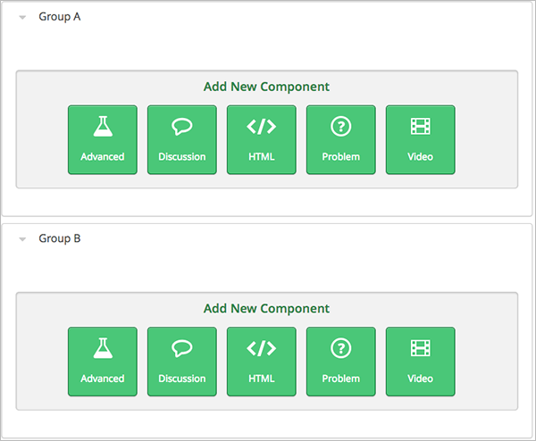
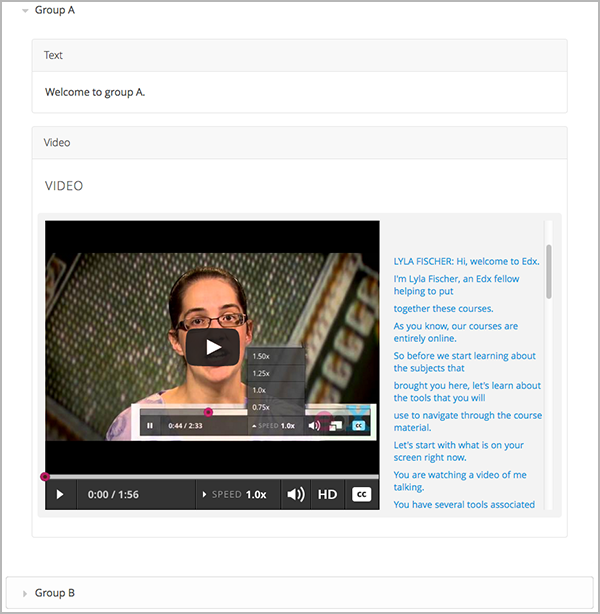

.. _Add Content Experiments to Your Course:

#########################################
Add Content Experiments to Your Course
#########################################

After you :ref:`enable content experiments <Enable Content Experiments>` and
:ref:`set up group configurations in Studio <Set up Group Configurations in edX
Studio>` or :ref:`in XML <Set up Group Configurations in an XML Course>`, you
can add content experiments to your course. See:

* :ref:`Add a Content Experiment in Studio`
* :ref:`Add a Content Experiment in XML`

.. _Add a Content Experiment in Studio:

********************************************
Add a Content Experiment in Studio
********************************************

You can add a content experiment in a unit or container page. In Studio, you
create and view content for all groups in the content experiment in a container
page for the experiment, as shown in `Create Content for Groups in the Content
Experiment`_.

When a student views the unit with the content experiment, she has no
indication there is a content experiment in the unit, and the content
experiment display name is not shown. She sees only the content that you
configure for the group she is assigned to. To the student, the unit with the
content experiment is no different than any other unit.

To configure a content experiment in Studio, you:

#. `Create the content experiment`_.
#. `Create content for groups in the content experiment`_.
   
After you configure a content experiment, you can `change the
group configuration <Change the Group Configuration for a Content
Experiment>`_.

===============================
Create the Content Experiment
===============================

#. In the unit page, under **Add New Component**, click **Advanced**.

#. Select **Content Experiment**.
   
   A new content experiment is added to the unit:

   .. image:: ../Images/content_experiment_block.png
    :width: 800
    :alt: The content experiment component in a unit page

   You can work with the content experiment as you can any other component.
   See :ref:`Developing Course Components` for more information.

#. Click either **Select a Group Configuration** or **Edit** to open the content
   experiment component.

   .. image:: ../Images/content_experiment_editor.png
    :alt: The content experiment editor

#. Next to **Group Configuration**, select a group configuration.

#. In the **Display Name** field, enter the name that the component will use in Studio. The
   display name is only used in Studio; students do not see this value.

#. Click **Save**.

The content experiment is displayed as a component that contains other
components. See :ref:`Components that Contain Other Components` for more
information.

.. note::  You cannot duplicate a content experiment.

You can now create content for the groups in the experiment.

=====================================================
Create Content for Groups in the Content Experiment
=====================================================
   
After you select a group configuration, in the content experiment component,
click **View**.

The content experiment page that opens automatically includes a container for
each group that is defined in the group configuration you selected. For
example, if you select a group configuration that defines Group A and Group B,
you see the following page:

You add content for both groups as needed, just as you would add content to any
container page. See :ref:`Components that Contain Other Components` for more
information.

For example, you can add an HTML component and a video to Group A:

.. note:: 
  It is valid, and can be useful, to have no content for a group in the
  experiment.  For example, if one group has a video and another group has no
  content, you can analyze the effect of the video on student performance.

========================================================
Change the Group Configuration for a Content Experiment
========================================================

You can change the group configuration for a content experiment. When you
change the group configuration, you must add components to any new groups that you create. You
can use the components from the previous groups, as well as create new
components.

.. warning::
  Changing the group configuration of a student-visible experiment will affect
  the experiment data.

To change the group configuration:

#. Open the unit page of the unit that contains the content experiment.

#. In the content experiment component, click **Edit**.

   .. image:: ../Images/content_experiment_editor_group2.png
    :alt: The content experiment editor with a group configuration selected

#. Select a different group configuration.

#. Click **Save**.

#. You must now add components to the new groups in the experiment. Click
   **View** to open the content experiment.

   You see that groups for the new configuration are empty, and any components
   that you had added to groups in the previous configuration are now moved to
   a section called **Inactive Groups**.

   .. image:: ../Images/inactive_groups.png
    :alt: Components in inactive groups

#. Drag and drop components from the **Inactive Groups** section into the new
   groups. You can also create new components in the new groups.

.. _Add a Content Experiment in XML:

****************************************
Add a Content Experiment in XML
****************************************

If you are developing your course in XML, you work with multiple XML files to
configure a content experiment. This section steps through the files involved
in a content experiment that shows different content to two different groups of
students.

For more information about working with your course's XML files, including
information about terminology, see the `edX XML Tutorial
<http://edx.readthedocs
.org/projects/devdata/en/latest/course_data_formats/course_xml.html>`_.

=====================================================
Define the Content Experiment in the Sequential File
=====================================================

You reference a content experiment in the file for the subsection in the
``sequential`` directory. For example:

.. code-block:: xml

    ...
    <vertical url_name="name for the unit that contains the A/B test" display_name="A/B Test Unit">
        <split_test url_name="name of A/B test file in the split_test folder"/>
    </vertical>
    .....

The ``<split_test>`` element's ``url_name`` value references the name of the
A/B test file in the ``split_test`` directory.

.. _Define the Experiment Content in the Split Test File:

=====================================================
Define the Experiment Content in the Split Test File
=====================================================

After you define the content experiment in the sequential file, you define the
course content you want to test in the file in the ``split_test`` directory.
This is the file referenced in the ``<split_test>`` element in the sequential
file, as shown above.

In the content experiment file, you add elements for the experiment content.
For this example, you add two ``<vertical>`` elements to compare the two
different sets of content.

.. code-block:: xml

    <split_test url_name="AB_Test.xml" display_name="A/B Test" user_partition_id="0" 
                group_id_to_child='{"0": "i4x://path-to-course/vertical/group_a", 
                                    "1": "i4x://path-to-course/vertical/group_b"}'>
        <vertical url_name="group_a" display_name="Group A">
           <html>Welcome to group A.</html>
           <video url_name="group_a_video"/>
        </vertical>
        <vertical url_name="group_b" display_name="Group B">
            <html>Welcome to group B.</html>
            <problem display_name="Checkboxes">
                
A checkboxes problem presents checkbox buttons for student input. 
                   Students can select more than one option presented.

                <choiceresponse>
                    <checkboxgroup direction="vertical" label="Select the answer that matches">
                        <choice correct="true">correct</choice>
                        <choice correct="false">incorrect</choice>
                        <choice correct="true">correct</choice>
                    </checkboxgroup>
                </choiceresponse>
            </problem>
        </vertical>
    </split_test>

In this example:

* The ``user_partition_id`` value references the ID of the experiment defined
  in the ``policy.json`` file.

* The ``group_id_to_child`` value references the IDs of the groups defined in
  the ``policy.json`` file and maps the group IDs to specific content.

  For example,  the value for group ``0``, ``i4x://path-to-
  course/vertical/group_a``, maps to the ``<vertical>`` element with the
  ``url_name`` equal to ``group_a``.  Therefore, students in group 0 see the
  content in that vertical.

For information about the ``policy.json`` file, see :ref:`Set up Group
Configurations in an XML Course`.