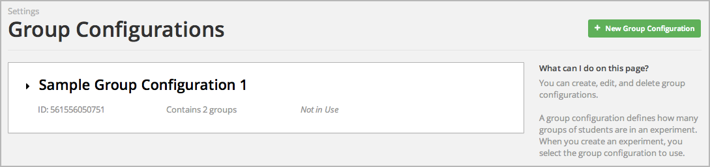
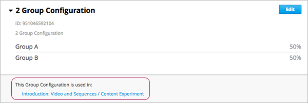
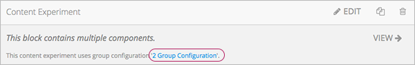
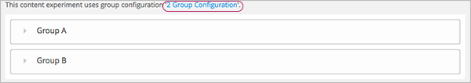

.. _Configure Your Course for Content Experiments:

#####################################################
Configure Your Course for Content Experiments
#####################################################

This chapter describes how to configure your course so that you can use content
experiments. See:

* :ref:`Enable Content Experiments`
* :ref:`Overview of Group Configurations`
* :ref:`Set up Group Configurations in edX Studio`
* :ref:`Guidelines for Modifying Group Configurations`
* :ref:`Set up Group Configurations in an XML Course`

.. _Enable Content Experiments:

****************************************
Enable Content Experiments
****************************************

To enable content experiments in your course, you add ``split_test`` to the
**Advanced Modules List** in Advanced Settings.

.. note::  
  ``split_test`` is the internal edX Platform name for a content experiment.

#. From the **Settings** menu, select **Advanced Settings**.

#. On the **Advanced Settings** page, locate **Advanced Modules List**.

#. In the **Advanced Modules List** field, add ``"split_test"``. Be sure that
   you include the double quotation marks.

   If you have multiple values, ensure that they are separated by commas
   (``,``).

   For example, the text in the **Advanced Modules List** field may resemble
   the following:

   .. code-block:: json
     
     [
       "lti",
       "word_cloud",
       "split_test"
     ]

#. At the bottom of the page, click **Save Changes**.

.. _Overview of Group Configurations:

****************************************
Overview of Group Configurations
****************************************

Before you can create content experiments, you must specify at least one group
configuration for your course.

A group configuration defines how many groups of students are in an experiment.
You can have any number of group configurations in your course. When you create
a content experiment, you select the group configuration to use.

For example, you may want to do two different experiments at different times during
your course. In one content experiment, students either see a video or complete a
video or a reading assignment. You can then include problems so that you can see 
which group learned the material more completely. For this content experiment, you 
need a group configuration that assigns your students to two groups.

In the other content experiment, you can present the same question using four 
different types of problem. For this content experiment, you need a
group configuration that assigns your students to four groups.

=============================
Assigning Students to Groups
=============================

The edX Platform assigns students to each group in a group configuration. 

Group assignments are:

* Dynamic

  The edX Platform assigns a student to a group the first time he or she views
  a content experiment that uses the group configuration.

* Random
  
  You cannot control which students are assigned to which group. 
  
* Evenly distributed
  
  The edX Platform keeps track of the size of groups and assigns new students
  to groups evenly. For example, when there are two groups in a configuration,
  each group will include 50% of the students in the course; when you have four
  groups, each group will include 25%.

* Permanent
  
  Students remain in their assigned groups regardless of how many content
  experiments you set up that use the same group configuration.

.. _Set up Group Configurations in edX Studio:

************************************************
Set up Group Configurations in edX Studio 
************************************************

..note:: You must :ref:`enable content experiments<Enable Content Experiments>` before you can set up group configurations.

To set up group configurations, on the **Settings** menu, select **Group
Configurations**. The **Group Configurations** page opens:

.. image:: ../Images/group_configurations.png
 :width: 800
 :alt: The Group Configurations page

From this page you can :ref:`create<Create a Group Configuration>`,
:ref:`edit<Edit a Group Configuration>`, and :ref:`delete<Delete a Group
Configuration>` group configurations. You can also :ref:`view experiments that
use a group configuration<View Experiments that Use a Group Configuration>`.

.. _Create a Group Configuration:

=============================
Create a Group Configuration
=============================

You can create a group configuration at any time.

#. On the **Group Configurations** page, click **Add Your First Group Configuration**. The
   following page opens:

  .. image:: ../Images/create-group-config.png
   :width: 800
   :alt: Create a New Group Configuration page

2. Enter a name in the **Group Configuration Name** field. Use a meaningful
   name, as you select from group configuration names when creating content
   experiments. Students will not see the name.

#. Optionally, enter a description for the new group configuration.
#. By default, a new configuration already contains two groups. Modify the
   names of those groups or add new groups as needed:

  * Modify the group names as needed. You see group names in the unit page in
    Studio; students do not see group names.
  * Click **Add another group** to include another group as part of the
    configuration.
  * Click the **X** to the right of an existing group to remove it from the
    configuration. A group configuration must have at least one group.

5. Click **Create** to save the new group configuration.
   
The group configuration is then listed in the page. You can see the number of groups that the configuration contains, as well as whether the configuration is in use in the course:

  
.. _Edit a Group Configuration:

=============================
Edit a Group Configuration
=============================

.. important:: 
  You can change the name of a group configuration at any time. However, 
  before you modify any other characteristics of a group that is inside a group configuration
  that is currently used in a running course, review `Guidelines for Modifying Group
  Configurations`_.

#. On the **Group Configurations** page, hover over the group configuration and
   click **Edit**.
   
   .. image:: ../Images/group_configurations_edit.png
    :alt: The Group Configurations page with Edit button

   The following page opens:

   .. image:: ../Images/save-group-config.png
    :alt: Edit a Group Configuration page

#. Modify the name and description as needed.

#. Modify groups in the configuration as needed. See `Create a Group
   Configuration`_ for details.
   
#. Click **Save** to save your changes.

.. _Delete a Group Configuration:

=============================
Delete a Group Configuration
=============================

.. note:: 
 You can only delete a group configuration that is not currently used in a content
 experiment. You cannot delete a group configuration that is used in a content experiment.

#. On the **Group Configurations** page, hover over the group configuration and
   click the Delete icon. 

  .. image:: ../Images/group-configuration-delete.png
   :alt: Edit a Group Configuration page

2. When prompted to confirm the deletion, click **Delete**.

.. _View Experiments that Use a Group Configuration:

===============================================
View Experiments that Use a Group Configuration
===============================================

When working with group configurations, you can view the experiments that use
each configuration.

On the **Group Configurations** page, click the name of a group to expand the group
and see its details. You see links to experiments that use the group configuration:

Click a link to go to the unit page that contains the experiment.

===============================================
View a Group Configuration from an Experiment
===============================================

When working with a content experiment, you can view details about the group
configuration used by that experiment.

On the unit page for a unit that contains a content experiment, click the name of the group
configuration.

     circled

Or at the top of the content experiment page, click the name of the group
configuration.

In both cases, the group configuration opens:

You can use the link in the group configuration to return to the unit that
contains the content experiment.

.. _Guidelines for Modifying Group Configurations:

*********************************************
Guidelines for Modifying Group Configurations
*********************************************

Review these guidelines if you must modify a group configuration after a course
starts. These guidelines apply for courses built in Studio or XML.

==================================
Modifying a Group Configuration
==================================

After the course starts, **do not**:

* Delete group configurations.

* Change the ``id`` value of a group configuration.

=================
Modifying Groups
=================

After the course starts, **do not** change the ``id`` value of a group.
  
You can change group names at any time.

==========================================================
Removing Groups from Group Configurations
==========================================================

After a course has started, you may find that students in a specific group are
having difficulties or a poor experience. In this situation, you can remove the
group from the group configuration. Content that was specified for that
group is then no longer visible to students.

Students in the removed group are reassigned evenly to one of the other groups
in the group configuration. Any problems that these students completed in the
removed group content do not count toward the students' grades. The students
must begin the problem set again and complete all the problems in the group
content to which they've been reassigned.

Removing a group affects the course event data. Ensure that researchers
evaluating your course results are aware of the group you removed and the
date you removed it.

.. _Set up Group Configurations in an XML Course:

************************************************
Set up Group Configurations in an XML Course 
************************************************

If you are developing your course in XML, you define group configurations in
the ``policy.json`` file in the ``policies`` directory.

See :ref:`Add a Content Experiment in XML` for more information on how the XML
for the content experiment uses these settings.

To specify group configurations, you modify the value for the
``user_partitions`` policy key.

.. note::  
  ``user_partitions`` is the internal edX Platform name for group
  configurations.

The value for ``user_partitions`` is a JSON collection of group configurations,
each of which defines the groups of students. 

.. note:: 
  Use names for group configurations that are meaningful. You select from the
  list of group configuration names when you add a content experiment.

See the following examples for more information.

=============================================
Example: One Group Configuration
=============================================

The following is an example JSON object that defines an group configuration
with two student segments.

.. code-block:: json

    "user_partitions": [{"id": 0,
                       "name": "Name of the group configuration",
                       "description": "Description of the group configuration.",
                       "version": 1,
                       "groups": [{"id": 0,
                                   "name": "Group 1",
                                   "version": 1},
                                  {"id": 1,
                                   "name": "Group 2",
                                   "version": 1}]
                                }
                       ]

In this example:

* The ``"id": 0`` identifies the group configuration. For XML courses, the
  value is referenced in the ``user_partition`` attribute of the
  ``<split_test>`` element in the content experiment file.
* The ``groups`` array identifies the groups to which students are randomly
  assigned. For XML courses, each group ``id`` value is referenced in the
  ``group_id_to_child`` attribute of the ``<split_test>`` element.

==========================================================
Example: Multiple Group Configurations
==========================================================

The following is an example JSON object that defines two group configurations.
The first group configuration divides students into two groups, and the second
divides students into three groups.

.. code-block:: json

    "user_partitions": [{"id": 0,
                         "name": "Name of Group Configuration 1",
                         "description": "Description of Group Configuration 1.",
                         "version": 1,
                         "groups": [{"id": 0,
                                     "name": "Group 1",
                                     "version": 1},
                                    {"id": 1,
                                     "name": "Group 2",
                                     "version": 1}]}
                        {"id": 1,
                         "name": "Name of Group Configuration 2",
                         "description": "Description of Group Configuration 2.",
                         "version": 1,
                         "groups": [{"id": 0,
                                     "name": "Group 1",
                                     "version": 1},
                                    {"id": 1,
                                     "name": "Group 2",
                                     "version": 1}
                                     {"id": 2,
                                     "name": "Group 3",
                                     "version": 1}
                                     ]}
                       ]

.. note:: 
  As this example shows, each group configuration is independent.  Group IDs
  and names must be unique within a group configuration, but not across all
  group configurations in your course.