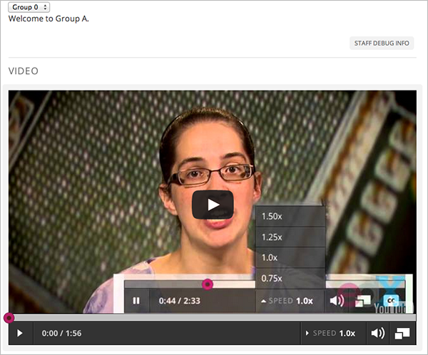
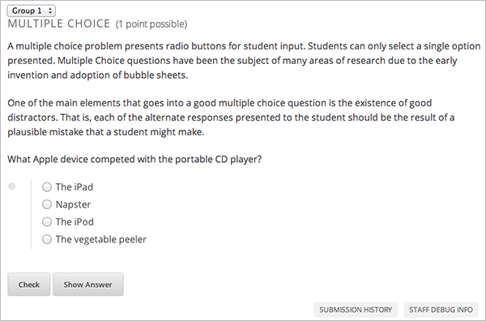

.. _Test Content Experiments:

##########################################
Test Content Experiments
##########################################

You should test content experiments in your course before the course starts to
ensure that content is delivered to groups as you intended.

When you view a unit that contains a content experiment in the LMS in the Staff
view, you select one of the groups from a drop-down list. The unit page then shows the
content for that group of students.

For example, in the following page, Group 0 is selected, and the HTML component
and video that is part of Group 0 is displayed:

You can change the group selection to view the problem that a different group of
students sees:

.. note:: 
  The example course content in this chapter uses content experiment
  terminology to make the functionality clear. Typically, you would not use
  terminology in course content that would make students aware of the
  experiment.