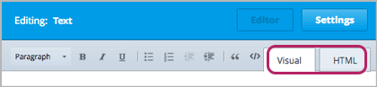
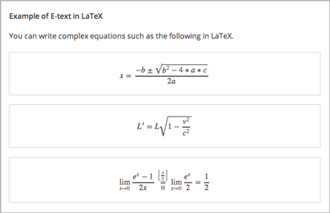

.. _Working with HTML Components:

#############################
Working with HTML Components
#############################

***********************
HTML Component Overview
***********************

HTML components are the most basic building blocks of your course. You use HTML components to add and format text, links, images, and more. 

For more information, see the following topics:

* :ref:`The User Interface`
* :ref:`Create an HTML Component`
* :ref:`Add a Link in an HTML Component`
* :ref:`Add an Image to an HTML Component`
* :ref:`Import LaTeX Code`

.. note:: Review :ref:`Organizing Your Course Content` and :ref:`Best Practices for HTML Markup` before you start working with HTML components.

To add an instant hangout to an HTML component, see :ref:`Using an Instant Hangout in Your Course`.

.. _The User Interface:

*****************************************
The HTML Component User Interface
*****************************************

When you create a new HTML component, you work with the HTML component editor. The editor has two views: **Visual view** and **HTML view.** To switch between Visual view and HTML view, click the tab in the upper-right corner of the component editor.

- **Visual view** provides a “what you see is what you get” (WYSIWYG) editor that allows you to format text by clicking the formatting buttons at the top of the editor. By default, every HTML component opens in Visual view.

  Visual view includes the following formatting buttons.

  .. image:: Images/HTML_VisualView_Toolbar.gif
    :alt: Image of the HTML visual editor, with callouts for formatting buttons

  #. Select a formatting style, such as heading 1, heading 2, or paragraph.
  #. Format text in bold.
  #. Format text in italics.
  #. Underline text.
  #. Create a bulleted list.
  #. Create a numbered list.
  #. Decrease the indent.
  #. Indent text.
  #. Format text as a blockquote.
  #. Format text as code (i.e., in Courier font).
  #. Create a link.
  #. Delete the current link.

  Visual view shows your content the way it will appear in the LMS. The following is the LMS rendition of the HTML component above.

  .. image:: Images/HTMLComponent_VisualView_LMS.gif
   :alt: Image of the visual view of the HTML component

- **HTML view** allows you to edit HTML code directly.

  .. image:: Images/HTML_HTMLView.gif
   :alt: Image of the HTML code view of the HTML component

  .. note:: If you're in HTML view, you can always switch to Visual view to make sure your content looks the way you expect. For example, we recommend that you do this if you add an image or a link to an HTML component.

.. _Create an HTML Component:

*****************************
Create an HTML Component
*****************************

To create an HTML component:

1. Under **Add New Component**, click **html**.

  .. image:: Images/NewComponent_HTML.gif
   :alt: Image of adding a new HTML component

2. In the list that appears, click **Text**.

  .. note:  You can also create a :ref:`Zooming Image` or :ref:`Image Modal`.

   An empty component appears at the bottom of the unit.

  .. image:: Images/HTMLComponent_Edit.png
   :alt: Image of an empty HTML component

3. In the empty component, click **Edit**.

   The HTML component editor opens in Visual view.

  .. image:: Images/HTMLEditor.gif
   :alt: Image of the HTML component Visual view

4. Enter the text and formatting that you want, either by using the formatting buttons in Visual view or by manually adding HTML tags in HTML view.

5. Enter a display name (the name that you want students to see). To do this, click **Settings** in the upper-right corner of the component editor, and then enter text in the **Display Name** field.

   To return to the text editor, click **Editor** in the upper-right corner.

6. Click **Save** to save the HTML component.

You can also add links and images to HTML components. Or, you can import LaTeX code. For more information, see:

* :ref:`Add a Link in an HTML Component`
* :ref:`Add an Image to an HTML Component`
* :ref:`Import LaTeX Code`

.. _Add a Link in an HTML Component:

***********************************
Add a Link in an HTML Component
***********************************

To add a link to a website, course unit, or file in an HTML component, you'll work with the **Insert/Edit Link** dialog box.

.. image:: /Images/HTML_Insert-EditLink_DBox.gif
 :alt: Image of the Insert/Edit Link dialog box

For more information, see:

* :ref:`Add a Link to a Website`
* :ref:`Add a Link to a Course Unit`
* :ref:`Add a Link to a File`

.. _Add a Link to a Website:

============================
Add a Link to a Website
============================

To add a link to a website:

#. Select the text that you want to make into the link.

#. Click the link icon in the toolbar.

#. In the **Insert/Edit Link** dialog box, enter the URL of the website that you want in the **Link URL** field.

   .. image:: Images/HTML_Insert-EditLink_Website.gif
    :alt: Image of the Insert/Edit Link dialog box

#. If you want the link to open in a new window, click the drop-down arrow next to the **Target** field, and then select **Open Link in a New Window**. If not, you can leave the default value.

#. Click **Insert**.

#. Save the HTML component and test the link.

.. _Add a Link to a Course Unit:

============================
Add a Link to a Course Unit
============================

You can add a link to a course unit in an HTML component.

#. Obtain the unit identifier of the unit you're linking to. To do this, open the unit page in Studio, and copy the unit ID from the **Unit Identifier** field under **Unit Location** in the right pane.
   
   .. image:: /Images/UnitIdentifier.png
    :alt: Image of the unit page with the unit identifier circled

#. Open the HTML component where you want to add the link.

#. Select the text that you want to make into the link.

#. Click the link icon in the toolbar.

#. In the **Insert/Edit Link** dialog box, enter the following in the **Link URL** field.

   ``/jump_to_id/<unit identifier>``

   Make sure to replace <unit identifier> (including the brackets) with the unit
   identifier that you copied in step 2, and make sure to include both forward slashes (/).

   .. image:: /Images/HTML_Insert-EditLink_CourseUnit.gif
    :alt: Image of the Inser/Edit Link dialog box with a link to a unit identifier

#. If you want the link to open in a new window, click the drop-down arrow next to
   the **Target** field, and then select **Open Link in a New Window**. If not, you can leave the default value.

#. Click **Insert**.

#. Save the HTML component and test the link.

.. _Add a Link to a File:

============================
Add a Link to a File
============================

You can add a link in an HTML component to any file you've uploaded for the course. For more information about uploading files, see :ref:`Add Files to a Course`.

#. On the **Files & Uploads** page, copy the URL of the file.

   .. image:: Images/HTML_Link_File.gif
    :alt: Image of Files and Uploads page with the URL field circled

#. Select the text that you want to make into the link.

#. Click the link icon in the toolbar.

#. In the **Insert/Edit Link** dialog box, enter the following in the **Link URL** field.

   ``/static/FileName.type``

   Make sure to include both forward slashes (/).

   .. image:: /Images/HTML_Insert-EditLink_File.gif
    :alt: Image of the Inser/Edit Link dialog box with a link to a file

#. If you want the link to open in a new window, click the drop-down arrow next to
   the **Target** field, and then select **Open Link in a New Window**. If not, you can leave the default value.

#. Click **Insert**.

#. Save the HTML component and test the link.

.. _Add an Image to an HTML Component:

***********************************
Add an Image to an HTML Component
***********************************

You can add any image that you have uploaded for the course to an HTML component. For more information about uploading images, see :ref:`Add Files to a Course`.

.. note:: Review :ref:`Best Practices for Describing Images` when you add images to HTML components.

To add an image, you'll need the URL of the image that you uploaded to the course. You'll then create a link to the image in the HTML component.

#. On the **Files & Uploads** page, copy the URL of the image that you want.

#. In the HTML component, switch to HTML view.

#. In the location where you want to add the image, enter an image tag that uses the following syntax.

   ``

``

   For example, your image tag may resemble the following.

   ``

``

#. Switch back to Visual view to make sure your image appears.

.. _Import LaTeX Code:

****************************************
Import LaTeX Code into an HTML Component
****************************************

You can import LaTeX code into an HTML component. You might do this, for example, if you want to create "beautiful math" such as the following.

.. warning:: The LaTeX processor that Studio uses to convert LaTeX code to XML is a third-party tool. We recommend that you use this feature with caution. If you do use it, make sure to work with your PM.

This feature is not enabled by default. To enable it, you have to change the advanced settings in your course. 

To create an HTML component that contains LaTeX code:

#. Enable the policy key in your course.

   #. In Studio, click **Settings**, and then click **Advanced Settings**.
   #. On the **Advanced Settings** page, scroll down to the **use_latex_compiler** policy key.
   #. In the **Policy Value** field next to the **use_latex_compiler** policy key, change **false** to **true**.
   #. At the bottom of the page, click **Save Changes**.

#. In the unit where you want to create the component, click **html** under **Add New Component**, and then click **E-text Written in LaTeX**.

#. In the component that appears, click **upload** in the upper-right corner.

   .. image:: Images/HTML_LaTeX.png
    :alt: Image of the LaTeX component with the upload button circled

#. In the dialog box that opens, select a file, and then click **Open**.

   The file loads in the LaTeX editor.

   .. image:: Images/HTML_LaTeXEditor.gif
    :alt: Image of the LaTex editor

#. If you want to, make changes to the file.

#. In the LaTeX editor, click **Save & Compile to edX XML** in the lower-left corner.

   The component editor closes, and the unit page opens. You can see the way your LaTeX content looks.

   .. image:: Images/HTML_LaTeX_CompEditor.png
    :alt: Image of the LaTeX component

#. On the unit page, click **Preview** to verify that your content looks the way you want it to in the LMS. 

   * If you see errors, go back to the unit page. Click **Edit** to open the component again, and then click **Launch Latex Source Compiler** in the lower-left corner of the component editor to edit the LaTeX code.

