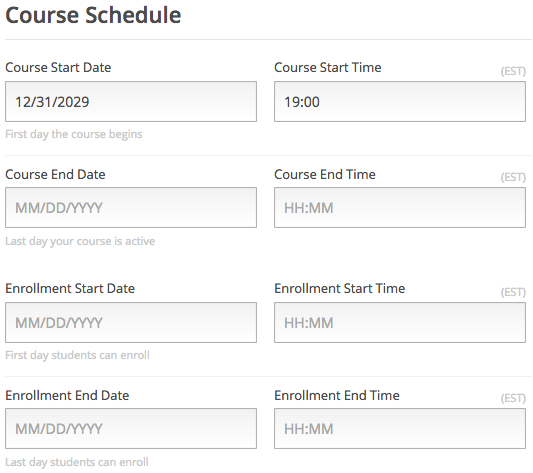
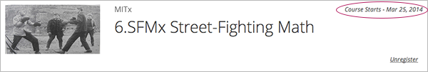
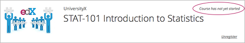
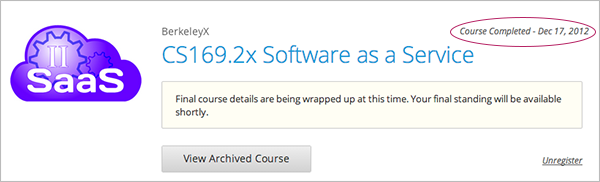
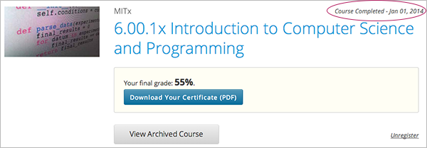
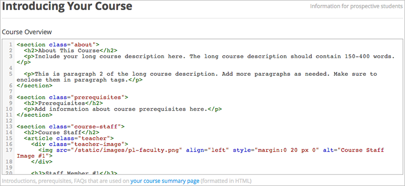
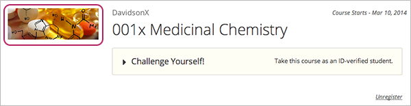

.. _Setting up a New Course:

###########################
Setting up a New Course
###########################

*******************
Overview
*******************

This chapter describes how to create and set up your course:

#. :ref:`Create a New Course`
#. :ref:`Edit Your Course`
#. :ref:`Use the Course Checklist`
#. :ref:`Add Course Team Members`
#. :ref:`Set Important Dates for Your Course`
#. :ref:`Describe Your Course`
#. :ref:`Add a Course Image`
#. :ref:`Add a Course Video`
#. :ref:`Set Course Requirements`
#. :ref:`Add Files to a Course`
#. :ref:`Add Static Pages`
#. :ref:`Add a Course Update`
#. :ref:`Add Course Handouts`
#. :ref:`Add Textbooks`

Also see the chapters :ref:`Establish a Grading Policy`, :ref:`Organizing Your Course Content`, and :ref:`Guidelines for Creating Accessible Content`.

.. _Edge: http://edge.edx.org
.. _edX.org: http://edx.org

.. _Create a New Course:
  
*******************
Create a New Course
*******************

#. Log in to Studio.
#. Click **New Course**.
#. Enter course information as needed and click **Create**.

  .. image:: Images/new_course_info.png
     :width: 800

  .. note::  Enter new course information carefully. This information becomes part of the URL for your course. To change the URL after the course is created, you must contact edX through the Help site (http://help.edge.edx.org). Additionally, because this information becomes part of your course URL, the total number of characters in the following three fields must be 65 or fewer.

  * For **Course Name**, enter the title of your course. For example, the name may be “Sets, Maps and Symmetry Groups". Use title capitalization for the course title.

  * For **Organization**, enter the name of your university. Do not include whitespace or special characters.

  * For **Course Number**, enter both a subject abbreviation and a number. For example, for public health course number 207, enter **PH207**. For math course 101x, enter **Math101x**. Do not include whitespace or special characters in the course number.

    *Note: If your course will be open to the world, be sure to include the "x". If it is exclusively an on-campus offering, do not include the "x".* 

  * For **Course Run**, enter the term your course will run. Do not include whitespace or special characters. 

    The Course Run date you enter does not affect the default **Course Start Date**.  See :ref:`Set Important Dates for Your Course` for more information.

4. Click **Save.**

You then see the empty Course Outline.

.. _Edit Your Course:

************************
Edit Your Course
************************
When you create a new course, the course opens in Studio automatically and you can begin editing.

If you come back to Studio later, your courses are listed on the Studio login page. 

 .. image:: Images/open_course.png
  :width: 800
 
To open the course, click the course name. 

When you open a course, you go to the Course Outline. The next topic discusses working with your course outline.

The rest of this page discusses other tasks you must do to set up your course.

.. _Use the Course Checklist:

************************
Use the Course Checklist
************************

You can use a Course Checklist within Studio to help you work through the tasks of building a course.

Categories of tasks in the Course Checklist include:

* Getting Started with Studio
* Draft a Rough Course Outline
* Explore edX's Support Tools
* Draft Your Course About Page

From the **Tools** menu, select **Checklists**.

 .. image:: Images/checklist.png
  :width: 800
 

As shown above for the **Add Course Team Members** task, if you hover over a task, a button is displayed that takes you to the page to complete that task.

You can expand and collapse sections of this page as needed.

You can check tasks as you complete them. Studio saves your changes automatically. Other course staff can see your changes.

.. _Add Course Team Members:

************************
Add Course Team Members
************************

Course team members are users who help you build your course.

Only a team member with Admin access can add or remove course team members, or grant Admin access to other team members. 

Other course team members can edit the course and perform all tasks except adding and removing other new team members and granting Admin access.

.. note::  Any course team member can delete content created by other team members.

All course team members must be registered with Studio and have an active account. 

To add a course team member:

#. Ensure you have Admin access.
#. Ensure that the new team member has registered with Studio.
#. From the **Settings** menu, select **Course Team**.
#. Click **Add a New Team Member**.
#. Enter the new team member's email address, then click **ADD USER**.

.. _Set Important Dates for Your Course:

***********************************
Set Important Dates for Your Course
***********************************
You must set dates and times for enrollment and for the course.

From the **Settings** menu, select **Schedule and Details**.  

Follow the on-screen text to enter the course and enrollment schedule.

.. note::

    The Time fields on this page reflect the current time zone in your browser, depending on your geography. Course start times for students are shown as UTC.

.. _The Course Start Date:

==============================
The Course Start Date
==============================

.. note:: 

    The default **Course Start Date** is set far into the future, to **01/01/2030 GMT**. This is to ensure that your course does not start before you intend it to.  You must change the course start date to the date you want students to begin using the course. 

Students see the course start date on their dashboards and on the course summary page.

The following example shows the course start date on the course summary page:

.. image:: Images/about-page-course-start.png
 :alt: An image of the course summary page, with the start date circled.

.. note:: For courses on edX.org_, you must communicate the course start date to your edX Program Manager, to ensure the date is accurate on the course summary page.

In the dashboard, if the course has not yet started, students see the start date as in the following example:

If the course has started, students see the start date as in the following example:

.. _Set the Advertised Start Date:

==============================
Set the Advertised Start Date
==============================

You can set an advertised start date for your course that is different than the course start date you set in the **Schedule and Details** page. You may want to do this if there is uncertainty about the exact start date. For example, you could advertise the start date as **Spring, 2014**.

To set an advertised start date:

#. From the **Settings** menu, select **Advanced Settings**.
#. Find the policy key **advertised_start**. The default value is **null**.
#. Enter the date you want as an advertised start date.  You can use any string, enclosed in double quotation marks. If you format the string as a date (for example, as 02/01/2014), the value is parsed and presented to students as a date.

  .. image:: Images/advertised_start.png
   :alt: Image of the advertised start date policy key

4. Click **Save Changes** at the bottom of the page.

The start date shown on the student's dashboard is now the value of the advertised_start policy key:

If you do not change the default course start date (01/01/2030), and the **advertised_start** policy value is ``null``, then the student dashboard does not list a start date for the course.  Students just see that the course has not yet started:

.. _The Course End Date:

==============================
The Course End Date
==============================

When your course is completed, students see the course end date on their dashboards.

.. note:: For courses on edX.org_, you must communicate the course end date to your edX Program Manager, to ensure the date is accurate on the course summary page.

If grades and certificates are not yet issued, or if students enroll in an archived course after it has ended, the course appears in the dashboard as in the following example:

If grades are complete and certificates are issued, students see the course, the end date, and the message as in the following example:

.. _`Describe Your Course`:

************************
Describe Your Course
************************

On Edge_, students that you explicitly invite see the description of your course on the course summary page.

For example, the course description is circled in the following course summary page:

.. image:: Images/about-page-course-description.png
 :alt: Image of a course summary with the description circled

.. note:: For courses on edX.org_, you must communicate the course description to your edX Program Manager, to ensure the content is accurate on the course summary page.

#. From the **Settings** menu, select **Schedule & Details**.
#. Scroll down to the **Introducing Your Course** section, then locate the **Course Overview** field.

3. Overwrite the content as needed for your course, following the directions in the boilerplate text. Do not edit HTML tags. For a template that includes placeholders, see :doc:`appendices/a`.

   .. note:: There is no save button. Studio automatically saves your changes.
 
4. Click **your course summary page** in the text beneath the field to test how the description will appear to students.

.. _`Add a Course Image`:

************************
Add a Course Image
************************

The course image that you add in Studio appears on the student dashboard. 

On Edge_, the image also appears on the course summary page.

In the following example, the course image that was added in Studio is circled in the student dashboard:

On edX.org_, the course image you add in Studio does not appear on the course summary page automatically. You must work directly with your edX Program Manager to set up the course summary page.

The course image should be a minimum of 660 pixels in width by 240 pixels in height, and in .JPG or .PNG format.

#. From the **Settings** menu, select **Schedule & Details**.
#. Scroll down to the **Course Image** section.
#. To select an image from your computer, click **Upload Course Image**, then follow the prompts to find and upload your image.
#. View your dashboard to test how the image will appear to students.

.. _`Add a Course Video`:

*********************************
Add a Course Introduction Video
*********************************

On Edge_, the course introduction video appears on the course summary page that students see. 

.. note:: On edX.org_, you work directly with your Program Manager to set up the course video in the summary page.

In the following example, the course video is circled in the course summary page:

The course video should excite and entice potential students to register, and reveal some of the personality the instructors bring to the course. 

The video should answer these key questions:

* Who is teaching the course?
* What university or college is the course affiliated with?
* What topics and concepts are covered in your course?
* Why should a learner register for your course?

The video should deliver your message as concisely as possible and have a run time of less than 2 minutes. 

Ensure your course introduction video follows the same :ref:`Compression Specifications` and :ref:`Video Formats` guidelines as course content videos.

To add a course introduction video:

#. Upload the course video to YouTube. Make note of the code that appears between **watch?v =** and **&feature** in the URL. This code appears in the green box below.

  .. image:: Images/image127.png
    :width: 800
    
2. From the **Settings** menu, select **Schedule & Details**.
#. Scroll down to the **Course Introduction Video** section.
#. In the field below the video box, enter the YouTube video ID (the code you copied in step 1). When you add the code, the video automatically loads in the video box. Studio automatically saves your changes.
#. View your course summary page to test how the video will appear to students.

.. _`Set Course Requirements`:

************************
Set Course Requirements
************************
The estimated Effort per Week appears on the Course Summary page that students see.

#. From the **Settings** menu, select **Schedule & Details**.
#. Scroll down to the **Requirements** section.
#. In the **Hours of Effort per Week** field, enter the number of hours you expect students to work on this course each week.
#. View your course summary page to test how the video will appear to students.

.. _`Add Files to a Course`:

**********************
Add Files to a Course
**********************

You can add files that you want students to access in the course. After you add a file,
you must link to it from a component, a course update, or in the course handouts. A file 
is only visible to students if you create a link to it.
 
.. note:: Because the file name becomes part of the URL, students can see the name of the file when they open it. Avoid using file names such as AnswerKey.pdf.
  
.. warning:: If you upload a file with the same name as an existing course file, the original file is overwritten without warning.

To add files:
 
#. From the **Content** menu, select **Files & Uploads**.
#. Click **Upload New File**.
#. In the **Upload New File** dialog box, click **Choose File**.
#. In the **Open** dialog box, select one more files that you want to upload, then click **Open**.
#. To add more file, click **Load Another File** and repeat the previous step.
#. To close the dialog box, click the **x** in the top right corner. 

When you close the dialog box, the new files appear on the **Files & Uploads** page.

==================
File URLs
==================

In the Files & Uploads page, each file has has an **Embed URL** and an **External URL**:

.. image:: Images/files_uploads_urls.png
 :alt: Image of the Files and Uploads page, with Embed URL and External URL columns circled

* You use the **Embed URL** to link to the file or image from a component, a course update, or a course handout. 

* You use the **External URL** to reference the file or image from outside of your course. The external URL does not work if you lock the file unless the person accessing the URL is enrolled in the course.

  .. warning:: You cannot use the External URL as the reference to a file or image from within your course.

You can double click a value in the **Embed URL** or **External URL** column to select the value, then copy it.

==================
Sort Files
==================

By default, files are sorted by the **Date Added** column, with the most recently added first.  

Alternatively, can also sort the list by the **Name** column by clicking on the column header.

For either the the **Date Added** or **Name** column, you can switch the sort order from descending to ascending, and back, by clicking the column header a second time.

The current sort order is shown at the top of the file list, and the active sort column header is underlined:

.. image:: Images/file_sort.png
  :alt: Sorting files in the Files & Uploads page

==================
Find Files
==================

The **Files & Uploads** page lists up to 50 files.  If your course has more than 50 files, additional files are listed in other pages.

The range of the files listed on the page, and the total number of files, are shown at the top of the page.

You can navigate through the pages listing files in two ways:

* Use the **<** and **>** buttons at the top and bottom of the list to navigate to the previous and next pages.

* At the bottom of the page, enter the page number to skip to, then tab out of the field:

  
  .. image:: Images/file_pagination.png
    :alt: Pagination in the Files & Uploads page

  
 
==================
Lock a file
==================
By default, anyone can access a file you upload if they know the URL, even people not enrolled in your class.

To ensure that those not in your class cannot view the file, click the lock icon.

.. note:: The external URL does not work if you lock the file.
 
==================
Delete a file
==================
To delete a file, click the **x** icon next to the file.  You are prompted to confirm the deletion.

.. warning:: If you have links to a file you delete, those links will be broken. Ensure you change those links before deleting the file.
 
.. _`Add Static Pages`:

****************
Add Static Pages
****************
You can add static pages to your course. Each static page appears in your courses navigation bar. 
For example, the following navigation bar includes a
**Syllabus** and **Projects** static pages.

.. image:: Images/image157.png

You can use static pages for a syllabus, grading policy, course handouts, or any other purpose.

You can also add an instant hangout to a static page.  See :ref:`Using an Instant Hangout in Your Course` for more information.

.. note:: The Course Info, Discussion, Wiki, and Progress pages are displayed to students by default. You cannot delete these pages.   

To create a static page:

#. From the **Content** menu, select **Static Pages**.
#. Click **New Page**. The following screen opens:

  .. image:: Images/image161.png
   :width: 800

3. Click **Edit**. 

#. Enter text for your page. You can switch to HTML mode if needed.
#. To edit the Display Name, click **Settings**.
#. Click **Save**.

To delete a static page, click **Delete** in the row for the page.  Confirm the deletion.

==================
Add a Calendar
==================
You can also use a static page to show a course calendar.

You can embed a Google calendar. Paste the embed code for the calendar in the static page. 

You can also create a dynamic HTML calendar. See :ref:`Appendix B`. 

.. _`Add a Course Update`:

**********************
Add a Course Update
**********************

You add updates to notify students of exams, changes in the course schedule, or anything else of a more urgent nature.

Students see course updates in **Course Info** tab when they log in to the course:

.. image:: Images/course_info.png
 :width: 800

To add a course update:

#. From the **Content** menu, select **Updates**. 
#. Click **New Update**.
#. Enter your update as as HTML.

  .. note::  You must enter the update in HTML. For a template that includes placeholders, see :ref:`Appendix A`.

4. Click **Save**.

.. _`Add Course Handouts`:

**********************
Add Course Handouts
**********************
You can add course handouts that are visible to students on the **Course Info** page.

.. note::  You must :ref:`Add Files to a Course` before you can add them as course handouts.

#. From the **Content** menu, select **Updates**. 
#. In the **Course Handouts** page, click **Edit**.
#. Edit the HTML to add links to the files you uploaded. See :ref:`Add a Link in an HTML Component` for more information.
#. Click **Save**.

.. _`Add Textbooks`:

****************
Add Textbooks
****************
You can add textbooks for your course as PDF files.  

.. note::  Do not use image files (for example, .PNG files) as textbooks for your course, as they are not accessible to screen readers. Review the :ref:`Best Practices for Accessible PDFs` for more information.

Each textbook that you add is displayed to students as a tab in the course navigation bar.

It's recommended that you upload a separate PDF file for each chapter of your textbook.

When students open the textbook tab in the course, they can navigate the textbook by chapter:

.. image:: Images/textbook_chapters.png
 :width: 800

To add a textbook:

#. From the **Content** menu, select **Textbooks**.
#. Click **New Textbook**. The following screen opens:

  .. image:: Images/textbook_new.png
   :width: 800

3. Enter the **Textbook Name**.
#. Enter the first **Chapter Name**.
#. To upload a PDF file from your computer, click **Upload PDF**.  Follow the prompts to upload your file.
#. To add addition chapters, click **+Add a Chapter** and repeat steps 3 and 4.
#. Click **Save**.