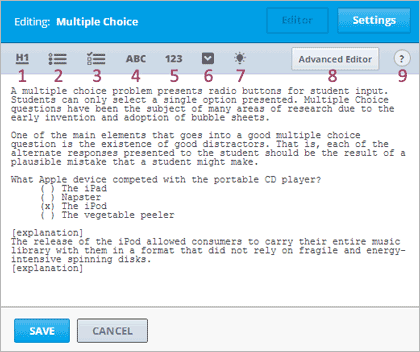
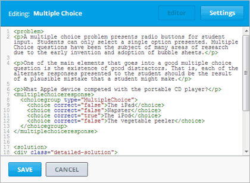
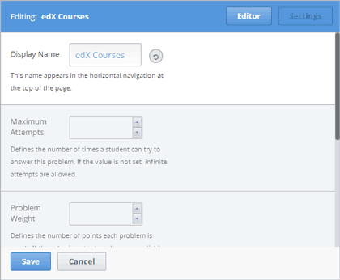
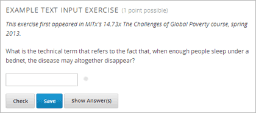
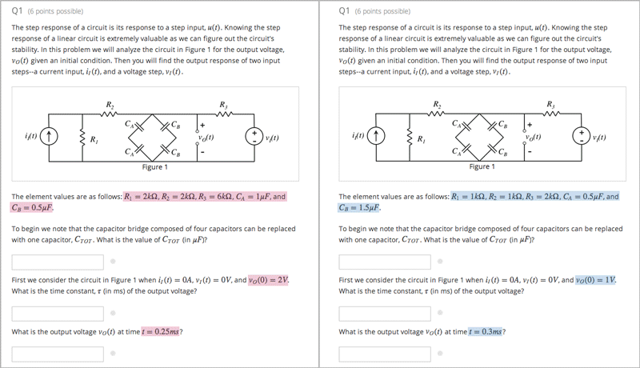

.. _Working with Problem Components:

################################
Working with Problem Components
################################

******************************
Overview of Problem Components
******************************

The problem component allows you to add interactive, automatically
graded exercises to your course content. You can create many different
types of problems in Studio.

All problems receive a point score, but, by default, problems do not count
toward a student's grade. If you want the problems to count toward the
student's grade, change the assignment type of the subsection that contains the
problems.

For more information, see the following topics.

* :ref:`Components and the User Interface`
* :ref:`Problem Settings`
* :ref:`Multiple Problems in One Component`
* :ref:`Modifying a Released Problem`

.. _Components and the User Interface:

************************************
Components and the User Interface
************************************

This section contains a description of the various components of a
problem as students see it in the LMS, as well as an introduction to the
Studio user interface for course creators.

==============================
The Student View of a Problem
==============================

All problems on the edX platform have several component parts.

.. image:: Images/AnatomyOfExercise1.gif
 :alt: Image of a problem from a student's point of view, with callouts for elements of the problem

#. **Problem text.** The problem text can contain any standard HTML formatting.

#. **Response field with the student’s answer.** Students enter answers
   in *response fields*. The appearance of the response field depends on
   the type of the problem.

#. **Rendered answer.** For some problem types, Studio uses MathJax to
   render plain text as “beautiful math.”

#. **Check button.** The student clicks **Check** to submit a response
   or find out if his answer is correct. If the answer is correct, a green
   check mark appears. If it is incorrect, a red X appears. When the
   student clicks the **Check button**, Studio saves the grade and current
   state of the problem.

#. **Save button.** The student can click **Save** to save his current
   response without submitting it for a grade. This allows the student to
   stop working on a problem and come back to it later.

#. **Show Answer button.** This button is optional. When the student
   clicks **Show Answer**, the student sees both the correct answer (see 2
   above) and the explanation (see 10 below). The instructor sets whether
   the **Show Answer** button is visible.

#. **Attempts.** The instructor may set a specific number of attempts or
   allow unlimited attempts.

   .. image:: Images/AnatomyOfExercise2.gif
    :alt: Image of a problem from a student's point of view, with callouts for attempts and showing the answer

#. **Feedback.** After a student clicks **Check**, all problems return a
   green check mark or a red X.

   .. image:: Images/AnatomyofaProblem_Feedback.gif
    :alt: Image of feedback checkmark and x from a student's point of view

#. **Correct answer.** Most problems require that the instructor specify
   a single correct answer.

#. **Explanation.** The instructor may include an explanation that
   appears when a student clicks **Show Answer**.

#. **Reset button.** This button clears the student input, so that the
   problem looks the way it did originally.

#. **Hide Answer button.**

   .. image:: Images/AnatomyOfExercise3.gif
    :alt: Image of a problem in the course accordian

#. **Grading.** The instructor may specify whether a group of problems
   is graded. If a group of problems is graded, a clock icon appears for
   that assignment in the course accordion.

   .. image:: Images/clock_icon.gif

#. **Due date.** The date that the problem is due. A problem that is
   past due does not have a **Check** button. It also does not accept
   answers or provide feedback.

.. note::  Problems can be **open** or **closed.** Closed problems do not
           have a **Check** button. Students can still see questions, solutions,
           and revealed explanations, but they cannot check their work, submit
           responses, or change their stored score.

There are also some attributes of problems that are not immediately
visible.

-  **Randomization.** For some problems, the instructor can specify
   whether a problem will use randomly generated numbers that vary from
   student to student.
-  **Weight.** Different problems in a particular problem set may be
   given different weights.

.. _Studio UI:

==============================
The Studio User Interface
==============================

Studio offers two interfaces for editing problem components: the Simple
Editor and the Advanced Editor.

-  The **Simple Editor** allows you to edit problems visually, without
   having to work with XML.
-  The **Advanced Editor** converts the problem to edX’s XML standard
   and allows you to edit that XML directly.

.. note:: You can switch at any time from the Simple Editor to the
          Advanced Editor by clicking **Advanced Editor** in the top right corner
          of the Simple Editor interface. However, it is not possible to switch from
          the Advanced Editor to the Simple Editor.

The Simple Editor
~~~~~~~~~~~~~~~~~
The Common Problem templates, including multiple choice, open in the Simple Editor. The
following image shows a multiple choice problem in the Simple Editor.

The Simple Editor includes a toolbar that helps you format the text of your problem.
When you select text and then click the formatting buttons, the Simple Editor formats
the text for you automatically. The toolbar buttons are the following:

1. Create a level 1 heading.
2. Create multiple choice options.
3. Create checkbox options.
4. Create text input options.
5. Create numerical input options.
6. Create dropdown options.
7. Create an explanation that appears when students click **Show Answer**.
8. Open the problem in the Advanced Editor.
9. Open a list of formatting hints.

The following image shows a multiple choice problem in the Simple Editor.

.. _Advanced Editor:

The Advanced Editor
~~~~~~~~~~~~~~~~~~~
The **Advanced Editor** opens a problem in XML. The Advanced Problem templates,
such as the circuit schematic builder, open directly in the Advanced Editor.

For more information about the XML for different problem types, see :ref:`Appendix E`.

The following image shows the multiple choice problem above in the Advanced Editor
instead of the Simple Editor.

.. _Problem Settings:

******************
Problem Settings
******************

All problems except word cloud and open response assessment problems
have the following settings. These settings appear on the **Settings** tab in
the component editor. (The settings for open response assessments and word clouds
are listed on the page for those problem types.)

-  Display Name
-  Maximum Attempts
-  Problem Weight
-  Randomization
-  Show Answer

===============
Display Name
===============

This setting indicates the name of your problem. The display name
appears as a heading over the problem in the LMS and in the course
ribbon at the top of the page.

.. image:: Images/ProbComponent_LMS_DisplayName.gif
 :alt: Image of the problem in a unit page from a student's point of view

==============================
Maximum Attempts
==============================

This setting specifies the number of times a student can try to answer
the problem. By default, a student has an unlimited number of attempts.

.. _Problem Weight:

==============================
Problem Weight
==============================

.. note:: Studio stores scores for all problems, but scores only count
          toward a student’s final grade if they are in a subsection that is
          graded.

This setting specifies the maximum number of points possible for the
problem. The problem weight appears next to the problem title.

.. image:: Images/ProblemWeight_DD.gif
 :alt: Image of a problem from a student's point of view, with the possible points circled

By default, each response field, or “answer space,” in a Problem
component is worth one point. Any Problem component can have multiple
response fields. For example, the Problem component above
contains one dropdown problem that has three separate questions for students
to answer, and thus has three response fields.

The following Problem component contains one text input problem,
and has just one response field.

Computing Scores
~~~~~~~~~~~~~~~~

The score that a student earns for a problem is the result of the
following formula:

**Score = Weight × (Correct answers / Response fields)**

-  **Score** is the point score that the student receives.
-  **Weight** is the problem’s maximum possible point score.
-  **Correct answers** is the number of response fields that contain
   correct answers.
-  **Response fields** is the total number of response fields in the
   problem.

**Examples**

The following are some examples of computing scores.

*Example 1*

A problem’s **Weight** setting is left blank. The problem has two
response fields. Because the problem has two response fields, the
maximum score is 2.0 points.

If one response field contains a correct answer and the other response
field contains an incorrect answer, the student’s score is 1.0 out of 2
points.

*Example 2*

A problem’s weight is set to 12. The problem has three response fields.

If a student’s response includes two correct answers and one incorrect
answer, the student’s score is 8.0 out of 12 points.

*Example 3*

A problem’s weight is set to 2. The problem has four response fields.

If a student’s response contains one correct answer and three incorrect
answers, the student’s score is 0.5 out of 2 points.

===============
Randomization
===============

Some problems have values that are randomized for each student. 

This setting has four options.

+-------------------+--------------------------------------+
| **Always**        | Students see a different version of  |
|                   | the problem each time they click     |
|                   | **Check**.                           |
+-------------------+--------------------------------------+
| **On Reset**      | Students see a different version of  |
|                   | the problem each time they click     |
|                   | **Reset**.                           |
+-------------------+--------------------------------------+
| **Never**         | All students see the same version    |
|                   | of the problem.                      |
+-------------------+--------------------------------------+
| **Per Student**   | Individual students see the same     |
|                   | version of the problem each time     |
|                   | they look at it, but that version    |
|                   | is different from what other         |
|                   | students see.                        |
+-------------------+--------------------------------------+

===============
Show Answer
===============

This setting defines when the problem shows the answer to the student.
This setting has seven options.

+-------------------+--------------------------------------+
| **Always**        | Always show the answer when the      |
|                   | student clicks the **Show Answer**   |
|                   | button.                              |
+-------------------+--------------------------------------+
| **Answered**      | Show the answer after the student    |
|                   | has submitted her final answer.      |
+-------------------+--------------------------------------+
| **Attempted**     | Show the answer after the student    |
|                   | has tried to answer the problem one  |
|                   | time, whether or not the student     |
|                   | answered the problem correctly.      |
+-------------------+--------------------------------------+
| **Closed**        | Show the answer after the student    |
|                   | has used up all his attempts to      |
|                   | answer the problem or the due date   |
|                   | has passed.                          |
+-------------------+--------------------------------------+
| **Finished**      | Show the answer after the student    |
|                   | has answered the problem correctly,  |
|                   | the student has no attempts left, or |
|                   | the problem due date has passed.     |
+-------------------+--------------------------------------+
| **Past Due**      | Show the answer after the due date   |
|                   | for the problem has passed.          |
+-------------------+--------------------------------------+
| **Never**         | Never show the answer. In this case, |
|                   | the **Show Answer** button does not  |
|                   | appear next to the problem in Studio |
|                   | or in the LMS.                       |
+-------------------+--------------------------------------+

===============
Problem Types
===============

Studio includes templates for many different types of problems, from
simple multiple choice problems to advanced problems that require the
student to “build” a virtual circuit. Details about each problem type,
including information about how to create the problem, appears in the
page for the problem type.

-  :ref:`Common Problems` appear on the **Common Problem Types** tab when you
   create a new Problem component in Studio. You create these problems
   using the Simple Editor.
-  :ref:`Advanced Problems` appear on the **Advanced** tab when you create a
   new Problem component. You create these problems using the Advanced
   Editor.
-  :ref:`Specialized Problems` are advanced problems that aren’t available by
   default. To add these problems, you first have to modify the advanced
   settings in your course. The Advanced component then appears under
   **Add New Component** in each unit, and these problems are available
   in the Advanced component.
-  :ref:`Open Response Assessment Problems` are a new kind of problem that allow you, the
   students in your course, or a computer algorithm to grade responses in the form
   of essays, files such as computer code, and images.

.. _Multiple Problems in One Component:

************************************
Multiple Problems in One Component
************************************

You may want to create a problem that has more than one response type.
For example, you may want to create a numerical input problem, and then
include a multiple choice question about the numerical input problem.
Or, you may want a student to be able to check the answers to
many problems at one time. To do this, you can include multiple problems
inside a single Problem component. The problems can be different types.

To create multiple problems in one component, create a new Blank
Advanced Problem component, and then paste the XML for each problem in
the component editor. You only need to include the XML for the problem
and its answers. You don’t have to include the code for other elements,
such as the **Check** button.

Elements such as the **Check**, **Show Answer**, and **Reset** buttons,
as well as the settings that you select for the Problem component, apply
to all of the problems in that component. Thus, if you set the maximum
number of attempts to 3, the student has three attempts to answer
the entire set of problems in the component as a whole rather than three
attempts to answer each problem individually. If a student clicks
**Check**, the LMS scores all of the problems in the component at once.
If a student clicks **Show Answer**, the answers for all the problems in
the component appear.

.. _Modifying a Released Problem:

************************************
Modifying a Released Problem
************************************

.. warning:: Be careful when you modify problems after they have been released!

After a student submits a response to a problem, Studio stores the
student’s response, the score that the student received, and the maximum
score for the problem. Studio updates these values when a student
submits a new response to a problem. However, if an instructor changes a
problem or its attributes, Studio does not automatically update existing
student information for that problem.

For example, you may release a problem and specify that its answer is 3.
After some students have submitted responses, you notice that the answer
should be 2 instead of 3. When you update the problem with the correct
answer, Studio doesn’t update scores for students who answered 2 for the
original problem and thus received the wrong score.

For another example, you may change the number of response fields to
three. Students who submitted answers before the change have a score of
0, 1, or 2 out of 2.0 for that problem. Students who submitted answers
after the change have scores of 0, 1, 2, or 3 out of 3.0 for the same
problem.

If you change the weight of the problem, however, the existing scores
update when you refresh the **Progress** page.

===============
Workarounds
===============

If you have to modify a released problem in a way that affects grading,
you have two options. Note that both options require you to ask your
students to go back and resubmit a problem.

-  In the Problem component, increase the number of attempts for the
   problem. Then ask all your students to redo the problem.
-  Delete the entire Problem component in Studio and create a new
   Problem component with the content and settings that you want. Then
   ask all your students to complete the new problem.
