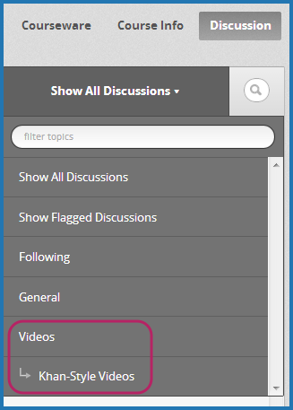

.. _Working with Discussion Components:

###################################
Working with Discussion Components
###################################

*******************
Overview
*******************

You can add a Discussion component to a Unit, to pose a question related to the
Unit and give students a chance to respond and interact.

See the following topics:

* :ref:`Create a Discussion Component`
* :ref:`A Student's View of the Discussion`

Before you add a Discussion component, it is generally a good idea to add an
HTML component that introduces the topic to be discussed. The Discussion
component itself does not contain any text and may be easy for students to
overlook.

Also see the following chapters:

* :ref:`Discussions`
* :ref:`Guidance for Discussion Moderators`

.. _Create a Discussion Component:

*****************************
Create a Discussion Component 
*****************************

.. note:: Before you create a Discussion component, consider that Discussion
 categories are immediately visible in your forum (on the Discussion tab for
 your course) when you create them, even though the unit that contains the
 Discussion component is set to Private.

To create a new Discussion component in an existing Unit, ensure the Unit is
Private. For more information on Public and Private Units, see :ref:`Public and
Private Units`.

#. Under **Add New Component**, click the **discussion** icon.

   .. image:: ../Images/NewComponent_Discussion.png
    :alt: Image of the adding a new discussion component
  
   The Discussion component is added:
  
   .. image:: ../Images/EditDiscussionComponent.png
    :alt: Image of the discussion component with the Edit button circled

#. In the Discussion component, click **Edit**.

   The Discussion component editor opens.
   
   .. image:: ../Images/DiscussionComponentEditor.png
    :alt: Image of the discussion component editor

#. Follow the guidelines in the editor to fill in the **Category**, **Display
   Name**, and **Subcategory**.
  
#. Click **Save**.

.. note:: For a Discussion component to be visible in the **Discussion** tab's
 topic drop-down list, the unit must be published and the section and
 subsection must have a release date in the past. See :ref:`Publishing Your
 Course` for more information.

.. _A Student's View of the Discussion:

**********************************
A Student's View of the Discussion 
**********************************

For students, Discussion component names appear in the course ribbon at the top
of the page:

.. image:: ../Images/DiscussionComponent_LMS_Ribbon.png
 :alt: Image of a unit from a student's point of view with the component list
     showing a discussion component

The Discussion space appears under other components in the unit. It doesn't have
a label in the body of the unit. Instead, students see "Show discussion" or
"Hide discussion" on the left, and a blue **New Post** button on the right.

In the following example, the Discussion component follows Video and HTML
components:

.. image:: ../Images/DiscussionComponent_LMS.png
  :alt: Image of a video component followed by a discussion component

In the **Discussion** tab at the top of the page, students can find the category
and subcategory of the discussion in the left pane.

