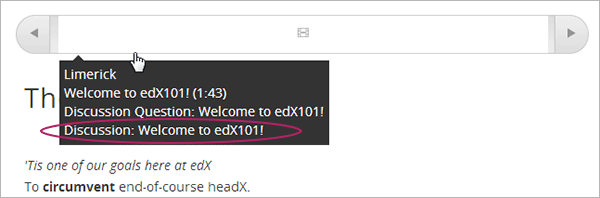
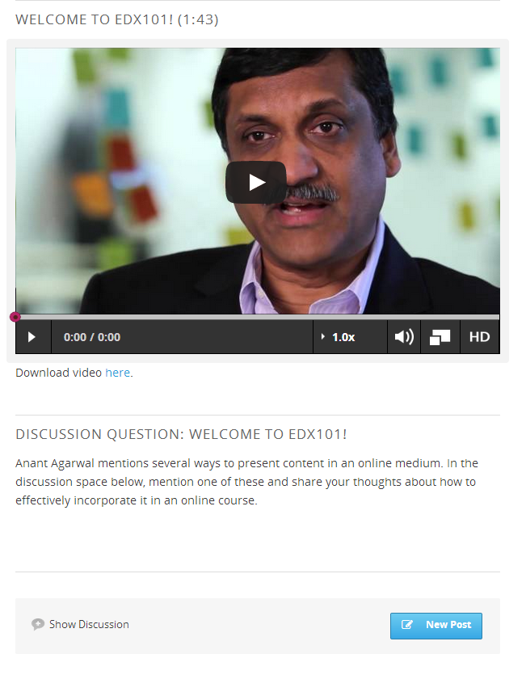
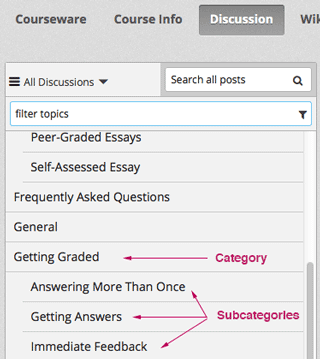

.. _Working with Discussion Components:

###################################
Working with Discussion Components
###################################

*******************
Overview
*******************

You can add a Discussion component to a unit, to pose a question related to the
Unit and give students a chance to respond and interact.

See the following topics:

* :ref:`Create a Discussion Component`
* :ref:`A Students View of the Discussion`

Before you add a Discussion component, it is generally a good idea to add an
HTML component that introduces the topic to be discussed. The Discussion
component itself does not contain any text and may be easy for students to
overlook.

Also see the following chapters:

* :ref:`Discussions`
* :ref:`Guidance for Discussion Moderators`

.. _Create a Discussion Component:

*****************************
Create a Discussion Component 
*****************************

#. Under **Add New Component**, click **Discussion**.

#. In the Discussion component that appears, click **Edit**.
  
   .. image:: ../Images/Disc_Create_Edit.png
    :alt: Image of the discussion component with the Edit button circled

#. When the Discussion component editor opens, follow the guidelines in the
   editor to fill in the **Category**, the optional **Display Name**, and the 
   **Subcategory** fields.
   
   .. image:: ../Images/DiscussionComponentEditor.png
    :alt: Image of the discussion component editor with a category of "Getting Graded" and a subcategory of "Answering More Than Once"

   The value in the **Display Name** field identifies the discussion in the
   course content. The values in the **Category** and **Subcategory** fields
   appear in the list of discussion topics on the **Discussion** page. To
   uniquely identify the discussion in your course, each **Category** /
   **Subcategory** pair that you supply should be unique.

   .. image:: ../Images/Discussion_category_subcategory.png
    :alt: The list of discussions with the "Answering More Than Once" topic indented under "Getting Graded"
  
#. Click **Save**.

.. warning:: 
  You should always use these steps to create a discussion component. If you
  create a discussion component by using the **Duplicate** button in Studio,
  both discussion components will contain the same conversations, even if users
  post in different discussions.

Discussion *categories* are immediately visible on the **Discussion** tab for
your course when you create them, even if the unit that contains the Discussion
is not published. However, an individual Discussion component is not visible
until the unit is published and release dates for the section and subsection
have passed. See :ref:`Controlling Content Visibility` for more information.

Additionally, you cannot see posts, responses, or comments in a Discussion
component when you are working in Studio. To see the discussion, go to the unit
that contains the Discussion component in Studio, and then click **Preview** or
**View Live** under **Unit Settings**.

.. _A Students View of the Discussion:

**********************************
A Student's View of the Discussion 
**********************************

For students, the display name for the Discussion component appears in the
course ribbon at the top of the page:

     showing a discussion component

The Discussion space appears under other components in the unit. It doesn't
have a label in the body of the unit. Instead, students see "Show discussion"
or "Hide discussion" on the left, and a blue **New Post** button on the right.

In the following example, the Discussion component follows Video and HTML
components:

In the **Discussion** tab at the top of the page, students can find the
category and subcategory of the discussion in the left pane.

