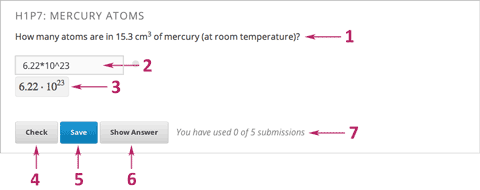
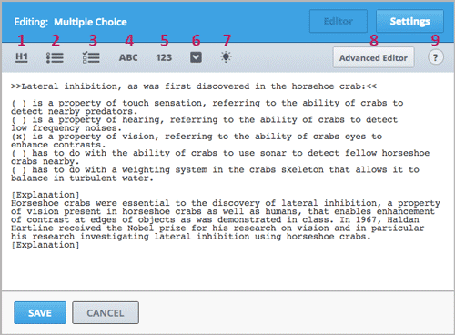
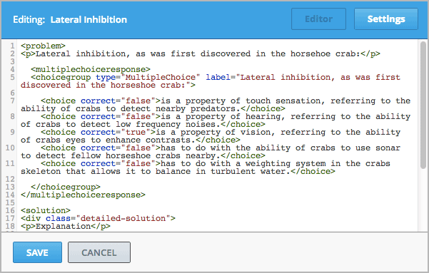
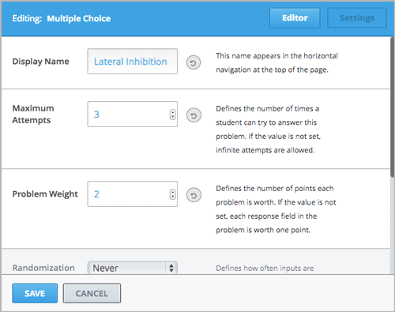
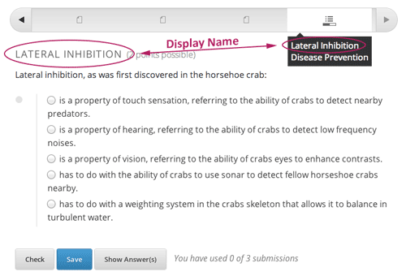
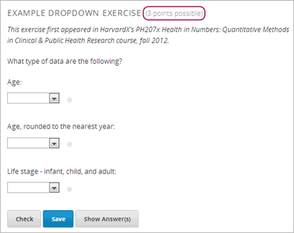
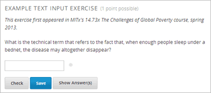
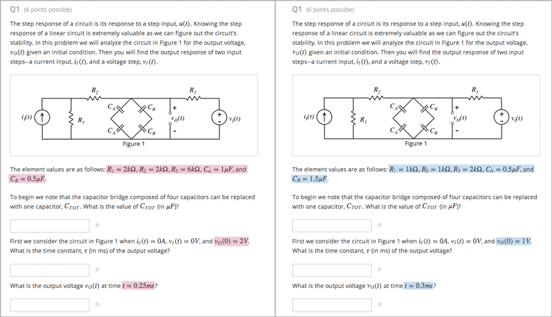

.. _Working with Problem Components:

################################
Working with Problem Components
################################

******************************
Overview of Problem Components
******************************

The problem component allows you to add interactive, automatically
graded exercises to your course content. You can create many different
types of problems in Studio.

All problems receive a point score, but, by default, problems do not count
toward a student's grade. If you want the problems to count toward the
student's grade, change the assignment type of the subsection that contains the
problems.

This section covers the basics of Problem components--what they look like to you and your students, and the options that every problem component has. For more information about individual problem types, see :ref:`Create Exercises`.

For more information, see the following topics.

* :ref:`Problem Student View`
* :ref:`Problem Studio View`
* :ref:`Problem Settings`
* :ref:`Modifying a Released Problem`
* :ref:`Additional Work with Problems`
* :ref:`Multiple Problems in One Component`
* :ref:`Problem Randomization`
  

.. _Problem Student View:

************************************
The Student View of a Problem
************************************

All problems on the edX platform have several component parts.

#. **Problem text.** The problem text can contain any standard HTML formatting.

#. **Response field with the student’s answer.** Students enter answers
   in *response fields*. The appearance of the response field depends on
   the type of the problem.

#. **Rendered answer.** For some problem types, Studio uses MathJax to
   render plain text as “beautiful math.”

#. **Check button.** The student clicks **Check** to submit a response
   or find out if his answer is correct. If the answer is correct, a green
   check mark appears. If it is incorrect, a red X appears. When the
   student clicks the **Check button**, Studio saves the grade and current
   state of the problem.

#. **Save button.** The student can click **Save** to save his current
   response without submitting it for a grade. This allows the student to
   stop working on a problem and come back to it later.

#. **Show Answer button.** This button is optional. When the student
   clicks **Show Answer**, the student sees both the correct answer (see 2
   above) and the explanation (see 10 below). The instructor sets whether
   the **Show Answer** button is visible.

#. **Attempts.** The instructor may set a specific number of attempts or
   allow unlimited attempts.

   .. image:: ../Images//AnatomyOfExercise2.png
    :alt: Image of a problem from a student's point of view, with callouts for attempts and showing the answer

#. **Feedback.** After a student clicks **Check**, all problems return a
   green check mark or a red X.

   .. image:: ../Images//AnatomyofaProblem_Feedback.png
    :alt: Image of feedback checkmark and x from a student's point of view

#. **Correct answer.** Most problems require that the instructor specify
   a single correct answer.

#. **Explanation.** The instructor may include an explanation that
   appears when a student clicks **Show Answer**.

#. **Reset button.** This button clears the student input, so that the
   problem looks the way it did originally.

#. **Hide Answer button.**

   .. image:: ../Images//AnatomyOfExercise3.png
    :alt: Image of a problem in the course accordian

#. **Grading.** The instructor may specify whether a group of problems
   is graded. If a group of problems is graded, a clock icon appears for
   that assignment in the course accordion.

   .. image:: ../Images//clock_icon.png

#. **Due date.** The date that the problem is due. A problem that is
   past due does not have a **Check** button. It also does not accept
   answers or provide feedback.

.. note::  Problems can be **open** or **closed.** Closed problems do not
           have a **Check** button. Students can still see questions, solutions,
           and revealed explanations, but they cannot check their work, submit
           responses, or change an earlier score.

There are also some attributes of problems that are not immediately
visible. You can set these attributes in Studio.

-  **Randomization.** For some problems, the instructor can specify
   whether a problem will use randomly generated numbers that vary from
   student to student.
-  **Weight.** Different problems in a particular problem set may be
   given different weights.
-  **Label.** To improve accessibility for students who have disabilities, each problem needs a descriptive label. The label typically contains part or all of the text of the question in the problem. Most templates include a space for a label. You can find example labels in the documentation for each problem or tool type. 

.. _Problem Studio View:

************************************
The Studio View of a Problem
************************************

All problems are written in XML. However, Studio offers two interfaces for editing problem components: the Simple Editor and the Advanced Editor.

-  The **Simple Editor** allows you to edit problems visually, without
   having to work with XML.
-  The **Advanced Editor** converts the problem to edX’s XML standard
   and allows you to edit that XML directly.

You can switch at any time from the Simple Editor to the Advanced Editor by clicking **Advanced Editor** in the top right corner of the Simple Editor interface. However, it is not possible to switch from the Advanced Editor to the Simple Editor.

.. _Simple Editor:

=================
The Simple Editor
=================

Several problem templates, including multiple choice and text input problem templates, open in the Simple Editor. The following image shows a multiple choice problem in the Simple Editor.

The Simple Editor includes a toolbar that helps you format the text of your problem.
When you select text and then click the formatting buttons, the Simple Editor formats
the text for you automatically. The toolbar buttons are the following:

1. Create a level 1 heading.
2. Create multiple choice options.
3. Create checkbox options.
4. Create text input options.
5. Create numerical input options.
6. Create dropdown options.
7. Create an explanation that appears when students click **Show Answer**.
8. Open the problem in the Advanced Editor.
9. Open a list of formatting hints.

The following problem templates open in the Simple Editor.

-  :ref:`Checkbox` In checkbox problems, students select one or more options
   from a list of possible answers.
-  :ref:`Dropdown` In dropdown problems, students select one answer from a
   dropdown list.
-  :ref:`Multiple Choice` Multiple choice problems require students to
   select one answer from a list of choices that appear directly below
   the question.
-  :ref:`Numerical Input` Numerical input problems require answers that
   include only integers, fractions, and a few common constants and
   operators.
-  :ref:`Text Input` In text input problems, students enter a short text
   answer to a question.

.. _Advanced Editor:

===================
The Advanced Editor
===================
The **Advanced Editor** opens a problem in XML. Templates for problems such as
such as drag and drop and math expression input open directly in the Advanced Editor.

The following image shows the multiple choice problem above in the Advanced Editor
instead of the Simple Editor.

The following problem templates open in the Advanced Editor.

-  :ref:`Circuit Schematic Builder` In circuit schematic problems, students
   create and modify circuits on an interactive grid and submit
   computer-generated analyses of the circuits for grading.
-  :ref:`Custom JavaScript` With custom JavaScript display
   and grading problems, you can incorporate problem types that you've created
   in HTML into Studio via an IFrame.
-  :ref:`Drag and Drop` Drag and drop problems require students to drag text
   or objects to a specific location on an image.
-  :ref:`Image Mapped Input` Image mapped input problems require students to
   click a specific location on an image.
-  :ref:`Math Expression Input` Math expression input problems require
   students to enter a mathematical expression as text, such as
   e=m\*c^2.
-  :ref:`Problem with Adaptive Hint` These problems can give students
   feedback or hints based on their responses. Problems with adaptive
   hints can be text input or multiple choice problems.
- :ref:`Problem Written in LaTeX` This problem type allows you to convert problems that you’ve already written in LaTeX into the edX format. Note that this problem type is still a prototype, however, and may not be supported in the future.
-  :ref:`Write Your Own Grader` Custom Python-evaluated input (also called "write-your-own-grader" problems evaluate students' responses using an embedded Python script that you create. These problems can be any type.

.. _Problem Settings:

******************
Problem Settings
******************

In addition to the text of the problem, problems that you create using a Problem component have the following settings. These settings appear on the **Settings** tab in the component editor. 

-  **Display Name**
-  **Maximum Attempts**
-  **Problem Weight**
-  **Randomization**
-  **Show Answer**

===============
Display Name
===============

This setting indicates the name of your problem. The display name
appears as a heading over the problem in the LMS and in the course
ribbon at the top of the page.

==============================
Maximum Attempts
==============================

This setting specifies the number of times a student can try to answer
the problem. By default, a student has an unlimited number of attempts.

.. note:: Only questions that have a **Maximum Attempts** setting of 1 or higher are included on the Student Answer Distribution report that you can download during your course.

.. _Problem Weight:

==============================
Problem Weight
==============================

.. note:: Studio stores scores for all problems, but scores only count
          toward a student’s final grade if they are in a subsection that is
          graded.

This setting specifies the maximum number of points possible for the
problem. The problem weight appears next to the problem title.

By default, each response field, or “answer space,” in a Problem
component is worth one point. Any Problem component can have multiple
response fields. For example, the Problem component above
contains one dropdown problem that has three separate questions for students
to answer, and thus has three response fields.

The following Problem component contains one text input problem,
and has just one response field.

Computing Scores
****************

The score that a student earns for a problem is the result of the
following formula:

**Score = Weight × (Correct answers / Response fields)**

-  **Score** is the point score that the student receives.
-  **Weight** is the problem’s maximum possible point score.
-  **Correct answers** is the number of response fields that contain
   correct answers.
-  **Response fields** is the total number of response fields in the
   problem.

**Examples**

The following are some examples of computing scores.

*Example 1*

A problem’s **Weight** setting is left blank. The problem has two
response fields. Because the problem has two response fields, the
maximum score is 2.0 points.

If one response field contains a correct answer and the other response
field contains an incorrect answer, the student’s score is 1.0 out of 2
points.

*Example 2*

A problem’s weight is set to 12. The problem has three response fields.

If a student’s response includes two correct answers and one incorrect
answer, the student’s score is 8.0 out of 12 points.

*Example 3*

A problem’s weight is set to 2. The problem has four response fields.

If a student’s response contains one correct answer and three incorrect
answers, the student’s score is 0.5 out of 2 points.

===============
Randomization
===============

This setting specifies whether certain values in your problem change each time a different student accesses the problem, or each time a single student tries to answer the problem. For example, the highlighted values in the problem below change each time a student submits an answer to the problem. 

If you want to change, or "randomize," specific values in your problem, you have to do both the following:

- Make sure that your problem contains a Python script that randomizes the values that you want. 
- Enable randomization in the Problem component. 

.. note:: Note that specifying this **Randomization** setting is different from *problem randomization*. The **Randomization** setting randomizes variables within a single problem. Problem randomization offers different problems or problem versions to different students. For more information, see :ref:`Problem Randomization`.

To enable randomization, select an option for the **Randomization** setting. This setting has four options.

+-------------------+--------------------------------------+
| **Always**        | Students see a different version of  |
|                   | the problem each time they click     |
|                   | **Check**.                           |
+-------------------+--------------------------------------+
| **On Reset**      | Students see a different version of  |
|                   | the problem each time they click     |
|                   | **Reset**.                           |
+-------------------+--------------------------------------+
| **Never**         | All students see the same version    |
|                   | of the problem. This is the default. |
+-------------------+--------------------------------------+
| **Per Student**   | Individual students see the same     |
|                   | version of the problem each time     |
|                   | they look at it, but that version    |
|                   | is different from the version that   |
|                   | other students see.                  |
+-------------------+--------------------------------------+

===============
Show Answer
===============

This setting defines when the problem shows the answer to the student.
This setting has the following options.

+-------------------+--------------------------------------+
| **Always**        | Always show the answer when the      |
|                   | student clicks the **Show Answer**   |
|                   | button.                              |
+-------------------+--------------------------------------+
| **Answered**      | Show the answer after the student    |
|                   | has submitted her final answer.      |
+-------------------+--------------------------------------+
| **Attempted**     | Show the answer after the student    |
|                   | has tried to answer the problem one  |
|                   | time, whether or not the student     |
|                   | answered the problem correctly.      |
+-------------------+--------------------------------------+
| **Closed**        | Show the answer after the student    |
|                   | has used up all his attempts to      |
|                   | answer the problem or the due date   |
|                   | has passed.                          |
+-------------------+--------------------------------------+
| **Finished**      | Show the answer after the student    |
|                   | has answered the problem correctly,  |
|                   | the student has no attempts left, or |
|                   | the problem due date has passed.     |
+-------------------+--------------------------------------+
| **Correct or      | Show the answer after the student    |
| Past Due**        | has answered the problem correctly   |
|                   | or the problem due date has passed.  |
+-------------------+--------------------------------------+
| **Past Due**      | Show the answer after the due date   |
|                   | for the problem has passed.          |
+-------------------+--------------------------------------+
| **Never**         | Never show the answer. In this case, |
|                   | the **Show Answer** button does not  |
|                   | appear next to the problem in Studio |
|                   | or in the LMS.                       |
+-------------------+--------------------------------------+

.. _Modifying a Released Problem:

*********************************
Modifying a Released Problem
*********************************

.. warning:: Be careful when you modify problems after they have been released!

After a student submits a response to a problem, Studio stores the
student’s response, the score that the student received, and the maximum
score for the problem. Studio updates these values when a student
submits a new response to a problem. However, if an instructor changes a
problem or its attributes, Studio does not automatically update existing
student information for that problem.

For example, you may release a problem and specify that its answer is 3.
After some students have submitted responses, you notice that the answer
should be 2 instead of 3. When you update the problem with the correct
answer, Studio doesn’t update scores for students who answered 2 for the
original problem and thus received the wrong score.

For another example, you may change the number of response fields to
three. Students who submitted answers before the change have a score of
0, 1, or 2 out of 2.0 for that problem. Students who submitted answers
after the change have scores of 0, 1, 2, or 3 out of 3.0 for the same
problem.

If you change the weight of the problem, however, the existing scores
update when you refresh the **Progress** page.

===============
Workarounds
===============

If you have to modify a released problem in a way that affects grading,
you have two options. Note that both options require you to ask your
students to go back and resubmit a problem.

-  In the Problem component, increase the number of attempts for the
   problem. Then ask all your students to redo the problem.
-  Delete the entire Problem component in Studio and create a new
   Problem component with the content and settings that you want. Then
   ask all your students to complete the new problem.

.. _Additional Work with Problems:

************************************
Additional Work with Problems
************************************

You have some further options when you work with problems. You can include more than one problem in a single problem component, or you can set up a problem that presents different versions to different students. 

.. _Multiple Problems in One Component:

====================================
Multiple Problems in One Component
====================================

You may want to create a problem that has more than one response type.
For example, you may want to create a numerical input problem, and then
include a multiple choice question about the numerical input problem.
Or, you may want a student to be able to check the answers to
many problems at one time. To do this, you can include multiple problems
inside a single Problem component. The problems can be different types.

To create multiple problems in one component, create a new Blank
Advanced Problem component, and then add the XML for each problem in
the component editor. You only need to include the XML for the problem
and its answers. You don’t have to include the code for other elements,
such as the **Check** button.

Elements such as the **Check**, **Show Answer**, and **Reset** buttons,
as well as the settings that you select for the Problem component, apply
to all of the problems in that component. Thus, if you set the maximum
number of attempts to 3, the student has three attempts to answer
the entire set of problems in the component as a whole rather than three
attempts to answer each problem individually. If a student clicks
**Check**, the LMS scores all of the problems in the component at once.
If a student clicks **Show Answer**, the answers for all the problems in
the component appear.

.. _Problem Randomization:

===========================
Problem Randomization
===========================

You may want to present different students with different problems, or different versions of the same problem. To do this, you'll create a Problem component for each problem or version in Studio, and then edit your course outside of Studio to randomize the problem that students see.

Note that *problem randomization* is different from the **Randomization** setting in Studio. The **Randomization** setting randomizes variables within a single problem. Problem randomization offers different problems or problem versions to different students.

.. note:: Creating problems with versions that can be randomized requires you to export your course, edit some of your course's XML files in a text editor, and then re-import your course. We recommend that you create a backup copy of your course before you do this. We also recommend that you only edit your course files in the text editor if you're very familiar with editing XML.

Terminology
************

Sections, subsections, units, and components have different names in the **Course Outline** view and in the list of files that you'll see after you export your course and open the .xml files for editing. The following table lists the names of these elements in the **Course Outline** view and in a list of files.

.. list-table::
   :widths: 15 15
   :header-rows: 0

   * - Course Outline View
     - File List
   * - Section
     - Chapter
   * - Subsection
     - Sequential
   * - Unit
     - Vertical
   * - Component
     - Discussion, HTML, problem, or video

For example, when you want to find a specific section in your course, you'll look in the **Chapter** folder when you open the list of files that your course contains. To find a unit, you'll look in the **Vertical** folder.

.. _Create Randomized Problems:

Create Randomized Problems
****************************

#. In the unit where you want to create a randomized problem, create a separate Problem component for each version or problem that you want to randomize. For example, if you want to offer four versions or problems, you'll create four separate Problem components. Make a note of the 32-digit unit ID that appears in the **Unit Identifier** field under **Unit Location**.

#. Export your course. For information about how to do this, see :ref:`Exporting and Importing a Course`. Save the .tar.gz file that contains your course in a memorable location so that you can find it easily.

#. Locate the .tar.gz file that contains your course, and then unpack the .tar.gz file so that you can see its contents in a list of folders and files.

   - To do this on a Windows computer, you'll need to download a third-party program. For more information, see `How to Unpack a tar File in Windows <http://www.haskell.org/haskellwiki/How_to_unpack_a_tar_file_in_Windows>`_, `How to Extract a Gz File <http://www.wikihow.com/Extract-a-Gz-File>`_, `The gzip Home Page <http://www.gzip.org/>`_, or the `Windows <http://www.ofzenandcomputing.com/how-to-open-tar-gz-files/#windows>`_ section of the `How to Open .tar.gz Files <http://www.ofzenandcomputing.com/how-to-open-tar-gz-files/>`_ page.

   - For information about how to do this on a Mac, see the `Mac OS X <http://www.ofzenandcomputing.com/how-to-open-tar-gz-files/#mac-os-x>`_ section of the `How to Open .tar.gz Files <http://www.ofzenandcomputing.com/how-to-open-tar-gz-files/>`_ page.

#. In the list of folders and files, open the **Vertical** folder. 

   .. note:: If your unit is not published, open the **Drafts** folder, and then open the **Vertical** folder in the **Drafts** folder.

#. In the **Vertical** folder, locate the .xml file that has the same name as the unit ID that you noted in step 1, and then open the file in a text editor such as Sublime 2. For example, if the unit ID is e461de7fe2b84ebeabe1a97683360d31, you'll open the e461de7fe2b84ebeabe1a97683360d31.xml file.

   The file contains a list of all the components in the unit, together with the URL names of the components. For example, the following file contains four Problem components.

   .. code-block:: xml
     
       <vertical display_name="Test Unit">
          <problem url_name="d9d0ceb3ffc74eacb29501183e26ad6e"/>
          <problem url_name="ea66d875f4bf4a9898d8e6d2cc9f3d6f"/>
          <problem url_name="2616cd6324704f85bc315ec46521485d"/>
          <problem url_name="88987707294d4ff0ba3b86921438d0c0"/>
       </vertical>

#. Add ``<randomize> </randomize>`` tags around the components for the problems that you want to randomize.

   .. code-block:: xml
      
       <vertical display_name="Test Unit">
         <randomize>
            <problem url_name="d9d0ceb3ffc74eacb29501183e26ad6e"/>
            <problem url_name="ea66d875f4bf4a9898d8e6d2cc9f3d6f"/>
            <problem url_name="2616cd6324704f85bc315ec46521485d"/>
            <problem url_name="88987707294d4ff0ba3b86921438d0c0"/>
         </randomize>
       </vertical>

#. After you add the ``<randomize> </randomize>`` tags, save and close the .xml file.

#. Re-package your course as a .tar.gz file.

   * For information about how to do this on a Mac, see `How to Create a Tar GZip File from the Command Line <http://osxdaily.com/2012/04/05/create-tar-gzip/>`_.

   * For information about how to do this on a Windows computer, see `How to Make a .tar.gz on Windows <http://stackoverflow.com/questions/12774707/how-to-make-a-tar-gz-on-windows>`_.

#. In Studio, re-import your course.

.. note::

  * Once you've implemented randomization, you can only see one of the versions or problems in Studio. You can edit that single problem directly in Studio, but to edit any of the other problems, you'll have to export your course, edit the problems in a text editor, and then re-import the course. This is true for instructors as well as course teams.
  
  * A .csv file for student responses contains the responses to each of the problems in the problem bank. 
