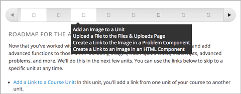
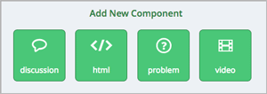
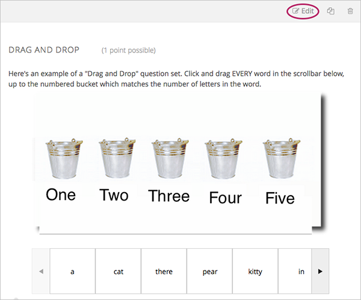
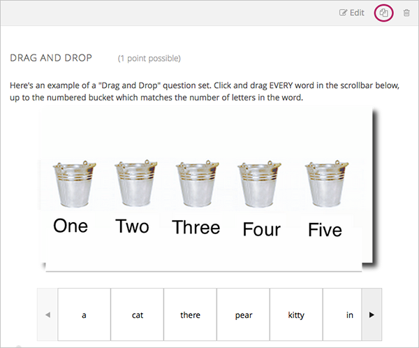
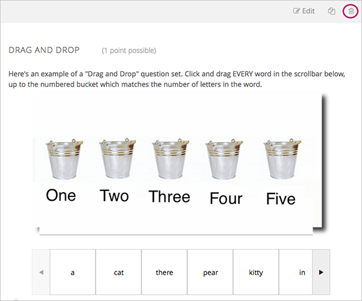
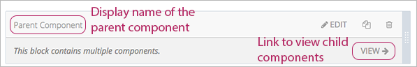
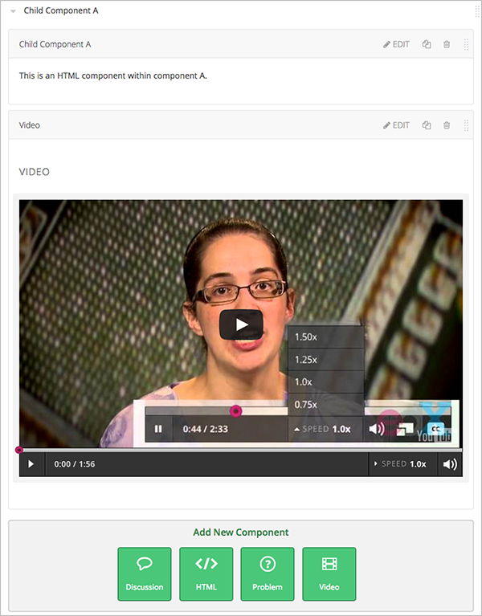
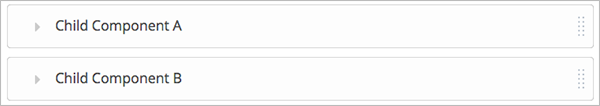
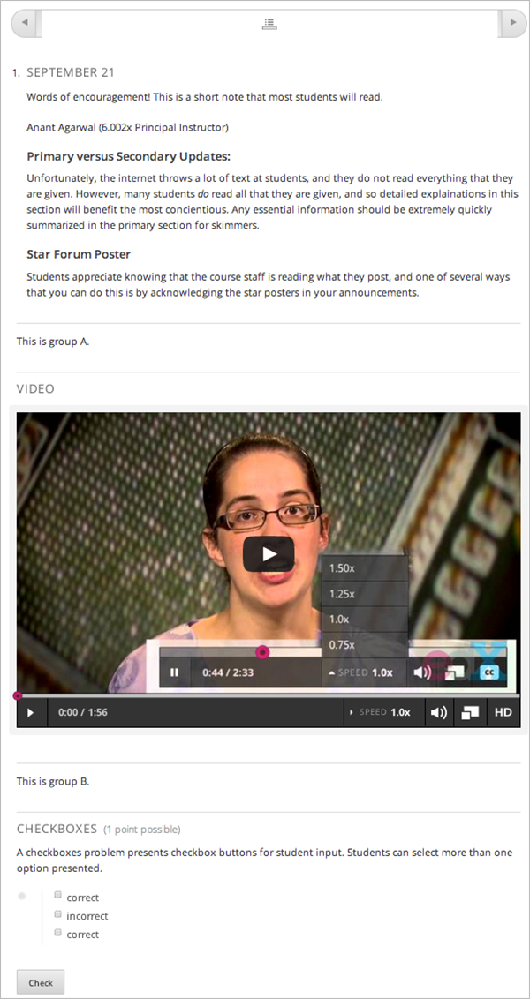
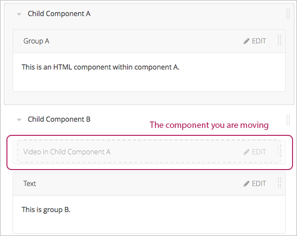

.. _Developing Course Components:

###################################
Developing Course Components
###################################

This chapter describes how you develop course components. See:

* `What is a Component?`_
* `Add a Component`_
* `Edit a Component`_
* `Duplicate a Component`_
* `Delete a Component`_
* `Components that Contain Other Components`_

For more information about specific component types, see:

* :ref:`Creating Course Content Index`
* :ref:`Exercises and Tools Index`

********************
What is a Component?
********************

A component is the part of a unit that contains your actual course content. A
unit can contain one or more components.

A student can view the name of all components in a unit by hovering over the
unit in the ribbon at the top of the page.

By default, Studio includes four types of components.

* **Discussion components** provide discussion spaces in the body of your
  course. Students can explore ideas about a lesson with their peers in a
  discussion space.
* **HTML components** allow you to add text, images, and some types of learning
  tools to your course. Content in HTML components is formatted as HTML.
* **Problem components** enable you to add many different types of exercises
  and problems to you course, from simple multiple choice problems to complex
  circuit schematic exercises.
* **Video components** contain the videos that you want to include in your
  course.

.. _Add a Component:

********************
Add a Component
********************

To add a component to the unit, click the component type that you want under
**Add New Component**.

For more information, see the documentation for the specific component type
that you want:

- :ref:`Working with Discussion Components`
- :ref:`Working with HTML Components`
- :ref:`Working with Problem Components`
- :ref:`Working with Video Components`
  
After you add a component, it is not visible to students until you
:ref:`publish the unit<Publish a Unit>`.

.. _Edit a Component:

********************
Edit a Component
********************

To edit a component, click **Edit**:

Then follow instructions for the type of component you are editing.

After you edit a component, the changes are not visible to students until you
:ref:`publish the unit<Publish a Unit>`.

=====================================
Set the Display Name for a Component
=====================================

Each component has a display name that shows in the component header when you
can edit the component. The display name also shows to students when they hover
the cursor over the unit icon in the course ribbon.

To set the display name for a component:

#. Edit the component.
#. Click **Settings**.
#. Edit the **Display Name** field.

  .. image:: ../Images/display-name.png
   :alt: Image of the Display Name field for a component.

4. Click **Save**.

Different types of components have different fields in the Settings dialog box,
but all have the **Display Name** field.

.. _Duplicate a Component:

**********************
Duplicate a Component
**********************

When you duplicate a component, a new copy of that component is added directly
beneath the first component. You can then modify the duplicate. In many cases,
duplicating a component and editing a copy is a faster way to create new
content.

To duplicate a component, click the Duplicate icon in the component header:

Then follow instructions for the type of component you are editing.

After you duplicate a component, the new component is not visible to students
until you :ref:`publish the unit<Publish a Unit>`.

.. note::  You cannot duplicate a content experiment.

.. _Delete a Component:

**********************
Delete a Component
**********************

.. caution:: 
 Be sure you want to delete the component. You can not undo the deletion.

To delete a component:

#. Click the Delete icon in the component header:

2. When you receive the confirmation prompt, click **Yes, delete this
   component**.

After you delete a component, the component remians visible to students until you :ref:`publish the unit<Publish a Unit>`.

.. _Components that Contain Other Components:

******************************************
Components that Contain Other Components
******************************************

For specific use cases, you configure course content so that components contain
other components.  For example, if you want to include conditional components
or content experiments, you have to create components inside components. See
:ref:`Creating Content Experiments` for more information.

The component that contains other components is referred to as the *parent*;
the contained components are referred to as *children*.

In the unit page, a parent component appears with the display name and a
**View** link. For example:

==================================================
Edit a Parent Component
==================================================

A parent component does not directly contain content. Content such as HTML,
videos, or problems are in the child components.

A parent component has a display name. When the unit is private or in draft,
click **Edit** in the parent component to change the display name.

.. note:: 
  Parent components of a specific type, such as content experiments, have
  additional attributes that you edit.

======================================
View Child Components
======================================

When you click **View** in the parent component, the parent component page
opens, showing all child components. In this example, Child Component A
contains an HTML component and a video:

Click the arrow next to a child component name to collapse it and hide the
component's contents:

Click the arrow again to expand the component.

See:

* `Edit a Component`_
* `Set the Display Name for a Component`_
* `Duplicate a Component`_
* `Delete a Component`_

======================================
Add a Child Component
======================================

If the containing unit is private or in draft, you can add a child component in
its parent component.

To add a child component, open and expand the parent component. Then click the
component type that you want under **Add New Component** within the parent
component.

For more information, see the documentation for the specific component type
that you want:

- :ref:`Working with Discussion Components`
- :ref:`Working with HTML Components`
- :ref:`Working with Problem Components`
- :ref:`Working with Video Components`

======================================
XML for Parent and Child Components
======================================

You develop parent and child components in XML, then import the XML course into
Studio to verify that the structure is as you intended. 

For more information about working with your course's XML files, including
information about terminology, see the `edX XML Tutorial <http://edx.readthedoc
s.org/projects/devdata/en/latest/course_data_formats/course_xml.html>`_.

The following examples show the XML used to create the unit and components
shown in Studio above.

The XML for the unit is:

.. code-block:: xml

    <vertical display_name="Unit 1">
        <html url_name="6a5cf0ea41a54b209e0815147896d1b2"/>
        <vertical url_name="131a499ddaa3474194c1aa2eced34455"/>
    </vertical>

The ``<vertical url_name="131a499ddaa3474194c1aa2eced34455"/>`` element above
references the parent component file that contains the child components:
 
.. code-block:: xml

    <vertical display_name="Parent Component">
        <vertical url_name="2758bbc495dd40d59050da15b40bd9a5"/>
        <vertical url_name="c5c8b27c2c5546e784432f3b2b6cf2ea"/>
    </vertical>

The two verticals referenced by the parent component refer to the child
components, which contain the actual content of your course:

.. code-block:: xml

    <vertical display_name="Child Component A">
        <html url_name="4471618afafb45bfb86cbe511973e225"/>
        <video url_name="fbd800d0bdbd4cb69ac70c47c9f699e1"/>
    </vertical>

.. code-block:: xml

    <vertical display_name="Child Component B">
        <html url_name="dd6ef295fda74a639842e1a49c66b2c7"/>
        <problem url_name="b40ecbe4ed1b4280ae93e2a158edae6f"/>
    </vertical>

Theoretically, there is no limit to the levels of component nesting you can use
in your course.

======================================
The Student View of Nested Components
======================================

For students, all parent and child components are displayed on the unit page.
The following example shows the student view of the unit described above:

.. note:: The visibility of nested components depends on the visibility of 
 the parent unit. The parent unit must be public for students to see nested
 components. For more information, see :ref:`Visibility of Components Contained
 by Other Components`.

*******************************
Reorganizing Child Components
*******************************

You can reorganize child components through the same drag and drop process you
use for other objects in your course outline. You hover over the element handle
on the right side of the screen until the mouse pointer changes to a four-
headed arrow. Then, click and drag the element to the location that you want.

Furthermore, when you have multiple levels of nesting, you can drag a child
component into a different parent component, if both parents are expanded. For
example, you can select the video component that is in Child Component A and
drag it into Child Component B. Select the video component, and as you drag it
into Child Component B, release the mouse button when a dashed outline of the
component you are moving appears in the new location:

You can also drag a child component outside of a parent, so that the child
moves to the same level as the parent.

.. note:: 
  For content experiments, you cannot drag a child component outside of a test
  group.