.. _Developing Your Course Outline:

###################################
Developing Your Course Outline
###################################

As you develop your course, you work primarily in the edX Studio course
outline.  This chapter includes the following information about working with
the course outline:

* `Open the Course Outline`_
* `Example of a Developed Course in the Outline`_
* `View the Course Organization as a Student`_
* `Navigate the Course Outline`_
* `Add Content in the Course Outline`_
* `Reorganize the Course Outline`_
* `Delete Content in the Course Outline`_
  
See the following chapters for information about working with the course
building blocks in the course outline:

* :ref:`Developing Course Sections`
* :ref:`Developing Course Subsections`
* :ref:`Developing Course Units`
* :ref:`Developing Course Components`

****************************
Open the Course Outline
****************************

To view the course outline:

#. Log in to edX Studio.
#. In the **My Courses** page, select the course you want to develop.

   The course outline opens by default when you open a course.

When working in a course, to open the outline, from the **Content** menu,
select **Outline**.
   
The first time you view an outline for a course, it contains no content. 

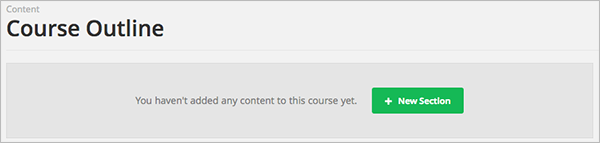

You must :ref:`create the first section<Create a Section>`.
  
********************************************************
Example of a Developed Course in the Outline
********************************************************

The following example shows a sample course in the outline, with indications
for sections, subsections, and units. As you develop your course, it will begin
to look like this example:

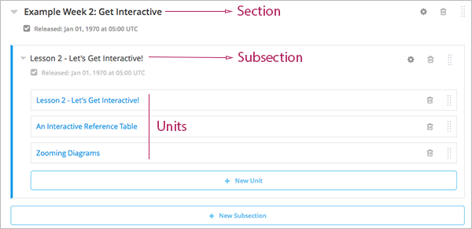

As this example shows, the course is organized into the following levels:

#. :ref:`Sections<Developing Course Sections>`
#. :ref:`Subsections<Developing Course Subsections>`
#. :ref:`Units<Developing Course Units>`

:ref:`Components<Developing Course Components>` are not shown in the outline. You add or access components by clicking on the units that contain them.
  
Use the links above for more information and instructions on working with each
type of object in the course. The rest of this chapter provides more detail
about the course outline.

********************************************************
View the Course Organization as a Student
********************************************************

The content you see in the outline in Studio is displayed to students in the
Courseware tab in the LMS. The following image shows how a student sees your
course content:

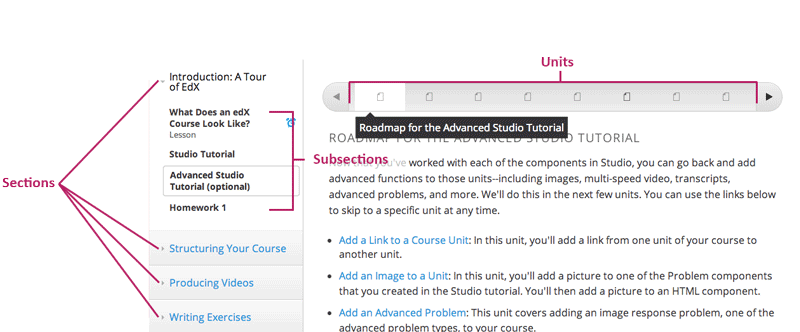

.. _Navigating the Course Outline:

*******************************
Navigate the Course Outline
*******************************

In Studio, you navigate the course outline by expanding and collapsing sections
and subsections.  Use the drop-down icon next to a section or subsection name
to expand or collapse its contents:

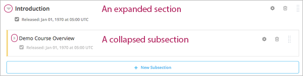

When you expand a subsection, all units in the subsection are visible:

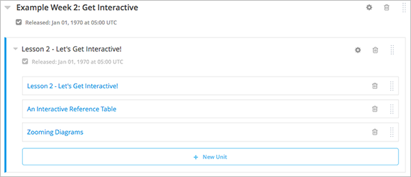

Click the name of a unit to open the :ref:`unit page<Developing Course Units>`.

.. _Add Content in the Course Outline:

************************************************
Add Content in the Course Outline
************************************************

You add sections, subsections, and units directly in the outline.

To add a section to the end of the outline, click **New Section** at the top of
the outline page or at the bottom of the outline:

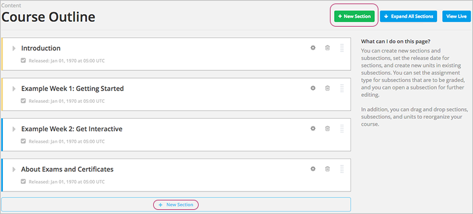

To add a subsection to the end of the section, expand the section and click
**New Subsection**:

.. image:: ../Images/outline-new-subsection.png
 :alt: The outline with the New Subsection button circled

To add a unit to the end of a subsection, expand the subsection and click **New
Unit**:

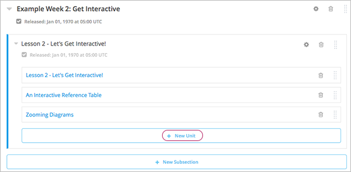

The :ref:`unit<Developing Course Units>` page opens.

.. _Reorganize the Course Outline:

************************************************
Reorganize the Course Outline
************************************************

You can reorganize your course content by dragging and dropping sections,
subsections, and units to new locations in the outline.

To move a section, subsection, or unit, hover over the handle on the right of
the object's box until the cursor changes to a four-headed arrow. For example,
in the image below, the handle for the subsection Lesson 1 - Getting Started is
selected:

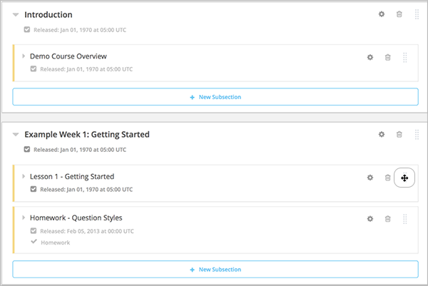

Then, click and drag the object to the location that you want. 

If you expanded the section or subsection you are moving the object to, when
you move the object, a blue line indicates where the object will land when you
release the mouse button. For example, in the image below, the subsection
Lesson 1 - Getting Started is being moved to the end of the section
Introduction:

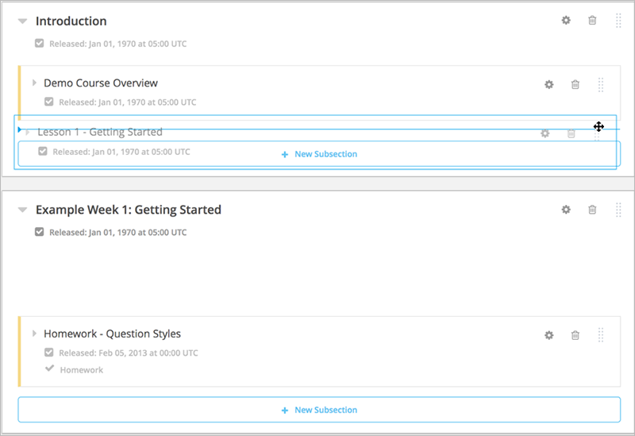

If you did not expand the section or subsection you are moving the object to,
the outline of that section or subsection turns blue when you have moved the
object to a valid location. You can then release the mouse button. For example,
in the image below, the subsection Lesson 1 - Getting Started is being moved to
the collapsed section Introduction:

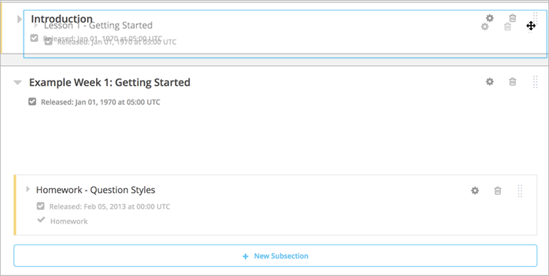

.. _Delete Content in the Course Outline:

************************************************
Delete Content in the Course Outline
************************************************

You delete sections, subsections, and units from the course outline.

.. warning::  
 You cannot restore course content after you delete it. To ensure you do not
 delete content you may need later, you can move any unused content to a
 section in your course that you set to never release.

Click the delete icon in the box for the object you want to delete:

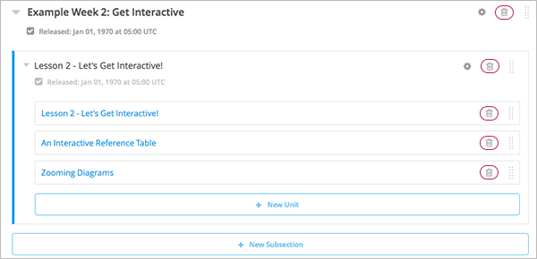

You are prompted to confirm the deletion.

.. note::
 When you delete an object, all objects that it contains are deleted. For
 example, when you delete a subsection, all units in that subsection are
 deleted.