.. _Developing Course Units:

###################################
Developing Course Units
###################################

When working with units in the course outline, ensure you understand the
following:

* `What is a Unit?`_
* `Viewing Units in the Outline`_
* `Viewing the Unit Page`_
* `Viewing Units as a Student`_
* `Unit Publishing Status and Visibility to Students`_
* `Unit Publishing Status`_

When developing your course, you perform the following tasks with units:

* `Create a Unit`_
* `Edit a Unit`_
* `Preview a Unit`_
* `Publish a Unit`_
* `Discard Changes to a Unit`_
* `View a Published Unit`_
* `Hide a Unit from Students`_
* `Delete a Unit`_

You add content to units with :ref:`course components<Developing Course
Components>`.

.. _What is a Unit?:

****************************
What is a Unit?
****************************

A unit is a part of a :ref:`subsection<Developing Course Subsections>` that
students view as a single page.

A unit contains one or more :ref:`components<Developing Course Components>`,
such as :ref:`HTML content<Working with HTML Components>`,
:ref:`problems<Working with Problem Components>`, :ref:`discussions<Working
with Discussion Components>`, and
:ref:`videos<Working with Video Components>`.

****************************
Viewing Units in the Outline
****************************

To view units in the outline, you :ref:`expand<Navigating the Course Outline>`
the parent section and subsection:

.. image:: ../Images/outline-callouts.png
 :alt: An outline with callouts for sections, subsections, and units

****************************
Viewing the Unit Page
****************************

When you click on a unit name in the outline, the **Unit** page opens.

The following example shows a unit page with two components, with circles and
text to show different areas and controls in the page.

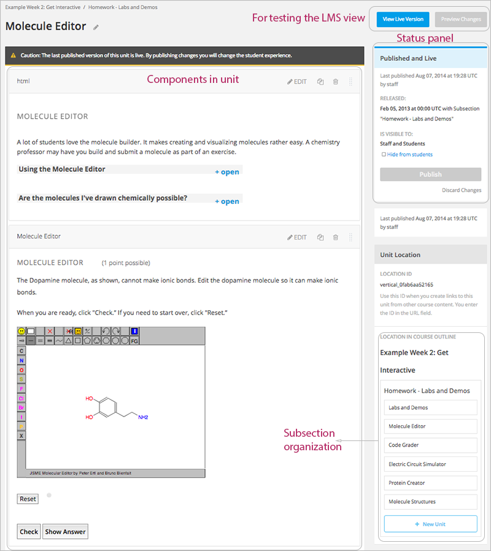

****************************
Viewing Units as a Student 
****************************

To a student using the edX Learning Management System, each unit in the
subsection appears as a link on the course ribbon at the top of the page. The
active unit is open beneath the course ribbon.

The following image shows a subsection that has seven units, which are circled
in the ribbon above the video, with the first unit open:

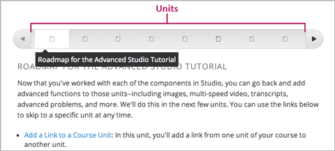

.. _The Unit Workflow:

************************************************
The Unit Workflow
************************************************

When you have set up the :ref:`section<Developing Course Sections>` and
:ref:`subsection<Developing Course Subsections>` in the course outline, you
then work with units.

The typical workflow is:

#. :ref:`Create a new unit<Create a Unit>`.
#. :ref:`Add components to the unit<Add a Component>`.
#. :ref:`Publish the unit<Publish a Unit>`.
   
After you publish the unit, you can:

#. :ref:`Modify components in the unit<Developing Course Components>`.
#. :ref:`Publish the changes to the unit<Publish a Unit>`.
   
The following diagram shows the typical unit development workflow:

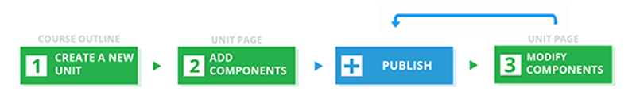
   
As you work through these steps, the **publishing status** of the unit changes.
The publishing status controls the content available to students, along with
:ref:`release dates<Release Dates>`. See the next section for more information.

.. _Unit States and Visibility to Students:

*************************************************
Unit Publishing Status and Visibility to Students
*************************************************

The following information summarizes whether or not students can see a unit.

* Students never see a unit with the publishing status `Draft (Never
  Published)`_.

* Students never see a unit with the publishing status `Visible to Staff
  Only`_. See `Hide a Unit from Students`_ for more information.

* Students do not see a unit with the publishing status `Published Not Yet
  Released`_ until the :ref:`release date <Release Dates>`. On the release
  date, the status changes to `Published and Live`_.

* If the publishing status is `Published and Live`_, students see the current
  version of the unit.
  
* If the publishing status is `Draft (Unpublished Changes)`_, students see the
  last published version of the unit if the :ref:`release date <Release Dates>`
  for the containing section and subsection has passed.

For more information, see :ref:`Controlling Content Visibility`.

.. _Unit Publishing Status:

************************************************
Unit Publishing Status
************************************************ 

As an course author, you work with units with the following statuses:

* `Draft (Never Published)`_
* `Published and Live`_
* `Published Not Yet Released`_
* `Draft (Unpublished Changes)`_
* `Visible to Staff Only`_

.. _Draft (Never Published):

========================
Draft (Never Published)
========================

When you create a new unit and add components to it, the unit's publishing
status is **Draft (Never Published)**, as shown in the status panel:

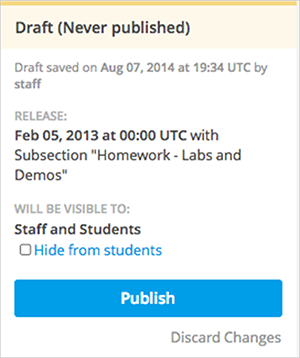

In Studio, you see the version of the content that you're working on. Students
never see a unit with this status, even if the release date has passed.

Though you do not see the unit in the LMS, you can :ref:`preview the
unit<Preview Course Content>`.

You must :ref:`publish the unit<Publish a Unit>` for it to be included in the
LMS.

.. _Published and Live:

====================
Published and Live
====================

The release date for the section and subsection have passed. You've published
the unit and haven't made any changes to it. You and students both see the
current version of the unit.

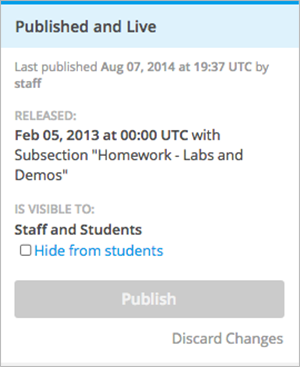

.. _Published Not Yet Released:

====================================
Published Not Yet Released
====================================

You've published the unit, but the release date hasn't passed. Students cannot
see this unit until the release date passes.

.. image:: ../Images/unit-published_unreleased.png
 :alt: Status panel of a unit that is published but not released

.. _Draft (Unpublished Changes):

===========================
Draft (Unpublished Changes)
=========================== 

When you edit a published unit, whether or not it is released, the unit's
publishing status changes to **Draft (Unpublished Changes)**, as shown in the
status panel:

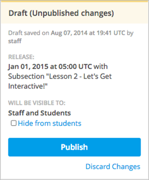

In Studio, you see the draft of the content that you're working on. If the
release date has passed, students see the last published version of the unit.
If the release date hasn't passed, students can't see your content.

You must :ref:`publish the unit<Publish a Unit>` for students to see your
changes.

You can :ref:`preview the changes to a unit<Preview Course Content>` to test
how your changes will appear to students after you publish the unit.

.. _Visible to Staff Only:

===========================
Visible to Staff Only
===========================

When you :ref:`hide a unit from students<Hide a Unit from Students>`, the
unit's publishing status changes to **Visible to Staff Only**.

Students never see a unit with this status, even if it has been published and
the release date has passed.

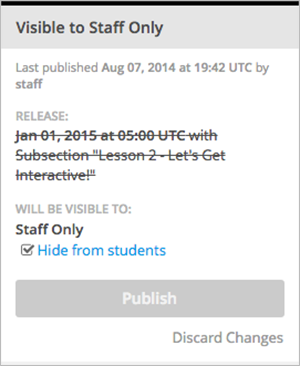

.. _Create a Unit:

****************************
Create a Unit
****************************

You can create a unit from the outline or create a unit in the same subsection
from the unit page.

To create a unit from the outline:

#. In the outline, expand the subsection in which you want to create a new
   unit.
#. Click **New Unit** at the bottom of the expanded subsection. A new
   unit is added at the end of the subsection.
#. On the unit page, the unit name is selected. Edit the name as needed.
#. :ref:`Add components<Add a Component>` to the new unit as needed.

To create a new unit from a unit page:

#. In the **Unit Location** panel, click **New Unit**.

   .. image:: ../Images/unit_location.png
    :alt: The Unit Location panel in the Unit page

   The unit page for the new unit opens automatically.

#. On the unit page, the unit name is selected. Edit the name as needed.

#. :ref:`Add components<Add a Component>` to the new unit as needed.

You must then :ref:`publish the unit<Publish a Unit>` to make it visible to
students.

.. _Edit a Unit:

**************
Edit a Unit
**************

You can edit a unit in the following ways:

* `Edit the unit name`_
* :ref:`Develop components<Developing Course Components>`
* `Reorganize Components in Units`_

When you make any of these changes, if you previously published the unit, the
state changes to `Draft (Unpublished Changes)`_. You must then :ref:`publish
the unit<Publish a Unit>` to make your edits visible to students.

==============================
Edit the Unit Name
==============================

To edit a unit name, hover over the name to show the Edit icon:

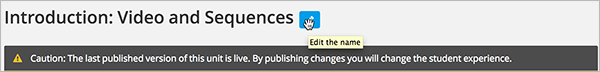

Click the Edit icon next to the unit name. The name field becomes editable.
Enter the new name and tab or click out of the field to save the name.

==============================
Reorganize Components in Units
==============================

You can reorganize components within a unit by dragging and dropping them to
new locations.

To move a component, hover over the handle on the right of the component's box
until the cursor changes to a four-headed arrow. For example, in the image
below, the handle for the discussion component is selected:

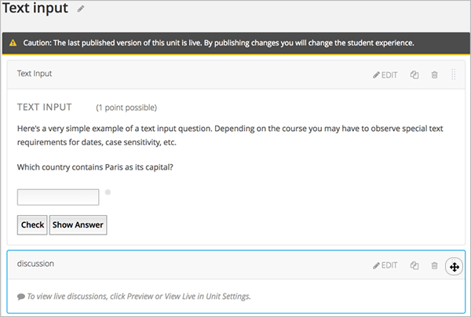

Then, click and drag the component to the location that you want. 

A dashed outline indicates where the component will land when you release the
mouse button. For example, in the image below, the discussion component is
being moved to the top of the unit:

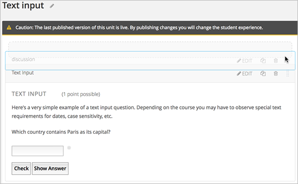

.. _Preview a Unit:

****************************
Preview a Unit
****************************

You preview a unit to review and test the content before it is visible to
students.

You can preview a unit before it is published and when there are unpublished
changes. When the unit is published and there are no pending changes, you
cannot preview the unit; you must view the live version of the unit.

To preview the unit, in the unit page, click **Preview Changes**.

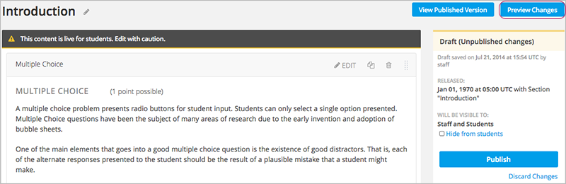

The unit opens in preview mode:

.. image:: ../Images/preview_mode.png
 :alt: The unit in preview mode

When you are revising a previously published unit, it is helpful to preview
your changes in one window and :ref:`view the published unit<View a Published
Unit>` in a second window.

.. _Publish a Unit:

****************************
Publish a Unit
****************************

Publishing a unit makes the current version of the unit in Studio available to
students, if the release date for the section and subsection have passed.

You publish a unit that has a status of `Draft (Never Published)`_ or `Draft
(Unpublished Changes)`_. When you publish a unit, the status changes to
`Published and Live`_ or `Published Not Yet Released`_.

To publish the unit, click **Publish** in the status panel:

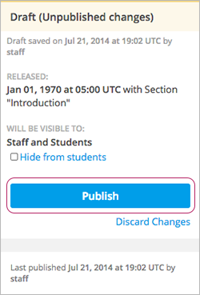

.. _Discard Changes to a Unit:

****************************
Discard Changes to a Unit
****************************

When you modify a published unit, your changes are saved in Studio, though the
changes aren't visible to students until you publish the unit again.

In certain situations, you may decide that you never want to publish your
changes. You can discard the changes so that Studio reverts to the last
published version of the unit.

To discard changes and revert the Studio version of the unit to the last
published version, click **Discard Changes** in the status panel:

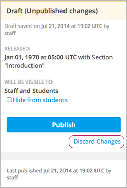

.. caution::
 When you discard changes to a unit, the changes are permanently deleted. You
 cannot retrieve discarded changes or undo the action.

.. _View a Published Unit:

****************************
View a Published Unit
****************************

To view the last published version of a unit in the LMS, click **View Published
Version**.

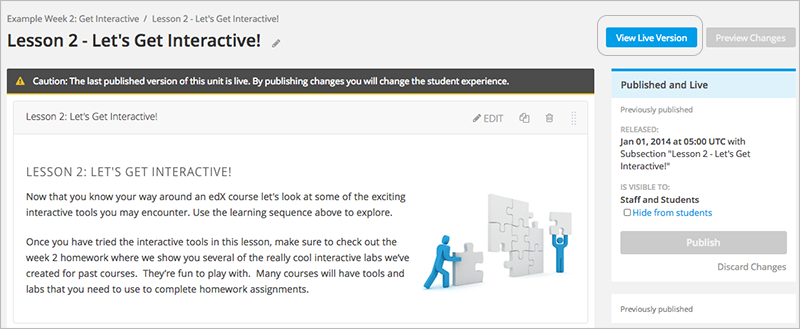

The unit page opens in the LMS in Staff view. You may be prompted to log in to
the LMS.

If the unit status is `Draft (Unpublished Changes)`_, you do not see your
changes in the LMS until you publish the unit again.

If the unit status is `Draft (Never Published)`_, the **View Published
Version** button is not enabled.

.. _Hide a Unit from Students:

****************************
Hide a Unit from Students
****************************

You can prevent students from seeing a unit regardless of the unit status or
the release schedules of the section and subsection.

To do this, select the **Hide from students** checkbox in the status panel:

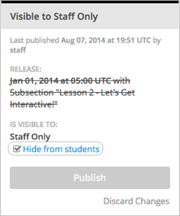

For more information, see :ref:`Controlling Content Visibility`.

=======================================
Make a Hidden Unit Visible to Students
=======================================

To make a hidden unit visible to students, clear the **Hide from students**
checkbox.

You are prompted to confirm that you want to make the unit visible to students.

.. caution::
 When you make a hidden unit that was previously published visible to
 students, the current content in the unit is published. Any changes you made
 to the unit when it was hidden from students will now be visible to students.

********************************
Delete a Unit
********************************

You delete a unit from the course outline.

When you delete a unit, you delete all components within the unit.

.. warning::  
 You cannot restore course content after you delete it. To ensure you do not
 delete content you may need later, you can move any unused content to a
 section in you

To delete a unit:

#. Click the delete icon in the box for the unit you want to delete:

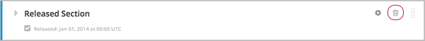

2. When you receive the confirmation prompt, click **Yes, delete this
   unit**.