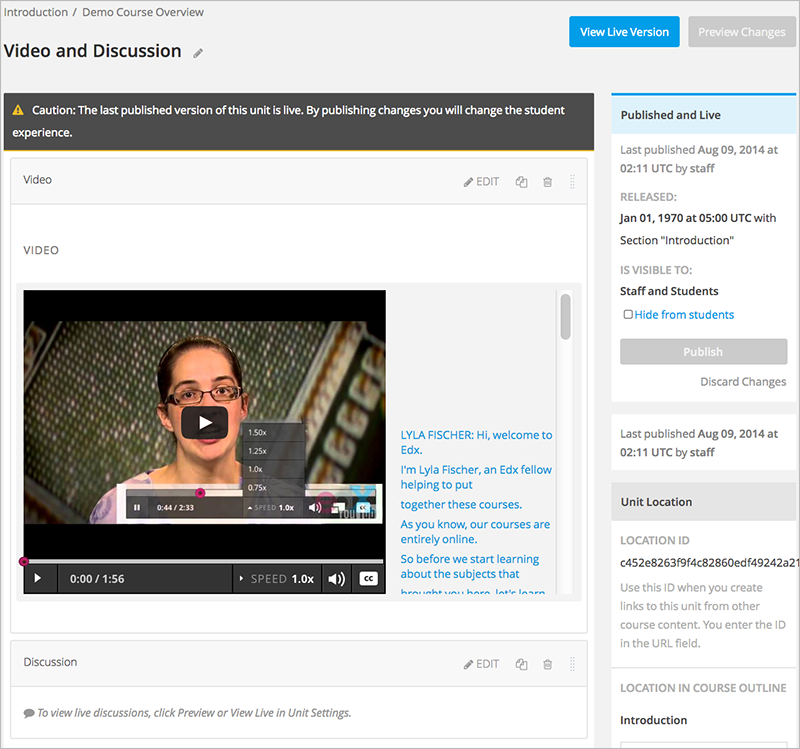
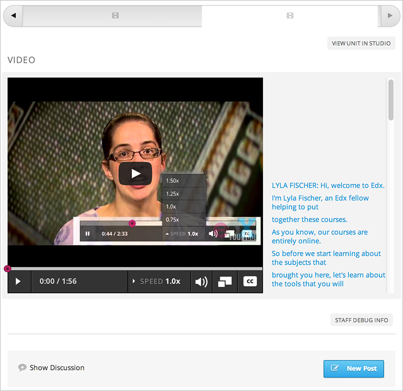
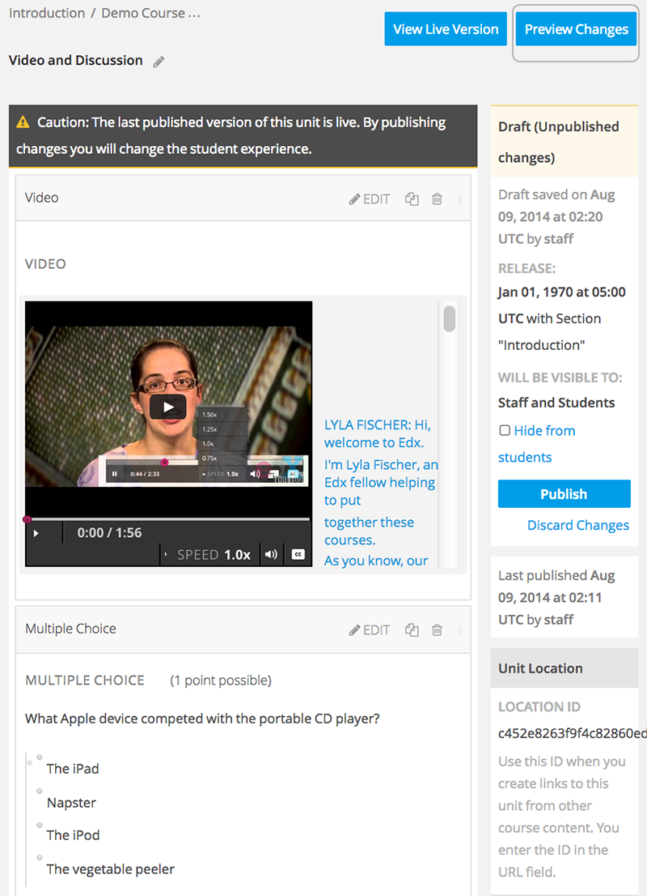
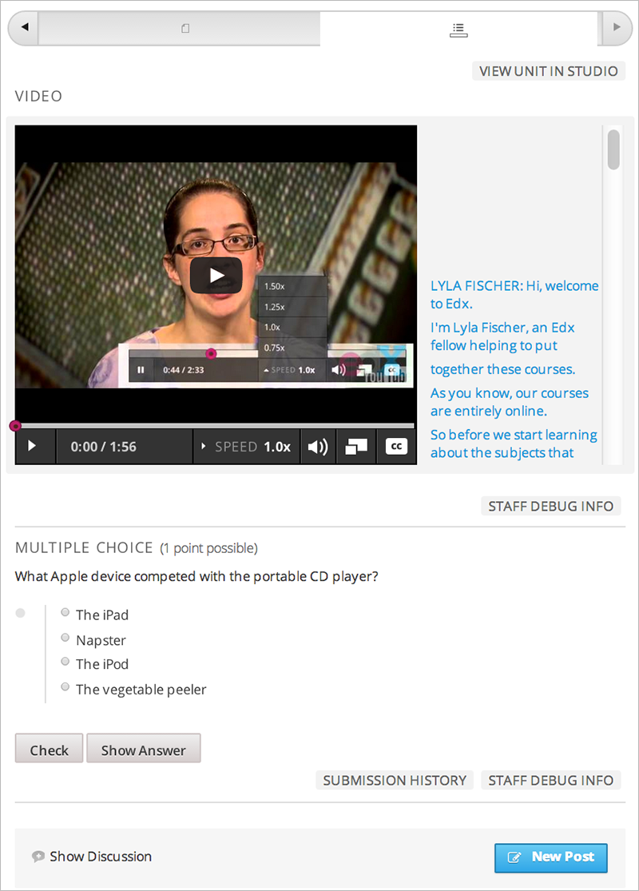
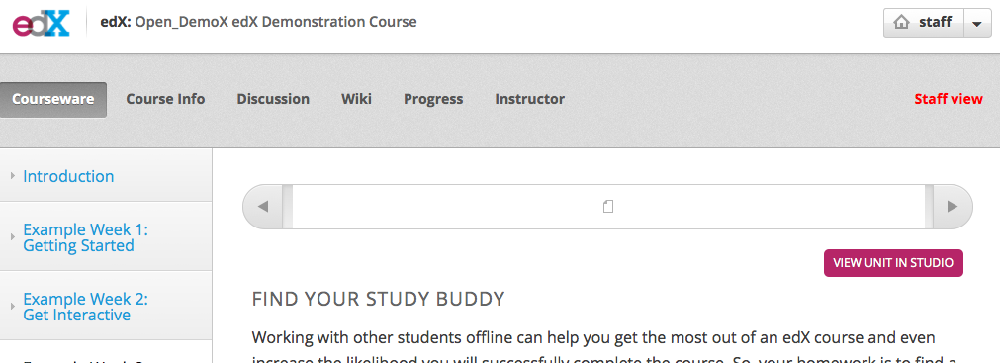
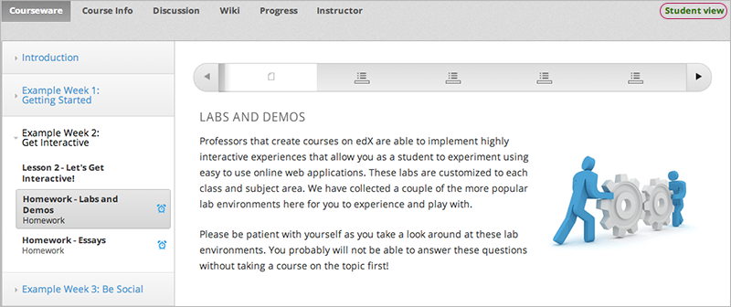

.. _Testing Your Course Content:

###########################
Testing Your Course Content
###########################

The way your course looks in Studio is not the way that students will see and
experience it when it is live. 

It is recommended that you test your content continually as you build your
course, so you can interact with your course from a student's point of view.

To test your content, you can:

* `Preview Course Content`_
* `View Your Live Course`_

For information about setting up a beta test for your course, see
:ref:`Beta_Testing`.

.. _Preview Course Content:

*************************
Preview Course Content
*************************

You preview course content before you publish it to test how it will look to
students.
 
When you preview course content, you see the latest course content as
configured in Studio. You see content in units with the publishing status
:ref:`Draft (Never Published)`, :ref:`Draft (Unpublished Changes)`, or
:ref:`Visible to Staff Only`. 

For example, you :ref:`publish a unit<Publish a Unit>` with a video and
discussion:

Students see the same content in the LMS:

You later decide to add a multiple choice problem to the unit, before the
discussion:

Before you publish this change, you can see what the question will look to
students.

When you click **Preview Changes**,  you see the unit in the LMS with
the multiple choice question:

This preview shows how students will experience the unit after you
:ref:`publish the change<Publish a Unit>`.

In the live course, students continue to see the same content, without the
multiple choice question, until you :ref:`publish the change<Publish a Unit>`.

.. note:: 
  **Preview Changes** in not available when the unit's state is :ref:`Published
  and Live`, because in this case the preview and live version are exactly the
  same. You can view the live course to see the published content.

 
.. _View Your Live Course:

******************************************
View Your Live Course
******************************************

When you are working in Studio, you can test your course by viewing it in the
LMS. In the LMS, you can see your course as a student sees it. You can see your
course in `Staff View`_ or `Student View`_

While you work in Studio, you can switch to your live course to see how your
course appears to students in two ways.

* From the outline page, click **View Live**.
   
  .. image:: ../Images/test-outline-view-live.png
   :alt: View live button on the outline

* In a unit page, click **View Live Version**.
   
  .. image:: ../Images/test-unit-view-live.png
   :alt: View Live Version button on the unit page

=================
Staff View
=================

You see the course in the **Staff View**.

     at top right and a View Unit in Studio button
 
In **Staff View**:

* You see all units that are :ref:`Published and Live`. For units that are
  :ref:`Draft (Unpublished Changes)` or :ref:`Visible to Staff Only`, you
  see the last published version of the unit. You see these units
  regardless of the release dates of the containing section or subsection.

* You do not see units that are :ref:`Draft (Never Published)`. To
  see these units, you must use Preview mode as described in :ref:`Preview
  Course Content`.

* You can access the Instructor Dashboard, which has features and reports that
  help you :ref:`run your course<Running Your Course Index>`.

When you view your course in **Staff View**, you can execute tests to make sure
that your course works the way you intend. For example,  before the release
date of a subsection, members of the course team can work through the problems
to verify that the correct answer gets a green check for correct, and that any
answer other than the correct one gets a red X for incorrect.

=================
Student View
=================

When viewing your course in the LMS, you can switch to student view to see the
content exactly how students will see it.

To switch from **Staff View** to **Student View** and back again, click **Staff
View** or **Student View** in the upper right corner.

     indicated at top right

In **Student View**:

* You do not see sections or subsections that have not yet been released.

* If the section and subsection are released, you see units that are
  :ref:`Published and Live`. For units that are
  :ref:`Draft (Unpublished Changes)`, you see the last published version of the
  unit. 

* You do not see units that are :ref:`Draft (Never Published)` or
  :ref:`Visible to Staff Only`. To see these units, you must switch back to Instructor view or use Preview mode as described in :ref:`Preview Course Content`.

* You can access the Instructor Dashboard, which has features and reports that
  help you run your course.

*************************************
Open Studio from Your Live Course
*************************************

When you are viewing your course in the LMS as **Staff View**, you can open
Studio directly.
   
* In a unit page, click **View Unit in Studio**.
  
  .. image:: ../Images/Live_Studio_from_LMS_Unit.png
   :alt: The View Unit in Studio button in an LMS unit

  The unit page opens in Studio.
 
* In the Instructor Dashboard, click **View Course in Studio** to open the
  course outline.
 
  .. image:: ../Images/Live_Course_Instructor_Dashboard.png
    :alt: Image of the Instructor Dashboard in a live course with a View Course
        in Studio button

  For information about the tasks you can complete on the Instructor Dashboard,
  see :ref:`Running Your Course Index`.
 
* In the **Course Progress** page, click **View Grading in Studio** to open the
  Grading page.
 
  .. image:: ../Images/Student_Progress.png
     :alt: Image of the Course Progress page for a student with a View  Grading
         in Studio button

  For information about checking a student's progress, see
  :ref:`Review_grades`.