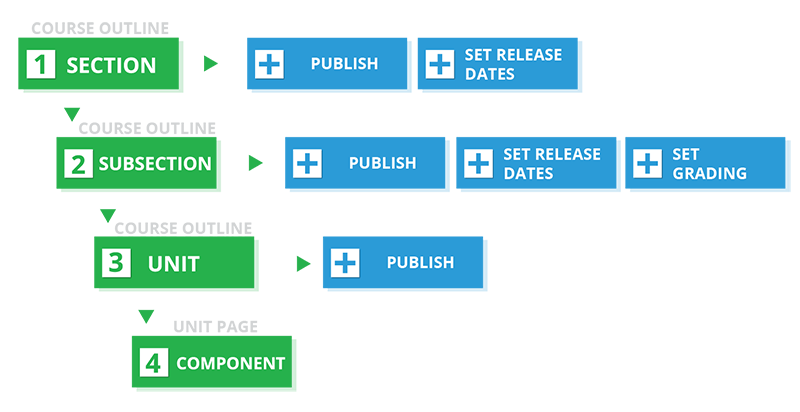
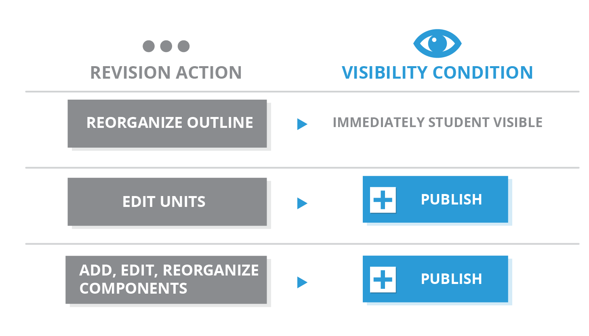

.. _Getting Started with Course Content Development:

###############################################
Getting Started with Course Content Development
###############################################

When you are done :ref:`setting up your course<Setting up your Course Index>`,
you are ready to build your course content.

This chapter provides an outline of the steps involved in developing your
course content, with links to more details. See:

* `Understanding Course Building Blocks`_
* `Creating New Course Content`_
* `Making Course Content Visible to Students`_
* `Revising Content`_

.. _Understanding Course Building Blocks:

************************************************
Understanding Course Building Blocks
************************************************

Before you begin, you should understand the building blocks of an edX course.

* :ref:`The course outline<Developing Your Course Outline>` is the container
  for all of your course content. The outline contains one or more sections.
* :ref:`Course sections<Developing Course Sections>` are at the top level of
  your course and typically represent a time period. A section contains one or
  more subsections.
* :ref:`Course subsections<Developing Course Subsections>` are parts of a
  section, and usually represent a topic or other organizing principle. A
  subsection contains one or more units.
* :ref:`Course units <Developing Course Units>` are lessons in a subsection
  that students view as single pages. A unit contains one or more components.
* :ref:`Course components<Developing Course Components>` are objects within
  units that contain your actual course content.

.. _Creating New Course Content:

****************************************
Creating New Course Content
****************************************

Once you understand the way edX courses are structured, you can start
organizing your content and entering it into Studio. 

You create :ref:`sections<Create a Section>`, :ref:`subsections<Create a
Subsection>`, and :ref:`units<Create a Unit>` in the :ref:`course
outline<Developing Your Course Outline>`. 

For graded subsections, you also
:ref:`set the assignment type and due date<Set the Assignment Type and Due Date
for a Subsection>`. 

You :ref:`create components<Add a Component>` in the unit
page.

In addition, you :ref:`control content visibility<Controlling Content
Visibility>` by setting release dates on the outline and publishing units.

The following diagram summarizes the content creation workflow:

It is recommended that you :ref:`test course content <Testing Your Course
Content>` throughout the creation process.

.. _Making Course Content Visible to Students:

******************************************************
Making Course Content Visible to Students
******************************************************

When you create your content, you'll also specify if and when students will be
able to see it. Content visibility depends on several factors: 

* The :ref:`course start date<The Course Start Date>`
* The release dates of the :ref:`section<Set a Section Release Date>` and
  :ref:`subsection<Set a Subsection Release Date>`
* The :ref:`publishing status<Hide a Unit from Students>` of the unit
* The :ref:`Hide content from students<Hide a Unit from Students>` setting
  
For more information, see :ref:`Controlling Content Visibility`.

.. _Revising Content:

****************************
Revising Content
****************************

You can revise your course content at any time. 

* When you :ref:`reorganize sections, subsections, and units<Reorganize the
  Course Outline>` in the outline, the new order is immediately visible to
  students if the section and subsection are released.

* When you :ref:`edit a unit<Edit a Unit>`, or :ref:`components<Add a
  Component>` within a unit, you must :ref:`publish<Publish a Unit>` those
  changes to make them visible to students.

The following diagram summarizes the content revision workflow and content
visibility:

It is recommended that you :ref:`test course content <Testing Your Course
Content>` during the revision process.