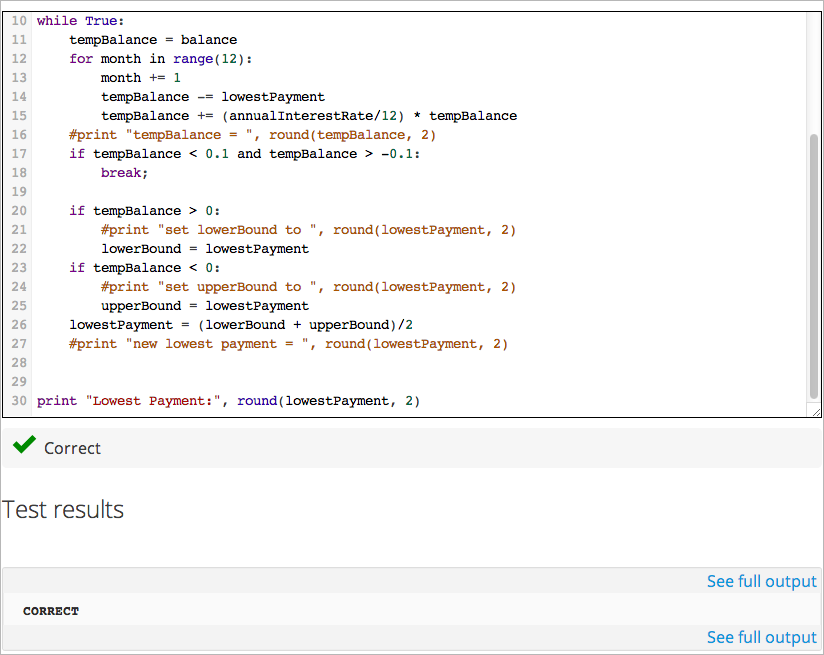
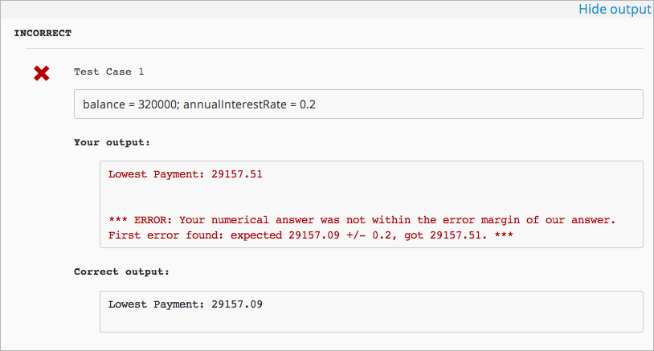

.. _Using External Graders:

###########################
Using External Graders
###########################

.. _External Grader Overview:

*******************
Overview
*******************

An external grader is a service that receives student responses to a problem, processes those responses, and returns feedback and a problem grade to the edX platform. You build and deploy an external grader separately from the edX platform.

See the following sections for more information:

* :ref:`External Grader Example`
* :ref:`External Graders and XQueue`
* :ref:`The XQueue Interface`
* :ref:`Building an External Grader`
* :ref:`Create a Code Response Problem`

.. _External Grader Example:

***************************
External Grader Example
***************************

An external grader is particularly useful for software programming courses where students are asked to submit complex code.  The grader can run tests that you define on that code and return results to a student.

For example, you define a problem that requires students to submit Python code, and create a set of tests that an external grader can run to verify the submissions. When a student enters Python code for the problem and clicks **Check**, the code is sent to the grader for testing.  If the code passes all tests, the grader returns the score and a string indicating that the solution is correct.

The external grader can return a string with results, which the student can see by clicking **See full output**. This can be particularly useful when the solution is not correct and you want to return information about the failed tests. For example:

.. _External Graders and XQueue:

**************************************
External Graders and XQueue
**************************************

The edX Platform communicates with your external grader through XQueue.  XQueue provides students' input to the grader; it then receives results from the grader and returns them to students.  

The queue for your course must be set up in one of two modes:

*  **Pull**

*  **Push**

In most situations, edX recommends that you use Pull mode. Pull mode will prevent your grader from being overloaded by submissions it is not ready to process.

You determine which mode to use when you are building your course and your grader. You must communicate this decision to your edX Program Manager. The student experience is not affected by this decision.

==================
Pull Mode
==================

In Pull mode, student submissions are collected in XQueue, where they remain until the grader actively retrieves, or pulls, the next submission from the queue for grading.

The external grader polls the XQueue through a RESTful interface at a regular interval. When the external grader receives a submission, it runs the tests on it, then pushes the response back to XQueue through the RESTful interface. XQueue then delivers the response to the edX Learning Management System.

For example code of an external grader that uses Pull mode, see the `Stanford-Online repository xqueue_pull_ref <https://github.com/Stanford-Online/xqueue_pull_ref>`_.

==================
Push Mode
==================

In Push mode, XQueue actively pushes student submissions to the external grader, which passively waits for the next submission to grade. When the external grader receives a submission, it runs the tests on it, then synchronously delivers the graded response back to the XQueue. XQueue then delivers the response to the edX Learning Management System.

For example code of an external grader that uses Push mode, see the `edX repository xserver <https://github.com/edx/xserver>`_.

============================
External Grader Workflow
============================

The following steps show the complete process:

#. The student either enters code or attaches a file for a problem, then clicks Check.
#. XQueue either pushes the code to the external grader, or waits until the external grader pulls the code.
#. The external grader runs the tests that you created on the code.
#. The external grader returns the grade for the submission, as well as any results in a string, to XQueue. 
#. The XQueue delivers the results to the edX Learning Management System.
#. The student sees the problem results and the grade.

==================
The XQueue Name
==================

Your course will use a specific XQueue name. You use this name when creating problems in edX Studio. You get this name from your edX Program Manager. As edX hosts many XQueues for different courses, it is critical that you use the exact XQueue name in your problems, as described in the section :ref:`Create a Code Response Problem`. 

.. _The XQueue Interface:

**************************************
The XQueue Interface
**************************************

The student submission sent from XQueue to the grader, and the response sent from the grader to XQueue, are JSON objects, as described below.

.. note:: XQueue does not send the the student ID to the external grader. Your grader cannot access student IDs or associate student IDs with submissions.

For the code for the XQueue interface, see the file `urls.py in the edX XQueue repository <https://github.com/edx/xqueue/blob/master/queue/urls.py>`_.

======================================================
Inputs to the External Grader
======================================================

The grader receives student submissions as a JSON object with two keys:

* **student_response**: A string containing the student's code submission.  The string comes from either input the student enters in the edX Learning Management System or a file the student attaches.

* **grader_payload**: An optional string that you can specify when creating the problem. For more information, see the section :ref:`Create a Code Response Problem`.

For example::

 {
   "xqueue_body":
   "{
     "student_response": "def double(x):\n return 2*x\n", 
     "grader_payload": "problem_2"
    }"
 }

======================================================
External Grader Responses
======================================================

After running tests and recording results for a submission, the grader must return information by posting a JSON response. The JSON string contains an indication if the submission was correct, the score, and any message the tests create.

In the following example, the grader returns a JSON string that indicates the submission was correct, the score was 1, and a message::

 { 
  "correct": true, 
  "score": 1, 
  "msg": "
The code passed all tests.
" 
 }

.. _Building an External Grader:

****************************
Building an External Grader
****************************

Course staff, not edX, is responsible for building and deploying the external grader. 

In addition to creating tests that are specific to the problems you use in your course, there are four areas that you must plan for when building an external grader:

* :ref:`Scale`
* :ref:`Security`
* :ref:`Reliability and Recovery`
* :ref:`Testing`

.. _Scale:

==================
Scale
==================

Your external grader must be able to scale to support the number of students in your course.

Keep in mind that student submissions will likely come in spikes, not in an even flow.  For example, you should expect the load to be much greater than average in the hours before an exam is due.  Therefore, you should verify that the external grader can process submissions from a majority of students in a short period of time. 

.. _Security:

==================
Security
==================

Students are submitting code that executes directly on a server that you are responsible for. It is possible that a student will submit malicious code. Your system must protect against this and ensure that the external grader runs only code that is relevent to the course problems.  How you implement these protections depends on the programming language you are using and your deployment architecture.  You must ensure that malicious code won't damage your server.

.. _Reliability and Recovery:

==============================
Reliability and Recovery
==============================

Once your course starts, many students will submit code at any possible time, and expect to see results quickly.  If your external grader is prone to failure or unexpected delays, the student experience will be poor.

Therefore, you must ensure that your grader has high availability and can recover from errors. Prior to your course starting, you must have a plan to immediately notifiy the team reponsible for operating your grader, as well as edX operations, when the grader fails. In collaboration with edX, you should develop a procedure to quickly identify the cause of failure, which can be your grader or edX's XQueue.

Contact your edX Program Manager for more information.

If you know the grader will be unavailable at a certain time for maintenance, you should :ref:`Add a Course Update`. 

.. _Testing:

==================
Testing
==================

You should test your grader thoroughly before your course starts.  Be sure to test incorrect code as well as correct code to ensure that the grader responds with appropriate scores and messages.

.. _Create a Code Response Problem:

********************************
Create a Code Response Problem
********************************

You create a code response problem in edX Studio by adding a common blank problem, then editing the XML problem definition in the :ref:`Advanced Editor`.

See :ref:`Working with Problem Components` for more information.

Following is a basic example of the XML definition of a problem that uses an external grader::

 <problem display_name="Problem 6">
    <text>
        
Write a program that prints "hello world".

    </text>
    <coderesponse queuename="my_course_queue">
        <textbox rows="10" cols="80" mode="python" tabsize="4"/>
        <codeparam>
            <initial_display>
              # students please write your program here
              print ""
            </initial_display>
            <answer_display>
              print "hello world"
            </answer_display>
            <grader_payload>
            {"output": "hello world", "max_length": 2}
            </grader_payload>
        </codeparam>
    </coderesponse>
 </problem>

Note the following about the XML definition:

* **queuename**: The value of the queuename attribute of the <coderesponse> element maps to an XQueue that edX sets up for the course.  You get this name from your edX Program Manager. You must use this exact name in order for the problem to communicate with the correct XQueue.

* **Input Type**: In this example, the input type is specificed by the **<textbox>** element.  When you use <textbox>, the student enters code in a browser field when viewing the course unit.  The other element you can use to specify the input type is <filesubmission>, which enables the student to attach and submit a code file in the unit.

* **<grader_payload>**: You can use the <grader_payload> element to send information to the external grader in the form of a JSON object. For example, you can use <grader_payload> to tell the grader which tests to run for this problem.